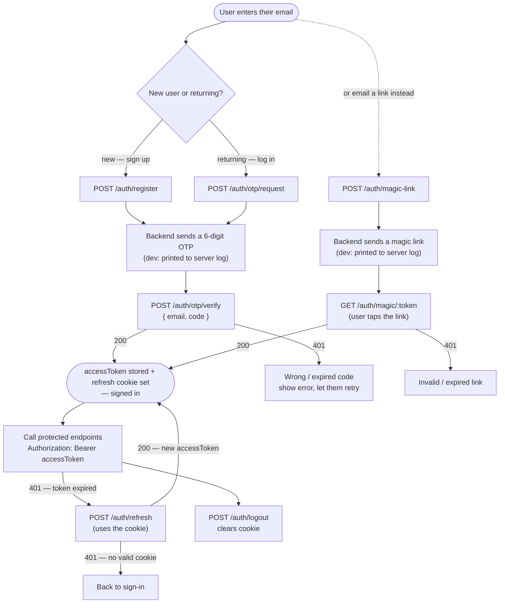

# SafeIn5 API — Frontend Integration Guide

Everything the frontend needs to integrate the backend built so far: passwordless
auth, behaviour signals (capture + feed), the supervisor loop, anonymous
reporting, and organisation scoping.

- **Base URL (dev):** `http://localhost:3000`
- **Feature routes:** under `/api/v1` (e.g. `POST /api/v1/auth/register`)
- **Health routes:** at the root (`/healthz`, `/readyz`)
- **Format:** JSON in and out. Send `Content-Type: application/json` on requests with a body.
- **Auth:** passwordless (email OTP or magic link) → short-lived **access token** (JWT) sent as a `Bearer` header. A long-lived **refresh token** lives in an HttpOnly cookie.

---

## 1. Before you start (important setup)

The dev server currently allows CORS for **one origin** (the `APP_URL`, default
`http://localhost:3000`) with credentials enabled. If your frontend runs on a
different origin (e.g. Vite on `http://localhost:5173`), ask the backend to set
`APP_URL` to your frontend's origin — otherwise the browser will block requests.

Because the refresh token is a cookie, **every** request that should send/receive
it must include credentials:

- `fetch(url, { credentials: 'include' })`
- axios: `axios.defaults.withCredentials = true`

Use `credentials: 'include'` on all API calls for simplicity; it's required for
`/auth/refresh` and `/auth/logout`, and harmless elsewhere.

---

## 2. Auth model

1. User enters their email. You call **register** (first time) or **otp/request** (returning).
2. The backend emails a 6-digit **OTP** (in dev it is written to the server log — see §8).
3. User enters the code. You call **otp/verify**, which returns
   `{ accessToken, user }` and sets the refresh cookie.
4. Store the `accessToken` in memory (or `localStorage`) and send it on every
   protected request as `Authorization: Bearer <accessToken>`.
5. Access tokens expire in **15 minutes**. When a call returns **401**, call
   **/auth/refresh** (uses the cookie) to get a new `accessToken`, then retry.
6. **logout** clears the cookie.

There is also a **magic link** variant (§4) — same result, the user clicks a link
instead of typing a code.

> The access token is a JWT containing `{ sub, email, tid (tenant), role }`. You
> don't need to decode it — `GET /me` returns the same info as JSON — but you may
> if convenient. Never trust it for authorization decisions the backend already
> enforces; use it only for UI hints (e.g. show supervisor actions when `role === 'supervisor'`).

### Sign-up / OTP login / magic-link flow



Notes: **register** and **otp/request** both return `204` and send a code — the
only difference is register also creates the account. **otp/verify** and
**magic/:token** are interchangeable finishers — both return `{ accessToken, user }`
and set the refresh cookie. From there the `401 → refresh → retry` loop keeps the
session alive until the refresh cookie itself expires.

---

## 3. Data models (TypeScript)

```ts
type Role = 'worker' | 'supervisor';
type Classification = 'good_practice' | 'be_aware' | 'needs_attention_now';
type SignalStatus = 'open' | 'acknowledged' | 'closed';

// All ids are sequential integers (1, 2, 3, ...).
interface Tenant { id: number; slug: string; name: string; }

interface User {
  id: number;
  email: string;
  firstName: string | null;
  lastName: string | null;
  emailVerified: boolean;
  role: Role;            // the user's role within their tenant
  tenant: Tenant;        // the organisation the user belongs to
}

interface LoginResponse { accessToken: string; user: User; }

interface Author { id: number; firstName: string | null; lastName: string | null; }

interface Signal {
  id: number;
  classification: Classification;
  bodyText: string;
  status: SignalStatus;
  isAnonymous: boolean;
  createdAt: string;          // ISO 8601
  acknowledgedAt: string | null;
  closedAt: string | null;
  closeNote: string | null;
  author: Author | null;      // null when the signal is anonymous
}
```

---

## 4. Endpoints

Legend for **Auth**: `public` = no token · `bearer` = `Authorization: Bearer <accessToken>` · `cookie` = refresh cookie.

### Authentication

#### `POST /api/v1/auth/register` — sign up · public
Creates the account (if new), joins the Community organisation, and sends an OTP.
```json
// request
{ "email": "sam@example.com", "firstName": "Sam", "lastName": "Rivera" }   // firstName/lastName optional
// response: 204 No Content   (OTP is sent; read it from the log in dev)
```

#### `POST /api/v1/auth/otp/request` — login (send code) · public
Sends a fresh OTP to an existing account. Always `204` (won't reveal whether the
account exists).
```json
{ "email": "sam@example.com" }   // -> 204
```

#### `POST /api/v1/auth/otp/verify` — verify code · public
```json
// request
{ "email": "sam@example.com", "code": "481920" }
// response: 200  (also sets the refresh cookie)
{
  "accessToken": "eyJhbGciOiJFZERTQSJ9...",
  "user": {
    "id": 1, "email": "sam@example.com", "firstName": "Sam", "lastName": "Rivera",
    "emailVerified": true, "role": "worker",
    "tenant": { "id": 1, "slug": "community", "name": "SafeIn5 Community" }
  }
}
// 401 if the code is wrong, expired, or too many attempts
```

#### `POST /api/v1/auth/magic-link` — send a magic link · public
```json
{ "email": "sam@example.com" }   // -> 204  (link written to the log in dev)
```

#### `GET /api/v1/auth/magic/:token` — verify a magic link · public
Returns the same `{ accessToken, user }` as otp/verify and sets the cookie.
`401` if the link is invalid or expired.

#### `POST /api/v1/auth/refresh` — new access token · cookie
No body. Uses the refresh cookie. Returns `{ accessToken, user }`. `401` if the
cookie is missing/invalid (send the user back to login).

#### `POST /api/v1/auth/logout` · public (clears the cookie)
No body → `204`.

### Current user

#### `GET /api/v1/me` · bearer
Returns the `User` object (same shape as `login.user`). `401` if the token is
missing/expired.

### Signals

#### `POST /api/v1/signals` — capture a signal · bearer
```json
// request
{
  "classification": "needs_attention_now",   // good_practice | be_aware | needs_attention_now
  "bodyText": "Exposed edge on level 2, no barrier",
  "anonymous": false                          // optional, default false
}
// response: 201 -> Signal
```
Set `"anonymous": true` to hide your name — the returned signal (and every feed
entry) will have `author: null` and `isAnonymous: true`.

#### `GET /api/v1/feed` — the organisation feed · bearer
All signals in **your organisation**, newest first.
Query params: `limit` (default 50, max 100), `status` (`open|acknowledged|closed`).
```
GET /api/v1/feed?status=open&limit=20   ->  200 -> Signal[]
```

#### `GET /api/v1/signals/mine` — your own signals · bearer
`limit` param as above. `200 -> Signal[]`.

#### `GET /api/v1/signals/:id` — one signal · bearer
`200 -> Signal`. `404` if it doesn't exist **or belongs to another organisation**.
`400` if `:id` isn't a number.

#### `POST /api/v1/signals/:id/acknowledge` — supervisor · bearer
Moves `open → acknowledged`. Idempotent (acknowledging again returns the signal).
`200 -> Signal`. `403` if you're not a supervisor. `404` cross-org/missing.
`409` if the signal is already closed.

#### `POST /api/v1/signals/:id/close` — supervisor · bearer
```json
{ "closeNote": "Barrier reinstated, area cleared" }   // required, 1-1000 chars
// 200 -> Signal (status "closed", closeNote set)
```
`403` non-supervisor · `404` cross-org/missing · `409` already closed · `400` missing note.

### Video uploads (chunked, signed URLs)

Large videos are uploaded **in parts**. For each part the frontend asks the API
for a short-lived **signed URL**, PUTs the raw bytes to it, then tells the API the
part landed. This is the S3 pre-signed-PUT pattern — today the signed URL points at
this backend; later it will point at S3, with the same flow.

**Auth is optional.** With a bearer token the upload is tied to your account
(and only you can act on it); without one it's **anonymous** — no account needed,
and it lands in the Community tenant. If you *do* send a token it must be valid.
The byte PUT always also needs the signed URL. (Anonymous uploads are keyed only
by their numeric id, so don't treat an anonymous upload as private.)

The backend stores parts on local disk or in S3 (a config switch) — **transparent
to you**: the flow, URLs, and responses are identical either way.

**Guided loop — each PUT hands you the next signed URL.** `initiate` returns the
signed URL for part 1; **the PUT of each part returns the next part's URL** (it
records the part for you); PUTting the **last** part auto-assembles the file,
deletes the temp parts, and returns the finished upload. You never call
`presign`/`confirm`/`complete` yourself in the happy path.

```
initiate ─► {next: url#1} ─► PUT url#1 ─► {next: url#2} ─► PUT url#2 ─► … 
                                              PUT url#last ─► {completed}
```

#### `POST /api/v1/uploads/initiate` — start an upload · optional bearer
```json
// request
{
  "filename": "incident.mp4",
  "mimeType": "video/mp4",
  "totalParts": 3,
  "totalBytes": 3145000,                 // optional, but recommended
  "checksum": "289813c8…"                // optional sha256 hex of the WHOLE file — recommended
}
// response: 201
{
  "id": 12, "filename": "incident.mp4", "totalParts": 3, "status": "pending", ...,
  "next": {                                // the signed URL for part 1 — start here
    "partNumber": 1,
    "uploadUrl": "http://localhost:3000/api/v1/uploads/blob/12/1?exp=…&sig=…",
    "method": "PUT",
    "headers": { "Content-Type": "application/octet-stream" },
    "expiresAt": "2026-07-24T10:15:00.000Z"
  }
}
```
Split the file into ≤ 20 MB parts (numbered `1..totalParts`). **Declare `checksum`**
when you can — it's the end-to-end integrity check at auto-complete. PUT part 1's
bytes to `next.uploadUrl`; that PUT's response hands you part 2's URL, and so on.

#### `PUT <next.uploadUrl>` — upload the bytes, get the next part's URL · signed URL (bearer optional)
Send the raw part bytes as the body with the headers from `next.headers`
(`Content-Type: application/octet-stream` — a missing/other content type is rejected).
Send the **same** auth you initiated with (your bearer token if the upload is yours,
or none if it's anonymous). The response records the part and drives the flow:
```
PUT <next.uploadUrl>
Authorization: Bearer <accessToken>    # only if the upload is authenticated
Content-Type: application/octet-stream
<raw part bytes>
```
```json
// more parts to go -> 200
{
  "partNumber": 1, "etag": "<sha256 of this part>", "bytes": 1048576,
  "receivedParts": [1], "missingParts": [2, 3],
  "next": {                                // PUT the next part's bytes here
    "partNumber": 2,
    "uploadUrl": "…/uploads/blob/12/2?exp=…&sig=…",
    "method": "PUT", "headers": { "Content-Type": "application/octet-stream" },
    "expiresAt": "…"
  },
  "completed": null
}
```
```json
// last part -> auto-assembled -> 200
{
  "partNumber": 3, "etag": "…", "bytes": 1048576,
  "receivedParts": [1, 2, 3], "missingParts": [],
  "next": null,
  "completed": { "id": 12, "status": "completed", "finalBytes": 3145000, ... }
}
```
So the loop is just: **PUT `next.uploadUrl` → PUT `next.uploadUrl` → …** until
`completed` is non-null. `401` invalid token (if sent) **or** bad/expired signature
· `409` the upload isn't `pending` · `404` unknown upload / wrong pool (authed vs
anonymous) · `400` empty/oversize body · `422` if the assembled file fails your
declared checksum/size. The signed URL is short-lived (default 15 min) — re-`presign`
the part if it expires.

#### `POST /api/v1/uploads/:id/parts/:n/presign` — re-sign a part (rarely needed) · optional bearer
Each URL comes from `initiate`/the previous PUT, so you only need this to **re-sign**
a part whose URL expired before you PUT it. Returns `{ uploadUrl, method, headers,
expiresAt }`. `400` out of range · `409` no longer `pending`.

#### `POST /api/v1/uploads/:id/parts/:n/confirm` — record a part uploaded out-of-band · optional bearer
Not needed for the local flow (the PUT records the part). This is the hook for a
**direct-to-S3** flow: after PUTting bytes straight to storage, POST this to record
the part; it returns the same `{ next, completed }` advance as the PUT. `400` if the
bytes aren't in storage yet · `409` if the upload isn't `pending`.
> If you re-upload a part (new bytes to a fresh signed URL) the last write wins, and
> assembly verifies each part against what was last recorded.

#### `POST /api/v1/uploads/:id/complete` — assemble manually (rarely needed) · optional bearer
The guided flow auto-assembles when you confirm the last part, so you normally
never call this. It's here as a manual fallback: assembles the parts, verifies
integrity (against your declared `checksum`/`totalBytes` if given), deletes the
temp parts.
```
POST /api/v1/uploads/12/complete  ->  200 -> { "id": 12, "status": "completed", "finalBytes": 3145000, ... }
```
Idempotent (a second call on a completed upload returns it). `400` if parts are
missing · `409` if a part changed since it was confirmed (re-confirm it) · `422`
if the assembled file fails your declared checksum/size.

#### `GET /api/v1/uploads/:id` — status · optional bearer
`200 ->` `{ status, receivedParts, missingParts, ... }`. `404` cross-user/missing.

#### `DELETE /api/v1/uploads/:id` — abort · optional bearer
Discards the upload and its temp parts. `200 -> { "status": "aborted" }` (or the
current status if it was already terminal). `409` if already `completed`.

### Health (root, no version)
- `GET /healthz` → `{ "status": "ok" }`
- `GET /readyz` → `{ "status": "ok", "db": "up" }` (or `503` if the DB is down)

---

## 5. Errors

Two shapes. Handle both.

**Validation errors** (bad/missing fields) — HTTP `400`:
```json
{
  "statusCode": 400,
  "message": "Validation failed",
  "errors": [
    { "code": "invalid_type", "path": ["closeNote"], "message": "Invalid input: expected string, received undefined" }
  ]
}
```
`errors[]` is the field-level detail (Zod). `path` is the field name.

**Everything else** (auth/permission/not-found/conflict) — the standard shape:
```json
{ "statusCode": 401, "error": "Unauthorized", "message": "Missing bearer token." }
```

| Status | When | What the UI should do |
|-------:|------|-----------------------|
| 400 | invalid body / non-numeric `:id` | show field errors from `errors[]`, or a generic message |
| 401 | missing/expired token; wrong or expired OTP | try `/auth/refresh`; if that also 401s, send to login |
| 403 | action needs supervisor role | hide/disable the action for workers |
| 404 | signal missing or in another org | show "not found" |
| 409 | invalid state change (e.g. closing a closed signal) | refresh the signal and re-render its status |
| 503 | `/readyz` only — DB down | — |

Suggested 401 handling: on any `401` from a `bearer` call, call `/auth/refresh`
once; on success retry the original request with the new token; on failure clear
the token and redirect to login.

---

## 6. Roles & organisations

- Every user belongs to **one organisation** (`user.tenant`). New self-registrations
  join the **Community** org.
- `user.role` is `worker` or `supervisor` **within that org**.
  - **worker:** capture signals, read the feed, read/close-nothing.
  - **supervisor:** everything a worker can do, plus `acknowledge` and `close`.
- **Isolation:** the feed, my-signals, get-by-id and the supervisor actions only
  ever touch the caller's own organisation. A signal in another org returns `404`.
- **Anonymity:** an anonymous signal has `author: null` everywhere. There is no way
  via the API to see who authored an anonymous signal.

Use `role` only to shape the UI (show/hide the acknowledge/close buttons). The
backend enforces it regardless.

---

## 7. Minimal client example (TypeScript, fetch)

```ts
const BASE = 'http://localhost:3000/api/v1';
let accessToken: string | null = null;

async function api(path: string, init: RequestInit = {}, retry = true): Promise<Response> {
  const res = await fetch(`${BASE}${path}`, {
    ...init,
    credentials: 'include', // send/receive the refresh cookie
    headers: {
      'Content-Type': 'application/json',
      ...(accessToken ? { Authorization: `Bearer ${accessToken}` } : {}),
      ...(init.headers ?? {}),
    },
  });

  // Access token expired? refresh once and retry.
  if (res.status === 401 && retry && accessToken) {
    const r = await fetch(`${BASE}/auth/refresh`, { method: 'POST', credentials: 'include' });
    if (r.ok) {
      accessToken = (await r.json()).accessToken;
      return api(path, init, false);
    }
    accessToken = null; // refresh failed -> caller should redirect to login
  }
  return res;
}

// --- auth ---
export const register = (email: string, firstName?: string, lastName?: string) =>
  api('/auth/register', { method: 'POST', body: JSON.stringify({ email, firstName, lastName }) });

export const requestOtp = (email: string) =>
  api('/auth/otp/request', { method: 'POST', body: JSON.stringify({ email }) });

export async function verifyOtp(email: string, code: string) {
  const res = await api('/auth/otp/verify', { method: 'POST', body: JSON.stringify({ email, code }) });
  if (!res.ok) throw await res.json();
  const data = await res.json();       // { accessToken, user }
  accessToken = data.accessToken;
  return data.user;
}

export const me = () => api('/me').then((r) => r.json());
export const logout = () => api('/auth/logout', { method: 'POST' }).then(() => (accessToken = null));

// --- signals ---
export const createSignal = (body: { classification: string; bodyText: string; anonymous?: boolean }) =>
  api('/signals', { method: 'POST', body: JSON.stringify(body) }).then((r) => r.json());

export const feed = (params: { status?: string; limit?: number } = {}) =>
  api(`/feed?${new URLSearchParams(params as Record<string, string>)}`).then((r) => r.json());

export const acknowledge = (id: number) =>
  api(`/signals/${id}/acknowledge`, { method: 'POST' }).then((r) => r.json());

export const closeSignal = (id: number, closeNote: string) =>
  api(`/signals/${id}/close`, { method: 'POST', body: JSON.stringify({ closeNote }) }).then((r) => r.json());
```

---

## 8. Dev notes

- **OTP / magic link in dev:** no real email is sent. The code and link are printed
  to the **backend server log**:
  ```
  [DEV MAIL] OTP for sam@example.com: 481920
  [DEV MAIL] Magic link for sam@example.com: http://localhost:3000/api/v1/auth/magic/<token>
  ```
- **Tokens reset on backend restart** in dev (the JWT keypair is ephemeral), so an
  old `accessToken`/refresh cookie stops working after a restart — just log in again.
- **Making a supervisor** (no admin UI yet) is a DB update the backend runs:
  `UPDATE user_tenant_membership ... role='supervisor' ...`; the user must log in
  again afterwards to get a token with the new role.
- **Ready-made API collections** live in `api/` (Postman + a VS Code `.http` file)
  if you want to click through the endpoints.

## Endpoint quick reference

| Method | Path | Auth | Body |
|--------|------|------|------|
| POST | /api/v1/auth/register | public | `{ email, firstName?, lastName? }` |
| POST | /api/v1/auth/otp/request | public | `{ email }` |
| POST | /api/v1/auth/otp/verify | public | `{ email, code }` |
| POST | /api/v1/auth/magic-link | public | `{ email }` |
| GET  | /api/v1/auth/magic/:token | public | — |
| POST | /api/v1/auth/refresh | cookie | — |
| POST | /api/v1/auth/logout | public | — |
| GET  | /api/v1/me | bearer | — |
| POST | /api/v1/signals | bearer | `{ classification, bodyText, anonymous? }` |
| GET  | /api/v1/feed?status=&limit= | bearer | — |
| GET  | /api/v1/signals/mine?limit= | bearer | — |
| GET  | /api/v1/signals/:id | bearer | — |
| POST | /api/v1/signals/:id/acknowledge | bearer (supervisor) | — |
| POST | /api/v1/signals/:id/close | bearer (supervisor) | `{ closeNote }` |
| POST | /api/v1/uploads/initiate | optional bearer | `{ filename, mimeType, totalParts, totalBytes?, checksum? }` |
| POST | /api/v1/uploads/:id/parts/:n/presign | optional bearer | — |
| PUT  | /api/v1/uploads/blob/:id/:n?exp=&sig= | signed URL (+opt. bearer) | raw part bytes (octet-stream) |
| POST | /api/v1/uploads/:id/parts/:n/confirm | optional bearer | — |
| POST | /api/v1/uploads/:id/complete | optional bearer | — |
| GET  | /api/v1/uploads/:id | optional bearer | — |
| DELETE | /api/v1/uploads/:id | optional bearer | — |
| GET  | /healthz, /readyz | public | — |
