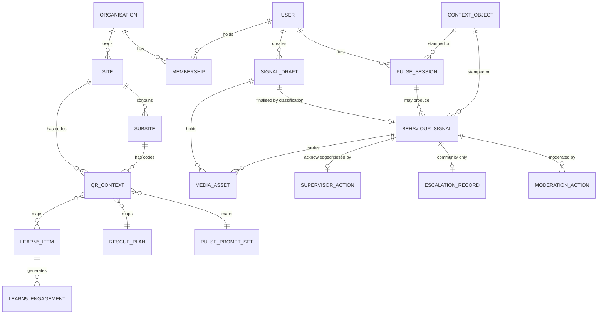

# SafeIn5 PRD - Sections 6-16 (UNVERIFIED DRAFT)

> **STATUS: UNVERIFIED FIRST-PASS DRAFT. DO NOT ISSUE.**
> Recovered from an incomplete authoring run that hit the session token limit.
> 14 of 16 sections authored. MISSING: 15 Risks & Mitigation, 16 Appendices.
> NOT DONE: traceability audit, consistency audit, global FR/NFR renumbering, dedup, assembly.
> FR/NFR ids are LOCAL to each section and collide across sections.

---

## 7D. Functional Requirements — Supervisor & Notifications

This section specifies the supervisor-facing half of the SafeIn5 feedback loop: how a supervisor finds a Behaviour Signal that needs a response, the two actions they may take on it (**Acknowledge** and **Close**), how the result of those actions becomes visible, how contribution is reflected back to a team or site, and the exact scope of push notifications in the MVP.

The whole of this section exists to answer one named failure mode: the **"report black hole"** (Dev Pack §17.1 Scenario 5 — *"No visible action or feedback is returned. Engagement and trust begin to collapse."*). Because **repeat usage is the primary success measure** (Dev Pack §14, PRD §2.3), a supervisor response loop is not a governance feature in this MVP — it is a validation dependency.

### 7D.0 Scope boundary

| In scope for MVP | Explicitly out of scope (Phase 2) |
|---|---|
| Two supervisor actions on a signal: **Acknowledge** and **Close with a comment** (PRD §5.4) | `Assigned` and `Actioned` states; the full Dev Pack §7 lifecycle `New → Assigned → Acknowledged → Actioned → Closed` |
| Supervisor discovery of signals awaiting a response, scoped to their assigned sites | **Assignment** to a named owner; "assignment required before action" (Dev Pack §7) |
| Public display of acknowledgement and closure on the signal in the feed | **Evidence** objects and "evidence required before close" (Dev Pack §7) |
| Capture of `acknowledged_at` / `closed_at` timestamps | **Review Task**, **Assignment**, **Evidence** and full workflow **Audit Log** objects (Dev Pack §7) |
| Team / site-level contribution visibility, no named individuals (PRD §5.10) | Individual recognition, badges, leaderboards, cross-site league tables (PRD §5.10) |
| Supervisor-targeted transactional notification (scope pending — see FR019) | Predictive safety alerts / hazard-cluster push (WRK-022 as literally worded), automated safety nudges (WRK-023, COULD/Phase 2), auto-generated insight push (Talentica Slide 13) |
| — | Response-time SLAs, targets, breach escalation, supervisor scorecards (ADM-039 ruling: *"Avoid language that implies worker performance scoring"*) |

**Community boundary.** Acknowledge and Close are **Corporate-tenant supervisor actions**. Community signals have no supervisor; the Community loop is closed by SafeIn5 moderator action and manual escalation status (PRD §5.12), specified in the Community moderation section. Whether the same two-flag mechanism is reused by moderators for Community is **Register Decision #34**.

---

### 7D.1 Supervisor scope and signal discovery

| Requirement ID | Description | User Story | Expected Behavior/Outcome | Priority | Acceptance Criteria |
|---|---|---|---|---|---|
| FR001 | The platform provides a **Site Supervisor** capability, assigned to one or more sites within a single tenant, whose permissions are limited to viewing signals for their assigned sites and performing Acknowledge and Close. Supervisors have no create/update/delete rights over signals, sites, users or content (Tender Pack QA-006 *"supervisor/admin visibility across assigned organisation"*; PRD §5.4). **BLOCKED BY REGISTER DECISION #15** — the role set is not enumerated in any source document and ADM-025 captures name and email only, with no role field. | As a site supervisor, I want to see only the signals from the sites I am responsible for so that I can act on what is mine to act on without being shown other people's sites. | A signed-in supervisor sees signals from their assigned site(s) and sub-sites only. Any request for a signal outside their assignment is refused at the API, not merely hidden in the UI. Supervisors cannot edit, reclassify or delete a signal — those remain admin-only actions (ADM-031 to ADM-034). | Must Have | 1. A supervisor assigned to Site A sees signals from Site A and all its sub-sites, and no signals from Site B. 2. A direct API call by a Site A supervisor for a Site B signal ID returns an authorization error, not the record. 3. The supervisor UI exposes no edit, reclassify, hide or delete control on any signal. 4. A supervisor assigned to two sites sees both, with the site shown on every signal. 5. No screen available to a supervisor displays data for any site they are not assigned to. |
| FR002 | A **"Needs a response"** working list is available to the supervisor, containing signals from their assigned sites that have not yet been acknowledged, defaulted to *Needs Attention Now* first, sorted oldest-first (register basis: Decision #18; Dev Pack §17.1 Scenario 5 *"UX must include visible acknowledgement and closure workflows"*; CQA-012 *"A simple feedback/status loop is desirable for Phase 1"*). **BLOCKED BY REGISTER DECISION #18** — no queue exists in any requirement row; ADM-005's latest-five panel is the only specified discovery mechanism, and the daily digest variant is unpriced. | As a site supervisor, I want a single list of signals still waiting for a response so that nothing sits unanswered because I did not happen to scroll past it. | The list shows unacknowledged signals for the supervisor's sites, defaulting to *Needs Attention Now* then *Be Aware*, oldest first. Acknowledging or closing a signal removes it from the list. The list is pull-only — no target, no breach state, no automatic escalation. | Should Have | 1. A newly submitted *Needs Attention Now* signal on an assigned site appears in the list without a page rebuild beyond a normal refresh. 2. Default ordering is *Needs Attention Now* before *Be Aware*, and within each, oldest first. 3. Acknowledging a signal removes it from the default list view. 4. Signals from unassigned sites never appear. 5. The list displays no target date, no red/amber breach styling and triggers no escalation to any other user. |
| FR003 | A **latest activity panel** shows the five most recent Behaviour Signals submitted on the supervisor's assigned sites, each linking to the signal detail (ADM-005, MUST/MVP — *"A minimized scrolling list module displaying the latest 5 safety signals submitted from the field"*). | As a site supervisor, I want to see the most recent signals from my site at a glance so that I keep day-to-day situational awareness without running a search. | The panel lists exactly the five most recent signals for the supervisor's scope with classification, sub-site and relative time, newest first, each opening the signal detail on tap. | Must Have | 1. Exactly five items are shown when five or more signals exist; fewer are shown when fewer exist, with an empty state when none exist. 2. Items are ordered by submission time, newest first. 3. Each item shows classification, sub-site and relative time. 4. Selecting an item opens that signal's detail view. 5. The panel respects FR001 scoping. |
| FR004 | Supervisor views can be filtered by **classification**, **sub-site** and **response status** (Not acknowledged / Acknowledged / Closed), and combined filters apply together (WRK-014 *"Filter by Classification … Filter by Sub-site location"*; ADM-032). The per-worker filter specified in ADM-032 is **not** offered to supervisors (PRD §5.10; register Decision #38). | As a site supervisor, I want to filter my site's signals by type, area and whether they have been answered so that I can work through what matters first. | Filters for classification, sub-site and response status are available on the supervisor signal list; selections combine with AND semantics; the active filter set is visible and clearable in one action. | Must Have | 1. Filtering by *Needs Attention Now* returns only signals with that classification. 2. Filtering by sub-site returns only that sub-site's signals, including when combined with a classification filter. 3. Filtering by status *Not acknowledged* excludes every acknowledged and closed signal. 4. Active filters are visibly indicated and clearable in a single action. 5. No filter, facet or sort option exposes an individual worker as a filter value. |
| FR005 | The supervisor can open a **signal detail view** showing media, caption/transcript, classification, context (site, sub-site, and where present asset, task type, risk type), submission time, author display name or "Anonymous", current response status, and the acknowledgement and closure record (ADM-031; Dev Pack §8.2; PRD §5.5, §5.16). | As a site supervisor, I want to see the full signal with its context so that I can understand what was observed before I respond to it. | The detail view renders all captured fields including a text rendering of any voice transcript, plays media on tap, and shows the current status with actor role and timestamp for each state change. Anonymous signals display "Anonymous" with no identity path anywhere in the view. | Must Have | 1. All captured fields listed in the description are rendered, with graceful omission of context fields that do not exist for a context-less signal (PRD §5.16). 2. A voice-captured signal renders its transcript as readable text. 3. Media plays only on explicit tap; nothing autoplays. 4. An anonymous signal shows "Anonymous" and offers no link, hover, tooltip or API field resolving to a user identity. 5. Acknowledgement and closure, where present, are shown with actor role and timestamp. |
| FR006 | Each signal awaiting a response displays an **ageing indicator** ("open for N days") derived from submission time. No target, threshold, colour-coded breach state or escalation is attached (Dev Pack §17.1 Scenario 5 *"Corporate dashboard should track response and closure times"*; ADM-039 ruling against performance scoring). **BLOCKED BY REGISTER DECISION #18.** | As a site supervisor, I want to see how long a signal has been waiting so that I can prioritise the oldest ones without being scored against a target nobody has agreed. | Unacknowledged signals display days-open, computed from submitted-at to now. The indicator is neutral in tone and styling and drives no automated behaviour. | Should Have | 1. A signal submitted three days ago and not acknowledged displays "open 3 days". 2. An acknowledged signal no longer displays a days-open indicator. 3. No colour change, warning icon, notification or escalation occurs at any elapsed value. 4. The indicator is present in both the working list and the signal detail. |

> **BLOCKED BY REGISTER DECISION #16 — supervisor surface.** Every requirement in 7D is written **surface-neutral**. Talentica Slide 17 places the Supervisor in the mobile PWA; Slide 22 places supervisor workflows in the Admin & Platform (desktop) workstream; no ADM requirement covers acknowledgement at all. The functional behaviour above is identical either way, but the build size is not. Decision #16 must be settled before Milestone 1, and the answer must be recorded as **one** surface — Register Decision #16 Option 3 (both surfaces) is a double build inside a fixed price.

> **BLOCKED BY REGISTER DECISION #18 — discovery mechanism and latency display.** FR002 and FR006 specify the recommended pull-only mechanism. What is not settled: whether a working list exists at all beyond ADM-005's latest-five panel, whether a daily email digest to site supervisors is included, and whether median time-to-acknowledge is displayed. **Commercial:** neither the working list nor the digest appears in any WRK/ADM/SCP row or any priced milestone line item.

---

### 7D.2 The Acknowledge and Close actions

| Requirement ID | Description | User Story | Expected Behavior/Outcome | Priority | Acceptance Criteria |
|---|---|---|---|---|---|
| FR007 | A supervisor can **Acknowledge** a Behaviour Signal on an assigned site with a **single tap and no mandatory input** (PRD §5.4; Tender Pack QA-005 *"Basic acknowledgement/review of signals"*). Acknowledgement means "a responsible person has seen this" — it makes no claim that anything has been done. | As a site supervisor, I want to acknowledge a signal in one tap so that the person who shared it can see it was received, without me having to write something first. | Tapping Acknowledge sets the signal to Acknowledged, records actor and timestamp, updates the status shown to every viewer of that signal, and requires no comment, category or form. The action is idempotent and cannot be undone. | Must Have | 1. Acknowledge completes in one tap with no intermediate form, modal field or mandatory input. 2. After acknowledgement the signal's status is Acknowledged for every viewer of that signal, including unauthenticated feed readers. 3. `acknowledged_at` and the acknowledging account are persisted. 4. Re-sending the acknowledge action for an already-acknowledged signal leaves the original timestamp and actor unchanged and returns success (idempotent). 5. The control is not offered, and the API refuses the action, for a supervisor not assigned to that signal's site. 6. No "un-acknowledge" control exists in any surface. |
| FR008 | A supervisor can **Close** a Behaviour Signal with a **mandatory free-text closure comment**. Closing implies acknowledgement: closing a not-yet-acknowledged signal records both states (PRD §5.4 *"marked Acknowledged and Closed with a comment"*; Dev Pack §16 *"visible closure of reported concerns"*). | As a site supervisor, I want to close a signal with a short note saying what happened so that everyone who sees it knows the concern was dealt with and how. | The Close action opens a comment composer; submission is blocked until a non-empty comment is entered. On submission the signal becomes Closed, the comment is stored and displayed publicly on the signal, and actor and timestamp are recorded. Closing a signal that was never acknowledged also stamps the acknowledgement. | Must Have | 1. Submitting Close with an empty or whitespace-only comment is rejected with an inline message; the signal state is unchanged. 2. A closure comment is accepted up to a defined maximum length, with the remaining character count shown. 3. On success the signal status becomes Closed for every viewer and the comment is displayed on the signal. 4. `closed_at`, closing account and comment text are persisted. 5. Closing a signal in state New records both `acknowledged_at` and `closed_at` in one transaction. 6. No Close control appears on an already-closed signal. |
| FR009 | The closure comment composer carries a **visible condition-first guardrail** warning the supervisor not to name individuals, because the comment is published to everyone who can see the signal (Dev Pack §15.4 *"default to condition first reporting rather than person first reporting"*; §15.1 *"not a surveillance or disciplinary platform"*). | As a worker, I want supervisor replies to talk about the condition and not about people so that sharing a signal never turns into naming someone. | The composer displays persistent helper text stating that the comment is publicly visible on the signal and must not name individuals. The warning is copy and layout only — no automated content detection is in MVP scope. | Should Have | 1. The composer shows the guardrail text before any typing occurs, not only on error. 2. The text states both facts: the comment is publicly visible, and individuals must not be named. 3. The guardrail does not block submission and performs no content scanning. 4. The same guardrail text appears on every surface where a closure comment can be written. |
| FR010 | The Behaviour Signal carries a **three-value response status**: `New` (submitted, not yet acknowledged), `Acknowledged`, `Closed`. Permitted transitions are `New → Acknowledged`, `New → Closed` and `Acknowledged → Closed`. There is **no reopen**, no reverse transition and no automatic transition of any kind. Correction of a wrongly closed signal falls back to the auditable admin edit path (ADM-033). **BLOCKED BY REGISTER DECISION #17** — whether *Good Practice* signals are closable at all, and whether reopen should exist, are not settled. | As a supervisor, I want a state model with only two things I can do so that responding stays fast and I am never blocked by workflow steps that do not exist in this MVP. | The signal exposes exactly three response states and the three permitted transitions. Any other transition is refused by the API. No timer, rule or batch job changes a signal's response status. | Must Have | 1. Each permitted transition succeeds and is reflected in the persisted record. 2. `Closed → Acknowledged`, `Closed → New` and `Acknowledged → New` are refused with an error and leave the record unchanged. 3. No signal changes response status without an explicit supervisor action — verified by leaving a signal untouched across a scheduled-job cycle. 4. The stored model contains no `Assigned`, `Actioned`, assignment, evidence or review-task field (Dev Pack §7 objects, deferred per PRD §5.4). 5. Data-model review confirms nothing in the schema prevents the deferred states being added later without migration of existing signals. |
| FR011 | Every acknowledgement and closure persists **actor account, role and UTC timestamp**, and these are captured **regardless of the author's anonymity setting**. Supervisor action records are never stripped by the anonymity rule, which applies to signal authors only (PRD §5.5; Dev Pack §7 *"Anonymity must be handled by stripping user metadata at the DB level when the Anonymous flag is active"*). | As SafeIn5, I want every supervisor response recorded with who and when so that supervisor engagement can be measured and the loop can be evidenced at pilot review. | `acknowledged_at`, `acknowledged_by`, `closed_at`, `closed_by` and `closure_comment` are persisted on the signal and are queryable for reporting. Anonymity of the author has no effect on the presence or completeness of these fields. | Must Have | 1. All five fields are persisted and retrievable via the API for an acknowledged and closed signal. 2. Timestamps are stored in UTC and rendered in the viewer's local time. 3. A signal authored anonymously carries a complete supervisor action record identical in structure to a signal authored identifiably. 4. Counts of signals acknowledged and closed per site over a date range can be produced from these fields alone. 5. No supervisor action record can be deleted or edited through any MVP UI. |

> **BLOCKED BY REGISTER DECISION #17 — residual Acknowledge/Close rules.** The following are specified above as the recommended position but are **not yet ratified**: (a) whether *Good Practice* signals are acknowledgeable-but-not-closable (a positive signal has nothing to resolve — WRK-010) or closable like the rest; (b) whether reopen is permitted; (c) whether the comment on Close is truly mandatory. FR008 and FR010 must be re-read once #17 is answered. Everything else in 7D.2 follows directly from PRD §5.4 and is not blocked.

---

### 7D.3 Closure visibility — what the reporter and the feed see

The binding constraint here is PRD §5.5: **there is no individual notification of acknowledgement or closure.** Visibility is public and pull-based. This is a deliberate consequence of account-level anonymity — a system that retained a resolvable identity link in order to notify would contradict the anonymity promise — and it has the side benefit of demonstrating to *every* viewer that signals get answered.

| Requirement ID | Description | User Story | Expected Behavior/Outcome | Priority | Acceptance Criteria |
|---|---|---|---|---|---|
| FR012 | The signal's **response status is displayed on the signal itself** — on the feed card and in the signal detail — to every viewer who can see that signal, including unauthenticated guest readers (PRD §5.5 *"closure shown publicly on the signal in the feed"*; PRD §5.6 guest reads). **BLOCKED BY REGISTER DECISION #14** — none of the three documented feed-card field lists includes a status chip; the card composition is not yet fixed. | As a worker, I want to see on the signal itself that it was acknowledged or closed so that I know signals here actually get answered, whether or not it was mine. | A status chip renders on the feed card and in the signal detail with one of three values: no chip for New, "Acknowledged", or "Closed". The chip is visible to all viewers of that signal, guest included. | Must Have | 1. An acknowledged signal shows an "Acknowledged" chip on its feed card and in its detail view. 2. A closed signal shows a "Closed" chip in both places. 3. An unacknowledged signal shows no status chip. 4. An unauthenticated guest viewing the feed sees the same chips as a signed-in worker. 5. The chip is visually distinguishable from the classification chip and does not replace it. |
| FR013 | The **closure comment and the acknowledgement/closure timestamps are displayed publicly** on the signal detail, attributed to the acting role rather than to a personal identity by default (Dev Pack §16 *"visible closure of reported concerns"*; §15.1 non-punitive principle). | As a worker, I want to read what the supervisor said when they closed a signal so that I can see the outcome and learn from it, not just that a box was ticked. | The signal detail shows the closure comment verbatim with its timestamp and the acting role, visible to everyone who can view the signal. | Must Have | 1. The closure comment text is rendered in full on the signal detail for all viewers of that signal, guest included. 2. The acknowledgement timestamp and the closure timestamp are both displayed in the viewer's local time. 3. The display shows the acting role for the response; whether a personal name is also shown is a copy decision recorded as an open item. 4. A signal that is acknowledged but not closed displays the acknowledgement and no comment area. 5. No reply, comment or reaction affordance is offered to any viewer on the closure (CQA-011 — no social mechanics). |
| FR014 | **No individual notification of acknowledgement or closure is sent to the signal author** — no push, no email, no in-app alert, no badge tied to a specific signal delivered to a specific person by the system (PRD §5.5, binding). The system must not create or retain any notification-routing link between an anonymous signal and a user account. | As a worker who reports anonymously, I want the system to have no way of pinging me about my own report so that the anonymity I was promised is structurally true and not just hidden in the interface. | Acknowledging or closing a signal dispatches no message of any kind to its author on any channel. Author-directed notification routing does not exist as a capability in the MVP. | Must Have | 1. Acknowledging a signal produces no email, web push or SMS to the author — verified by inspecting the outbound message log for the account and finding no entry. 2. Closing a signal likewise produces no outbound message to the author. 3. The notification service holds no subscription, template or route keyed to signal authorship. 4. The behaviour is identical for identified and anonymous authors — the identified author is not notified either. 5. A code and schema review confirms no anonymity-reversing identity link exists for notification purposes. |
| FR015 | The signed-in worker can retrieve **their own signals** and see the current response state of each (`Submitted` / `Acknowledged` / `Closed`), via a "My Signals" view. Nothing is pushed — the worker pulls (Dev Pack §15.5 *"Worker receives acknowledgement or closure feedback"*; PRD §2.3 repeat usage). **BLOCKED BY REGISTER DECISION #36** — whether this is a dedicated view, a feed filter, or confirmation-screen landing only. | As a worker, I want to find the signals I shared and see whether they have been answered so that I have a reason to come back into the app. | The signed-in worker can open a list of signals authored by their account, newest first, each showing classification, context, submitted time and current response state, opening the full signal on tap. The ownership link is held on the account and is unaffected by display-level anonymity. | Should Have | 1. The view lists all and only signals authored by the signed-in account, newest first. 2. Each entry shows its current response state, updated when a supervisor acts. 3. Signals submitted with anonymity active still appear in the author's own list while continuing to display as "Anonymous" everywhere else. 4. The view is unaffected by the feed's sub-site auto-filter (WRK-013) — a worker sees their own out-of-zone signals. 5. A guest with no account is not offered the view. 6. Opening the view triggers no notification and creates no admin-visible identity trail beyond what already exists. |
| FR015.1 | After submitting a signal, the confirmation screen provides an **onward path into the feed with the worker's own signal shown at the top** (Dev Pack §6 — the Frame 07 confirmation currently terminates the journey with no defined next step). | As a worker, I want to see my signal land in the feed straight after I share it so that I can tell it worked. | Confirmation offers a clear continue action leading to the feed with the just-submitted signal at the top of the list, including while its media is still uploading (PRD §5.9 queued uploads). | Should Have | 1. The confirmation screen presents a continue action leading to the feed. 2. The just-submitted signal is the first item in the feed on arrival. 3. If media is still queued, the signal renders with a pending-media indicator rather than being hidden. 4. The journey does not dead-end on the confirmation screen on any device size. |

> **BLOCKED BY REGISTER DECISION #36 — worker retrieval path.** FR015 states the recommended position (a pull-only "My Signals" view). If #36 resolves to confirmation-landing only, the closure loop that justifies the whole Acknowledge + Close decision exists on paper only: the feed auto-filters to the worker's current sub-site (WRK-013), closure typically arrives days later, and there is otherwise no route back to a signal the worker shared. **Commercial:** Talentica Milestone 4's PWA line item *"worker feedback loop"* is named but unspecified and must be resolved into this deliverable.

---

### 7D.4 Team and site-level contribution visibility

Binding constraint: **PRD §5.10 — team/site-level only, no named individuals, no leaderboards, and cross-site comparison must not be exposed to supervisors.**

| Requirement ID | Description | User Story | Expected Behavior/Outcome | Priority | Acceptance Criteria |
|---|---|---|---|---|---|
| FR016 | A **site/team contribution summary** presents collective activity and outcomes for a site over a rolling period — signals shared, signals acknowledged, signals closed — framed as collective contribution and weighted toward outcomes rather than raw submission volume (PRD §5.10; ADM-039 ruling *"Show activity by site and crew only as engagement/learning indicators"*). | As a worker, I want to see what my site has shared and what changed as a result so that sharing feels like it adds up to something for the crew. | The summary displays site-attributed counts for the period — signals shared, acknowledged, closed — in collective language (for example "your site shared 40 signals this month, 12 have been closed"), with closure and outcome figures given at least equal visual weight to submission counts. No individual is named or counted. | Should Have | 1. The summary displays counts for signals shared, acknowledged and closed for one site over a stated period. 2. Closure/outcome figures are presented at least as prominently as submission volume. 3. All copy refers to the site or team; no personal name, initials, avatar or user identifier appears anywhere in the component. 4. Anonymous signals are included in the site totals, since the totals are not attributed to individuals. 5. The period covered is stated explicitly on the component. |
| FR017 | The platform provides **no individual recognition mechanic and no comparative ranking**: no leaderboard, no badge, no streak, no per-worker submission count in any worker- or supervisor-facing surface, and **no cross-site comparison in the supervisor dashboard** (PRD §5.10 mitigations 1–3; Dev Pack §15.2 *"Avoid creating a 'snitch culture'"*; ADM-039 *"Avoid language that implies worker performance scoring"*; register Decision #38). | As a worker, I want the system not to rank me or my site against anyone so that sharing a safety signal never becomes a performance measure used against me or my crew. | No surface available to a worker or a supervisor renders a per-individual count, a ranked list of people, or a side-by-side comparison of sites. Supervisors see only their own assigned sites' figures. | Must Have | 1. No worker-facing or supervisor-facing screen displays a per-individual signal count, rank, badge, streak or score. 2. A supervisor assigned to Site A cannot see Site B's counts on any dashboard, summary or export available to them. 3. A supervisor assigned to two sites sees each site's figures separately, with no ranking, ordering by volume, or comparative delta between them. 4. No API response available to a supervisor role contains another site's aggregate counts. 5. UI copy across these surfaces contains no comparative or competitive language (no "top", "best", "leader", "rank"). |
| FR018 | Supervisor response activity is **instrumented for the pilot success metrics** — counts of signals acknowledged and closed per site per period, and elapsed time from submission to acknowledgement and to closure — derived from the FR011 timestamps (Tender Pack Success Metrics *"Supervisor Engagement — Signals Reviewed / Actioned"*, SHOULD; QA-003 *"Supervisor/admin review or acknowledgement activity"*; Dev Pack §17.1 Scenario 5 *"Corporate dashboard should track response and closure times"*). **BLOCKED BY REGISTER DECISION #37** — whether these appear as dashboard widgets, a CSV export, or only in external telemetry. | As SafeIn5, I want to measure whether supervisors actually respond and how quickly so that the pilot can evidence that the feedback loop worked, or show honestly that it did not. | Acknowledged and closed counts and elapsed-time figures are derivable per site and per period from stored data, and are available to SafeIn5 for pilot reporting without vendor tooling access. | Should Have | 1. Counts of signals acknowledged and closed can be produced per site for any date range. 2. Elapsed time from submission to acknowledgement and from submission to closure is computable per signal and aggregable as a median. 3. The figures reconcile exactly with the underlying signal records. 4. No target, threshold or breach flag is derived from or displayed alongside these figures (consistent with FR006). 5. The measure is not presented per individual supervisor in any client-facing surface. |

> **Note — recognition surface is unspecified in every source document.** PRD §5.10 fixes the *model* (site/team level, outcome-weighted) but no source names the screen it lives on, nor whether workers, supervisors or both see it. FR016 is written to be surface-neutral. There is no register decision covering this; it needs one before Milestone 1 UX design.

---

### 7D.5 Notification scope

Three documents disagree about notifications and none of them settles it: **WRK-022** is priced MUST/MVP for *"Live Worksite Warnings — Predictive Safety Alerts"* but its Detailed Requirement Statement is a **verbatim copy of WRK-009's voice/caption ruling** and addresses alerts nowhere; **WRK-023** defers automated nudges to Phase 2; **Talentica Slide 13** excludes *"auto-generated push notifications"* while **Slide 19** provisions `web-push (VAPID)` and a Notification Service, and Milestone 4 lists "notifications" on **both** workstreams.

| Requirement ID | Description | User Story | Expected Behavior/Outcome | Priority | Acceptance Criteria |
|---|---|---|---|---|---|
| FR019 | Where notifications are in scope, they are limited to a **transactional notification to the supervisors of the affected site when a signal classified *Needs Attention Now* is submitted**. One notification per signal. No threshold logic, no clustering, no analytics, no worker-facing notification (Dev Pack §2 *"Needs attention now — a risk that requires prompt awareness, escalation, or action"*; §15.3 *"Who acts on Behaviour Signals and within what timeframe?"*). **BLOCKED BY REGISTER DECISION #6** — whether any transactional push is in MVP at all is undecided, and the vendor documents contradict each other on whether it is priced. | As a site supervisor, I want to be told when someone flags something that needs attention now on my site so that I find out in minutes rather than the next time I open the dashboard. | On submission of a *Needs Attention Now* signal, each supervisor assigned to that signal's site receives exactly one notification linking to the signal. No other classification triggers a notification and no other recipient type exists. | Should Have | 1. Submitting a *Needs Attention Now* signal on Site A notifies Site A's assigned supervisors and no one else. 2. Exactly one notification is dispatched per signal per recipient; a duplicate submission attempt or retry does not double-send. 3. Submitting a *Good Practice* or *Be Aware* signal dispatches no notification. 4. No worker, guest or Community user receives any notification. 5. Opening the notification lands the recipient on that signal's detail view, after authentication if required. 6. Notification dispatch failure does not fail, delay or roll back signal submission. |
| FR020 | Notification delivery uses **web push (VAPID)** with **email as the fallback channel** where push is unavailable or not granted; the permission prompt is requested only after the supervisor has completed a first meaningful action, never on first load; and denial degrades gracefully to the pull-based mechanisms in 7D.1 (Talentica Slide 19 *"Notifications — web-push (VAPID)"* and Slide 22; PRD §5.9). **BLOCKED BY REGISTER DECISION #6.** | As a site supervisor, I want to be asked about notifications at a sensible moment and still be able to work if I say no, so that a permission prompt is not the first thing the product does to me. | Push permission is requested contextually with an in-app explanation immediately before the OS prompt. If permission is denied or push is unsupported (notably iOS Safari without home-screen install), the platform falls back to email and the supervisor loses no functionality beyond the alert itself. | Should Have | 1. No notification permission prompt is fired on first load or before the supervisor's first completed action. 2. An in-app explanation precedes the OS permission prompt. 3. With permission denied, all supervisor discovery and action functions in 7D.1 and 7D.2 remain fully usable. 4. With push unavailable, the notification is delivered by email to the supervisor's registered address. 5. The service worker registered for push performs **no background sync of queued signals** — offline behaviour remains as specified in PRD §5.9 (app must be open). 6. Notification preferences can be turned off by the supervisor without affecting any other function. |
| FR021 | Notification payloads are **minimised**: classification, site/sub-site name, relative time and a link to the signal. No media, no caption or transcript text, and no author identity — including where the author is identified (PRD §5.5; Dev Pack §7 GDPR/audit requirements). | As a worker, I want the alert a supervisor gets not to carry my words or my name so that a notification on a lock screen cannot expose who shared what. | The dispatched payload contains only classification, location label, relative time and signal link. Signal content and author identity are retrievable only after authenticated access to the signal itself. | Must Have | 1. Inspection of a dispatched payload shows no caption, transcript, media URL or author identifier. 2. The payload contains classification, site/sub-site name, relative time and a link only. 3. Following the link requires an authenticated session before signal content is shown. 4. Payload content is identical for anonymous and identified authors. |
| FR022 | The MVP delivers **no predictive, cluster-based or nudge-based notification of any kind**. WRK-022's literal text (*"pushes direct pop-up alerts … if an urgent safety hazard cluster is flagged in their zone"*) is **not** implemented; WRK-023 automated safety nudges are Phase 2; auto-generated insight push is excluded (Talentica Slide 13); CQA-009 confirms no AI dependency in MVP. The rule-based repeated-attention indicator, if approved, is **dashboard-only and raises no notification** (ADM-040; register Decision #42). | As SafeIn5, I want no alert in the MVP that implies the system is predicting anything so that we do not create a false sense of predictive safety before the data exists to support it. | No hazard-cluster detection, behavioural-drift detection, threshold-triggered push or automated nudge exists in the MVP. Any threshold indicator that is approved changes only a dashboard display. | Must Have | 1. No notification in the system is triggered by a count, threshold, pattern, cluster or trend. 2. No notification is triggered by anything other than the single event defined in FR019. 3. No user-facing copy anywhere describes an alert as predictive, proactive, early-warning or AI-derived (ADM-040 ruling: *"It must not be presented as predictive AI"*). 4. If the ADM-040 indicator is built, verification confirms it produces a dashboard state change only and dispatches no message on any channel. |

> **BLOCKED BY REGISTER DECISION #6 — notification scope, and ⚠ COMMERCIAL.** FR019 and FR020 specify the recommended minimum (supervisor-only transactional push with email fallback). What is undecided: (a) whether *any* transactional notification is in MVP, or whether the answer is honest capture copy only; (b) whether push or email is the primary channel; (c) which of Slide 13 (excludes auto push) and Slide 19 (provisions web-push VAPID) reflects the priced build — Milestone 4 lists "notifications" on **both** the Admin & Platform and PWA workstreams, implying a possible double count. **This must be reconciled in writing before Milestone 1.**

> **Dependency on the capture flow (not specified here).** Register Decision #6 Option 1 requires explicit copy at the point a worker selects *Needs Attention Now*, stating that SafeIn5 is not an emergency channel and that immediate dangers must still be raised by radio or in person, repeated on the confirmation screen. That copy sits in the capture/classification section, not here, but this section depends on it: a label reading "Needs Attention Now" that dispatches nobody is the fastest available route to the black hole Dev Pack §17.1 Scenario 5 names as existential. The Community equivalent — the 999 interstitial — is already agreed at PRD §5.15.

---

### 7D.6 Traceability summary

| Source row / clause | Treatment in 7D |
|---|---|
| ADM-005 (MUST) — latest 5 signals for supervisors/site leads | FR003 — implemented as specified |
| ADM-031, ADM-032 — signal detail and filters | FR004, FR005 — reused for the supervisor view; the ADM-032 *worker* filter is **withheld** from supervisors per PRD §5.10 and register #38 |
| ADM-033, ADM-034 — update/delete observation | Not supervisor capabilities; remain admin-only (FR001) |
| ADM-039 (SHOULD) — crew performance summary | FR016, FR017 — reframed as collective engagement, with the ruling against performance scoring enforced as a testable negative requirement |
| ADM-040 (Discovery) — early warning threshold | FR022 — explicitly notification-free; the indicator itself is specified in the analytics section, pending register #42 |
| WRK-022 (MUST, mis-ruled) — predictive safety alerts | FR019 + FR022 — the priced MUST is honoured only as a transactional supervisor notification; the predictive/cluster reading is rejected because WRK-022's ruling text belongs to WRK-009 and cluster detection is what WRK-023 defers |
| WRK-023 (COULD, Phase 2) — automated safety nudges | Out of scope, FR022 |
| QA-005 — "Basic acknowledgement/review of signals" | FR007, FR008 — given requirement identity, priority and acceptance criteria, which the Tender Pack never assigned |
| CQA-012 (SHOULD) — "simple feedback/status loop desirable for Phase 1" | FR002, FR012, FR013, FR015 |
| Success Metrics — "Signals Reviewed / Actioned" (SHOULD) | FR011, FR018 |
| Dev Pack §7 state machine, Review Task, Assignment, Evidence, Audit Log | **Deferred to Phase 2** per PRD §5.4; FR010 requires only that the schema does not preclude them |
| Dev Pack §15.5 — "Worker receives acknowledgement or closure feedback" | FR012, FR013, FR015 — satisfied by public display plus pull, **not** by notification (PRD §5.5) |
| Dev Pack §17.1 Scenario 5 — report black hole | FR002, FR006, FR007, FR008, FR012, FR018 |

---

## 10. Integration Requirements

This section specifies every external system, third-party service and device/browser capability the SafeIn5 MVP depends on. It follows the tech stack committed in the Talentica proposal (Slide 19) and the service decomposition in Dev Pack §7 / §12, constrained by the decisions already recorded in PRD §§5.5–5.17.

**Scope principle.** The MVP integrates only with *infrastructure* services (email, storage, transcription, push, telemetry, error tracking) and one *content link-out* adapter. It integrates with **no customer system and no third-party organisation's system**. All integrations are implemented behind an internal adapter/port interface (Talentica Slide 16, *"Adapter pattern for Integrations such as Learn 5 Content integration"*) so that no provider SDK type appears in domain code and any provider can be substituted without a schema change.

---

### 10.1 Integration Inventory

| # | Integration point | Candidate provider | Direction | Protocol / interface | Data exchanged | Auth mechanism |
|---|---|---|---|---|---|---|
| I1 | **Transactional email** — magic-link / OTP, worker invitation, admin password reset | AWS SES or SendGrid (Talentica Slide 19) | Outbound (server → provider) | HTTPS REST API, TLS 1.2+ (SMTPS 587 fallback) | Recipient email address, recipient display name, template ID, one-time code or signed enrolment/magic-link URL, tenant and site display name, expiry timestamp | Provider API key or cloud IAM role, held in the platform secrets manager; never present in the PWA bundle |
| I2 | **Speech-to-text** — voice-note transcription (WRK-020 / SCP-020) | **Path A:** browser Web Speech API (on device) · **Path B:** cloud STT provider (Talentica Slide 19, *"Speech-to-text provider"*; background *"transcription dispatch"* worker) | Path A: in-browser, no network egress from SafeIn5 · Path B: outbound (server → provider) | Path A: `SpeechRecognition` browser API · Path B: HTTPS REST or gRPC, TLS 1.2+, audio payload ≤ the capture-length cap | Path A: audio never leaves the device; only the resulting text is submitted · Path B: raw audio blob (opus/webm), language tag `en-GB`, request correlation id. **No user identifier, no site identifier, no signal identifier is sent** | Path A: none (browser permission prompt only) · Path B: provider API key / IAM role in secrets manager |
| I3 | **Web push** — supervisor notification transport (Talentica Slide 19, *"Notifications \| web-push (VAPID)"*) | Browser push services (FCM endpoint for Chrome/Android, Apple Push endpoint for installed iOS PWAs) — reached via the W3C Web Push protocol, not vendor SDKs | Outbound (server → browser push endpoint → device) | HTTPS Web Push protocol (RFC 8030) with VAPID (RFC 8292) and message encryption (RFC 8291) | Encrypted payload containing signal id, classification label, site/sub-site display name, timestamp. **No signal caption, no media, no reporter identity** | VAPID key pair (server-held private key, public key shipped to client); per-device push subscription endpoint + keys stored against the supervisor account |
| I4 | **Object / media storage** — photos, video, thumbnails, poster frames (Dev Pack §7 Media Service; Talentica Slide 19, *"S3-compatible (S3 / GCS)"*) | S3 or GCS, EU region (Talentica Slide 14) | Bidirectional: PWA → storage (direct upload), storage → PWA (direct read), server → storage (processing, lifecycle) | HTTPS REST, TLS 1.2+, S3 multipart upload API; optional CDN in front for reads | Binary media objects, object key, content-type, content-length, checksum. Object keys are opaque UUIDs and **must not encode user, site or classification** | Short-lived server-issued pre-signed URLs for PWA upload/read (client never holds storage credentials); cloud IAM role for server-side operations |
| I5 | **Learn 5 external content adapter** — link-out to third-party learning (Dev Pack §8.4 Option 1; PRD §5.8 fallback path) | Third-party content hosts, e.g. 5mins.ai | Outbound navigation only (device browser → third party) | Plain HTTPS navigation to an allowlisted URL, opened in a new browser tab/webview. **No API call, no data feed, no callback, no SCORM/xAPI, no SSO** | The URL only. No user identifier, no token, no query parameters added by SafeIn5 | None — anonymous public content fetch by the user's own browser |
| I6 | **Product analytics telemetry** | Mixpanel (Talentica Slide 19) | Outbound (PWA client → provider; server-side events where a client event is unreliable) | HTTPS REST / provider JS SDK, TLS 1.2+ | Named events with a pseudonymous distinct id, event properties limited to an allowlist (classification label, context type, site id hash, tier, timing values). **No email, no name, no free text, no caption, no transcript, no media, no precise location** | Project token (write-only, publicly visible by design in the client bundle); server-side ingestion uses the project secret from the secrets manager |
| I7 | **Behavioural / session telemetry** | Microsoft Clarity (Talentica Slide 19) | Outbound (PWA client → provider) | HTTPS, provider JS tag | Anonymised interaction and session-replay data with aggressive masking: all text inputs, all captured media, all camera preview surfaces and all feed card content masked | Public project id in the client tag |
| I8 | **Error tracking** | Sentry (Talentica Slide 19, *"Sentry \| Client-side error tracking"*) | Outbound (PWA client → provider; optionally server) | HTTPS ingest API / provider SDK; source maps uploaded from CI | Exception type, stack trace, release/commit sha, browser + OS, breadcrumbs, pseudonymous session id. **PII, tokens, OTP codes, media URLs and signal content scrubbed before send** | Public DSN in the client bundle; auth token for source-map upload held as a CI secret |

**Device / browser capabilities (not third-party systems, listed for completeness):** camera and microphone (`getUserMedia`), in-app QR scanning (see Register Decision 24 — currently unpriced), Geolocation API (Register Decision 26 — unpriced), Service Worker + Cache Storage for the offline Rescue Plan (PRD §5.9). **No mapping, geocoding or reverse-geocoding provider is integrated** — geolocation, if implemented, is stored as raw coordinates and not resolved to an address.

---

### 10.2 Functional Requirements

| Requirement ID | Description | User Story | Expected Behavior/Outcome | Priority | Acceptance Criteria |
|---|---|---|---|---|---|
| FR001 | Integrate a transactional email provider (I1) to deliver worker authentication messages — magic link and/or 6-digit email OTP — required because an account is mandatory to submit a Behaviour Signal (PRD §5.6; WRK-001, WRK-002, SCP-001, SCP-002; Talentica Slide 19 *"Custom magic-link + email OTP + JWT"*). | As a frontline worker, I want to receive a login code by email within seconds so that I can complete my first submission without creating or remembering a password. | The platform calls the email provider over HTTPS with a templated message containing a single-use credential; the credential is generated, hashed and expired by SafeIn5, never by the provider. Delivery is asynchronous to the HTTP request but the send is enqueued before the API responds to the client. | Must Have | 1. Requesting a login code triggers exactly one provider API call and the API returns a 2xx accepted response within 2 s at p95. 2. The email arrives at a test inbox on each of Gmail, Outlook.com and one UK corporate domain within 30 s at p95, measured over 20 consecutive sends per domain. 3. The message contains a 6-digit numeric code and/or a signed magic link, an explicit expiry statement, and the SafeIn5 sender identity; it contains no tracking pixel and no third-party click-tracking redirect. 4. The credential expires server-side after the configured TTL and is single-use; a second use returns an authentication failure. 5. Requesting a code for an address that does not exist returns the identical UI response and timing as a valid address (no account enumeration). 6. Provider API failure (5xx, timeout, throttle) is retried with exponential backoff up to 3 attempts; permanent failure surfaces a user-facing "we could not send your code — try again" state and is logged as an integration error (FR015). 7. No email credential, API key or provider endpoint secret is present in the PWA JavaScript bundle (verified by static inspection of the production build). |
| FR002 | Use the same email integration (I1) for administrator-initiated user invitation (ADM-026 / SCP-050, *"Automated email dispatcher that sends platform enrollment links straight to the user's inbox"*) and for administrator password recovery (ADM-003 / SCP-027). | As a corporate administrator, I want an invited worker to receive an enrolment email automatically so that I do not have to distribute access details manually across a pilot site. | Creating a user in the admin console dispatches an enrolment email carrying a signed, expiring enrolment link; requesting admin password recovery dispatches a reset email carrying a single-use, expiring reset token. | Must Have | 1. Saving a new user in the admin console (ADM-025) dispatches exactly one enrolment email to the address entered, and the admin UI confirms dispatch or shows an explicit failure. 2. The enrolment link resolves to the worker PWA first-run entry point and authenticates the invited user without a password. 3. An administrator can re-send the invitation from the user record; each re-send invalidates the previously issued link. 4. Enrolment and reset tokens expire after the configured TTL (default 7 days for enrolment, 60 minutes for password reset) and are single-use. 5. Password-reset emails are dispatched only for the admin console (ADM-001–003); worker accounts have no password and no reset path. 6. Bulk/CSV invitation is not offered anywhere in the UI (Talentica Slide 13 — bulk user import out of scope). |
| FR003 | Isolate the email provider behind an internal `EmailPort` adapter with a single SafeIn5-owned sender identity, and handle bounce/complaint outcomes at least to the point of visible failure. | As a platform administrator, I want to see that an invitation email bounced so that I do not wait for a worker who never received it. | All email is sent from one verified SafeIn5 sending domain; per-tenant sender identity and custom branding are not implemented. Hard bounces and complaints are recorded against the user record and the address is suppressed from further automated sends until an administrator resolves it. | Should Have | 1. Exactly one adapter interface is used for all outbound email; swapping provider implementation requires no change outside the adapter module (demonstrated by a second implementation stub in the test suite). 2. The sending domain has SPF, DKIM and DMARC records published and passing, verified with a mail-authentication test tool before pilot go-live. 3. A hard bounce or spam complaint sets a visible "email undeliverable" state on the user record in the admin console within 15 minutes of the provider reporting it. 4. A suppressed address receives no further automated sends until an administrator clears the state or corrects the address (ADM-030 update email). 5. Per-tenant sender domains, custom email templates per tenant and marketing/broadcast email are explicitly not implemented. |
| FR004 | Integrate speech-to-text (I2) so that a spoken voice note is converted to editable text in the Behaviour Signal caption field (WRK-020, SCP-020 — both MUST/MVP; CQA-006 voice-first). Implementation is behind a `TranscriptionPort` adapter with two interchangeable implementations: on-device browser speech recognition and a cloud STT provider. | As a frontline worker in gloves and goggles, I want to speak my observation and see it become text so that I never have to type on a touchscreen at the point of work. | Tapping the microphone control starts recognition; the recognised text populates the caption field and remains editable before submission. The adapter selects the on-device engine where the browser provides one and falls back to the configured path otherwise. | Must Have | 1. Recording is startable and stoppable with single taps on 48×48dp minimum controls (PRD §5.2 A1). 2. A transcript is present in the caption field and editable before the worker leaves the capture screen, on both Chrome/Android and Safari/iOS (Talentica Slide 14 supported browsers). 3. Transcription adds no more than 5 s to the capture activity on a mid-range Android throttled to a 3G profile, and the capture + classification budget of < 60 s (PRD §5.17) still passes with a voice-captured caption. 4. No user identifier, account id, site id, tenant id or signal id is transmitted to any external transcription service (verified by network trace). 5. Language is fixed to English (`en-GB`); no language selector is exposed (CQA-014). 6. Swapping between the on-device and cloud implementations is a configuration change requiring no change to capture-screen code.  > **BLOCKED BY REGISTER DECISION #4** — whether the voice note is an input-only device transcription (no external provider, no stored audio) or a retained audio artifact with asynchronous server-side cloud transcription is not yet decided. This determines whether integration I2 involves a **third-party contract, audio egress, a DPA and per-minute cost at all**, and whether WRK-020's *"within the message box"* wording can be met (Talentica's *"transcription dispatch"* background worker is asynchronous and cannot). The requirement above is written to be satisfiable under either resolution; criteria 2 and 3 fail under a purely asynchronous server-side model. |
| FR005 | Guarantee graceful degradation of the speech-to-text integration so that no capture is ever blocked by transcription failure (PRD §5.2 A3 *no mandatory typing*, A6 *noise tolerance*). | As a worker on a noisy quarry floor, I want to still be able to submit my signal when transcription fails so that a broken microphone or a bad connection never costs me my observation. | When recognition is unavailable, denied, or returns an empty or failed result, the flow continues: the worker may submit with no caption at all (Dev Pack §4 *zero mandatory fields*), or use the optional keyboard, or rely on the photo/video alone. | Must Have | 1. With the microphone permission denied, the capture screen loads, the microphone control is visibly disabled with an explanatory label, and a signal can still be captured, classified and submitted end-to-end. 2. With the transcription service unreachable (simulated by blocking the provider host), capture, classification and submission all complete successfully. 3. A failed or empty transcription never discards previously entered caption text and never blocks navigation to the classification screen. 4. No error dialog requires a text response or keyboard input to dismiss. 5. Transcription failures are counted as an instrumented event (FR012) so failure rate is measurable across the pilot. |
| FR006 | Integrate S3-compatible object storage (I4) for Behaviour Signal media, uploaded directly from the PWA using short-lived server-issued pre-signed URLs and the multipart upload API (Dev Pack §7 Media Service — *"Must support background processing and multipart uploads"*; Dev Pack §4 — media upload must be asynchronous). | As a worker, I want my photo or video to upload in the background so that I can classify and finish while the file is still transferring. | The server issues a pre-signed upload target per media object; the PWA uploads directly to storage without proxying bytes through the API; upload progress and completion are reported back to the API, which links the object to the signal. | Must Have | 1. The PWA obtains a pre-signed upload URL from the API and uploads directly to the storage endpoint — no media bytes traverse the application server (verified by network trace). 2. Pre-signed upload URLs expire within 15 minutes of issue and are scoped to a single object key, single HTTP method and a maximum content length. 3. The worker can proceed from capture to classification while an upload is in progress; the upload is not on the critical path of the < 60 s budget (PRD §5.17). 4. A failed or interrupted upload is retried automatically with exponential backoff while the app is open, and resumes on next app foreground (PRD §5.9 — no background sync). 5. Video uploads are accepted up to the 30-second capture cap (Talentica Slide 14) and are rejected server-side with a clear message if the duration or size limit is exceeded. 6. Storage credentials never reach the client; the PWA bundle contains no access key, secret or bucket-level credential. 7. Objects are written to an EU-region bucket (Talentica Slide 14 — EU data residency). |
| FR007 | Serve stored media back to the PWA and the admin console through short-lived signed read URLs, with server-generated thumbnails and video poster frames, and with no publicly readable objects. | As a worker scrolling the feed, I want images to load quickly on a poor connection so that the feed is usable at a site gate. | Media is never publicly listable or publicly readable. Feed cards render a generated thumbnail (image) or poster frame (video); the full asset is fetched only on explicit tap (Register Decision 14 — tap-to-play, never autoplay). | Must Have | 1. A direct unsigned request to any media object URL returns HTTP 403; bucket listing is denied. 2. Signed read URLs expire within 60 minutes and are issued only to a caller authorised to view that signal (tenant/row-level security per Dev Pack §7). 3. Every uploaded image has a generated thumbnail; every uploaded video has a generated poster frame; the feed card renders the derivative, not the original. 4. Feed thumbnails for a 10-card page complete loading in under 5 s on a mid-range Android throttled to a 3G profile. 5. Media is not cached for offline viewing (PRD §5.9 — feed is not cached).  > **COMMERCIAL RISK — video processing component absent.** Talentica's stack lists `sharp` (image thumbnails) only (Slide 19); there is **no video processing component** in the priced stack, yet video is confirmed in MVP for both tiers with a 30-second cap. Poster-frame generation and any container/codec normalisation require an additional media-processing dependency or a third-party transcoding service that is currently unpriced. Must be resolved at Discovery (Register Decision 2). |
| FR008 | Apply an object lifecycle policy to the media store covering orphaned uploads and agreed retention. | As a data controller, I want media that was uploaded but never attached to a published signal to be purged automatically so that we do not hold personal data with no lawful basis. | Media uploaded during a capture that is abandoned before finalisation is deleted by a storage lifecycle rule or a scheduled purge job. Retained media follows the platform retention period. | Should Have | 1. A media object not linked to a finalised Behaviour Signal within the configured orphan TTL is deleted from the object store, verified by an automated test that uploads, abandons and then asserts a 404 after the TTL window. 2. The purge is logged in the audit store with object key and reason, without reintroducing personal data into the log. 3. Deleting a signal through moderation (ADM-034) deletes or soft-deletes its media objects consistently with the moderation ruling adopted for that requirement.  > **BLOCKED BY REGISTER DECISION #44** — no retention period exists in any source document, and the deletion cascade for a removed user is undecided. The orphan TTL and the platform retention period must both be set at Discovery before this requirement is testable. **BLOCKED BY REGISTER DECISION #30** for the abandoned-draft rule that determines when an upload becomes an orphan. |
| FR009 | Integrate Web Push over VAPID (I3) as the notification transport, for supervisor-directed transactional notifications only. | As a site supervisor, I want to be told when a Needs Attention Now signal is raised on my site so that I can acknowledge it the same shift instead of discovering it days later. | The PWA registers a push subscription for authenticated supervisor accounts; the server dispatches encrypted push messages via the browser push endpoint using the VAPID key pair. Worker-facing push, hazard-cluster alerting and any auto-generated insight notification are excluded. | Should Have | 1. A supervisor can grant notification permission from the app and a push subscription is stored against their account; revoking permission removes the subscription within one session. 2. A push message is dispatched to all subscribed supervisors of the affected site within 60 s of a Needs Attention Now signal being finalised. 3. The push payload contains no caption text, no media, no transcript and no reporter identity; tapping it opens the signal in the app, where normal authorisation applies. 4. Push failures (expired subscription, 404/410 from the push endpoint) prune the stored subscription automatically and are logged as integration events. 5. On iOS Safari, push is offered only when the PWA is installed to the home screen; where it is unavailable the app states this plainly and the email fallback is used instead — the supervisor is never left believing notifications are active when they are not. 6. No predictive, cluster-based or automatically generated nudge notification is implemented (WRK-023 / SCP-023 deferred; Talentica Slide 13 excludes automated insight push).  > **BLOCKED BY REGISTER DECISION #6** — whether any push is in MVP, and to whom, is unresolved. WRK-022 is priced MUST/MVP but its ruling text is a verbatim copy of WRK-009's voice/caption decision and addresses alerting nowhere; Talentica Slide 13 excludes auto-generated push while Slide 19 provisions `web-push (VAPID)` and Milestone 4 lists "notifications" on both workstreams. If the decision lands on "no push in MVP", this FR is withdrawn and the supervisor path falls back to email (FR001's provider) or pull-only. |
| FR010 | Provide the Learn 5 **external content adapter** as the secondary delivery path (Dev Pack §8.4 Option 1; PRD §5.8 — native hosting is primary, external adapter is the fallback). | As a platform administrator, I want to point a Learn 5 item at an existing external lesson so that a site can have relevant learning content before SafeIn5 has authored a native module for it. | A Learn 5 item may be typed as either *native* (title, description, media hosted in SafeIn5) or *external link*. An external item renders as a normal Learn 5 card and opens the target URL in the device browser or a webview on tap. | Should Have | 1. The admin console allows a Learn 5 item to be created as an external link with a title, short description and target URL (Dev Pack §8.4). 2. External URLs must be `https` and must match a configured domain allowlist; a non-matching or non-https URL is rejected at save with a specific error. 3. Tapping an external Learn 5 card opens the target in a new browser context and returns the worker to their previous SafeIn5 screen on back-navigation, with no loss of any in-progress capture. 4. No SafeIn5 identifier, token, account reference or query parameter is appended to the outbound URL (verified by network trace). 5. No content is fetched, embedded, framed, scraped or synchronised from the external host; there is no API contract, no SCORM/xAPI, no completion callback and no SSO hand-off. 6. An unreachable external target degrades to a plain browser error in the external tab and never breaks the SafeIn5 session. |
| FR011 | Instrument the external Learn 5 launch so that engagement remains measurable even when content is not hosted natively (PRD §5.8 — *"Engagement cannot be measured inside a third party's product"*; Success Metrics sheet — *Learn5 Views / Completion*, SHOULD; QA-003). | As SafeIn5, I want to know that a worker opened an external Learn 5 item and from which QR context, so that the Learn 5 engagement success metric survives the fallback delivery path. | Launching an external item emits the same view event as a native item, tagged with the delivery mode, the Learn 5 item id and the originating context. Completion is not claimable for external items. | Should Have | 1. Opening an external Learn 5 item emits a `learn5_opened` event carrying item id, `delivery_mode = external`, and originating context type (QR / PULSE-L-step / browse). 2. The event is recorded for both authenticated and guest users, with a pseudonymous identifier only. 3. Reporting distinguishes native from external opens, and does not report a completion figure for external items. 4. No event is emitted to, or received from, the external host.  > **BLOCKED BY REGISTER DECISION #41** — "completion" is undefined for a Learn 5 card, so only the *view* half of the metric is specifiable today. **BLOCKED BY REGISTER DECISION #45** — whether the Learn 5 library is shared or tenant-scoped determines where an external item may be mapped. |
| FR012 | Integrate a product analytics service (I6 — Mixpanel) and emit an agreed event taxonomy covering the MVP success metrics (Talentica Slides 11, 18, 19; CQA-016; QA-003; Success Metrics sheet). | As SafeIn5, I want the pilot's usage to be instrumented from the first build so that repeat usage — the primary success measure — is provable rather than asserted. | The PWA and admin console emit named events with an allowlisted property set. Events cover, at minimum: app open, QR scan, PULSE start/step/complete, capture start, media attached, transcription used/failed, classification selected, signal submitted, feed card opened, filter used, Learn 5 opened, supervisor acknowledge, supervisor close. | Must Have | 1. Every one of the eight metrics on the Tender Pack Success Metrics sheet is derivable from the emitted event set; a written event-to-metric mapping is delivered as a Milestone 2 artifact. 2. Repeat usage is derivable per pseudonymous user and per site over an arbitrary date range. 3. PULSE completion rate and PULSE elapsed time are emitted per session so repeat-scan fatigue (PRD §5.7) is detectable. 4. QR scans are emitted with site and sub-site identifiers (MUST metric). 5. Community-tier and Corporate-tier events are distinguishable by a `tier` property (MUST metric — *Community vs Corporate Use*). 6. Event dispatch is non-blocking: with the analytics host unreachable, every user journey completes normally (see FR017). 7. Analytics is initialised only after the consent state permits it (FR014).  > **BLOCKED BY REGISTER DECISION #37** — whether these metrics are also surfaced in-product (dashboard widgets plus CSV export) or live only in Mixpanel is unresolved. QA-003 requires *"exportable usage data"* and *QR Scans* is a MUST metric with no dashboard widget specified today; if metrics live only in the vendor tool, the pilot site lead cannot see them. |
| FR013 | Integrate behavioural/session telemetry (I7 — Microsoft Clarity) with mandatory masking, to observe real field interaction without recording safety content or personal data. | As a product owner, I want to see where workers hesitate or mis-tap in gloves so that the next iteration fixes real friction rather than assumed friction. | The Clarity tag is loaded in the worker PWA with masking enabled for all text, all inputs, all media surfaces and all feed content, so that recordings show interaction geometry rather than content. | Should Have | 1. Session recordings show no caption text, no transcript, no camera preview, no captured photo or video, and no feed card content (verified by reviewing a recorded session of a full capture journey). 2. All form inputs, including the OTP entry field, are masked. 3. The tag is loaded only after the consent state permits it (FR014) and only in the worker PWA — not in the admin console, where tenant data would be visible. 4. Blocking the Clarity host produces no console error visible to the user and no measurable change to the capture journey timings. 5. The tag adds no more than 50 ms to first-contentful-paint on a mid-range Android throttled to a 3G profile. |
| FR014 | Enforce privacy constraints across all telemetry and error-tracking integrations (I6, I7, I8) so that no personal data, no Behaviour Signal content and no anonymity-defeating identifier leaves the platform. | As a worker who reports anonymously, I want to know that a third-party analytics vendor cannot see who I am or what I reported so that the anonymity promise holds outside SafeIn5's own database. | Telemetry carries a pseudonymous identifier and allowlisted structural properties only. Free text, media, transcripts, email addresses, names, precise coordinates and raw tokens are never transmitted. Third-party tags are gated by the consent decision. | Must Have | 1. A documented property allowlist exists; any event property not on the allowlist is dropped at the adapter boundary (unit-tested). 2. No email address, display name, OTP code, JWT, magic-link token, pre-signed URL, caption, transcript or media reference appears in any outbound telemetry or error payload (verified by network trace across a full capture, classification and feed journey). 3. Signals submitted with account-level anonymity active (PRD §5.5) emit telemetry that cannot be joined back to the reporting account within the third-party tool. 4. Third-party analytics and session-replay tags do not load before the consent state permits it, including for unauthenticated guest QR readers. 5. Every third-party processor is covered by a signed DPA and appears on the sub-processor list (FR018) before pilot go-live.  > **BLOCKED BY REGISTER DECISION #28** — the consent model (what is captured, when, and what a guest sees) is undecided, so the exact gating behaviour for third-party tags on the unauthenticated QR landing path cannot be specified. |
| FR015 | Integrate client-side error tracking (I8 — Sentry) with release tagging, source maps and payload scrubbing. | As an engineer, I want a stack trace from a worker's phone at a quarry so that a field-only failure can be diagnosed without access to the device. | Unhandled exceptions and unhandled promise rejections in the PWA and admin console are reported to Sentry with release/commit identification and de-minified stack traces. Sensitive values are scrubbed before transmission. | Must Have | 1. A deliberately thrown test error in the staging PWA appears in Sentry within 60 s with a readable, source-mapped stack trace. 2. Every issue is tagged with the release/commit sha; source maps are uploaded by the CI pipeline (GitHub Actions) and are not publicly served. 3. Request bodies, headers, cookies, query strings, tokens, OTP codes and media URLs are scrubbed by a configured deny-list before send; a test asserts that a token placed in an error message is redacted. 4. Integration-failure events raised by FR001–FR013 (email, transcription, storage, push, telemetry) are reported with an integration name tag so third-party degradation is distinguishable from application defects. 5. Error reporting failure never surfaces to the user and never blocks a user journey. |
| FR016 | Manage all integration credentials and endpoints as per-environment configuration held in the cloud secrets manager, with no third-party secret in source control or in any client bundle. | As a security reviewer, I want provider credentials to be rotatable without a code change so that a leaked key can be revoked in minutes. | Dev, staging and production each hold their own provider credentials and their own provider projects/buckets. Client-visible values (Mixpanel project token, Clarity project id, Sentry DSN, VAPID public key) are explicitly classified as public and are the only integration values present in the client bundle. | Must Have | 1. A repository scan finds no provider API key, secret, DSN with write scope, or VAPID private key committed to source control. 2. Rotating any server-side provider credential requires only a secrets-manager update and a restart — no code change and no redeployment of the client. 3. Staging and production use separate provider projects/buckets so pilot data and test data never mix. 4. A documented register lists every integration, its environment-specific endpoint, its credential location and its owner, delivered at Milestone 2. 5. All outbound integration traffic uses TLS 1.2 or higher; plaintext HTTP to any provider is rejected. |
| FR017 | Ensure no third-party integration outage can block the safety-critical journeys — QR → PULSE, Rescue Plan, capture, classification and submission (Dev Pack §13 Definition of Acceptance; PRD §5.9). | As a worker at a confined-space entry, I want the rescue plan and the capture flow to work even when half the internet is down so that a vendor outage is never a safety consequence. | Every integration is called through an adapter with a bounded timeout, bounded retries and an explicit degraded behaviour. A degradation matrix is agreed and tested. | Must Have | 1. A documented degradation matrix covers each integration (email, STT, push, storage, Learn 5 external, analytics, Clarity, Sentry) stating timeout, retry policy and user-visible behaviour, delivered at Milestone 2. 2. With the analytics, Clarity and Sentry hosts blocked, a full journey — QR scan → PULSE → capture → classify → submit → view feed — completes with no user-visible error. 3. With the transcription service blocked, capture completes per FR005. 4. With the object store unreachable, the signal is captured and queued locally and the UI shows an explicit unsent state and count (PRD §5.9); no data is lost across an app restart. 5. With the email provider unreachable, an already-authenticated session is unaffected; only new sign-in is blocked, with an explicit message. 6. The cached Rescue Plan renders with every third-party host blocked and with the device offline. 7. No third-party script is a render-blocking dependency of the PWA shell. |
| FR018 | Maintain and publish an integration and sub-processor register covering every third party that receives SafeIn5 data, with data residency and DPA status (Talentica Slide 14 — EU data residency and GDPR compliance). | As SafeIn5, I want a defensible list of who processes our users' data so that a pilot client's procurement or GDPR question can be answered without a code audit. | A maintained document lists each processor, the data categories it receives, its processing location, its DPA status and its retention behaviour. It is a Milestone 4 / pre-go-live deliverable. | Should Have | 1. The register names every integration in §10.1 that receives any SafeIn5-originated data, and explicitly records those that receive none (I5 Learn 5 external link-out). 2. Each entry states data categories, processing region, DPA status and sub-processor retention period. 3. Any processor storing personal data outside the EU/UK is flagged for an explicit decision before go-live; media storage is EU-region by requirement (FR006). 4. The register is referenced by the Community and Corporate privacy notices. 5. Adding a new third-party integration requires a register entry before the integration is enabled in production. |

---

### 10.3 Non-Functional Requirements

| Requirement ID | Category | Description | Expected Behavior/Outcome | Priority |
|---|---|---|---|---|
| NFR001 | Performance | Media upload to object storage must remain off the critical path of the capture budget (Dev Pack §4; PRD §5.17 — the < 60 s budget excludes upload completion). | With a 30-second video and a 3 MB photo queued, the worker reaches and confirms classification without waiting for either transfer; capture + classification measured on a mid-range Android throttled to a 3G profile remains < 60 s. | Must Have |
| NFR002 | Performance | Speech-to-text must not degrade the capture budget. | Transcription adds ≤ 5 s to the capture activity at p95 on a mid-range Android throttled to a 3G profile; the classification step remains < 10 s (Dev Pack §4). | Must Have |
| NFR003 | Performance | Third-party client tags (analytics, session replay, error tracking) must not degrade first paint or interaction latency in the worker PWA. | Combined third-party tag cost ≤ 100 ms added to first-contentful-paint and ≤ 75 KB gzipped added to the initial bundle, measured on the same throttled profile; all tags load asynchronously and non-render-blocking. | Should Have |
| NFR004 | Security | All integration traffic is encrypted in transit and all server-side credentials are held in the platform secrets manager, never in source control or client bundles. | TLS 1.2+ enforced on every outbound provider call; a build-time check fails the pipeline if a server-side secret pattern is detected in the client bundle. | Must Have |
| NFR005 | Security | Object storage is private by default with least-privilege, time-bounded access. | No public-read or public-list object or bucket policy exists; pre-signed upload URLs expire ≤ 15 minutes and read URLs ≤ 60 minutes; client-side never holds long-lived storage credentials. | Must Have |
| NFR006 | Security | Push messages carry no sensitive content, since they render on a lock screen. | Push payloads contain classification label, site display name and signal id only; caption, transcript, media and reporter identity are never included. | Should Have |
| NFR007 | Compliance | Personal data processed by integrations must sit within the EU/UK data-residency commitment and be covered by a DPA (Talentica Slide 14). | Media storage and primary data are in an EU region; every processor receiving personal data has a signed DPA and a register entry (FR018) before pilot go-live; any non-EU processing is an explicit, recorded decision. | Must Have |
| NFR008 | Compliance | Telemetry and error-tracking integrations must not defeat the anonymity model (PRD §5.5) or expose Behaviour Signal content. | No third-party payload contains free text, transcripts, media, email addresses, names or a token linking an anonymous signal to an account; verified by network trace at UAT and re-verified after any event-taxonomy change. | Must Have |
| NFR009 | Reliability | Every outbound integration call is bounded and retried under an explicit policy. | Default connect/read timeout ≤ 5 s for interactive calls; retries capped at 3 with exponential backoff and jitter; a failing provider trips a circuit breaker rather than queueing unbounded work; all outcomes logged with an integration name tag. | Must Have |
| NFR010 | Reliability | Authentication email delivery is the single hardest external dependency of the submission path and must be monitored. | Email dispatch success rate and provider latency are monitored; sustained failure raises an alert to the operations channel; a documented manual fallback exists for pilot support to grant access if the provider fails during the pilot window. | Should Have |
| NFR011 | Compatibility | All integrations must function within the committed browser set — Safari (iOS) and Chrome (Android) — as an installable PWA (Talentica Slide 14; Dev Pack §10). | Email/OTP, media upload, speech-to-text, external Learn 5 link-out, telemetry and error tracking are verified working on both browsers on physical devices; iOS web push limitations are documented and handled per FR009 criterion 5 rather than assumed. | Must Have |
| NFR012 | Scalability | Integration configuration and provider quotas must comfortably cover pilot volumes with headroom, without assuming free-tier limits. | Sized for ~60 pilot users, 3 organisations × 3 sites plus a shared Community tenant, up to 30 QR context mappings and 20–30 Learn 5 modules (Talentica Slide 14; Dev Pack §8.6); provider plans and rate limits are confirmed in writing before Milestone 4, and Community open self-registration volume is explicitly considered when sizing email and storage. | Should Have |
| NFR013 | Usability | No integration may introduce mandatory typing, a blocking modal, or an interruption to the field journey (PRD §5.2 A1–A4). | Permission prompts (microphone, notifications, location) are preceded by an in-app explanation and never fire inside the capture flow; no integration error dialog requires keyboard input to dismiss; all integration-related controls meet the 48×48dp minimum. | Must Have |

---

### 10.4 Explicitly Out of Scope

The following are **not** integrated in the MVP. This is a deliberate scope statement, not an omission.

**A. Corporate and customer-system integrations — excluded outright** *(Dev Pack §9 OUT OF SCOPE, "Corporate integrations"; Talentica Slide 13, "Features Not Required — Corporate / external system integrations")*

| Excluded | Note |
|---|---|
| SSO / enterprise identity provider (SAML, OIDC, Azure AD/Entra, Okta) | Talentica Slide 13 — Phase 2. Authentication is SafeIn5's own magic-link/OTP for workers and password/OTP for admins (ADM-001–003). |
| SCIM or directory-based user provisioning; HRIS/HR system feeds | User creation is manual in the admin console (ADM-025). |
| Bulk user import / CSV provisioning | Talentica Slide 13 — explicitly not planned. Community self-registration remains in scope. |
| Incumbent EHS / incident-management platforms (Enablon, Cority-class), permit-to-work, LOTO, asset-management, ERP or maintenance systems | PRD §3.3 — SafeIn5 is not positioned as a frontline layer alongside enterprise EHS estates in the near term. |
| Learning Management System integration beyond the link-out adapter (SCORM, xAPI/Tin Can, LTI, completion write-back) | Dev Pack §8.4 Option 1 is a hyperlink/webview only (FR010). |
| Outbound webhooks, a tenant-facing public API, data-warehouse feeds, BI connectors | Not required for pilot validation; the transactional outbox (Talentica Slide 19) is internal only. |
| Legacy data migration from any customer system | Talentica Slide 13 — explicitly not planned. |
| Billing, subscription, payment or invoicing providers | QA-002 — no monetisation in Phase 1. |
| Corporate email-domain based auto-enrolment / tenant discovery | Not specified anywhere; membership is by invitation (ADM-026). |

**B. Authority-system and emergency-service escalation integrations — excluded outright**

Community escalation is **manual** (PRD §5.12 / Register Decisions 33–34): a SafeIn5 administrator records that a signal has been referred to a local authority or asset owner, and records the returned status against the signal so it is visible in the Community feed. There is **no system-to-system integration of any kind**:

| Excluded | Note |
|---|---|
| Local authority fault/hazard reporting APIs, council CRM systems, FixMyStreet-class services | No such requirement exists in the Tender Pack; Talentica Slide 13 excludes external integrations. |
| Asset owner / utility / highways operator notification systems | Referral is a manual admin action with a status field only. |
| Emergency services (999/112), CAD or dispatch systems | PRD §5.15 — SafeIn5 is explicitly *not* an emergency service, and the Community "Needs Attention Now" interstitial states so. Building an emergency integration would contradict that legal position. |
| Local resilience forums / flood-warning services | Dev Pack §17.2 Scenario 2 names this as a *"future phase"* possibility only. |
| SMS gateway for alerts | WRK-022's assumption note mentions a *"text message gateway"*; not implemented. Notification transport is web push and email only (FR009, FR001). |
| Geographic clustering feeds, mapping or geocoding providers | ADM-006 risk heat map deferred to Phase 2; no address resolution is performed on any captured coordinate. |

> **RECONCILIATION REQUIRED.** Talentica Slide 8, steps 5–6 present *"Authority / Owner notification"* and *"Resolution and feedback"* as delivered Community journey steps. Under this section they are delivered as a **manual admin referral record plus a status returned to the feed**, with no external integration. The scope baseline and the client-facing journey material must be corrected to say so before Milestone 1 sign-off (Register Decision 34, Commercial Risk Summary rows 32/34).

**C. Other excluded integrations**

| Excluded | Note |
|---|---|
| AI/ML provider integrations for classification, computer vision, risk clustering, duplicate detection, confidence scoring or behavioural-drift detection | CQA-009 (WON'T), ADM-041/042/043, Talentica Slide 13. The transcription provider (I2) is the **only** externally hosted model-based service, and it performs transcription only — never classification. |
| Automatic face blurring / image redaction services | Talentica Slide 13 — *"explicitly out of scope and not planned"*; PRD §5.5 confirms. Reinstating it is a change request (Register Decision 27). |
| WhatsApp or other messaging-platform capture channel | Dev Pack §6 Frame 05 marks WhatsApp *"(Future)"*. |
| Social-media sharing, OAuth social login | Not specified; contradicts CQA-011's avoidance of social-media mechanics. |
| Native push via APNs/FCM vendor SDKs | Native iOS/Android apps are out of scope (Talentica Slide 13); push, where implemented, uses the standards-based Web Push protocol only (I3). |
| Translation / localisation services | CQA-014 — English only for MVP. |
| Third-party moderation, abuse-detection or content-classification services | PRD §5.12 — post-moderation is manual; abuse detection is Phase 2. |

---

## 8. Non-Functional Requirements

This section defines the quality attributes the SafeIn5 MVP must exhibit. It is written against the agreed decisions in §§2–5 and the Talentica NFR set (Proposal Slide 14), the Dev Pack behavioural design rules (Dev Pack §4) and the Phase 1 Definition of Acceptance (Dev Pack §13).

Three framing rules apply to everything below:

1. **The performance budgets in §8.1 are acceptance gates, not aspirations.** They must be transcribed verbatim into the Definition of Acceptance before Milestone 2 begins (PRD §5.17). Dev Pack §13 lists *"Enter the app"* and *"Capture a Behaviour Signal in under 60 seconds"* as adjacent bullets without saying whether the first sits inside the second; left unresolved this will be argued at UAT.
2. **Every budget is measured under the protocol in NFR005.** An unthrottled measurement passes in an office and fails at a quarry gate.
3. **Accessibility requirements A1–A4 are hard MVP requirements, not design guidance** (PRD §5.2). A5–A6 are design principles assessed by design review. Formal WCAG 2.1 AA conformance is explicitly **Phase 2** and is therefore not stated as an MVP NFR.

---

### 8.1 Performance

| Requirement ID | Category | Description | Expected Behavior/Outcome | Priority |
|---|---|---|---|---|
| NFR001 | Performance | Behaviour Signal **capture + classification** must complete in under 60 seconds. The clock starts on the first tap of the capture control and stops when classification is confirmed. It **excludes** the PULSE sequence, **excludes** authentication, and **excludes** media upload completion (PRD §5.17; Dev Pack §4 MANDATORY; Register Decision 1). | On the reference device and network profile (NFR005), a scripted end-to-end run — open capture, take one photo, record a voice note, confirm classification — completes in **< 60.0 s** on every one of 10 consecutive runs. Median and 90th percentile are both recorded in the UAT evidence pack. Failure of this gate blocks Phase 1 acceptance. | Must Have |
| NFR002 | Performance | **Classification alone** must complete in under 10 seconds, measured from the classification screen becoming interactive to the selection being confirmed (Dev Pack §4; PRD §5.17). | Classification screen is interactive within 1 s of capture confirmation and a worker selecting one of the three labels reaches the confirmation state in **< 10.0 s** on the reference device. Measured separately from NFR001 and reported separately. | Must Have |
| NFR003 | Performance | The **full PULSE sequence** must be completable in under 5 minutes. PULSE is always the full sequence — no condensed or adaptive variant exists in MVP, including on repeat scans of the same QR context (Dev Pack §3; PRD §5.7). | A worker completing every PULSE step (Pause, Uncover, Learn, Shift, Echo) including reading the served Learn 5 card reaches the end of the sequence in **< 5 min** on the reference device. Instrumented per-context so that PULSE completion time and repeat-scan frequency are observable (PRD §5.7 mitigation). | Must Have |
| NFR004 | Performance | **QR scan → PULSE first meaningful render** (cold app load) is a budget stated **separately** from NFR001 and is not inside the 60-second clock (PRD §5.17). | A numeric budget is agreed at Milestone 1, written into the Definition of Acceptance alongside NFR001–NFR003, and measured under NFR005. Until it is set, no acceptance test exists for the QR journey's responsiveness — which is the product's primary entry point (Dev Pack §8.1). | Must Have |
| NFR005 | Performance | **Binding measurement protocol.** All budgets in NFR001–NFR004 and NFR009 are measured on a **mid-range Android handset throttled to a 3G network profile**. The exact device model and throttle profile are named at Milestone 1 and frozen for the duration of the engagement (PRD §5.17; Dev Pack §13). | A single named reference device + named network profile is recorded in the Definition of Acceptance. All UAT performance evidence is captured on that combination. Measurements taken on an unthrottled connection or a flagship handset are not admissible evidence against any budget. A secondary confirmation run on iOS Safari is recorded as information only, not as a gate. | Must Have |
| NFR006 | Performance | **Media upload must be asynchronous and non-blocking.** The worker proceeds from capture to classification and confirmation without waiting for upload to complete (Dev Pack §4 MANDATORY; Proposal Slide 18 "capture-first-sync-later"). | Uploads run in the background. The capture flow never displays a blocking progress modal. Confirmation is reachable with 0% of media uploaded. Interaction between this and the honesty of the confirmation screen wording is governed by Register Decision 7 (see note below). | Must Have |
| NFR007 | Performance | **Video clips are capped at 30 seconds each** to control payload size and upload time. Video is in scope for MVP for **both** Community and Corporate tiers (Proposal Slide 14; WRK-019/SCP-019 MUST/MVP; PRD agreed decision). | Recording stops automatically at 30.0 s and the UI signals the limit before it is reached. The server rejects any clip whose duration exceeds 30 s (plus a defined tolerance) with a specific error, so the cap cannot be bypassed by a modified client. One video and photos are mutually exclusive per signal pending Register Decision 3. | Must Have |
| NFR008 | Performance | **Media payload constraint.** Captured images must be downscaled on the device before being queued for upload; the number of media items per signal must be bounded. Nothing in the current stack prevents full-resolution originals being queued, which would break the capture-first-sync-later model at exactly the connectivity described for the pilot sites — *"intermittent WiFi / patchy cellular"* (Proposal Slide 6; Register Decision 3). | Client-side downscale occurs before the item enters the upload queue; queued payload size per image is bounded by a stated ceiling; the per-signal media count is enforced client-side and server-side. Specific values are blocked — see note below. | Must Have |
| NFR009 | Performance | **Screen-level responsiveness budgets** for the feed (first card rendered) and the admin dashboard (KPI widgets populated) are not stated in any source document and must be set at Milestone 1 alongside NFR004. | A first-render budget for the worker feed and a load budget for the admin dashboard are agreed, documented, and measured under NFR005 (worker feed) and on a standard desktop profile (admin console). Until set, these surfaces have no performance acceptance criteria. | Should Have |

> **BLOCKED BY REGISTER DECISION #3** — NFR008 cannot state numeric values. The register's recommended option (Option 2) is *up to 3 photos or 1 video, mutually exclusive types, camera-only, client-side downscale to ~1600px / ≤500KB per image*, but this is **not yet decided**. Until it is, the media model, the capture screen and the offline queue profile are all unsized.

> **BLOCKED BY REGISTER DECISION #7** — the confirmation screen must not claim a signal is "shared" while its media is still queued (NFR006). The wording and state model for a queued-but-confirmed signal are open.

> ⚠ **COMMERCIAL RISK — video has no processing component in the priced stack.** NFR007 makes video a MUST for both tiers, but the Talentica media stack (Proposal Slide 19) lists only `sharp` — an image library — and no video transcoding, poster-frame or playback component. Video also changes the capture screen, the feed card, and the offline queue profile. This is direct exposure against the fixed GBP 45,000 price (Register commercial item #2). CQA-007's tenderer confirmation column was **left blank** and must be filled in writing.

---

### 8.2 Security

| Requirement ID | Category | Description | Expected Behavior/Outcome | Priority |
|---|---|---|---|---|
| NFR010 | Security | **Tenant isolation with row-level security.** Structured data must be segregated at the tenant level using RLS, enforcing strict separation between Community and Corporate layers and between corporate tenants (Dev Pack §7 Storage; Proposal Slide 17 Data & Media Layer). | Every query path carries a tenant predicate enforced at the database layer, not only in application code. A penetration/authorisation test at Milestone 4 demonstrates that a valid session for Tenant A cannot read, list, count or aggregate any record belonging to Tenant B or to the Community tenant, including via feed, search, dashboard-count and media endpoints. | Must Have |
| NFR011 | Security | **Corporate content must never surface in the Community feed.** The boundary is enforced technically, not by convention or admin discipline — the mixed Community population makes convention insufficient (WRK-024/SCP-024; PRD §5.11 issue M6). | No Corporate-tenant signal, media item or Learn 5 item is retrievable through any Community or unauthenticated endpoint. Content sharing, where it exists at all, is one-way (Community → Corporate) and never the reverse. Tested as an explicit negative test case at UAT. | Must Have |
| NFR012 | Security | **Authentication mechanisms.** Workers authenticate by email OTP / magic link; administrators authenticate by password with a forgot-password path, with OTP available (PRD §5.6; ADM-001/002/003 MUST; Proposal Slide 19). | Worker sign-in requires no password. Admin passwords are stored using a modern adaptive hash (bcrypt per Slide 19), never reversibly. OTP codes and magic links are single-use and time-limited. Session tokens expire and can be revoked when a user is blocked or deleted (ADM-028). | Must Have |
| NFR013 | Security | **Unauthenticated access is read-only and strictly bounded.** Guests may read QR → PULSE, Rescue Plan, Learn 5 and the Community feed without any account. Every write operation — signal submission, comment, moderation, configuration — requires an authenticated account (PRD §5.6; WRK-003 MUST). | Anonymous requests to any write endpoint return 401/403. The unauthenticated read surface is an explicitly enumerated allow-list, reviewed at Milestone 4; anything not on the list requires a session. Corporate feed content is never on that list. | Must Have |
| NFR014 | Security | **Role-based access control.** Every API authorises on tenant **and** role. Supervisors may acknowledge and close signals but perform no CRUD on sites or users; recognition and analytics must not expose cross-site comparison to supervisors (Dev Pack §5; PRD §5.4, §5.10; QA-006). | Authorisation is enforced server-side on every endpoint, not by hiding UI controls. A supervisor session cannot reach any endpoint returning data for a site they are not assigned to, including aggregate counts. The role set itself is blocked — see note below. | Must Have |
| NFR015 | Security | **Append-only audit logging.** Audit records are written for administrative and supervisory actions — signal edits, hides, deletes, escalation status changes, acknowledge/close, user block/delete, site delete — and cannot be amended or removed through the application (Proposal Slide 14; Dev Pack §7; ADM-033 "controlled and auditable"). | Audit entries are immutable once written and carry actor, action, target, timestamp and tenant. No application path exists to update or delete an audit row. An admin edit to a worker's caption or classification (ADM-033) produces an audit entry showing before and after values. | Must Have |
| NFR016 | Security | **Anonymity is enforced at the data layer and masked in audit logs**, by stripping user metadata when the account-level anonymity flag is active. MVP anonymity is display-level and data-layer enforced; **true anonymity — location masking and administrator non-reversibility — is out of MVP scope** (Dev Pack §7; Proposal Slide 18; PRD §5.5). | Anonymous signals expose no user identifier through any API response, feed card, export or dashboard drill-down. Audit entries relating to anonymous signals carry the masked reference. The residual limitation — that administrators may retain technical means of correlation — is disclosed to pilot workers in plain English before first submission; overpromising anonymity is a larger trust risk than not offering it. | Must Have |
| NFR017 | Security | **Encryption in transit and at rest.** All client–server traffic uses TLS 1.2 or above; data at rest (database, object store, backups) is encrypted; media objects are served through time-limited signed URLs rather than permanently public paths. | HTTP is redirected to HTTPS with HSTS. No media object is retrievable via a stable, guessable, permanently valid URL. Verified at Milestone 4 deployment readiness. *(Assumption — no source document states an encryption requirement.)* | Must Have |
| NFR018 | Security | **Per-account rate limiting** on submission and media-upload endpoints — the cheapest available defence against the malicious-reporter scenario in an open Community population (Dev Pack §17.2 Scenario 4; PRD §5.12). | A per-account submission ceiling per rolling window is enforced server-side; breaches are rejected with a clear message and logged. **Recommended but not yet confirmed** — it appears in no Talentica scope item and is not in the priced build (PRD §5.12). | Should Have |
| NFR019 | Security | **Environment and secret hygiene.** Separate Dev / Staging / Production environments with no shared credentials, no secrets in source control, and managed secret storage (Proposal Slide 19). | Three isolated environments exist with distinct data stores and credentials. Production data is never copied into staging without anonymisation. Secrets are injected at runtime from the cloud secret store. | Must Have |

> **BLOCKED BY REGISTER DECISION #15** — NFR014 cannot enumerate roles. No source document lists the roles or their permissions, and ADM-024–ADM-030 capture name, email and site with **no role field at all**, so there is currently no way to create a Supervisor. The register's recommended option is four fixed roles (SafeIn5 Platform Admin, Org Admin, Site Supervisor, Worker) with no custom permission editor. Until decided, the authorisation matrix cannot be specified or tested.

---

### 8.3 Reliability

| Requirement ID | Category | Description | Expected Behavior/Outcome | Priority |
|---|---|---|---|---|
| NFR020 | Reliability | **Queued upload with the app open.** A worker must be able to complete capture with no connectivity; the signal queues locally and uploads when connectivity returns **while the app is open**. There is no background sync and no offline-first store (PRD §5.9; Dev Pack §4; CQA-008). | With the device in aeroplane mode, capture and classification complete normally and the signal enters a local queue. On connectivity returning with the app foregrounded, the queue drains without user action. Queue contents survive an app restart and a device reboot — explicitly tested (PRD §5.9 risk). Closing the app suspends sync; it resumes on next open. | Must Have |
| NFR021 | Reliability | **Unsent items must be visible.** Because degraded connectivity is the normal operating condition at pilot sites rather than an edge case, the UI must always show what has not yet been sent (PRD §5.9 risk mitigation). | A persistent indicator shows the count of unsent items and their state; the app attempts sync immediately on foreground. No signal is ever silently discarded, and no failure state is reachable in which a captured signal disappears without a user-visible message. | Must Have |
| NFR022 | Reliability | **The Rescue Plan is cached and readable offline** — the only screen with a mandated offline guarantee, because it is the single screen where absent connectivity has a *safety* consequence rather than a usability one (PRD §5.9; Dev Pack §8.3). | After one online visit to a QR-routed Rescue Plan, the full plan — location/asset, immediate actions, roles, required equipment, escalation contacts, version/review date (Dev Pack §8.3) — renders with the device offline. Staleness handling is blocked, see note below. | Must Have |
| NFR023 | Reliability | **Feed and Learn 5 are not cached.** Both show an explicit offline state rather than stale content presented as current (PRD §5.9). | With no connectivity, the feed and Learn 5 render a clear offline message and no content. Stale content is never displayed as if it were current — a safety-relevant distinction, not a cosmetic one. | Must Have |
| NFR024 | Reliability | **Idempotent submission with automatic retry.** Upload retries must not create duplicate signals — an important property given the queue-and-retry model and the absence of duplicate detection in MVP, which is Phase 2 (Proposal Slide 18; PRD §5.12). | Each queued signal carries a client-generated idempotency key. Repeated submission of the same key produces exactly one stored signal and one feed card. Retries use backoff and surrender to a user-visible failed state rather than looping indefinitely. | Must Have |
| NFR025 | Reliability | **Environment availability.** Staging availability of ≥95%, with a release to staging at the end of each milestone (Proposal Slide 24 SLAs). | Staging is available ≥95% of business hours across the engagement and carries the current milestone build from milestone close. A **production** availability target is stated in no source document and must be set before pilot start — see Open Items. | Should Have |
| NFR026 | Reliability | **Backup and restore.** Managed database backups with a documented, exercised restore procedure (Proposal Slide 19). | Automated managed backups are enabled on the production database with a stated retention window; a restore is exercised at least once before pilot start and the procedure is included in the handover documentation (Dev Pack §13 Delivery). | Must Have |
| NFR027 | Reliability | **Observability.** Structured application logging, service metrics and client-side error tracking must be operational before pilot start (Proposal Slide 19). | Structured logs (Pino), Prometheus-format metrics and Sentry client error capture are live in production. A production defect reported by a pilot worker can be traced to a request and a client error without reproducing it locally. | Must Have |
| NFR028 | Reliability | **Success-metric instrumentation.** Because the primary success measure is **repeat usage**, not feature completion, the platform must instrument the metric set that the MVP exists to prove: active users, repeat usage per user/site, signal submissions by classification, QR scans by site/sub-site/context, Learn 5 views and completions with the QR context that drove the view, PULSE completion time and repeat-scan frequency per context, and supervisor acknowledge/close activity (QA-003, CQA-016; Dev Pack §14; PRD §5.7, §5.8). | Every metric listed is captured with tenant, site and context dimensions from Milestone 2 onward — not retrofitted at Milestone 4 — and is exportable as raw usage data (QA-003 requires *"exportable usage data"*). Learn 5 engagement is measurable regardless of whether a module is natively hosted or served through the external adapter (PRD §5.8). | Must Have |

> **BLOCKED BY REGISTER DECISION #39** — NFR022 cannot specify what a worker sees when the cached Rescue Plan is older than the published version. A cached emergency procedure that has since been revised is a safety issue, not a caching issue. Versioning and staleness behaviour are open.

> **BLOCKED BY REGISTER DECISION #44** (partial, for NFR026) — the backup retention window depends on the platform-wide data retention period, which exists in no document.

> ⚠ **COMMERCIAL / SCOPE FLAG on NFR028** — the priced telemetry approach places usage metrics in Microsoft Clarity and Mixpanel (Proposal Slide 19), i.e. **outside the product**, while QR Scans and Repeat Usage are MUST success metrics that SafeIn5 must be able to see and export. Register Decision 37 flags that as unresolved: the client may be unable to see the metrics the MVP is contracted to prove, and no export is currently built.

---

### 8.4 Usability & Accessibility

Requirements A1–A4 (PRD §5.2) are hard MVP requirements and appear below as NFR029–NFR032. A5–A6 are design principles and appear as NFR033–NFR034 at Should Have, assessed by design review rather than automated test. Formal **WCAG 2.1 AA conformance is a Phase 2 target** (PRD §5.2, A7) and is deliberately **not** stated as an MVP requirement — declaring conformance requires an audit budget not present in the fixed price.

| Requirement ID | Category | Description | Expected Behavior/Outcome | Priority |
|---|---|---|---|---|
| NFR029 | Usability | **A1 — Glove-friendly touch targets.** Minimum 48×48dp interactive targets with generous spacing and no precision gestures (pinch, long-press-drag, small drag handles) anywhere in a required path. Workers operate in gloves; precision input is unavailable (PRD §5.2 A1; Dev Pack §4; Proposal Slide 4). | Every interactive element on the worker PWA measures ≥48×48dp with ≥8dp separation from adjacent targets. No task on the critical path (QR → PULSE → capture → classify → confirm) can be completed only by a pinch, long-press-drag or multi-finger gesture. Verified by design QA against the built screens, not only against the Figma frames. | Must Have |
| NFR030 | Usability | **A2 — Sunlight-readable contrast.** The palette must be validated outdoors in direct sunlight, not only against contrast ratios on a monitor. Quarries, yards and lifting zones are outdoor environments (PRD §5.2 A2). | An outdoor readability check on the reference device in direct daylight is performed at Milestone 1 (design) and repeated at Milestone 5 (UAT), covering the feed card, classification labels and the Rescue Plan. Classification colour must never be the *only* carrier of meaning — each label carries text and an icon. | Must Have |
| NFR031 | Usability | **A3 — Voice-first with no mandatory typing, and zero mandatory fields.** No flow may *require* keyboard input to complete, and no field at capture is mandatory (PRD §5.2 A3; Dev Pack §4 MANDATORY; CQA-006). | A complete Behaviour Signal can be captured, classified and submitted without the keyboard ever appearing. Text input is available and optional throughout. Directly supports NFR001 — this is the mechanism by which the 60-second budget is met, not a separate nicety. | Must Have |
| NFR032 | Usability | **A4 — One-handed operation.** Primary controls sit in the bottom third of the screen; the other hand may be holding equipment or a handrail (PRD §5.2 A4). | On the reference device, every primary action on the worker critical path is reachable within the bottom third of the viewport. Secondary and destructive actions may sit outside it. Verified by design QA at Milestone 1 and against the built screens at UAT. | Must Have |
| NFR033 | Usability | **A5 — Low-literacy and low-digital-confidence support.** Icon-led navigation, plain English, no jargon, no paperwork idiom (PRD §5.2 A5; Dev Pack §16). | All worker-facing copy is reviewed at Milestone 1 against a plain-English standard; navigation is icon-plus-label rather than label-only; no screen presents a form-like multi-field layout at capture (Dev Pack §4: *"No long forms or structured input at capture stage"*). Assessed by design review, not automated test. | Should Have |
| NFR034 | Usability | **A6 — Noise tolerance.** No reliance on audio cues, and voice capture degrades gracefully to text when transcription fails in high-noise conditions (PRD §5.2 A6). | No confirmation, warning or state change is communicated by sound alone. If speech recognition is unavailable or fails, the worker is shown a clear fallback to the text field rather than the note being silently dropped, and the flow still completes within NFR001. | Should Have |
| NFR035 | Usability | **One component library, two theme layers.** Community and Corporate are visually distinct but share components; theming tokens are built into the shared library from **Milestone 2**, not retrofitted. MVP theming scope is limited to logo and colour (PRD §5.3; Proposal Slide 13 excludes full design-system customisation). | A single component library serves the worker PWA, the admin console and the supervisor surfaces. Community and Corporate render from the same components under different token sets. Changing a tenant's logo and colour requires configuration only, no code change or redeploy. | Must Have |
| NFR036 | Usability | **The feed is card-based operational learning, not social media.** Engagement mechanics that would reframe safety content as entertainment are excluded (WRK-012 *Approved with Amendment*; CQA-011). | The feed presents quick-to-scan cards oriented to operational learning and awareness. No infinite reel-style autoplay presentation, no vanity engagement counters, no ranking of contributors. | Must Have |
| NFR037 | Usability | **Non-punitive by design across every surface.** Condition-first rather than person-first; no named individuals, no leaderboards, no individual performance framing, and no cross-site comparison exposed to supervisors (Dev Pack §15.1, §15.2; ADM-039 amendment; PRD §5.10). | Recognition and analytics are expressed at team/site level only. No screen anywhere in the product ranks workers or sites against one another. Dashboard language frames activity as engagement and learning, never as performance scoring or surveillance. Reviewed as a checklist item at each milestone sign-off. | Must Have |

---

### 8.5 Compatibility

| Requirement ID | Category | Description | Expected Behavior/Outcome | Priority |
|---|---|---|---|---|
| NFR038 | Compatibility | **Supported worker browsers: Safari (iOS) and Chrome (Android)** for field and mobile usage (Proposal Slide 14). | The worker PWA is functionally verified on Safari/iOS and Chrome/Android on real devices before each milestone sign-off. No supported-browser-specific defect may remain open at UAT closure. Minimum OS/browser versions are an assumption pending confirmation — see Assumptions. | Must Have |
| NFR039 | Compatibility | **Installable PWA.** The worker app is a Progressive Web App supporting "Add to Home Screen"; there are no native iOS or Android builds (Dev Pack §10; Proposal Slide 13, Slide 19). | The app satisfies installability criteria on both supported browsers and launches standalone from the home screen. No feature on the critical path depends on a capability unavailable to an installed PWA on iOS Safari. | Must Have |
| NFR040 | Compatibility | **The admin console is a desktop web application, not a PWA** (Proposal Slide 19), designed fresh rather than derived from Figma Frames 01–10 (PRD §5.1). | The admin console is verified at desktop viewport sizes on current-version desktop browsers. It is not required to be installable, offline-capable or mobile-optimised. Target desktop browser list to be confirmed — see Open Items. | Must Have |
| NFR041 | Compatibility | **No dependency on native-only or unreliable platform capabilities.** In particular the product must not depend on service-worker background sync, which is unreliable on iOS Safari and is in any case excluded by the connectivity decision (PRD §5.9; Proposal Slide 13). | No required behaviour depends on background execution after the app is closed. Absence of background sync degrades sync timing only (NFR020) and never causes data loss (NFR021). | Must Have |
| NFR042 | Compatibility | **Graceful degradation when device permissions or capabilities are unavailable** — camera, microphone/speech engine, or geolocation denied or absent. The context model is polymorphic and a signal with no context at all remains valid (PRD §5.16; Dev Pack §5). | Declining geolocation yields a signal with no geo context that renders without a context header rather than failing or blocking. Absence of a speech engine disables the record affordance and falls through to the text field with a visible message (never a silent drop). Declining camera access still permits a caption-only or classification-only signal, subject to Register Decision 3. | Must Have |
| NFR043 | Compatibility | **English (UK) only.** No multilingual or localisation capability is built for MVP (CQA-014 WON'T/Phase 2; Proposal Slide 13; PRD §3.3). | All UI copy, Learn 5 content, PULSE content and Rescue Plans are authored in English only. No translation workflow, locale switcher or right-to-left support is delivered. Note the tension with A5 (NFR033): English-only raises the burden on plain-language copy for a workforce that may include non-native speakers. | Must Have |

---

### 8.6 Compliance

| Requirement ID | Category | Description | Expected Behavior/Outcome | Priority |
|---|---|---|---|---|
| NFR044 | Compliance | **EU-based data residency.** All personal data, Behaviour Signal content and media are stored in an EU region. This is an architecture and GDPR-compliance decision, **not** a signal of EU market entry — the MVP is UK-only (Proposal Slide 14; PRD §3.3). | Database, object store, backups and log sinks are provisioned in an EU region. Third-party processors (email delivery, speech-to-text, telemetry, error tracking) are assessed for data location and recorded in a processor register before pilot start. | Must Have |
| NFR045 | Compliance | **GDPR data subject rights — export and erasure.** The platform must support export of a user's data and deletion of a user, with a defined cascade rule for the signals they authored (Proposal Slide 14; Proposal Milestone 4; ADM-028 MUST — whose Functional Description column is blank). | An administrator can export a named user's personal data and delete/block that user. The deletion cascade is defined, implemented consistently, and reconciled with the append-only audit commitment (NFR015). The cascade rule is blocked — see note below. | Must Have |
| NFR046 | Compliance | **Data retention policy.** A retention period must be set for Behaviour Signals, media, audit records and telemetry (Proposal Slide 14: *"export, delete, and retention policies"*). | A stated retention period per data class is documented and technically enforced or, at minimum, operationally scheduled with a named owner before pilot start. Blocked — no retention period exists in **any** source document. | Must Have |
| NFR047 | Compliance | **"Not an emergency service" disclaimer.** SafeIn5 must carry an explicit disclaimer in the Community terms of use **and** at the point of capture, plus the 999 interstitial shown to Community users selecting "Needs Attention Now" (PRD §5.15; Dev Pack §17.2 Scenario 3). | The interstitial *"If anyone is in immediate danger, call 999. SafeIn5 is not an emergency service."* is displayed to Community users at the moment they select "Needs Attention Now"; the report then proceeds normally with no blocking or diversion. The same statement appears in the Community terms of use. Both are reviewed by counsel before the Community tier goes live — a duty-of-care matter, not a design preference. | Must Have |
| NFR048 | Compliance | **Consent and visibility control.** A worker must understand who will see their signal, and what anonymity does and does not protect, before their first submission (Dev Pack §5 System; PRD §5.5). | Before first submission the user is shown, in plain English, who can see the signal and the honest limits of MVP anonymity (per NFR016). The exact consent text and where it is presented are blocked — see note below. | Must Have |
| NFR049 | Compliance | **No monetisation functionality in MVP.** No subscription billing, payment flows, pricing plans, commercial account management or invoicing (QA-002; Proposal Slide 13). | None of the above is built. The architecture must not preclude adding them later (see NFR055). | Must Have |
| NFR050 | Compliance | **Moderation takedown obligation.** Because Community publication is immediate and moderation is post-publication (PRD §5.12), defamatory, identifying or abusive content is publicly visible until an administrator removes it. This residual risk is accepted explicitly and must be bounded by a documented takedown response commitment. | A documented internal takedown target exists with a named owner before Community go-live, together with the admin tooling to hide or delete a signal (ADM-031–034). Note that this is an internal operational commitment; a **published** moderation SLA was rejected as creating a staffed obligation nothing in the proposal covers (PRD §5.15). | Should Have |

> **BLOCKED BY REGISTER DECISION #44** — NFR045 and NFR046 cannot be specified. No retention period exists in any document, and the deletion cascade is undefined. The register's recommended option is admin-mediated export and delete with **anonymise-in-place** for the user's signals (author becomes "Removed user"), preserving the safety learning while erasing the person and reconciling erasure with the append-only audit log. **The cascade rule is a Milestone 2 data-model decision even though the UI is Milestone 4** — it determines whether authorship is a hard foreign key or a nullable, anonymisable reference.

> **BLOCKED BY REGISTER DECISION #28** — NFR048 cannot state the consent text or its placement.

> **OPEN — geographic scope of Community sign-up.** Open Community self-registration will not respect national borders, while the MVP is positioned UK-only (PRD §3.3, §5.11). Either Community sign-up is geographically gated or non-UK users are accepted with the consequent GDPR and moderation implications. This decision changes NFR044's processor assessment and NFR050's moderation load.

---

### 8.7 Scalability

| Requirement ID | Category | Description | Expected Behavior/Outcome | Priority |
|---|---|---|---|---|
| NFR051 | Scalability | **Pilot deployment shape: approximately 50–60 users across 3 organisations × 3 sites, plus a shared Community tenant**, initially in the UK extractive/quarrying domain (Proposal Slide 14; CQA-003; Dev Pack §7; PRD §1). | The platform supports the full pilot population concurrently active without breaching NFR001, NFR002 or NFR006. A load test at Milestone 4 exercises the pilot shape — 3 corporate tenants, 9 sites, the Community tenant — with concurrent capture and media upload. Concurrency figures for that test are an assumption pending Discovery. **Pilot scope is not market scope** (PRD §3.3). | Must Have |
| NFR052 | Scalability | **Up to 30 unique QR context mappings** for the MVP pilot (Dev Pack §8.6). | 30 distinct QR-to-context mappings can be configured and resolved, each routing to PULSE, Rescue Plan and/or Learn 5 as configured (Dev Pack §8.1). Adding a mapping is a configuration action, not a deployment. | Must Have |
| NFR053 | Scalability | **Approximately 20–30 Learn 5 modules** authored by SafeIn5 and loaded for contextual delivery (Proposal Slide 14; PRD §5.8; CQA-010). | The Learn 5 store holds 20–30 modules with contextual mapping, served natively as the primary path with the external adapter as fallback. Content volume at this scale must not require search infrastructure beyond basic filtering (WRK-021 deep search is Phase 2). | Must Have |
| NFR054 | Scalability | **New organisations, sites and sub-sites are provisioned by configuration only** — no code change, no schema change, no redeploy. The hierarchy is Organisation > Site > Sub-site/Area/Asset/Task Zone and must remain simple; complex asset management is explicitly avoided (ADM-012–ADM-023; SCP-036–SCP-047; WRK-013 amendment). | An administrator can create a fourth organisation, or a tenth site, entirely through the admin console, and QR codes are auto-generated on creation (ADM-018). No engineering involvement is required to onboard an additional pilot organisation. | Must Have |
| NFR055 | Scalability | **One platform, two operating models, no rebuild.** The architecture must support free Community use and controlled Corporate use without requiring a rebuild, and must not block future SaaS monetisation, a super-admin layer, or additional verticals (Tender Pack Legend & Principles; CQA-001; QA-002; QA-006). | *"Evidence that architecture can support free Community use and controlled Corporate use"* is itself a MUST success metric (Tender Pack Success Metrics). Demonstrated at UAT by operating both tiers concurrently on one deployment with shared services, shared component library (NFR035) and enforced isolation (NFR010, NFR011). | Must Have |
| NFR056 | Scalability | **Clean, structured SIGNAL data preserved for the future intelligence layer.** Phase 1 must capture structured behavioural events, workflow events, context relationships and usage metrics so that pattern detection can be added later without a rebuild (Dev Pack §11, §12; Proposal Slide 17 Intelligence Layer; PRD §2.3 secondary objective). | Signal, PULSE session, context and workflow events are emitted to an event outbox/stream with their relationships intact, from Milestone 2 onward. The polymorphic context object (PRD §5.16) is stored in a queryable structured form, never as free text. The data model does not preclude the deferred Dev Pack §7 workflow objects (Review Task, Assignment, Evidence) even though they are out of MVP scope (PRD §5.4). | Must Have |
| NFR057 | Scalability | **No AI/ML dependency in MVP.** AI, computer vision, predictive analytics and automated classification are excluded; the architecture must not block them (CQA-009 WON'T/Phase 2; Dev Pack §11; ADM-041–043). | No MVP acceptance criterion depends on a model inference. No feature is presented to users as predictive. Where machine intelligence would eventually sit — classification assistance, pattern detection, duplicate detection — the MVP uses explicit user action or admin action instead, behind an interface that could later be replaced. | Must Have |
| NFR058 | Scalability | **Community tier volume is not bounded by the pilot figure.** The ~60-user sizing describes the *Corporate* pilot; the Community tier is open to self-registration and to the general public, and its volume is therefore unbounded and unpredictable (PRD §5.11; WRK-003; Proposal Slide 13 "Community self-registration is in scope"). | A sizing assumption and a throttling/abuse-control position for the Community tier are agreed before Community go-live, covering registration rate, submission rate (NFR018) and media storage growth. Without one, the only capacity figure in the engagement (~60 users) does not describe the tier that is designed to grow. | Should Have |

---

### 8.8 Traceability to the Definition of Acceptance

The following NFRs must be transcribed into the Phase 1 Definition of Acceptance (Dev Pack §13) with their measurement protocol attached, because each is currently either ambiguous or absent there:

| NFR | Why it must be in the Definition of Acceptance |
|---|---|
| NFR001, NFR002, NFR003, NFR004 | Dev Pack §13 states *"Capture a Behaviour Signal in under 60 seconds"* without defining the clock's start, stop, or exclusions. |
| NFR005 | §13 states no measurement device or network profile, so any measurement could be argued admissible. |
| NFR010, NFR011 | Tenant isolation and the Community/Corporate firewall are asserted as architecture, not as acceptance tests. |
| NFR020, NFR022 | The offline guarantee is one screen wide and the queue durability requirement is easily lost at UAT. |
| NFR028 | Repeat usage is the **primary** success measure; if it is not instrumented and exportable, Phase 1 cannot be evaluated against its own stated purpose. |
| NFR029–NFR032 | A1–A4 are hard requirements assumed from recommendation; without acceptance criteria they will be treated as design opinion. |

---

## 7E. Functional Requirements — Community, Moderation & Escalation

**Scope of this section.** Requirements specific to the **Community operating model**: self-registration, audience self-selection at onboarding, unauthenticated guest reading, the single shared mixed feed (individual workers outside a tenant *and* the general public — PRD §5.11), post-moderation controls, manual escalation to an authority or asset owner with status returned to the feed (PRD §5.12), the emergency interstitial (PRD §5.15), geolocation attachment for non-QR Community capture (PRD §5.16), the Corporate-content leakage boundary (WRK-024), and the two supporting controls that are **recommended but not yet confirmed** (PRD §5.12).

**Not in this section** (specified elsewhere in §7): media capture mechanics and the 30-second video cap; voice capture/transcription; PULSE sequence and direct launch (PRD §5.14); Learn 5 delivery (PRD §5.8); corporate supervisor Acknowledge + Close (PRD §5.4); account-level anonymity mechanics (PRD §5.5); offline queueing (PRD §5.9).

**Explicitly out of MVP scope for this area** — no FR is written for any of these: pre-moderation / approval queues, automated abuse detection, confidence scoring, duplicate detection (Dev Pack §17.2 Scenario 4 — deferred to Phase 2 per PRD §5.12); any integration with, or automated notification to, a local authority or asset owner (Talentica Slide 13, "Corporate / external system integrations" — not planned); geographic clustering of reports (Dev Pack §17.2 Scenario 2) and the risk heat map (ADM-006, Defer); user/topic tagging in the feed (Talentica Slide 13, Phase 2); promotion of Corporate content into the Community feed (WRK-024 / D16 — permitted only "if explicitly approved", not built in MVP).

> **Correction applied throughout:** classification labels are **Good Practice / Be Aware / Needs Attention Now** (WRK-010, CQA-005). WRK-013's surviving reference to the retired label *"Stop & Act now"* is a known document error and is not implemented.

### 7E.1 Requirements

| Requirement ID | Description | User Story | Expected Behavior/Outcome | Priority | Acceptance Criteria |
|---|---|---|---|---|---|
| FR001 | Community self-registration. Any member of the public, or any individual worker outside a corporate tenant, can create a SafeIn5 account without an invitation, using email OTP / magic link and no password (WRK-001 "the design must not assume that all users are corporate users"; WRK-003; SCP-001/SCP-003; PRD §5.6). Talentica Slide 13 confirms Community self-registration is in scope. The account is created in the shared Community tenant (Talentica Slide 14 deployment model). | As a member of the public or an independent worker, I want to create a SafeIn5 account myself without waiting for an invitation, so that I can share safety information without belonging to a company. | A "Create account" route is reachable from any guest screen. The user enters an email address, receives a one-time code or magic link, and on verification holds an active Community account with no corporate site assignment and no admin approval step. | Must Have | 1. A user holding no invitation completes registration using an email address only; no password field is presented at any step. 2. The OTP / magic link is single-use and expires after a configured TTL (default 15 minutes); a reused or expired credential is rejected with a re-send option. 3. On verification an account record exists with tenant = Community, role = Community user, site assignment = null. 4. The new account can submit a Behaviour Signal to the Community feed immediately, with no further approval. 5. No corporate admin action is required or possible in the flow (ADM-025/026 invitation path is not used). 6. Registration completes in no more than 3 screens, with all controls at minimum 48x48dp (PRD §5.2 A1). |
| FR001.1 | A Community account carries no organisation, site or sub-site membership and cannot submit into a corporate site feed (WRK-024 Corporate Requirement: "Corporate feed remains private/site-based"; Dev Pack §7 row-level security). | As a paying corporate client, I want self-registered public accounts to be unable to post into my site feed, so that my private operational feed stays trustworthy. | Submission endpoints reject any attempt by a Community-tenant account to write into a corporate tenant, site or sub-site, regardless of QR context presented. | Must Have | 1. A Community account that scans a corporate QR may read the safety content it resolves to, but any submit attempt returns a permission error and the signal is either written to the Community feed or refused per the rule set by Register Decision #23. 2. A negative test in the acceptance pack proves no Community-authored row exists in any corporate tenant after the test run. 3. Enforcement is at the data layer (row-level security), not by client-side filtering. |
| FR002 | Audience self-selection at onboarding. A Community user declares their context once — **"I'm a worker"** or **"I'm reporting in my community"** — which sets their default feed filter (PRD §5.13, Register Decision #46 partly resolved). | As a new Community user, I want to say once whether I am a worker or a resident, so that the feed shows me content that is relevant to me by default. | A single onboarding question with exactly two options is presented after account verification. The answer is stored on the account and is used as the default Community feed filter. It is changeable later from the profile screen. | Must Have | 1. The question is presented exactly once, after email verification, before the first feed view. 2. Exactly two options are offered; both are selectable with a single tap and no typing. 3. The selection persists on the account across sessions and devices. 4. The selection is editable from the profile/settings screen and the feed default updates immediately on change. 5. The question cannot be skipped in a way that leaves the account with no value; if dismissed, the account defaults to "view both" and the question is re-offered on the next app open. 6. The selection is instrumented as an analytics event (audience split is required to interpret pilot data — QA-003). |
| FR003 | Guest read access. QR landing content (PULSE, Rescue Plan, Learn 5) and the Community feed are readable with **no authentication of any kind** (WRK-003 MUST, SCP-003; PRD §5.6). | As a member of the public or a worker who has just scanned a QR code, I want to read the safety content and the feed without signing in, so that nothing stands between me and safety-critical information. | All read paths render for an unauthenticated user. No login wall, email prompt, cookie gate or "continue as guest" decision is placed in front of them. | Must Have | 1. With cleared storage and no session, scanning a QR renders PULSE, the Rescue Plan and the mapped Learn 5 content without any credential prompt. 2. With cleared storage and no session, the Community feed loads and is scrollable, and individual signal detail views open. 3. No screen in any read path presents a login form, a modal sign-in prompt, or a blocking consent dialog; a static privacy/terms notice is permitted (Register Decision #28). 4. Guest reading is instrumented separately from authenticated reading, so guest volume is measurable. 5. Guest read access works on Safari (iOS) and Chrome (Android) (Talentica Slide 14). |
| FR004 | Account gate on submission. Submitting a Behaviour Signal to the Community feed requires an authenticated account (PRD §5.6, "guest reads, account writes"). A guest who attempts to submit is taken through FR001 and returned to their captured content without data loss. | As a guest who has just photographed a hazard, I want to be asked to create an account only at the point of sharing and to keep what I captured, so that I do not lose my work or my intent. | On the submit action, an unauthenticated user is routed to registration/sign-in. On success the app returns to the point of interruption with media, caption/voice note and classification intact. | Must Have | 1. An unauthenticated submit attempt does not publish and does not discard captured content. 2. After successful registration or sign-in, the user is returned to the same step with all captured media, text, transcript and classification preserved. 3. Abandoning the gate returns the user to the feed and the draft is purged per the draft-retention rule. 4. No anonymous/guest-authored signal exists in the Community feed after the test run. 5. The gate is instrumented (attempt, completion, abandonment) so drop-off at the gate is measurable. |
| FR005 | One shared mixed Community feed. A single Community feed carries both industrial behavioural signals from workers outside a corporate tenant and public infrastructure/environmental hazard reports (WRK-024 "a general feed which will show good practices and positive behaviours from all over the user base"; SCP-024; PRD §5.11). | As a Community user, I want one place that shows what people are sharing, so that I can learn from both work and neighbourhood safety signals. | The Community feed is a single card-based, chronologically ordered list drawing from all Community-tenant signals, regardless of whether the author declared "worker" or "community". It is not reel-style and carries no social engagement mechanics (WRK-012 amendment, CQA-011). | Must Have | 1. Signals authored by both audience types appear in the same feed and are retrievable through the same endpoint. 2. Cards are card-based and quick to scan; there are no likes, follower counts, comment threads or infinite auto-play reels (CQA-011). 3. Each card shows: media thumbnail (or a media-less state), caption or transcript excerpt, classification label, relative timestamp, author display name or "Anonymous", and context header when context exists (FR012). 4. The feed renders correctly when it contains zero signals, only worker signals, only community signals, and a mix. 5. No corporate-tenant signal appears under any filter combination (see FR021). |
| FR006 | Audience filter on the Community feed. The onboarding declaration (FR002) sets the default filter; the user may switch to the other audience or view both (PRD §5.13). | As a resident, I want to see neighbourhood reports by default but still be able to look at worker content, so that the feed is relevant without being closed off. | The feed exposes a three-state filter — Worker / Community / Both — pre-set from the account's audience declaration and changeable at any time from the feed itself. | Must Have | 1. A user who selected "I'm a worker" sees the worker-authored subset on first feed load; a user who selected "I'm reporting in my community" sees the community-authored subset. 2. The filter can be changed in one tap from the feed and the change takes effect without a full page reload. 3. A changed filter persists for the session; the account default is only altered from the profile screen (FR002.4). 4. Unauthenticated guests see the "Both" state (no account exists to hold a declaration). 5. Filter state is reflected in the feed request and is instrumented. |
| FR007 | Community feed ordering and classification filter. The Community feed is filterable by classification — Good Practice / Be Aware / Needs Attention Now (WRK-014; note WRK-013's retired "Stop & Act now" label is not implemented). Corporate site/sub-site filtering (WRK-013/WRK-014 Corporate column) does not apply, as Community content has no site hierarchy. **Ordering rule is blocked — see note B1.** | As a Community user, I want to filter the feed by how serious a signal is, so that I can find urgent items or learn from good practice. | The feed offers a classification filter with the three shared labels plus "All". Ordering follows the rule set by Register Decision #46; until it is taken, reverse-chronological is implemented as the working default. | Must Have | 1. Selecting each classification returns only signals carrying that classification; "All" returns the unfiltered set. 2. The classification filter composes with the audience filter (FR006) — both apply simultaneously. 3. No site or sub-site filter control is presented in the Community feed. 4. Filter selections are reflected in the request and are instrumented. 5. Paging/scroll continues to apply the active filters without duplicating or dropping cards. |
| FR008 | Shared classification taxonomy in Community. Community submissions use the same three labels as Corporate — Good Practice / Be Aware / Needs Attention Now (WRK-010 amendment, SCP-010, CQA-005; PRD §5.15). No Community-specific labels exist. | As a SafeIn5 product owner, I want one taxonomy across both operating models, so that a single mixed feed and a single dataset remain coherent. | The classification step in the Community capture flow presents exactly the same three options, in the same order and with the same wording, as the Corporate flow. | Must Have | 1. Exactly three classification options are presented, worded Good Practice, Be Aware, Needs Attention Now. 2. No retired label ("Emerging Risk", "Stop & Act Now", "Take 5") appears in any Community screen or API payload. 3. Classification is completable within the <10-second budget (PRD §5.17) exclusive of the FR009 interstitial. 4. Community and Corporate signals store classification in the same field with the same enumerated values. |
| FR009 | Emergency interstitial. When a **Community-context** report is classified **"Needs Attention Now"**, an interstitial is shown before the report proceeds, carrying the exact text: *"If anyone is in immediate danger, call 999. SafeIn5 is not an emergency service."* The report then proceeds normally — no blocking, no diversion (PRD §5.15; addresses Dev Pack §17.2 Scenario 3, "System should avoid public panic or misuse"). | As a member of the public reporting something urgent, I want to be told clearly that SafeIn5 is not an emergency service, so that I call 999 when someone is actually in danger. | A single full-width interstitial appears immediately after the "Needs Attention Now" selection in a Community-context flow, with one acknowledge control that continues submission and a back control that returns to classification. | Must Have | 1. The interstitial fires if and only if tenant context = Community AND classification = Needs Attention Now. 2. The displayed text matches the approved wording character-for-character. 3. The acknowledge control is minimum 48x48dp and within one-handed bottom-third reach (PRD §5.2 A1/A4); acknowledging continues to submission unchanged. 4. A back control returns the user to the classification step with the draft intact. 5. The interstitial is shown on every qualifying submission; no "don't show again" control exists. 6. A Corporate-context submission classified Needs Attention Now never displays it. 7. Interstitial display, acknowledgement and back-out are instrumented as distinct events. |
| FR010 | "Not an emergency service" disclaimer outside the interstitial. The disclaimer also appears in the Community terms of use accepted at registration and as static text at the point of capture (PRD §5.15 Legal position). | As SafeIn5 Ltd, I want the emergency disclaimer to be visible before and during use, not only at the moment of urgent classification, so that the duty-of-care position is defensible. | The Community terms of use presented at registration contain the disclaimer; the Community capture screen carries a persistent, non-blocking line of static text; the guest QR landing page carries the same line. | Must Have | 1. The disclaimer text is present in the terms of use shown at Community registration and acceptance is recorded against the account with a timestamp and terms version. 2. The Community capture screen displays the disclaimer as static text that requires no dismissal and adds no tap. 3. The guest QR landing page displays the disclaimer. 4. The text is identical in all three locations and is centrally maintained (one string, three usages). |
| FR011 | Geolocation attachment for Community capture. Where the user has granted permission and no QR context is present, device geolocation is attached automatically to the PULSE session and resulting Behaviour Signal as a **geo-derived context object** (Dev Pack §5 Community Layer; PRD §5.16). Where permission is refused or unavailable, the signal is submitted with **no context** and remains fully valid. **Scope, display and anonymity interaction are blocked — see note B2.** | As a resident reporting an open manhole, I want my location attached automatically, so that the report is actionable without me typing an address. | On Community capture with no QR context, the app requests location once (subject to FR011.1) and attaches coordinates plus accuracy and capture timestamp to the context object. Refusal is a supported, non-blocking path. | Must Have | 1. With permission granted and no QR context, a submitted signal carries a context object of type "geo" with latitude, longitude, accuracy and fix timestamp. 2. With permission denied, unavailable or timed out, the signal submits successfully with context = none and no error is shown to the user. 3. Location acquisition never blocks the capture flow and is not on the critical path of the <60-second capture + classification budget (PRD §5.17). 4. Where a QR context is present, geolocation is not requested and QR context takes precedence (Dev Pack §5 Corporate Layer wording, applied consistently). 5. Raw coordinates are not displayed on any feed card or signal detail view in MVP. 6. A signal with context = none renders in the feed without a context header and without an empty placeholder (FR012). |
| FR011.1 | Location permission priming. Before the OS location prompt fires, an in-app explainer states why location is requested and what it is used for. The prompt is never triggered from inside the capture flow's timed path (Register Decision #26 recommendation; PRD §5.2 A3 no mandatory typing, §5.17 budgets). | As a Community user, I want to be told why SafeIn5 wants my location before my phone asks, so that I can make an informed choice rather than reflexively refusing. | A single in-app explanation screen precedes the OS permission prompt. Refusal is recoverable — the user can enable location later from settings without reinstalling. | Must Have | 1. The OS prompt is preceded by an in-app explainer on first request only. 2. Refusing does not repeat the OS prompt within the same session. 3. A path exists in profile/settings to grant location later, and it takes effect on the next capture. 4. Permission grant, refusal and later change are instrumented. |
| FR012 | Polymorphic context rendering in the feed. A Community feed card must render correctly for all three context shapes: QR-derived, geo-derived, and none (PRD §5.16). | As a Community user, I want the feed to read cleanly whether or not a signal has location or site information, so that mixed content does not look broken. | The feed card exposes a common set of display fields and shows a context header only where context exists, with no empty labels, placeholders or "Unknown location" strings. | Must Have | 1. A QR-derived signal renders its site/sub-site/asset display fields in the context header. 2. A geo-derived signal renders the approved non-coordinate representation defined by Register Decision #26; until taken, no context header is shown. 3. A signal with no context renders with no context header and no blank space reserved for one. 4. All three shapes are returned by the same feed endpoint with the same card schema. 5. Sorting and filtering operate correctly across a feed containing all three shapes. |
| FR013 | Community moderation view. A SafeIn5 internal platform moderator can open any Community signal and see its media, caption/transcript, classification, submission timestamp, author (or "Anonymous"), and context (ADM-031; ADM-001 "Community administration is SafeIn5 internal only for MVP"). | As a SafeIn5 moderator, I want to see the full detail of any Community signal, so that I can judge whether it should stay published. | A moderation list and detail view exist in the admin console, scoped to the Community tenant, accessible only to the internal moderator role. | Must Have | 1. The moderator can open any published Community signal and view all listed fields including full-resolution media and the full transcript. 2. A corporate tenant admin has no access to the Community moderation view (verified by a negative test). 3. Media renders for both image and video (30-second cap per Talentica Slide 14) signals. 4. Anonymous signals display "Anonymous" and no user metadata (PRD §5.5 data-layer stripping). 5. Opening a signal in the moderation view is recorded in the audit log (FR025). |
| FR014 | Community moderation filters. The moderation list is filterable on dimensions that exist for Community content — classification, date range, author account, and (if FR023 is confirmed) report count. ADM-032's site and sub-site filters do not apply to Community content and must not be the only filters offered (Register Decision #33: "ADM-032's filter set must be amended so moderation works on content with no site or sub-site"). | As a SafeIn5 moderator, I want to filter Community content by things Community content actually has, so that I can find what needs review. | The Community moderation list offers classification, date-range and author filters, with site/sub-site controls suppressed or disabled in the Community scope. | Must Have | 1. Each offered filter returns the correct subset, and filters compose. 2. No site or sub-site filter control is presented when the console scope is Community. 3. Filtering a set containing context-less signals does not exclude them from unrelated filters. 4. The default list order surfaces the most recently published signals first. |
| FR015 | Hide / remove Community content. A moderator can remove a published Community signal from the feed after publication — post-moderation, no approval queue (PRD §5.12; ADM-034, D24 "hide/delete inappropriate content"). **Hide-versus-hard-delete semantics are blocked — see note B3.** | As a SafeIn5 moderator, I want to take down abusive, defamatory or identifying content quickly, so that open publication does not become a liability. | A single removal action on the moderation detail view removes the signal from every Community feed view within a defined propagation time, records the actor, reason and timestamp, and requires no second approver. | Must Have | 1. After removal, the signal is absent from the Community feed for all users — authenticated and guest — within 60 seconds of the action. 2. A direct link or deep link to the removed signal returns a neutral "no longer available" state, not an error or the content. 3. The action requires a reason selected from a fixed list that includes "contains identifiable people" (Register Decision #27 recommendation), "abusive or offensive", "false or malicious", "duplicate", "other" with free text. 4. The action is written to the append-only audit log with actor, reason, target and timestamp (Talentica Slide 14). 5. The action is reversible or irreversible strictly per the ruling on Register Decision #29; whichever is chosen, the behaviour of dashboard counts after removal is deterministic and specified. |
| FR016 | Correction of Community content. A moderator can correct the caption of a Community signal, with a visible "Updated by SafeIn5" marker on the card (ADM-033, D24 "editing worker observations should be controlled and auditable"). **Whether classification is editable is blocked — see note B3.** | As a SafeIn5 moderator, I want to fix a misleading caption without deleting a useful safety signal, so that quality improves without erasing the contribution. | Caption edit is available from the moderation detail view. The edited card displays an attribution marker. The original value is retained in the audit log. | Should Have | 1. An edited caption displays with a visible "Updated by SafeIn5" marker on both the feed card and the detail view. 2. The pre-edit value is retrievable from the audit log. 3. Classification is not editable unless and until Register Decision #29 rules otherwise; if not editable, the control is absent, not disabled-with-tooltip. 4. Editing is unavailable to corporate tenant admins for Community content. |
| FR017 | Block a Community account. A moderator can block a Community account, preventing further submissions (ADM-028 "Delete/Block User", MUST). | As a SafeIn5 moderator, I want to stop a repeat malicious reporter from submitting, so that post-moderation does not become an endless clean-up job. | A block action on the account record immediately prevents new submissions and new reports/flags from that account, while previously published content stays published unless separately removed. | Must Have | 1. A blocked account cannot create a Behaviour Signal; the attempt returns a clear, non-technical message. 2. A blocked account retains read access unless a separate ruling removes it. 3. Content previously authored by the blocked account remains published unless individually removed via FR015. 4. Blocking and unblocking are audit-logged with actor and timestamp. 5. A blocked account cannot circumvent the block by re-registering with the same email address. |
| FR018 | Manual escalation record. A moderator can mark a Community signal as **Escalated**, recording the authority or asset owner referred to, the referral date, an internal note, and a short public status note (PRD §5.12; Register Decision #34; Dev Pack §17.2 Scenario 1 "Potential escalation to local authority or asset owner"; Talentica Slide 8 step 5). Contacting the authority happens **outside** the system. | As a SafeIn5 moderator, I want to record that I have referred a hazard to the council or asset owner, so that the community can see the report went somewhere. | Escalation is a status transition on the signal — Published to Escalated — captured in the admin console with the fields above. The system performs no outbound notification and holds no authority directory. | Must Have | 1. A moderator can set a Community signal to Escalated and must supply a referral target (free text) and a referral date; the internal note is optional and the public status note is mandatory. 2. The system sends no email, webhook, API call or any other outbound message to a third party as a result of escalation (verified by a negative test) — Talentica Slide 13 excludes external integrations. 3. No authority directory, lookup or routing table exists in MVP. 4. The transition is audit-logged with actor, timestamp, target and both notes. 5. Escalation is available only on Community-tenant signals; corporate signals follow the supervisor Acknowledge + Close flow (PRD §5.4). |
| FR019 | Escalation status returned to the feed. The escalation status and the moderator's public status note are displayed publicly on the signal in the Community feed and detail view, visible to all viewers including guests (PRD §5.12 "status returned to the feed"; Talentica Slide 8 step 6; CQA-012 "a simple feedback/status loop"). | As a Community user, I want to see that a report I read — or submitted — was referred on and what happened, so that I believe the platform does something with what people share. | The signal card and detail view carry a status badge (Published / Escalated / Closed) with the status date and the public status note. Internal notes and the named referral target are never published. | Must Have | 1. A signal in Escalated state displays the status badge, status date and public status note on both the card and the detail view. 2. The badge and note are visible to unauthenticated guests. 3. The internal moderator note is never returned by any public endpoint (verified by inspecting the API response, not only the UI). 4. The public status note is limited to 280 characters and is plain text only. 5. Status changes appear in the feed within 60 seconds of the moderator action. |
| FR020 | Closing a Community signal. A moderator can move an Escalated or Published Community signal to **Closed**, recording a public outcome note. **No individual notification is sent to the reporter** — closure is shown publicly on the signal (PRD §5.5, §5.12). | As a Community user who reported a hazard anonymously, I want to see the outcome on the signal itself, so that I get closure without the platform having to be able to identify me. | Closure is a status transition captured in the admin console with a mandatory public outcome note. The outcome renders publicly on the signal. No push, email or in-app notification is generated for the author. | Must Have | 1. A moderator can move a Community signal to Closed with a mandatory public outcome note. 2. No notification of any channel is generated to the signal's author on closure (verified by a negative test, including for non-anonymous authors). 3. The Closed badge, closure date and outcome note are visible to all viewers including guests. 4. A closed signal remains in the feed and remains searchable/filterable; closure is not removal. 5. Status transitions are restricted to the internal moderator role and are audit-logged. |
| FR021 | Corporate-content leakage boundary. The Community feed must never expose corporate/client content (WRK-024 / D16: the general feed "must not expose corporate/client content unless explicitly approved"). The boundary is enforced technically at the data layer via row-level security (Dev Pack §7 "strict data segregation between community and corporate layers"; Talentica Slide 14 "tenant-based isolation"), not by application-level convention. **Whether corporate users can read the Community feed, and any future promotion path, are blocked — see note B4.** | As a paying corporate client, I want certainty that nothing my crews post can surface on a public feed, so that I can put SafeIn5 on my sites. | Every Community feed, search, filter and detail request is scoped to the Community tenant at the query layer. No admin UI exists in MVP to promote or copy a corporate signal into Community. | Must Have | 1. With corporate signals seeded across at least two corporate tenants, no Community feed request under any combination of filters returns a corporate row. 2. Direct access by ID to a corporate signal from an unauthenticated or Community-tenant session returns not-found, not a permission-denied message that confirms existence. 3. Isolation is enforced by row-level security; disabling application-layer filtering in a test build must not leak corporate rows. 4. No "promote to Community", "share externally" or equivalent control exists anywhere in the admin console. 5. The negative-isolation test is a named item in the Definition of Acceptance. |
| FR021.1 | Content-library direction of travel. Community-visible Learn 5 and contextual content must not include corporate-authored, tenant-private content (WRK-024 / D16; Register Decision #45 one-way rule). **Library model is blocked — see note B5.** | As a SafeIn5 product owner, I want corporate-authored learning content structurally unable to reach the Community tier, so that the firewall is enforced by the data model rather than by policy. | Content items carry an explicit scope/visibility attribute; Community-visible surfaces query only Community-scoped items. | Must Have | 1. A content item authored inside a corporate tenant is not returned by any Community-facing content endpoint. 2. The scope attribute exists on the content record from the first schema version (retrofit is not acceptable). 3. A negative test proves no tenant-private content item appears in the Community app. |
| FR022 | Takedown responsiveness instrumentation. The system records publication time and removal time for every removed Community signal so that takedown latency can be measured and reported (PRD §5.12 residual risk: "a documented takedown SLA"). | As SafeIn5 Ltd, I want to know how long abusive content stayed visible, so that I can state and defend a takedown SLA. | Publication timestamp and moderation-action timestamp are stored on every signal and exposed as a simple report in the admin console. | Should Have | 1. Every removal action stores publication timestamp, action timestamp and computed elapsed time. 2. The admin console exposes a list or export of removals with elapsed time per item. 3. Elapsed time is computed in UTC and is correct across a British Summer Time boundary. 4. The report is available for a moderator-selectable date range. |
| FR023 | **RECOMMENDED — NOT YET CONFIRMED. User report/flag control.** Every Community feed card and detail view carries a "Report this" control allowing an authenticated user to flag content, feeding a moderation queue ordered by report count (PRD §5.12 "required supporting controls — recommended, not yet confirmed"; Register Decision #33 Option 1; Dev Pack §17.2 Scenario 4). **This control appears in no Tender Pack requirement and in no Talentica scope item — it is currently unpriced and must be confirmed at Discovery before it can be treated as committed.** | As a Community user, I want to flag content that is abusive or identifies someone, so that harmful posts surface to moderators without a moderator watching the feed continuously. | A report control on every Community card opens a short fixed reason list. Submitting increments the signal's report count and places it in the moderation queue, which is sortable by report count. | Should Have | 1. The control is present on every Community feed card and detail view. 2. Reporting requires an authenticated account; a guest tapping it is routed to FR001/FR004. 3. Reasons are a fixed list including "contains identifiable people", "abusive or offensive", "false or malicious", "duplicate", "other". 4. One account can report a given signal only once; repeat attempts are idempotent. 5. The moderation queue can be sorted by report count descending and shows the count and reason breakdown per signal. 6. Reporting does not hide the content automatically — publication is unaffected until a moderator acts (post-moderation, PRD §5.12). 7. The reporter's identity is not shown to the reported signal's author anywhere in the product. |
| FR024 | **RECOMMENDED — NOT YET CONFIRMED. Per-account submission rate limiting.** Community-tenant accounts are subject to a configurable cap on Behaviour Signal submissions and on report/flag actions per rolling hour and per rolling day (PRD §5.12; Register Decision #33 Option 1; Dev Pack §17.2 Scenario 4 "User repeatedly submits false or abusive reports"). **Not present in any Tender Pack requirement or Talentica scope item — unpriced, confirm at Discovery.** | As SafeIn5 Ltd, I want a cheap automatic brake on a malicious reporter, so that one bad actor cannot flood an open feed faster than moderators can clear it. | Submission and report actions from a Community account are counted against configurable thresholds. Exceeding a threshold returns a clear, non-punitive message and a retry time. No content is lost. | Should Have | 1. Thresholds are server-side configuration values, changeable without a code deployment (working defaults: 10 submissions per rolling hour, 30 per rolling day, 20 reports per rolling day — to be confirmed). 2. On exceeding a threshold, the submission is refused with a plain-English message stating when the user may try again; the draft is preserved. 3. Limits are enforced server-side and cannot be bypassed by clearing client storage or reinstalling the PWA. 4. Limits apply to Community-tenant accounts only and do not apply to corporate site submissions. 5. Threshold breaches are logged and visible to moderators as a signal of possible abuse. |
| FR025 | Moderation and escalation audit trail. Every moderation, escalation, correction and block action is written to the append-only audit log with actor, action type, target, timestamp and reason/notes (Dev Pack §7 "audit logging"; D24 "controlled and auditable"; Talentica Slide 14 "append-only audit logging enabled"). | As SafeIn5 Ltd, I want an immutable record of every moderation decision, so that takedowns and escalations can be defended and reviewed. | All actions in FR015–FR020 and FR017 write an audit entry that cannot be edited or deleted through any application interface. | Must Have | 1. Each of view, remove, correct, escalate, close and block writes exactly one audit entry per action. 2. Entries record actor identity, action type, target signal or account ID, UTC timestamp and any reason/notes supplied. 3. No application interface permits editing or deleting an audit entry. 4. Audit entries for actions on anonymous signals contain no author identity (PRD §5.5, masked in audit logs). 5. Audit entries are queryable by target and by actor for a given date range. |

### 7E.2 Blocked items — cannot be fully specified until the register decision is taken

> **BLOCKED BY REGISTER DECISION #46** *(note B1 — affects FR007)*
> How the Community feed is ordered is not settled. Audience self-selection (PRD §5.13) fixes the default *filter* but not the *sort*. WRK-013's classification-first ordering was written for the corporate site feed; whether "Needs Attention Now first" applies to a public feed (and whether that amplifies alarming content in an open population — Dev Pack §17.2 Scenario 3) is undecided, as is whether a "You're caught up" boundary exists for Community. Reverse-chronological is implemented as a working default and must be re-confirmed before Milestone 4.

> **BLOCKED BY REGISTER DECISION #26** *(note B2 — affects FR011, FR011.1, FR012)*
> Geolocation is **unpriced** — it appears in no WRK/SCP/ADM requirement and is absent from the Talentica scope slide (PRD §5.16). Four sub-questions block full specification: (a) whether geolocation is in MVP scope at all and at what cost; (b) exactly when the permission prompt fires; (c) whether location is displayed on a feed card, and at what granularity if so; (d) whether geolocation capture is suppressed entirely on anonymous signals — Talentica Slide 18 concedes MVP anonymity does **not** mask location, so displaying it on an anonymous signal would break the anonymity promise already made. Until (c) is answered, FR012.2 renders no context header for geo-derived signals, which weakens the actionability of public hazard reports.

> **BLOCKED BY REGISTER DECISION #29** *(note B3 — affects FR015, FR016)*
> ADM-034 says "delete observations" while its own decision text (D24) says "hide/delete", and nothing states whether removal is a reversible soft-hide or a hard delete, nor what happens to dashboard counts afterwards. Separately, whether a moderator may change a Community signal's **classification** is unresolved — the register recommendation is that classification is immutable to admins because it is the author's own judgement and it feeds the MUST category-split success metric. FR015 and FR016 are written to both possibilities; the acceptance criteria for count behaviour and reversibility cannot be finalised until this is ruled.

> **BLOCKED BY REGISTER DECISION #32** *(note B4 — affects FR021)*
> WRK-024 / D16 forbid exposing corporate content in the Community feed "unless explicitly approved", but nothing defines (a) whether a corporate worker can *read* the Community feed at all, and (b) whether an admin-approved promotion path exists. FR021 specifies the outbound firewall, which WRK-024 mandates regardless. It does **not** specify Community-feed navigation for corporate users, which changes the PWA's information architecture and should be settled before Milestone 1 UX design so navigation is designed once.

> **BLOCKED BY REGISTER DECISION #45** *(note B5 — affects FR021.1)*
> Whether there is one Learn 5 library with a visibility flag or two separate libraries, and who may author Corporate content, is unresolved; Talentica's scope slides contain **no Community-content line item**, so Community-facing content authoring is unpriced. FR021.1 states the one-way rule (Community content may be used by Corporate; Corporate-authored content may never surface in Community) because D16 requires it structurally, but the library model itself cannot be specified here.

> **BLOCKED BY REGISTER DECISION #23** *(note B6 — affects FR001, FR001.1)*
> Whether one person holds a single global identity with per-tenant memberships, or separate Community and Corporate accounts, is unresolved — as is the rule for what happens when a self-registered Community account scans a **corporate** QR and attempts to submit. FR001.1 forbids the write into the corporate tenant (all candidate options agree on that) but cannot state whether the signal is refused outright or diverted to the Community feed.

> **BLOCKED BY REGISTER DECISION #35 and #8** *(note B7 — affects FR002, FR004)*
> The first-run sequence (Frames 01–03 are in scope but never mapped in Dev Pack §6) and the exact point at which the account gate fires are only partly resolved by PRD §5.6. FR002 assumes the audience question sits immediately after email verification and before the first feed view; FR004 assumes the gate fires on the submit action rather than before the camera opens. Both placements must be confirmed at Milestone 1 — moving the gate earlier would put a login in front of a safety-critical read path, which PRD §5.6 forbids.

> **BLOCKED BY REGISTER DECISION #28** *(note B8 — affects FR003, FR010)*
> What consent is captured, and how a Community user or guest is told who will see their signal, is undefined; no Tender Pack requirement mentions consent, privacy notice or visibility control, while Dev Pack §5 names "consent and visibility control" as a Phase 1 system capability. FR010 covers the emergency disclaimer only. The wider consent statement for guests (who sit outside any employment agreement) and the audience indicator on the capture screen cannot be specified until this is ruled.

### 7E.3 Commercial note — carried from PRD §5.11 and the register's commercial risk summary

Five items in this section are **absent from the Talentica scope and milestones** and therefore carry exposure against the fixed GBP 45,000 price: manual escalation and public status feedback (FR018–FR020 — Talentica Slide 8 steps 5–6 are shown to the client as delivered but appear in no milestone); the user report/flag control (FR023); per-account rate limiting (FR024); geolocation (FR011); and Community-facing content authoring (FR021.1). Talentica Slide 8 step 4 additionally promises that "duplicates removed" — duplicate detection is explicitly **out of MVP** per PRD §5.12, so that promise must be corrected in the scope baseline rather than left in the proposal. Talentica's admin scope lists only "Feed Moderation", sized for a closed industrial user base, not an open mixed population.

---

## 7A. Functional Requirements — Capture, PULSE, QR & Classification

This section specifies the worker-facing point-of-work journey: QR scan and context resolution, the PULSE sequence, Behaviour Signal draft creation and media capture, classification, confirmation, and the offline queue. It is bound by the decisions recorded in PRD §5.5–§5.17; where a source row conflicts with a recorded decision, the decision governs and the conflict is noted.

**Out of scope for this section** (specified elsewhere): feed rendering, ordering and filtering; Learn 5 authoring and the browsable Learn 5 library; Rescue Plan content model; supervisor acknowledge/close; admin console; community moderation and escalation.

**Two source corrections apply throughout and are assumed in every requirement below:** WRK-013 still names the retired label *"Stop & Act now"* — the correct label is **Needs Attention Now** (WRK-010 ruling); ADM-004 refers to counts *"across projects"* — the entity is **site**.

**Deferred to Phase 2 and deliberately not specified here:** condensed/adaptive PULSE; offline-first capture store and background sync; automatic face blurring; AI/automated classification; duplicate detection, confidence scoring and abuse detection; worker/user tagging; predictive or cluster-based alerts.

---

### 7A.1 QR Scan & Context Resolution

| Requirement ID | Description | User Story | Expected Behavior/Outcome | Priority | Acceptance Criteria |
|---|---|---|---|---|---|
| FR001 | The platform must provide a QR Context Resolution service that maps every SafeIn5 QR code to a single stored context object carrying **site, sub-site/asset-location, task type, risk type, configured destination type(s), and active/inactive status**, and must pass that context into the PULSE session, Behaviour Signal creation and Rescue Plan display (Dev Pack §8.1–§8.2, §8.5; WRK-004/005/006/007; PRD §5.16). | As a frontline worker, I want the app to already know where I am and what task I am about to do when I scan the QR at the work area, so that I do not have to type or select any context. | Scanning a QR resolves one context object server-side and renders the configured destination with a persistent context header. No user input is required to establish context. | Must Have | 1. Scanning an active QR returns a context object containing all six fields defined in Dev Pack §8.2; any missing mandatory field returns a resolution error rather than a partially populated context. 2. The resolved context is attached, unchanged, to (a) the PULSE session started from that scan and (b) every Behaviour Signal created during that session. 3. A persistent context header showing at minimum site and sub-site/asset is visible on every screen of the QR-initiated journey. 4. The system supports at least **30 distinct QR-to-context mappings** concurrently for the pilot (Dev Pack §8.6). 5. The QR payload is an `https` URL carrying a **high-entropy, non-enumerable token**; a test that increments or guesses a token from a known valid code must fail to resolve any other context (required by the guest-access boundary, PRD §5.6). 6. At least one full contextual use case (confined space: PULSE + Rescue Plan + Learn 5 from one code) resolves end-to-end in the staging environment (Dev Pack §8.5, §13). |
| FR002 | The worker PWA must support **both** QR entry mechanisms: an in-app camera scanner for scanning while a session is already open, and resolution of the same code as a plain URL when scanned by the device's native camera (WRK-016/017/018 "without friction"; Dev Pack §8.5 "QR scan or QR URL routing"). | As a worker already inside the app, I want to scan the next QR without leaving the app, so that changing work area costs me one tap rather than an app switch. | The same physical code works from a cold OS-camera scan by an unauthenticated guest and from the in-app scanner mid-session; both produce identical context resolution. | Must Have | 1. An in-app "Scan QR" control is reachable from the feed, from the PULSE screen and from the context header, with a touch target ≥48×48dp (PRD §5.2 A1). 2. Scanning the same physical code via the OS camera and via the in-app scanner resolves to the identical context object and destination. 3. Where an installed PWA exists, an OS-camera scan hands off to the installed app; the hand-off is tested and evidenced on iOS Safari and Chrome Android (Talentica Slide 14 supported browsers). 4. Camera permission is requested with an in-app explanation immediately before the OS prompt, and denial leaves a usable fallback path (open the code in the browser) rather than a dead end. 5. A malformed or non-SafeIn5 code produces a designed "code not recognised" state, never a crash or blank screen. |
| FR003 | A QR scan must route the worker to the destination(s) configured on its context record — PULSE, Rescue Plan and/or Learn 5 — with the non-primary destinations remaining reachable in one tap from the context header at every step of the journey (Dev Pack §8.1, §8.6; WRK-005/006; SafeIn5.md Step 1). | As a worker at a confined-space entry, I want the rescue procedure and the learning card to be one tap away at all times, so that I never have to complete a behavioural sequence to reach safety information. | The landing destination follows the QR's configuration; every other configured destination is exposed as a persistent one-tap shortcut. | Must Have | 1. A QR configured with all three destinations exposes all three: one as the landing screen, the others as persistent header shortcuts. 2. Rescue Plan is reachable in ≤1 tap from any step of the PULSE sequence and from the confirmation screen. 3. A QR configured with a single destination lands directly on it and shows no shortcuts for unconfigured destinations. 4. Destination configuration is read from the context record at resolution time; changing configuration in admin changes worker behaviour without re-issuing the printed code. |
| FR004 | Unauthenticated (guest) users must be able to scan a QR and read PULSE, Rescue Plan and Learn 5 content with no account, no login and no interstitial (WRK-003 MUST; SCP-003; PRD §5.6 "guest reads, account writes"). | As a contractor arriving on site without a SafeIn5 account, I want to scan the code at the barrier and immediately read the rescue plan, so that safety information is never behind a login. | QR-resolved safety content renders fully unauthenticated. The account gate fires only at signal submission (FR021). | Must Have | 1. A scan performed in a private/incognito browser session with no stored credentials renders PULSE, Rescue Plan and Learn 5 in full. 2. No login, sign-up, dismissible modal or "continue as guest" step appears anywhere on that path. 3. The guest can start and complete the full PULSE sequence and enter the capture screen without authenticating. 4. Submission — and only submission — presents the account gate. |
| FR005 | Scanning a QR whose context is inactive, retired, deleted or unrecognised must produce a designed worker-facing state that still surfaces generic emergency guidance and a way to report the bad code — never a blank page or an unhandled error (Dev Pack §8.2 "active/inactive status"; ADM-023). | As a worker scanning a code on a barrier that has been retired since it was printed, I want to be told the location is no longer active and still be given emergency guidance, so that a stale sticker is not a safety trap. | Inactive/unknown codes resolve to a designed state, not a failure. Printed codes outlive their digital records, so this state is a normal operating condition, not an edge case. | Must Have | 1. Scanning a context marked inactive renders the "location not active" state within the same latency budget as a successful scan. 2. That state includes generic emergency guidance and a control to report the code as wrong/out of date. 3. Scanning a well-formed SafeIn5 token that no longer exists produces the same state, not an HTTP error page. 4. No path from this state permits creating a Behaviour Signal against the dead context. |
| FR006 | A worker must be able to scan a different QR at any point in an open session and have the app's active context switch to the new site/sub-site without friction, without losing an in-progress capture, and without requiring re-authentication (WRK-015/016/017/018 MUST; SCP-015–018). | As a worker moving from the lifting zone to the crushing plant, I want to scan the new code and have the app follow me, so that what I capture next is stamped with where I actually am. | Active context is replaced by the newly scanned context; the context header updates; content (PULSE, Rescue Plan, Learn 5) and any context-filtered views follow the new context. | Must Have | 1. Scanning a second QR while a session is open replaces the active context and visibly updates the context header within 2 seconds of resolution. 2. Re-scan requires no re-authentication and no confirmation dialog. 3. If an unsubmitted capture draft exists at the moment of re-scan, the worker is asked whether to keep the original context or adopt the new one; neither choice discards captured media. 4. A Behaviour Signal is always stamped with the context that is active **at the moment of capture**, not the moment of the scan that established it. 5. Signals already submitted are never retrospectively re-stamped by a later scan. |
| FR007 | Every Behaviour Signal and PULSE session must carry exactly one **polymorphic context object** whose shape varies by source — QR-derived, geo-derived, or none — while exposing a common set of display fields to the feed (PRD §5.16). | As a self-employed worker on the Community tier with no QR to scan, I want to be able to share a signal anyway, so that the absence of context does not block me from contributing. | All three context shapes are valid and render correctly. A signal with no context is a valid signal and renders without a context header. | Must Have | 1. A signal created from a QR journey carries the full QR context (FR001). 2. A signal created with neither QR nor location persists successfully and renders in the feed with no context header and no placeholder text such as "Unknown site". 3. Feed filtering and admin listing tolerate all three shapes without error. 4. The stored context records which source produced it, so QR-derived and geo-derived signals are distinguishable in data. |

> **BLOCKED BY REGISTER DECISION #10 (FR001).** The exact dimensions of the context record and the depth of the site hierarchy are undecided — Dev Pack §8.2 mandates task type and risk type, while the Tender Pack admin model (ADM-012–023) provides only Organisation > Site > Sub-site and folds assets into sub-sites. FR001 AC1 is written to Dev Pack §8.2 and must be re-cut if a narrower model is chosen. Note the consequence: task type and risk type are the only automatic basis for supervisor trend grouping.

> **BLOCKED BY REGISTER DECISION #24 (FR002).** Whether an in-app QR scanner is built at all is undecided, and it is **unpriced** — the Talentica stack lists `qrcode` (generation) and no scanning library. FR002 is written to the dual mechanism required to satisfy WRK-016/017/018 "without friction" together with WRK-003 guest access; a URL-only decision would reduce mid-session re-scan (FR006) to an instruction to leave the app.

> **BLOCKED BY REGISTER DECISION #9 (FR003).** Whether a QR lands on a hub of destination tiles or drops directly into PULSE, and whether a Rescue Plan review can be made a mandatory blocking step for high-risk contexts, is undecided. FR003 specifies the destination set and one-tap reachability, which hold under any option; the landing behaviour cannot be finalised until #9 is taken. Frames 01–10 contain **no QR landing state**, so this screen is fresh design under PRD §5.1 regardless.

> **BLOCKED BY REGISTER DECISION #11 (FR004).** What a *corporate* QR resolves for an unauthenticated scanner is undecided — specifically whether the site/sub-site feed is included. FR004 covers PULSE, Rescue Plan and Learn 5 only, because WRK-024/SCP-024 rule the corporate feed private and the feed *is* the corporate content.

> **BLOCKED BY REGISTER DECISION #25 (FR005).** The QR lifecycle states, who sets them, and whether site/sub-site deletion is a hard delete (ADM-023 as written) or a soft archive are undecided. FR005 specifies the worker-facing behaviour, which is required under either.

> **BLOCKED BY REGISTER DECISION #21 (FR006).** How long a scanned context persists, and what a cold app open with no scan shows, are undecided. FR006 AC4 (stamp at capture time) is stated as a rule that must hold under any persistence model.

> **BLOCKED BY REGISTER DECISION #26 (FR007).** Whether device geolocation is captured at all, when permission is requested, and whether it is displayed are undecided — and geolocation appears in **no** WRK/SCP requirement and in no Talentica scope slide, so it is **unpriced** (PRD §5.16). The geo-derived branch of FR007 cannot be specified further until this is resolved; the QR-derived and no-context branches are unaffected.

---

### 7A.2 PULSE Sequence

| Requirement ID | Description | User Story | Expected Behavior/Outcome | Priority | Acceptance Criteria |
|---|---|---|---|---|---|
| FR008 | PULSE must be delivered as a **sequence of five discrete steps — Pause, Uncover, Learn, Shift, Echo** — presented in full every time it is entered, with no condensed, adaptive or repeat-scan variant (Dev Pack §3; WRK-005 as amended to PULSE terminology; CQA-004; PRD §5.7). | As a worker about to start a task, I want a short guided pause that resets my awareness before I act, so that I notice what is different today before it becomes an incident. | Five steps are always shown in order. Repeat scans of the same context show the identical full sequence. PULSE is non-blocking — the worker may exit at any step. | Must Have | 1. Entering PULSE presents five steps in the fixed order P → U → L → S → E, each labelled with the SafeIn5 wording; the term "Take 5" appears nowhere in the UI (CQA-004). 2. The tenth consecutive scan of the same QR context presents the same full five-step sequence as the first — no shortening, skipping or "you've seen this" variant. 3. No step requires typing or form input to advance (PRD §5.2 A3); every advance control is ≥48×48dp and sits in the lower third of the screen (A1, A4). 4. The worker can exit PULSE at any step and reach the feed or capture directly; exiting is not treated as an error and creates no partial record that blocks re-entry. 5. Median time to complete the full sequence is **under 5 minutes** measured on a mid-range Android throttled to a 3G profile (Dev Pack §3; PRD §5.17). |
| FR009 | PULSE must be launchable directly, without a QR scan, by all users including Community users, from a persistent entry point in the PWA (WRK-005 Community Requirement — *"Community users should be able to launch PULSE directly"*; PRD §5.14). | As a Community user with no QR code anywhere near me, I want to start a PULSE myself, so that the product's core method is available to me and not only to corporate sites. | A direct-launch entry point exists alongside QR entry. The sequence, step count and copy structure are identical; only the context differs. | Must Have | 1. A "Start PULSE" control is reachable in ≤2 taps from the app's default screen for both authenticated and guest users. 2. Direct launch produces the same five-step sequence as a QR launch (FR008). 3. On direct launch the user may optionally select an available context, or proceed with none; neither is mandatory. 4. A signal created from a directly launched, context-less PULSE persists and publishes successfully (FR007 AC2). |
| FR010 | A **context-less variant of the PULSE step content** must be authored and served whenever PULSE runs with no site, asset, task or risk type attached, so that the Uncover, Learn and Shift steps have a meaningful referent (PRD §5.14; Dev Pack §3). | As a Community user running PULSE with no site attached, I want the prompts to still make sense, so that the sequence is not four empty screens with a share button at the end. | Generic prompts replace context-grounded prompts; no step renders blank, and no step references a site, asset or task that does not exist. | Must Have | 1. Running PULSE with no context renders authored copy at all five steps; no step displays an empty region, a null token, or a phrase such as "at this location" when no location exists. 2. The Learn step serves a generic Learn 5 card from the SafeIn5 library when no context-designated card exists (FR011). 3. Copy is reviewed and signed off as **content design** during Milestone 1; the requirement is not met by falling back to the corporate prompt strings with placeholders removed. 4. Both variants pass the same accessibility checks (plain English, icon-led, no jargon — PRD §5.2 A5). |
| FR011 | The **Learn** step of PULSE must serve a Learn 5 card inline, selected from the active context where one exists and from the generic library where it does not (SafeIn5.md PULSE step; Dev Pack §3, §8.4; WRK-004; PRD §5.8). | As a worker mid-pause, I want one short, relevant learning card at the point of decision, so that I recall the safest option before I act rather than after. | One card renders inline within the sequence. It does not navigate the worker out of PULSE. | Must Have | 1. The Learn step renders exactly one Learn 5 card inline; the worker returns to step S by advancing, not by using the browser back control. 2. Where the active context designates a card, that card is served deterministically — the same context serves the same card on repeat scans, making the journey reproducible at UAT. 3. Where no context exists or none is designated, a generic card is served and the step never renders empty. 4. A Learn 5 view event is logged with the card ID and the context that drove the view (PRD §5.8; QA-003). |
| FR012 | The **Echo** step must offer a single-tap handoff into Behaviour Signal capture, carrying the active context forward, and must allow the worker to finish PULSE without sharing (Dev Pack §3 "E — Echo"; SafeIn5.md Step 2–3). | As a worker who just spotted something during the pause, I want one tap to go from noticing it to photographing it, so that sharing costs me nothing extra. | The Echo step ends the sequence either by opening capture with context pre-attached, or by closing PULSE with no signal created. | Must Have | 1. The Echo step presents a share control and a decline/finish control, both ≥48×48dp. 2. Tapping share opens the camera capture screen directly (Frame 05) with the active context already attached — no context selection step is presented. 3. Declining ends the session cleanly, logs PULSE completion, and creates no Behaviour Signal or draft. 4. Time from Echo tap to camera preview visible is ≤2 seconds on a mid-range Android / 3G profile. |
| FR013 | PULSE engagement must be instrumented: sequence starts, per-step advance, completion, exits by step, entry point (QR vs direct), and repeat-scan frequency per context (Dev Pack §14; QA-003; CQA-016; PRD §5.7 repeat-scan-fatigue mitigation). | As SafeIn5, I want to see whether workers actually complete PULSE or tap through it, so that repeat-scan fatigue is detectable in the pilot rather than assumed away. | Events are emitted for every step transition and are queryable by context and by user cohort for the pilot period. | Must Have | 1. Events are emitted for: sequence start (with entry point), each step advance, sequence completion, and exit-with-step-index. 2. PULSE completion rate and median completion time are reportable per site and per QR context for any date range in the pilot. 3. Repeat-scan frequency per user per context is reportable, enabling detection of tap-through behaviour (identical completion times at the floor of the distribution). 4. Instrumentation applies identically to QR-triggered and directly launched sessions. |

> **BLOCKED BY REGISTER DECISION #40 (FR011).** Whether the inline PULSE card is an explicitly admin-designated card, the first item of an ordered list, or rotates per scan is undecided. FR011 AC2 assumes a deterministic selection because a non-reproducible sequence cannot be acceptance-tested; if rotation is chosen, AC2 must be rewritten and UAT scripts adjusted.

> **NOTE — content dependency (FR010).** Context-less PULSE copy is a **content design deliverable for Milestone 1**, not a build task, and no source document contains it. If SafeIn5 does not author it, direct-launch PULSE (FR009, mandated by WRK-005) ships with no usable content for the Community population.

---

### 7A.3 Behaviour Signal Capture

| Requirement ID | Description | User Story | Expected Behavior/Outcome | Priority | Acceptance Criteria |
|---|---|---|---|---|---|
| FR014 | Entering the capture screen must create a **Behaviour Signal Draft** — an incomplete signal that exists before classification is applied — which becomes a finalised Behaviour Signal only when classification is confirmed (Dev Pack §1.1, §2, §7 Behavioural Signal Service; Frame 05). | As a worker, I want the app to start holding what I capture the moment the camera opens, so that nothing I record is lost while I finish the flow. | A draft object is created on capture entry, accumulates media/caption/context, and transitions to a finalised signal on classification (FR024). | Must Have | 1. Opening capture creates a draft record carrying the active context (FR006 AC4) and a creation timestamp. 2. Media and caption attach to the draft as they are captured, not only on submit. 3. A draft is never visible in any feed, dashboard count or search result. 4. The elapsed time from first tap on capture to classification confirmed is **under 60 seconds** on a mid-range Android throttled to a 3G profile, excluding PULSE, authentication and upload completion (PRD §5.17 — must be written into the Definition of Acceptance). 5. The draft-to-signal transition is atomic: a signal is either fully finalised with a classification or remains a draft. |
| FR015 | Capture must impose **zero mandatory fields**: no keyboard input, no dropdown, no form and no structured field may be required to complete a capture (Dev Pack §4 MANDATORY; PRD §5.2 A3). | As a worker in gloves and goggles under crane-window pressure, I want to share what I saw without filling in anything, so that reporting fits the job instead of interrupting it. | The capture screen presents media and caption affordances only; every one of them is optional; the flow completes with none of them typed. | Must Have | 1. A capture completed with a photo and no typed text reaches classification with no validation error or blocking prompt. 2. No field on the capture screen is marked required, and no submit control is disabled pending text entry. 3. The keyboard is never auto-focused or auto-raised on entering capture. 4. No dropdown, picker or multi-select control appears on the capture screen (Dev Pack §4 "No long forms or structured input at capture stage"). |
| FR016 | The worker must be able to capture **photographs** from the device camera as part of a Behaviour Signal, photo-first, with no gallery management or image editing (WRK-008 MUST; SCP-008; CQA-006 "Photo is core"). | As a worker, I want the camera to open instantly and one tap to take the picture, so that the photo does the explaining instead of a written description. | The camera opens directly on capture entry. Photos attach to the draft immediately and upload asynchronously (FR020). | Must Have | 1. Entering capture opens a live camera preview within 2 seconds on a mid-range Android / 3G profile; no intermediate menu is shown. 2. The shutter control is ≥48×48dp and positioned in the lower third of the screen (PRD §5.2 A1, A4). 3. A captured photo can be discarded and retaken; no crop, filter, annotation, rotate or reorder function is provided (WRK-008 — "should not require complex galleries or editing"). 4. Images are downscaled on the device before queueing, to a bounded maximum dimension and file size, so that a queued signal does not carry a full-resolution original over patchy cellular. 5. Capture continues to function with no network connectivity (FR030). |
| FR017 | The worker must be able to record **video** as part of a Behaviour Signal, in both Community and Corporate tiers, with a hard cap of **30 seconds per clip** (WRK-019 MUST/MVP "Approved"; SCP-019; CQA-007; Talentica Slide 14 — "Maximum video duration of 30 seconds per clip"; PRD agreed decision: video IN for MVP, both tiers). | As a worker, I want to record a few seconds of a moving hazard that a still photo cannot show, so that the next crew understands what actually happens. | Video recording is available alongside photo, hard-stops at 30 seconds, and follows the same asynchronous upload and offline queue path as photos. | Must Have | 1. A video recording control is present on the capture screen for both Community and Corporate users. 2. Recording stops automatically at 30.0 seconds; the resulting clip is never longer, and remaining time is visible during recording. 3. The worker can discard and re-record; no trimming or editing is provided. 4. A poster/preview frame is generated so the feed card and the capture review both render without downloading the clip. 5. Video uploads use resumable/multipart transfer so a retry over a failing network does not restart from zero (Dev Pack §7 Media Service). 6. A queued video survives app restart and uploads on the next foreground session (FR030, FR031). |
| FR018 | The worker must be able to record a **voice note** and have it converted to text as the caption, with voice prioritised over typing (WRK-009 MUST; WRK-020 MUST — *"transcribes spoken voice notes into clean, typed text within the message box"*; CQA-006; PRD §5.2 A3, A6). | As a worker who cannot type in gloves, I want to say what I saw and see it turned into text I can check, so that a wrong transcript never goes out to my crew in my name. | A record control produces a transcript the worker can review and edit before submitting. Failure to transcribe degrades gracefully to the text field rather than failing silently. | Must Have | 1. A record control ≥48×48dp is present on the capture screen and is at least as prominent as the text field. 2. The resulting transcript is displayed in the caption field **before** submission and is editable by the worker. 3. If transcription is unavailable or fails, the worker is told so explicitly and the text field remains usable — the note is never silently discarded (PRD §5.2 A6 noise tolerance). 4. Transcription is English-language only for MVP (CQA-014). 5. Recording, transcription and review complete within the 60-second capture budget on a mid-range Android / 3G profile (FR014 AC4). |
| FR019 | The worker must be able to add a short **free-text caption** to a Behaviour Signal as an optional alternative or supplement to the voice note (WRK-009; Dev Pack §2 "text — optional free-form input"). | As a worker who prefers to type a short note, I want a plain text field, so that I can add a one-line explanation without recording audio. | A single-line/short multi-line text field is available and optional. It is never the only route to adding a caption. | Must Have | 1. A text caption field is present, optional, and accepts a bounded length appropriate to a short note. 2. A signal submitted with a caption and no media persists and renders as a text-only card, subject to the minimum-content rule (see BLOCKED note, #3). 3. The field is never auto-focused (FR015 AC3). 4. Caption text is stored as structured `text` on the signal and is searchable/filterable by the admin console. |
| FR020 | Media uploads must be processed **asynchronously in the background**, allowing the worker to advance to classification and confirmation without waiting for upload completion (Dev Pack §4 MANDATORY; §7 Media Service; SafeIn5.md Step 3). | As a worker on patchy cellular, I want to carry on the moment I have taken the photo, so that a slow upload does not hold me at the work face. | The transition from capture to classification is never gated on upload progress. Upload continues behind the flow. | Must Have | 1. Tapping through from capture to classification succeeds while an upload is at 0% progress. 2. No spinner, modal or blocking state prevents advancing to classification for upload reasons. 3. Upload progress and state are visible to the author but never block navigation. 4. Upload failure after the worker has left the screen is surfaced per FR031, not swallowed. |
| FR021 | Submission of a Behaviour Signal requires an account (email OTP / magic link); the account gate must fire **at submit**, and any media, voice note, caption and classification captured before the gate must survive authentication and post automatically once the account is verified (PRD §5.6 "guest reads, account writes"; WRK-001/002; Dev Pack §4). | As a first-time user who has just photographed a hazard, I want to verify my email and have my signal go out, so that signing in does not cost me the thing I just captured. | Guests capture freely; the gate appears only at submit; nothing captured is lost across the authentication round trip. | Must Have | 1. The camera opens for an unauthenticated user with no prior sign-in prompt (FR004 AC3). 2. The gate presents at submit, not before capture. 3. A draft containing media + caption + classification survives the app being backgrounded during email/OTP retrieval and is posted automatically on successful verification, with no re-capture. 4. Abandoning authentication leaves the draft recoverable in the same session rather than silently destroying captured media. 5. Time spent authenticating is excluded from the 60-second capture budget (PRD §5.17). |
| FR022 | The capture screen must carry mandatory, designed **condition-first guidance** — photograph the condition, not the person — as a standing element of the camera UI, given that automatic face blurring is out of MVP scope (Dev Pack §15.1, §15.4, §17.1 Scenario 1; PRD §5.5 face blurring out of scope; WRK-008 "not require complex galleries or editing"). | As a worker, I want to be reminded to shoot the hazard rather than my colleague, so that sharing a signal does not get someone into trouble. | Guidance is a designed, always-present element of the capture screen, not optional or dismissible copy buried in help. | Should Have | 1. Condition-first guidance is visible on the camera screen without any interaction to reveal it. 2. Guidance appears on both the QR-initiated and directly launched capture paths. 3. The guidance does not block the shutter control or add a tap to the flow. 4. Pilot onboarding material states plainly that images publish unblurred (PRD §5.5 honesty requirement). |
| FR023 | Abandoned Behaviour Signal Drafts and any media already uploaded against them must be purged on a defined retention window, and no orphaned media may persist indefinitely (Dev Pack §7; GDPR obligations noted in Talentica Slide 14; media uploads begin before finalisation per FR020). | As SafeIn5, I want media from abandoned captures to be deleted automatically, so that we do not accumulate unclassified personal data with no owner and no purpose. | Drafts and their media are purged on a documented TTL. Purge is verifiable in the staging environment. | Must Have | 1. A draft not finalised within the retention window is deleted, along with all media uploaded against it. 2. Purge is evidenced by test: create a draft with media, abandon it, confirm both the record and the stored objects are removed after the window. 3. Purge never affects finalised signals. 4. The retention window is documented in the privacy notice. |

> **BLOCKED BY REGISTER DECISION #3 (FR016, FR017, FR019).** The minimum and maximum content of one Behaviour Signal is undecided: whether at least one of {media, caption} is required, how many photos are permitted, whether photo and video may be mixed on one signal, whether gallery import is allowed, and the exact client-side downscale targets. FR016 AC4 states downscaling as a hard requirement without numbers; FR019 AC2 cannot be finalised until the minimum-content rule is set. **Commercial note:** no client-side resize/compress component is named anywhere in the proposed stack.

> **BLOCKED BY REGISTER DECISION #4 (FR018).** Whether the voice note is a retained, playable artifact on the signal or purely an input method whose only output is text, and whether transcription is on-device/synchronous or server-side/asynchronous, are undecided. FR018 AC2 (transcript reviewable and editable before submit) is written as non-negotiable because it follows from the 60-second budget and the no-mandatory-typing rule; a server-side asynchronous model that populates the caption after the worker has left the screen would fail that criterion. **Commercial note:** the two options differ by a third-party STT contract, a background transcription worker, audio storage and an audio player.

> **BLOCKED BY REGISTER DECISION #8 (FR021).** The precise moment the account gate fires, and whether device trust makes it a first-run rather than per-signal event, are undecided. FR021 AC3 (unauthenticated draft persists locally and survives backgrounding) must be confirmed explicitly — it interacts directly with the agreed no-background-sync constraint (PRD §5.9).

> **BLOCKED BY REGISTER DECISION #27 (FR022).** Whether capture-time condition-first guidance is accepted as the mitigation for the absence of face blurring — and whether it is a mandatory designed element or optional copy — is undecided. Priority is set to Should Have pending that decision; if the mitigation is accepted it becomes Must Have.

> **BLOCKED BY REGISTER DECISION #30 (FR023).** The retention window for abandoned drafts and their media, and whether drafts are resumable at all, are undecided. FR023 specifies the purge obligation without a number.

> ⚠️ **COMMERCIAL RISK — FR017 (video).** Video is MUST/MVP in WRK-019/SCP-019 and is an agreed MVP decision for both tiers, but the proposed Talentica stack lists `sharp` (an image library) as its only media-processing component and **no video processing capability** — no transcoding, no poster-frame generation, no video-aware queue profile. CQA-007 additionally records video as "Phase 2" in its Phase column and its tenderer confirmation column was **left blank**. FR017 AC4 and AC5 are unpriced. This must be resolved in writing before Milestone 2.

---

### 7A.4 Classification

| Requirement ID | Description | User Story | Expected Behavior/Outcome | Priority | Acceptance Criteria |
|---|---|---|---|---|---|
| FR024 | Classification must present exactly **three worker-facing labels — Good Practice / Be Aware / Needs Attention Now** — shared unchanged across Community and Corporate, as a single one-tap decision that finalises the Behaviour Signal (WRK-010 MUST as amended; SCP-010; CQA-005; Dev Pack §6 Frame 06; PRD §5.15). | As a worker, I want one simple question with three obvious answers, so that classifying what I saw takes seconds and does not need safety jargon. | One screen, three large one-tap options, no free text, no sub-categories. Selection finalises the draft into a Behaviour Signal. | Must Have | 1. Exactly three options are presented, labelled **Good Practice**, **Be Aware** and **Needs Attention Now**; the retired labels "Emerging Risk" and "Stop & Act Now" appear nowhere in the UI, API or data (WRK-013 and ADM-035 still carry the retired wording and are superseded). 2. The same three labels are presented to Community and Corporate users, with identical values stored. 3. Each option is a single tap with a target ≥48×48dp; no confirmation dialog follows. 4. The labels are a fixed system list; no admin CRUD of classifications exists in MVP (ADM-035/SCP-059 deferred to Phase 2). 5. Median time from classification screen render to selection confirmed is **under 10 seconds** on a mid-range Android / 3G profile (Dev Pack §4; PRD §5.17). 6. Selection transitions the draft to a finalised Behaviour Signal (FR014 AC5) and routes to confirmation (FR027). |
| FR025 | When a user submitting into the **Community** tier selects **Needs Attention Now**, an interstitial must be shown before the report proceeds, carrying the exact wording *"If anyone is in immediate danger, call 999. SafeIn5 is not an emergency service."* The report then proceeds normally — no blocking, no diversion (PRD §5.15; Dev Pack §17.2 Scenario 3). | As a member of the public reporting something urgent, I want to be told clearly that this is not the 999 service, so that I do not wait on SafeIn5 while somebody is in danger. | One interstitial screen, one acknowledgement, then the normal confirmation flow. The signal is never suppressed or downgraded. | Must Have | 1. Selecting Needs Attention Now on a Community submission displays the interstitial with the exact specified wording. 2. The interstitial requires one acknowledgement tap and offers no path that cancels or downgrades the signal. 3. After acknowledgement the signal proceeds to confirmation and publishes exactly as any other Community signal. 4. The interstitial does **not** appear for Corporate submissions, where the label routes to an accountable on-site supervisor. 5. Equivalent "not an emergency service" wording is present in the Community terms of use as well as at the point of capture (PRD §5.15 legal position). 6. Interstitial display is instrumented so its frequency can be reviewed after the pilot. |
| FR026 | A Needs Attention Now classification must be recorded, stored and surfaced with its priority intact — sorted first in context-filtered feeds and counted separately in the classification breakdown — and the capture flow must not imply an automated emergency response that the MVP does not provide (WRK-013 as corrected; ADM-004 as corrected to "across sites"; ADM-038; Dev Pack §2, §17.1 Scenario 5). | As a worker flagging something urgent, I want to know exactly what happens next, so that I do not assume someone has been paged when nobody has. | The label drives ordering and counts. Worker-facing copy states honestly what the system does and does not do. | Must Have | 1. Needs Attention Now signals sort above Be Aware, which sorts above Good Practice, in context-filtered feed ordering (WRK-013, with the corrected label). 2. Classification counts are available per site for all three labels (ADM-038/SCP-062). 3. Confirmation copy for a Needs Attention Now signal differs from the other two labels and sets an accurate expectation of what happens next (FR027 AC2). 4. No copy anywhere in the flow states or implies that an alert has been dispatched unless a dispatch mechanism has actually been built. |

> **BLOCKED BY REGISTER DECISION #5 (FR024).** Whether classification is mandatory to publish is undecided — Dev Pack §4 mandates "zero mandatory fields at capture" while §1.1/§2 and SafeIn5.md Step 4 treat classification as the act that finalises the signal. FR024 is written on the basis that classification finalises the signal (AC6); if a skip is introduced, an "Unclassified" state must be added to the feed ordering (FR026 AC1), to the dashboard breakdown (ADM-038) and to admin triage.

> **BLOCKED BY REGISTER DECISION #6 (FR026).** What actually happens when a **Corporate** worker taps Needs Attention Now — whether any supervisor is notified in real time, and within what timeframe a response is expected — is undecided and **nothing currently in scope routes, escalates or alerts on the top classification**. FR026 AC3/AC4 mandate honest copy under any option; the notification behaviour itself cannot be specified until #6 is taken. Note that WRK-022 is priced MUST/MVP for "Live Worksite Warnings" but its ruling text is a verbatim copy of WRK-009's voice/caption ruling and addresses alerting nowhere, so it cannot be read as a deliberate decision to build alerting.

---

### 7A.5 Confirmation & Reinforcement

| Requirement ID | Description | User Story | Expected Behavior/Outcome | Priority | Acceptance Criteria |
|---|---|---|---|---|---|
| FR027 | On finalising a Behaviour Signal the worker must see a **confirmation and reinforcement screen** whose copy is supportive rather than compliance-toned, and which varies by classification (Dev Pack §6 Frame 07, §15.1–§15.2; SafeIn5.md Step 5; WRK-013/ADM corrections not applicable here). | As a worker who just shared something, I want to be thanked in a way that tells me it mattered, so that I come back and do it again. | One reinforcement screen, three copy variants, no blame language, no compliance framing, no scoring. | Must Have | 1. The confirmation screen renders immediately on classification confirmation, without waiting for upload completion (FR020). 2. Three distinct copy variants exist, one per classification; the Needs Attention Now variant carries the expectation-setting message required by FR026 AC3. 3. Copy contains no disciplinary, compliance or performance language, and names no individual (Dev Pack §15.1; PRD §5.10). 4. No score, badge, streak, leaderboard or individual ranking is displayed (PRD §5.10 — rejected explicitly). 5. Recognition framing, where present, is collective — team/site level only, never a named individual. |
| FR028 | Every submitted Behaviour Signal must carry a **visible state — Queued / Sending / Sent / Failed** — and the confirmation screen must not claim a signal has been shared when it has not yet reached the server (Dev Pack §4; WRK-011 "handle failed uploads gracefully and avoid data loss"; CQA-008; PRD §5.9). | As a worker on a bad signal, I want to know whether my report actually went out, so that the app never tells me something is shared when it is sitting in my pocket. | Confirmation copy reflects the true state. The author can see their own pending signal from the moment of submit. | Must Have | 1. Each signal exposes one of exactly four states: Queued, Sending, Sent, Failed. 2. Confirmation copy for a signal still queued differs from copy for a signal confirmed received; neither states or implies delivery that has not occurred. 3. The author can see their own pending signal as a local item from the moment of submit. 4. A signal that fails to upload is never silently discarded and never disappears from the author's view. 5. State transitions are observable in the staging environment by forcing airplane mode mid-submit. |
| FR029 | The confirmation screen must offer an explicit **onward path** — into the feed, back to the context, or to scan another QR — so that the journey does not terminate on a dead end (Dev Pack §6 Frame 07 is the end of the frame map; Dev Pack §14 repeat usage as primary success measure). | As a worker who just shared a signal, I want an obvious next step, so that the app leads me into the feed where I can see what other crews have found. | At least one clear onward control is present; the flow never traps the worker on a terminal screen. | Should Have | 1. The confirmation screen presents at least one onward control ≥48×48dp. 2. Following it lands the worker in the context-filtered feed with their own signal visible at the top where feed scoping permits. 3. No path from confirmation results in a screen with no forward navigation. 4. Onward navigation is instrumented so post-submit feed engagement is measurable (repeat usage evidence, Dev Pack §14). |

> **BLOCKED BY REGISTER DECISION #7 (FR028).** Whether a signal publishes to the feed on submit (with a media placeholder), on upload completion, or as a split publish is undecided, as is how a worker learns that a queued upload ultimately failed. FR028 specifies the state model and the honesty constraint, which hold under any option; the publication trigger cannot be specified until #7 is taken. CQA-008's tenderer column — "Confirm proposed handling of failed/slow uploads" — was **left blank in the issued pack**.

> **BLOCKED BY REGISTER DECISION #36 (FR029).** Whether a "My Signals" retrieval view exists is undecided. FR029 covers only the immediate onward path. Without a retrieval mechanism, and given the agreed no-individual-closure-notification rule (PRD §5.5), a worker whose context changes will have no route back to their own signal to see that it was acknowledged or closed — which would leave the Acknowledge+Close decision (PRD §5.4) delivering its trust benefit on paper only.

---

### 7A.6 Offline & Upload Queue Behaviour

| Requirement ID | Description | User Story | Expected Behavior/Outcome | Priority | Acceptance Criteria |
|---|---|---|---|---|---|
| FR030 | The worker must be able to complete a full capture and classification with **no connectivity**; the signal queues locally and uploads when connectivity returns **while the app is open**. No background sync is provided and no offline-first data store is built (PRD §5.9; WRK-011 SHOULD; CQA-008; Dev Pack §4). | As a worker at the bottom of a quarry with no signal, I want to capture and classify normally, so that bad coverage does not mean the observation is lost. | Capture, media attach and classification all succeed offline. The signal enters the queue and flushes on the next connected foreground session. | Must Have | 1. With the device in airplane mode, a worker can open capture, take a photo, record a video, record/transcribe or type a caption where the transcription engine permits offline operation, classify, and reach confirmation. 2. The resulting signal is held in a local queue with state `Queued` (FR028). 3. On connectivity returning while the app is in the foreground, queued items upload automatically without user action. 4. Closing the app suspends the queue; it resumes on next foreground — **no background sync is expected or tested** (PRD §5.9, deliberate exclusion). 5. Queue contents survive app restart and device restart; this is tested explicitly. 6. Retries use automatic backoff, and a video retry does not restart the transfer from zero (FR017 AC5). |
| FR031 | Unsent items must be **visible and countable to the worker at all times**, with a manual retry, and no queued item may ever be silently discarded (PRD §5.9 mitigation; WRK-011 "avoid data loss where practical"). | As a worker who pocketed my phone after capturing, I want the app to tell me plainly that two signals have not gone out yet, so that I do not assume the job is done. | A persistent unsent-count indicator, a manual "Retry now", and an explicit failed state the worker can see and act on. | Must Have | 1. A persistent indicator shows the count of unsent signals whenever that count is greater than zero. 2. A manual "Retry now" control is available and ≥48×48dp. 3. An item that exhausts automatic retries moves to `Failed` and remains visible and retryable; it is never deleted automatically. 4. The app attempts a queue flush immediately on returning to the foreground. 5. Test evidence covers: capture offline → force-quit → reopen with connectivity → signal uploads and appears in the feed. |
| FR032 | Offline availability of surrounding content must follow the agreed cache policy: the **Rescue Plan is cached and readable offline**; the **feed and Learn 5 are not cached** and render a designed offline state (PRD §5.9). | As a worker at a confined-space entry with no signal, I want the rescue procedure to still open, so that the one screen with a safety consequence never depends on coverage. | Rescue Plan renders from cache offline. Feed and Learn 5 show an honest offline state rather than an error or a stale silent copy. | Should Have | 1. With the device in airplane mode, a previously resolved Rescue Plan renders in full from cache. 2. The cached Rescue Plan displays its version/review date so a stale copy is identifiable (Dev Pack §8.3). 3. The feed and Learn 5 render a designed offline state offline; neither shows an unhandled error nor silently presents stale content as current. 4. Cache behaviour is tested on both iOS Safari and Chrome Android (Talentica Slide 14 supported browsers). |

> **NOTE — measurement protocol (applies to FR001, FR008, FR012, FR014, FR016, FR018, FR024).** Every timing criterion in this section is measured on a **mid-range Android device throttled to a 3G network profile** (PRD §5.17). Unthrottled measurement is not acceptable evidence. The capture + classification budget (<60s), the classification budget (<10s), the PULSE budget (<5 min) and the separately stated QR-scan-to-PULSE-render budget must all be written into the Definition of Acceptance; the QR-scan-to-render figure itself is to be set at Milestone 1.

---

### 7A.7 Traceability Summary

| Source row | Covered by |
|---|---|
| WRK-003 / SCP-003 (guest access) | FR004, FR021 |
| WRK-004 / SCP-004 (Learn 5 via QR) | FR003, FR011 |
| WRK-005 / SCP-005 (PULSE, direct launch) | FR008, FR009, FR010 |
| WRK-006 / SCP-006 (Rescue Plan route) | FR003, FR032 |
| WRK-008 / SCP-008 (camera) | FR016 |
| WRK-009 / SCP-009 (message/caption) | FR018, FR019 |
| WRK-010 / SCP-010 (classification) | FR024 |
| WRK-011 / SCP-011 (upload / offline queue) | FR028, FR030, FR031 |
| WRK-013 (classification-first ordering; label corrected) | FR026 |
| WRK-015–018 / SCP-015–018 (scan another QR) | FR002, FR006 |
| WRK-019 / SCP-019 (video capture) | FR017 |
| WRK-020 / SCP-020 (transcription) | FR018 |
| ADM-038 / SCP-062 (category breakdown) | FR024, FR026 |
| QA-001, QA-003, CQA-016 (success metrics) | FR013, FR029 |
| QA-004 (QR generation/placement, context linkage) | FR001, FR005 |
| CQA-004 (PULSE terminology) | FR008 |
| CQA-005 (worker categories) | FR024 |
| CQA-006 (voice-first) | FR018, FR019 |
| CQA-007 (video) | FR017 |
| CQA-008 (failed/slow uploads) | FR028, FR030, FR031 |
| CQA-014 (English only) | FR018 |
| Dev Pack §3 (PULSE loop) | FR008–FR012 |
| Dev Pack §4 (behavioural design rules) | FR014, FR015, FR020, FR024 |
| Dev Pack §8.1–§8.6 (QR system) | FR001–FR006 |
| Dev Pack §13 (Definition of Acceptance) | FR001, FR014, FR024 |
| Dev Pack §15.1/§15.4 (ethical design) | FR022, FR027 |
| Dev Pack §17.2 Scenario 3 (public panic/misuse) | FR025 |

---

## 7F. Functional Requirements — Identity, Access, Roles & Consent

This section specifies who may do what in SafeIn5, how they prove who they are, what they are told about their data before they share it, and how their data is removed. It implements the access model agreed in PRD §5.6 (**guest reads, account writes**), the anonymity model in §5.5 (**account-level, no individual closure notification**), and the Dev Pack §5 System capability triplet *"Authentication (user + optional anonymity) · Role-based access · Consent and visibility control"* — the last of which appears in **no** Tender Pack requirement row and is specified here for the first time.

Requirements are numbered locally from FR001 and will be renumbered globally.

---

### 7F.1 Guest & Unauthenticated Access

| Requirement ID | Description | User Story | Expected Behavior/Outcome | Priority | Acceptance Criteria |
|---|---|---|---|---|---|
| FR001 | A QR scan or QR URL must resolve its mapped context and render the destination content — PULSE, Rescue Plan and Learn 5 — with no authentication, no account and no device registration (WRK-003 / SCP-003, MUST; Dev Pack §8.1 "QR is a core product feature and must be treated as a primary entry point"; PRD §5.6). | As a frontline worker or member of the public, I want to scan a QR code and read the safety content immediately, so that a login never stands between me and a rescue plan at the point of work. | The scanner is issued an anonymous guest session and the mapped destination(s) render. No sign-in prompt, interstitial or dismissible login banner appears anywhere in the journey. | Must Have | 1. Scanning a valid QR from a browser holding no SafeIn5 session renders the mapped destination without any authentication prompt. 2. All three destination types (PULSE, Rescue Plan, Learn 5) are individually reachable unauthenticated. 3. No email address, name, phone number or device identifier is requested or required at any point in the guest read journey. 4. Repeating the test in a private/incognito window with cleared storage produces identical behaviour. 5. The Rescue Plan destination renders from cache with connectivity disabled (PRD §5.9). |
| FR002 | PULSE must be launchable directly, without a QR scan and without an account, by all users including Community users (WRK-005 / SCP-005 Community Requirement: *"Community users should be able to launch PULSE directly"*; PRD §5.14). | As a self-employed worker or community reporter with no QR code in front of me, I want to start PULSE from within the app, so that the core SafeIn5 method is available to me at all. | A "Start PULSE" entry point is available to unauthenticated users. The full, non-condensed sequence runs (PRD §5.7) using the authored context-less content, with no context object attached. | Must Have | 1. An unauthenticated user can start and complete the full PULSE sequence with no QR scan. 2. The sequence presented is the full five-step sequence; no condensed or adaptive variant exists (PRD §5.7). 3. The resulting PULSE session record persists with context = none and is not rejected by validation. 4. No sign-in prompt appears during the sequence. |
| FR003 | The Community feed must be readable without authentication (PRD §5.6 "View the feed — none"; WRK-024 Community Requirement). | As a member of the public who has just scanned a QR, I want to see what others have shared before I decide whether to join, so that I can judge whether the platform is worth my time. | Guests can browse and filter the Community feed read-only. All write affordances (submit, flag, comment) are either absent or route to the account gate (FR010). | Must Have | 1. An unauthenticated user can open, scroll and filter the Community feed. 2. No feed item exposes an author email address or any personal identifier beyond the display name the author's anonymity setting permits (FR025). 3. All write controls visible to a guest route to FR010 and never fail silently. 4. No Corporate-tenant signal appears in the guest-visible feed under any filter combination (FR021). |
| FR004 | Access to a **Corporate site/sub-site feed** by an unauthenticated scanner of that site's QR must be governed by an explicit rule, because WRK-003 (guest access MUST) and WRK-024 / D16 (*"must not expose corporate/client content unless explicitly approved"*) pull in opposite directions. Working rule: the QR's safety content (FR001) is open; the site feed requires a signed-in account holding membership of that organisation. | As a pilot client, I want my site's live safety signals to be visible only to my own people, so that anyone who photographs a sticker on a barrier cannot browse my safety record. | An unauthenticated scan of a Corporate QR renders PULSE, Rescue Plan and Learn 5 plus the Community feed. The Corporate site feed returns an access-required state prompting sign-in. | Must Have | 1. Unauthenticated scan of a Corporate QR renders PULSE / Rescue Plan / Learn 5 successfully. 2. The same session requesting that site's feed receives an access-required response and no signal content, including via direct API call. 3. A signed-in user with no membership of that organisation receives the same result. 4. A signed-in user with membership of that organisation receives the site feed. |
| FR005 | Guest sessions must be capability-bounded: a guest may read (FR001–FR004) but may not submit a Behaviour Signal, hold an anonymity setting, be assigned to a site, or reach the admin console (PRD §5.6; §5.5 note "guest users have no account to hold an account-level setting"). | As SafeIn5, I want submission tied to a named account, so that Corporate governance and Community abuse control both have a handle to work with. | Guest sessions carry no identity, no tenant membership and no settings. Any attempt to invoke a write endpoint without an authenticated principal is rejected. | Must Have | 1. Every signal-write, profile-write and admin API rejects a guest session with an authentication-required error. 2. No guest-authored Behaviour Signal can be created by any route, including a replayed or hand-crafted request. 3. The guest session exposes no profile or settings screen. 4. Navigating directly to an admin console URL as a guest redirects to admin sign-in and reveals no tenant data, not even organisation names. |

> **BLOCKED BY REGISTER DECISION #11** — *"What does a corporate QR resolve for someone with no account?"* remains formally open (options: tiered / fully open / redacted / per-tenant toggle). FR004 is written to the tiered option because it is the only reading that satisfies both WRK-003 and D16; **if a different option is selected, FR004 and FR022 must both be rewritten.** A per-tenant toggle variant would additionally add an admin setting not currently specified anywhere.

---

### 7F.2 Account Creation & Authentication

| Requirement ID | Description | User Story | Expected Behavior/Outcome | Priority | Acceptance Criteria |
|---|---|---|---|---|---|
| FR006 | Community users must be able to self-register with an email address alone, using email OTP or magic link — no password, no invitation, no admin action (WRK-001 Community Requirement *"Community access should support self-registration"*; SCP-001; Talentica Slide 13 *"Community self-registration is in scope"*). | As an individual worker or community reporter, I want to create an account by entering my email and a code, so that I can start sharing without paperwork or waiting for an invitation. | Entering an email address issues a one-time code and/or magic link. Verifying it creates an active account in the shared Community tenant and signs the user in. | Must Have | 1. A previously unknown email address entered at sign-in creates an account on successful verification; no separate "register" journey is required. 2. The account is created with Community tenant membership and the Worker role (FR014). 3. No password is set or requested for a worker/Community account. 4. The consent and terms flow of FR029/FR031 completes before the account becomes able to submit. 5. The audience self-selection question of PRD §5.13 ("I'm a worker" / "I'm reporting in my community") is captured during account creation and stored on the account. |
| FR007 | Corporate users must be enrolled by invitation: an admin creates the user with name, email, **role** and site assignment, and the system emails an enrolment link (ADM-025, ADM-026, ADM-027 / SCP-049–051, all MUST; QA-005 *"Create/manage users and assign role/site access"*). | As a site safety lead, I want to invite my crew by email and have them land in the right site with the right role, so that I do not have to configure anything on their phone. | Creating a user dispatches an enrolment email. Following the link verifies the address, completes consent, and activates the account with the pre-assigned role, tenant and site already applied. | Must Have | 1. Creating a user in the admin console dispatches an enrolment email to the stated address within 60 seconds. 2. The created record captures name, email, role and site assignment — **ADM-025 as written captures name and email only and must be corrected to include a role field** (Register #15). 3. Following the enrolment link and verifying activates the account; role, tenant and site match what the admin set, with no user input. 4. The account state is `Invited` before verification and `Active` after; an `Invited` account cannot sign in or submit. 5. The enrolment link is single-use and expires; an expired or reused link offers a re-send, not an error dead end. 6. Re-inviting an email address that already has an account adds an organisation membership rather than creating a duplicate account (subject to FR013). |
| FR008 | Returning worker and Community users authenticate by email OTP or magic link only; no password is ever set for these accounts (WRK-001 *"Email/OTP is acceptable for MVP if it reduces password friction"*; WRK-002 SHOULD *"it should not become a barrier to worker participation"*; Talentica Slide 19 *"Custom magic-link + email OTP + JWT"*). | As a worker in gloves at a quarry gate, I want to sign in with a short code rather than a password, so that authentication does not defeat the point of the product. | Entering a registered email issues a single-use numeric OTP and a magic link in the same email. Either completes sign-in and establishes a session. | Must Have | 1. Submitting a registered email address delivers an email containing both a numeric OTP and a magic link. 2. The OTP is single-use, expires after a fixed published period, and is invalidated on successful use. 3. After a fixed number of failed verification attempts the code is invalidated and a new one must be requested; the error message does not disclose whether the email address is registered. 4. The magic link is single-use and expires. 5. Following the magic link from a different browser than the one that requested it does not sign that browser in silently without the OTP (protects against forwarded links). 6. Sign-in is reachable in ≤2 taps from the account gate (FR010). 7. A `Blocked` or deleted account cannot complete sign-in (FR035, FR036). |
| FR009 | The system must maintain a persistent authenticated session so that the account gate is a first-run event, not a per-signal event, and must provide an explicit sign-out. | As a worker who shares a signal most shifts, I want to stay signed in, so that I am not asked for a code every time I see something worth sharing. | A long-lived session token persists across app closes, device restarts and PWA re-launches. Sign-out clears it and returns the user to guest capability. | Must Have | 1. After signing in, closing the PWA fully and reopening it the following day, the user is still signed in and can submit without re-authenticating. 2. Sign-out clears the session; the next submit attempt fires the account gate. 3. After sign-out the user retains guest read access (FR001–FR004) with no degradation. 4. Session expiry, when it occurs, presents the account gate rather than an error, and does not discard an in-progress draft (see BLOCKED #8). |
| FR010 | Submitting a Behaviour Signal requires an authenticated account. The gate fires **at submit** — never before capture, and never before classification (PRD §5.6; Dev Pack §4 *"Zero mandatory fields at capture"*; WRK-002 *"OTP … should not become a barrier to worker participation"*). | As a worker who has just photographed a hazard, I want to be asked to identify myself only once I have finished, so that the moment of capture is never blocked by a login. | Camera, capture and classification are fully usable unauthenticated. On submit, an unauthenticated user is presented with the sign-in/registration step; on success the signal posts. | Must Have | 1. An unauthenticated user can open the camera, capture media, add a voice/text caption and select a classification with no authentication prompt. 2. The authentication prompt appears only on the submit action. 3. On successful authentication the signal posts without the user re-entering media, caption or classification. 4. If the user abandons authentication, the app returns to the pre-submit state with the draft intact rather than discarding it. 5. Authentication time is excluded from the <60s capture+classification budget (PRD §5.17) and this exclusion is recorded in the Definition of Acceptance. |
| FR011 | Admin console access requires a separate credentialed sign-in using email and password (ADM-001, ADM-002 / SCP-025, SCP-026, both MUST; Talentica Slide 19 *"bcrypt for admin passwords"*). | As a corporate administrator, I want a conventional secure desktop login for the console, so that dashboard, user and site management sit behind a real credential. | Admin console sign-in accepts email + password, establishes an admin session, and applies the signed-in principal's role and tenant scope to every subsequent request. | Must Have | 1. Valid email + password grants access to the console; invalid credentials are refused with a message that does not disclose which field was wrong. 2. Passwords are stored only as salted hashes; the plaintext appears in no log, no audit record and no API response. 3. A worker-role account cannot sign in to the admin console even with valid credentials. 4. Console session scope is limited to the signed-in principal's role and tenant (FR016, FR020). 5. An admin session is independent of any worker PWA session on the same device. |
| FR012 | Administrators must be able to recover access without SafeIn5 intervention (ADM-003 / SCP-027, MUST: *"basic password recovery"*). | As a site safety lead who has forgotten my password, I want to reset it myself, so that I am not locked out of my own site's dashboard. | A "Forgot password" flow emails a single-use, time-limited reset link; following it allows the admin to set a new password and invalidates existing sessions. | Must Have | 1. Requesting a reset for a registered admin email dispatches a reset email; requesting one for an unregistered address produces the same on-screen response and no email (no account enumeration). 2. The reset link is single-use and time-limited; reuse is refused with an option to request a new one. 3. Setting a new password invalidates all existing sessions for that account. 4. The reset event is written to the audit log (FR039). |
| FR013 | One identity per email address, with tenant membership modelled separately: an account holds a Community membership and zero or more Corporate memberships, so that a Community user can later become a Corporate user without a new account (WRK-001 D1 *"the account model must support future movement from Community user to Corporate user"*; ADM-024 Strategic Reasoning; CQA-001 *"without rebuild"*). | As a self-employed rigger who joins a contractor mid-pilot, I want my existing account to gain access to their site, so that I do not have to start again with a second login. | Email address is the unique identity key. Invitations to an existing address attach a membership. Submission rights are evaluated per membership, not per account. | Must Have | 1. Inviting an email address that already holds an account attaches a new organisation membership; no second account is created. 2. A user holding two memberships sees content from both and never sees a tenant they do not hold a membership for. 3. An account with no membership for a scanned Corporate site may read that site's QR safety content (FR001) but cannot submit into that site. 4. Removing one membership does not delete the account or its other memberships. |

> **BLOCKED BY REGISTER DECISION #8** — *"Where in the capture flow does the account gate fire?"* FR010 fixes the gate at submit, which is settled by PRD §5.6. **Three sub-behaviours remain unspecified and must be decided before Milestone 1:** (a) whether the unauthenticated draft — photo, voice note, classification — is persisted locally and survives the app going to background while the user reads their email; (b) whether OTP is preferred over magic link precisely because the code can be read from a notification without leaving the PWA; (c) whether long-lived device trust (e.g. a 90-day token) is in scope, which determines whether FR009 is a first-run event or recurs. Sub-behaviour (a) also interacts with the agreed "no background sync" constraint (PRD §5.9) and cannot be assumed.

> **BLOCKED BY REGISTER DECISION #23** — *"One identity across Community and Corporate, or separate accounts?"* FR013 is written to the global-identity/per-tenant-membership option. This is a **Milestone 2 data-model decision that is expensive to retrofit after row-level security is built**. If separate accounts per operating model are chosen instead, FR006, FR007, FR013 and FR020 all change, and D1's "movement from Community user to Corporate user" becomes a Phase 2 merge job.

> **CONFLICT NOTED — accessibility principle A3.** PRD §5.2 A3 requires that *"no flow may require keyboard input to complete."* Email entry at sign-in is keyboard input. The exception is defensible because authentication is a one-time event outside the capture flow and is explicitly excluded from the performance budget (§5.17), but it should be recorded as an accepted deviation rather than discovered at UAT.

---

### 7F.3 Roles & Permissions

| Requirement ID | Description | User Story | Expected Behavior/Outcome | Priority | Acceptance Criteria |
|---|---|---|---|---|---|
| FR014 | The platform must implement a fixed set of four roles — **SafeIn5 Platform Admin**, **Org Admin**, **Site Supervisor**, **Worker** — with a Community user modelled as a tenant-less Worker. No custom permission editor (Dev Pack §5 *"Role-based access"*; QA-005; QA-006 *"supervisor/admin visibility across assigned organisation"*; ADM-001 *"Community administration is SafeIn5 internal only for MVP"*; D23 *"Avoid complex HR-style user administration"*). | As SafeIn5, I want a small fixed role set, so that governance is enforceable without building enterprise permission administration into a validation MVP. | Every account holds exactly one role per membership. Permissions derive from the role and its tenant/site scope. Roles are not editable and no custom role can be created. | Must Have | 1. Exactly four roles exist and are selectable when creating or editing a user. 2. No UI or API allows creating, renaming or re-permissioning a role. 3. The permission matrix in §7F.3.1 is enforced for every role, verified by one positive and one negative test per cell. 4. A Community account carries the Worker role with no Corporate tenant membership. |
| FR015 | Role must be a first-class attribute set at user creation and changeable afterwards by an authorised admin (ADM-025 gap; ADM-029 / SCP-053 for assignment updates). | As an org admin, I want to promote a worker to site supervisor when they take on the role on site, so that the platform reflects who is actually accountable. | Role appears on the create-user form and the edit-user form. Changing it takes effect on the user's next request without requiring them to sign in again. | Must Have | 1. The create-user form includes a role selector; role is mandatory and defaults to Worker. 2. An org admin can change a user's role; the change takes effect within one request cycle. 3. An org admin cannot grant the SafeIn5 Platform Admin role. 4. Every role change is written to the audit log with actor, subject, old value, new value and timestamp (FR039). |
| FR016 | All permission checks must be enforced server-side on every API call, not by hiding controls in the UI. | As a pilot client, I want access rules that hold even against a modified client, so that tenant separation is a security property and not a presentation choice. | Each API request is authorised against the caller's authenticated principal, role and tenant/site scope. Unauthorised requests are refused regardless of client state. | Must Have | 1. Every write endpoint refuses a request whose principal lacks the required role, tested by direct API call with a valid session of an insufficient role. 2. Every read endpoint scoped to a tenant refuses or filters requests from principals without that tenant membership. 3. Hiding a control in the UI is never the only enforcement for any capability in §7F.3.1. 4. Object identifiers are not guessable-enumerable into cross-tenant reads (FR020, FR022). |
| FR017 | The Site Supervisor role is limited, for MVP, to viewing signals within assigned sites and performing **Acknowledge** and **Close** (PRD §5.4 — full Dev Pack §7 state machine, Assignment and Evidence objects are Phase 2). Supervisors additionally must **not** be shown cross-site comparison (PRD §5.10). | As a site supervisor, I want to acknowledge and close signals on my sites, so that workers see their signals were acted on — without the platform turning into a performance-management tool. | Supervisors see the signals and dashboards for their assigned sites, can acknowledge and close, and have no user-management, site-management or content-authoring capability and no cross-site view. | Must Have | 1. A supervisor can acknowledge and close a signal within an assigned site. 2. A supervisor cannot acknowledge or close a signal on a site they are not assigned to, tested by direct API call. 3. A supervisor has no access to user creation, role assignment, site CRUD, Learn 5 authoring or QR configuration. 4. No supervisor-visible screen ranks or compares sites against one another (PRD §5.10). 5. No assignment, review-task or evidence object is exposed to the supervisor (PRD §5.4). |
| FR018 | The SafeIn5 Platform Admin is the only cross-tenant role and is the sole holder of Community moderation permissions (ADM-001 *"Community administration is SafeIn5 internal only for MVP"*; PRD §5.12 manual escalation). | As SafeIn5, I want one internal role that can moderate the open Community tier, so that Corporate customers never gain moderation rights over content that is not theirs. | Platform Admins may act across all tenants including the shared Community tenant; Org Admins may not. Community hide/delete/escalate actions are available to Platform Admins only. | Must Have | 1. A Platform Admin can view and moderate content in the Community tenant and in any Corporate tenant. 2. An Org Admin cannot view, hide, delete or escalate any Community-tenant content. 3. An Org Admin cannot view any other organisation's data by any route. 4. Every cross-tenant action taken by a Platform Admin is audit-logged with the target tenant recorded (FR039). |
| FR019 | Site assignment must support a worker moving between sites within their organisation, and must define the unassigned state (WRK-015 / D13 *"Workers may move between sites/sub-sites/task zones"* — MUST; ADM-019, ADM-022, ADM-023). Working rule: membership is at organisation level; site assignment sets the default feed filter; a scan of any QR within the same organisation grants that site's context, feed and submission rights. | As a rigger who works three yards for the same contractor, I want to scan in anywhere my employer operates and be treated as present, so that I can learn from and contribute to the crew I am actually standing with. | A worker holds one organisation membership and zero or more site assignments. Scanning a QR inside their organisation grants full local rights for that context. Scanning another organisation's QR grants safety content only (FR004). | Must Have | 1. A worker assigned to Site A who scans a Site B QR within the same organisation can read the Site B feed and submit into Site B. 2. **ADM-019's filter "workers who are not assigned to any other site" must be corrected** — as written it directly contradicts D13 and would be built as specified. 3. "On bench" (ADM-023) is defined and implemented as: organisation member with no site assignment; such a user retains sign-in and submission rights via QR context. 4. Deleting a site sets its assigned workers to on-bench and does not delete or deactivate their accounts (ADM-023). 5. A worker cannot read or submit into any site outside their organisation (FR020). |

#### 7F.3.1 Permission matrix (MVP)

| Capability | Worker (incl. Community) | Site Supervisor | Org Admin | SafeIn5 Platform Admin |
|---|---|---|---|---|
| Guest reads (PULSE, Rescue Plan, Learn 5, Community feed) | ✔ | ✔ | ✔ | ✔ |
| Submit Behaviour Signal | ✔ (own org / Community) | ✔ | ✔ | ✔ |
| Read Corporate site feed | ✔ own organisation | ✔ assigned sites | ✔ own organisation | ✔ all tenants |
| Set own anonymity | ✔ | ✔ | ✔ | ✔ |
| Acknowledge / Close a signal | �’ | ✔ assigned sites | ✔ own organisation | ✔ all tenants |
| Edit or delete a signal (ADM-033/034) | ✗ | ✗ | ✔ own organisation | ✔ all tenants |
| Moderate Community content / manual escalation (PRD §5.12) | ✗ | ✗ | ✗ | ✔ |
| Create / invite users, assign role & site (ADM-025–027) | ✗ | ✗ | ✔ own organisation | ✔ all tenants |
| Block / delete users (ADM-028) | ✗ | ✗ | ✔ own organisation | ✔ all tenants |
| Site & sub-site CRUD, QR generation (ADM-012–023) | ✗ | ✗ | ✔ own organisation | ✔ all tenants |
| Learn 5 / Rescue Plan / PULSE content authoring (ADM-020) | ✗ | ✗ | ✔ own organisation | ✔ all tenants |
| Dashboards & analytics (ADM-004–005, ADM-037–039) | ✗ | ✔ assigned sites, no cross-site comparison | ✔ own organisation | ✔ all tenants |
| Export personal data / action GDPR request (FR034) | ✗ | ✗ | ✔ own organisation | ✔ all tenants |

*(✗ = denied; ✔ = permitted within the stated scope. "�’" denotes a capability deliberately withheld from Workers.)*

> **BLOCKED BY REGISTER DECISION #15** — *"What roles exist, and what can each do?"* No source document enumerates roles or permissions; four options are on the table (2 roles / 3 roles / 4 fixed roles / no roles). FR014–FR018 and the matrix above are written to the four-fixed-roles option because it is the only one that simultaneously supports ADM-001's cross-tenant Community administration, QA-006's organisation-level admin visibility, and the confirmed supervisor Acknowledge/Close capability. **If a different option is selected the whole of §7F.3 must be re-authored.** Note also that ADM-025 as written has no role attribute at all, so there is currently no specified way to create a Supervisor.

> **BLOCKED BY REGISTER DECISION #22** — *"Can a worker belong to more than one site?"* FR019 is written to organisation-level membership. ADM-019 (one site per worker) and WRK-015/D13 (roaming is a MUST) are a straight contradiction in the source pack; the register offers four options. **The chosen option determines the user↔site cardinality in the data model and must be settled before Milestone 2.**

> **BLOCKED BY REGISTER DECISION #16** — *"Where does the supervisor acknowledge and close — phone or desktop?"* Every supervisor-adjacent requirement in the Tender Pack is an ADM (desktop console) row, while the Talentica proposal places the Supervisor in the PWA. This determines **which surface must enforce FR017**, and carries a risk of the same capability being built twice.

---

### 7F.4 Anonymity as an Identity Setting

| Requirement ID | Description | User Story | Expected Behavior/Outcome | Priority | Acceptance Criteria |
|---|---|---|---|---|---|
| FR020 | Every user-visible query must be scoped to the caller's tenant memberships. Sites, sub-sites, signals, users, QR contexts and content belong to exactly one tenant; the Community tier is a single shared tenant (Dev Pack §7 *"row level security (RLS) to ensure strict data segregation"*; Talentica Slide 14 *"tenant-based isolation"*; Slide 22 3 organisations × 3 sites plus a shared Community tenant). | As a pilot client, I want certainty that another operator cannot see my site's signals, so that I can put SafeIn5 in front of my workforce. | Tenant scope is applied at the data layer, not only in application code. A request carrying a valid session for tenant A can never return a row belonging to tenant B. | Must Have | 1. A signed-in user of organisation A requesting a known signal ID belonging to organisation B receives not-found/forbidden, never content. 2. The same holds for site, sub-site, user and QR context identifiers. 3. Feed, search, filter and dashboard queries return zero rows from other tenants under every filter combination tested. 4. Only the SafeIn5 Platform Admin role can produce a result set spanning more than one tenant (FR018). 5. Isolation is verified by a test that bypasses the UI and calls the API directly. |
| FR021 | Corporate content must never appear in the Community feed, and no cross-posting mechanism exists in MVP (WRK-024 / SCP-024 D16: *"must not expose corporate/client content unless explicitly approved"*; PRD §5.11 M6). | As a pilot client, I want an architectural guarantee rather than an editorial convention, so that my private site content cannot leak into a public feed by mistake. | Community feed queries exclude Corporate-tenant signals by construction. No UI control, admin action or API in MVP moves a signal between the Community and a Corporate tenant. | Must Have | 1. No Corporate-tenant signal is returned by any Community feed query, authenticated or guest, under any filter. 2. No "share to Community" or equivalent affordance exists in the worker PWA or the admin console. 3. No API accepts a tenant reassignment for an existing signal. 4. A signal's tenant is set at creation from the submitting membership and is immutable thereafter. |
| FR022 | QR code URLs must carry a high-entropy, non-enumerable token rather than a readable or sequential site identifier. | As SafeIn5, I want QR URLs that cannot be guessed or walked, so that the access boundary in FR004 is real rather than decorative. | Each QR resolves via an opaque token. Altering or incrementing a token yields not-found, not another site's context. | Must Have | 1. QR URLs contain no readable site name, organisation name or sequential integer. 2. Incrementing or mutating a valid token returns not-found in 100% of sampled attempts. 3. Tokens are unique across all tenants. 4. Deactivating a site or its QR (ADM-023) causes the token to resolve to a defined "no longer active" state rather than an error page. |
| FR023 | Anonymity must be an **account-level** setting, set once by the user and applied to all signals submitted while it is active — not a per-signal toggle (PRD §5.5, Q20; Dev Pack §15.4 *"Anonymous and confidential reporting modes should be supported"*). | As a worker who fears retaliation, I want to decide once that my name is never attached, so that I do not have to make that decision under time pressure at every capture. | A single anonymity toggle exists in the worker profile/settings. Its current value is applied at submission time to every signal. No anonymity control appears in the capture or classification flow. | Must Have | 1. The anonymity setting exists exactly once, in profile/settings, and nowhere in the capture flow. 2. Turning it on and submitting produces a signal displaying as anonymous; turning it off and submitting produces an attributed signal. 3. Changing the setting does not alter the display of previously submitted signals (see Assumption). 4. The capture flow gains no additional tap, screen or decision as a result of this setting, verified against the <60s budget (§5.17). |
| FR024 | When the anonymity flag is active, user metadata must be stripped at the data layer, and the author masked in audit logs — not merely hidden in the UI (Dev Pack §7 *"Anonymity must be handled by stripping user metadata at the DB level when the 'Anonymous' flag is active"*; Talentica Slide 18). | As a worker, I want the platform's anonymity to be more than a display setting, so that my identity is not sitting in a database column waiting to be queried. | Anonymous signals persist without a resolvable author reference. The feed, the admin console, exports and audit records all render the author as "Anonymous". | Must Have | 1. An anonymous signal's stored record contains no author reference resolvable to a user account. 2. The feed card, signal detail, admin feed management view (ADM-031) and any export render the author as "Anonymous" with no profile link. 3. Admin feed filtering by worker (ADM-032) cannot surface an anonymous signal against a named user. 4. Audit log entries for anonymous signals record the action without the actor identity (FR039). 5. No admin UI anywhere offers a "reveal author" action. |
| FR025 | The platform must state plainly, at the point the anonymity setting is offered and in the privacy notice, that MVP anonymity is display-level and data-layer enforced and that administrators may retain technical means of correlation (PRD §5.5 scope limit: *"This must be stated honestly to pilot workers"*; Talentica Slide 18: true anonymity — location masking, non-reversal by admins — is not in MVP). | As a pilot worker, I want to be told exactly what anonymity does and does not protect, so that I can make a real decision rather than trust a promise the system does not keep. | An honest, plain-English statement of the anonymity boundary is displayed adjacent to the toggle and repeated in the privacy notice and Community terms. | Must Have | 1. The statement appears adjacent to the anonymity toggle, not behind a link. 2. It explicitly states that location is not masked and that anonymity is not guaranteed non-reversible in MVP. 3. The same statement appears in the privacy notice (FR028) and, for Community, the terms of use (FR030). 4. Wording is signed off by SafeIn5 before pilot launch. |
| FR026 | The system must not send an individual acknowledgement or closure notification to a signal's author; acknowledgement and closure are displayed publicly on the signal in the feed (PRD §5.5: *"A system that retained a resolvable identity link in order to notify would contradict the anonymity promise"*). | As an anonymous reporter, I want to see that my signal was acted on by looking at the feed, so that the platform never needs to know how to reach me. | Acknowledge and Close update the signal's public state on the feed card and detail view. No per-author notification, email or push is generated. | Must Have | 1. Acknowledging or closing a signal produces no email, push or in-app notification addressed to its author. 2. Acknowledged and Closed states, and the closure comment, are visible on the signal to every viewer entitled to see that signal. 3. No stored relationship exists that resolves an anonymous author for notification purposes. 4. The behaviour is identical for attributed and anonymous signals. |
| FR027 | Workers must have a minimal profile/settings screen containing the anonymity toggle, their current organisation/site, and sign-out. No such screen is specified in WRK-001…WRK-024. | As a worker, I want somewhere to change my anonymity setting and sign out, so that the account-level model in §5.5 is actually operable. | A settings screen reachable in one tap from the main navigation, containing exactly: anonymity toggle with the FR025 statement, current organisation/site, sign out. | Must Have | 1. The screen is reachable in one tap from the PWA's primary navigation. 2. It contains the anonymity toggle, the FR025 statement, current organisation/site, and sign out. 3. All controls meet the 48×48dp touch-target requirement (PRD §5.2 A1). 4. It contains no notification settings, no data-export control and no account-deletion control in MVP (see FR033). |

> **BLOCKED BY REGISTER DECISION #43** — *"Is anonymity on or off by default, and is there a settings screen?"* FR027 assumes a minimal settings screen exists. **The default value of the anonymity flag has never been chosen and is a product decision, not an implementation detail:** defaulting to anonymous suppresses the crew-to-crew attribution that makes "safer by sharing" visible and leaves supervisors unable to follow up on a Needs Attention Now signal; defaulting to identified means most pilot users never make a conscious choice. Whether the choice is additionally surfaced once at first submission is part of the same decision.

> **BLOCKED BY REGISTER DECISION #38** — *"Does the admin console show per-worker activity, when anonymity strips the link?"* ADM-024 (MUST) requires per-worker "activity volume metrics" and ADM-032 requires a filter by worker. FR024 makes those figures silently incomplete, and D28 rules against anything reading as individual performance data. **FR024's acceptance criteria 2 and 3 will need amendment depending on the option chosen** (remove per-worker volume / caveat it / replace with a binary "active in last 30 days" indicator).

---

### 7F.5 Consent, Privacy Notice & Visibility

| Requirement ID | Description | User Story | Expected Behavior/Outcome | Priority | Acceptance Criteria |
|---|---|---|---|---|---|
| FR028 | Consent and a plain-English privacy notice must be captured once at account creation, covering photo/video, voice recording, geolocation (where captured), and who will see the resulting signal (Dev Pack §5 *"Consent and visibility control"* — a named Phase 1 system capability; Dev Pack §15.4 *"Data handling must comply with GDPR"*). **No Tender Pack requirement row mentions consent, privacy notice or visibility control at all.** | As a worker being asked to photograph my workplace, I want to be told in plain English what happens to that photo and who sees it, so that I can share without wondering what I have agreed to. | A single consent step is presented during account creation (FR006/FR007), before the account can submit. The notice is plain English, no longer than one screen, and covers media, voice, location and audience. | Must Have | 1. Account creation cannot complete without the consent step being presented and accepted. 2. The notice explicitly names: photo/video capture and storage, voice recording and transcription, geolocation where captured, and who can see a submitted signal. 3. The notice is written in plain English, readable at the low-literacy standard of PRD §5.2 A5, and is re-readable from settings at any time. 4. Consent is presented once per account, not per submission — no submission-time checkbox exists (Dev Pack §4 zero mandatory fields). 5. Guests receive an equivalent static notice on the QR landing page, since guests sit outside any employment agreement. |
| FR029 | A persistent, non-blocking audience indicator must be shown on the capture and confirmation screens, stating where the signal will be visible (e.g. *"Visible to: Northfield Quarry — Lift Zone A"* or *"Visible to: SafeIn5 Community"*). | As a worker about to share, I want to see who will read this, so that I am not surprised later by who saw it. | The audience string is rendered as static text on the capture and confirmation screens, derived from the active context and tenant. It requires no tap and adds no step. | Should Have | 1. Capture and confirmation screens display the audience string derived from the active context. 2. The string is accurate for all three context shapes — QR-derived, geo-derived and none (PRD §5.16). 3. Displaying it adds no tap, screen or measurable time to the <60s budget. 4. For Community submissions the string names the Community feed, not a site. |
| FR030 | Community account creation must require acceptance of terms of use that include an explicit **"SafeIn5 is not an emergency service"** disclaimer, in addition to the point-of-capture interstitial already agreed (PRD §5.15 legal position: *"required regardless of design … a duty-of-care matter, not a design preference"*). | As SafeIn5, I want the emergency-service limitation stated in the terms and at the moment of use, so that the platform is not read as a 999 substitute. | Community terms include the disclaimer and must be accepted before a Community account can submit. It appears again as the interstitial when a Community user selects "Needs Attention Now". | Must Have | 1. Community terms of use contain the disclaimer verbatim and require explicit acceptance. 2. Acceptance is recorded against the account with the terms version and timestamp (FR031). 3. The interstitial *"If anyone is in immediate danger, call 999. SafeIn5 is not an emergency service."* is shown to Community users selecting "Needs Attention Now", and the report proceeds normally afterwards (PRD §5.15). 4. Terms wording is reviewed by counsel before the Community tier goes live. |
| FR031 | Every consent and terms acceptance must be recorded against the account with the document version and timestamp, and be retrievable. | As SafeIn5, I want to be able to demonstrate what each user agreed to and when, so that a GDPR or duty-of-care enquiry can be answered from the system. | Acceptance records are written on acceptance and exposed in the user's admin record and in their data export (FR032). | Must Have | 1. Accepting consent or terms writes a record containing account ID, document type, document version and UTC timestamp. 2. The record is visible in the admin user detail view. 3. The record is included in the personal data export (FR032). 4. Publishing a new version of the notice or terms does not overwrite prior acceptance records. |

> **BLOCKED BY REGISTER DECISION #28** — *"What consent is captured, and how does a worker know who will see their signal?"* FR028 and FR029 are written to the recommended option (one-time consent at account creation plus a persistent audience indicator). The alternatives on the table are one-time consent alone, a per-submission checkbox (which would breach Dev Pack §4's zero-mandatory-fields rule and the 60-second budget), or a footer privacy-policy link only (which fails an explicit Phase 1 system requirement and leaves guests uncovered). **This decision changes onboarding, the OTP screen and the capture-to-submit flow, and must be settled before Milestone 2.**

---

### 7F.6 Account Lifecycle, GDPR Export & Deletion

| Requirement ID | Description | User Story | Expected Behavior/Outcome | Priority | Acceptance Criteria |
|---|---|---|---|---|---|
| FR032 | An authorised admin must be able to export all personal data held about a named user in a machine-readable format (Talentica Slide 14 *"GDPR compliance, including export, delete, and retention policies"*; Milestone 4 *"GDPR compliance"*). | As a data subject, I want a copy of what SafeIn5 holds about me, so that my GDPR subject access right is actually exercisable. | An admin selects a user and produces an export containing the account record, memberships, role and site assignments, consent records, and the user's attributed signals with metadata. | Must Have | 1. An Org Admin can export a user within their organisation; a Platform Admin can export any user. 2. The export is machine-readable (JSON or CSV) and includes account, memberships, role/site history, consent records (FR031) and attributed signals. 3. Signals the user submitted anonymously are **not** included and cannot be, by construction (FR024) — the export states this limitation explicitly. 4. A supervisor or worker cannot export another user's data. 5. Every export is audit-logged with actor, subject and timestamp (FR039). |
| FR033 | An authorised admin must be able to **block** a user, immediately preventing sign-in and submission while leaving their published content in place (ADM-028 / SCP-052, MUST — Functional Description column is blank in the source pack). | As an org admin, I want to stop a departed or misbehaving user from posting, so that access ends when their engagement does. | Blocking sets the account to `Blocked`. Existing sessions are invalidated. Published signals remain visible. Blocking is reversible. | Must Have | 1. A blocked user cannot sign in; the sign-in attempt is refused without disclosing the block reason. 2. Any live session for that user is invalidated within one request cycle. 3. The user's previously published signals remain in the feed unchanged. 4. A blocked user can be unblocked, restoring sign-in with the prior role and assignments. 5. Block and unblock are audit-logged (FR039). |
| FR034 | An authorised admin must be able to **delete** a user. Working rule: deletion erases the person, not the observation — the account and its personal data are removed and the user's signals are anonymised in place, showing "Removed user" (ADM-028; Dev Pack §15.4 GDPR; PRD §5.11 crew-to-crew learning as the product's value). | As a data subject exercising erasure, I want my personal data removed without deleting safety knowledge my colleagues still rely on, so that erasure does not create a new hazard. | Deletion removes the account, credentials, email and profile. Authored signals persist with the author reference nulled and rendered as "Removed user". Audit records retain the action with the actor pseudonymised. | Must Have | 1. After deletion the email address no longer resolves to an account and cannot sign in. 2. The user's signals remain in the feed and in dashboard counts, displaying "Removed user". 3. No stored field resolves a deleted user's signals back to the person. 4. Deletion is irreversible and is confirmed by an explicit two-step confirmation in the admin console. 5. Deletion is audit-logged (FR039) without reintroducing the erased identity. |
| FR035 | A user's email address must be changeable by an authorised admin, with re-verification of the new address before it becomes the sign-in identity (ADM-030 / SCP-054, MUST). | As an org admin, I want to correct a mistyped email so an invited worker can actually receive their code, so that a typo does not permanently lock someone out. | Changing the email issues a verification to the new address. The old address remains the sign-in identity until the new one is verified. | Must Have | 1. Changing the email dispatches a verification message to the new address. 2. The old address continues to work for sign-in until the new address is verified. 3. The new address cannot duplicate an existing account's address (FR013). 4. The change is audit-logged with old and new values (FR039). |
| FR036 | A platform-wide personal-data retention period must be configured and enforced. **No retention period is stated in any source document.** | As SafeIn5, I want a defined retention period, so that "GDPR compliance" is an implemented behaviour rather than a slide bullet. | A single documented retention period applies platform-wide; data beyond it is removed or anonymised by a scheduled process. | Should Have | 1. A retention period is documented and configured in one place. 2. A scheduled process anonymises or removes personal data beyond the period. 3. Behaviour Signal content itself survives retention-driven anonymisation, consistent with FR034. 4. Execution of the process is audit-logged. |
| FR037 | The platform must maintain an append-only audit log of identity, access and consent events (Dev Pack §7 *"Audit logging"*; Talentica Slide 14 *"Append-only audit logging enabled"*). | As SafeIn5, I want an immutable record of who was granted what and when, so that a governance or privacy question can be answered from evidence. | Every identity-affecting event is written to an append-only store with actor, subject, action, before/after values, tenant and UTC timestamp. Records cannot be edited or deleted through any application path. | Must Have | 1. The following are logged: sign-in success and failure, admin password reset, user create/invite, role change, site-assignment change, email change, block/unblock, delete, anonymity toggle, consent and terms acceptance, personal data export, cross-tenant Platform Admin action. 2. No API or UI permits editing or deleting an audit record. 3. Audit entries for anonymous signals record the action with the actor masked (FR024). 4. Audit records are retrievable filtered by subject, actor, tenant and date range. |

> **BLOCKED BY REGISTER DECISION #44** — *"Who handles GDPR export and deletion, and what happens to a deleted user's signals?"* FR032–FR036 are written to the admin-mediated, anonymise-in-place option. The alternatives are hard delete of the user **and** all their signals and media (which would silently remove safety content from a live site feed and cannot be reconciled with the append-only audit commitment), worker self-service export/delete in the PWA, or out-of-band handling by SafeIn5 with no UI. **Three things are independently unresolved:** (a) who owns and actions the request; (b) the deletion cascade rule — this is a **Milestone 2 data-model decision** because it determines whether authorship is a hard foreign key or a nullable anonymisable reference, even though the UI is Milestone 4; (c) **the retention period, which exists in no document and must be set at Discovery** (FR036 cannot be tested until it is).

---

### 7F.7 Explicitly Out of Scope for MVP

Recorded so that they are not inferred from adjacent requirements:

| Item | Basis |
|---|---|
| SSO / SAML / OAuth social sign-in | Not in any source document; Talentica Slide 19 specifies custom magic-link + OTP + JWT only. |
| Multi-factor authentication beyond the OTP itself | Not specified; admin access is email + password (ADM-001/002). |
| Passwords for worker or Community accounts | WRK-001 explicitly prefers OTP to reduce password friction. |
| Worker self-service data export and account deletion in the PWA | FR027 limits settings to anonymity, current site and sign-out; disproportionate at ~50 pilot users. |
| Per-signal anonymity toggle | PRD §5.5 — anonymity is account-level only. |
| Custom roles or a permission editor | D23 *"Avoid complex HR-style user administration."* |
| Admin-visible "reveal author" for anonymous signals | PRD §5.5 — contradicts the anonymity promise. |
| True anonymity (location masking, admin non-reversal) | Talentica Slide 18 — explicitly not MVP. |
| Automatic face blurring / identity minimisation in media | Talentica Slide 13 "explicitly out of scope and not planned"; a deviation from Dev Pack §15.4 that must be recorded as accepted (Register #27). |
| Super-admin SaaS panel, subscription/billing, organisation onboarding workflows | QA-002, QA-006 — Phase 2; architecture must not block. |
| Bulk user import / CSV provisioning | Talentica Slide 13 — excluded. |
| Per-account rate limiting and user report/flag controls | PRD §5.12 — recommended but **not yet confirmed**; no FR written. |
| Geographic gating of Community self-registration | PRD §3.3 discovery item — undecided; no FR written. |

---

## 7B. Functional Requirements — Feed, Search, Learn 5 & Rescue Plan

This section specifies the consumption surfaces of the worker PWA: the Corporate site/sub-site feed, the shared Community feed, feed card content and ordering, search and filter, Learn 5 delivery and instrumentation, and the Rescue Plan (including its offline guarantee). Capture, classification and PULSE are specified in §7A; admin authoring and moderation tooling in §7C.

All requirements below are bound by the decisions recorded in PRD §5.4 (Acknowledge + Close only), §5.5 (account-level anonymity, no individual closure notification), §5.6 (guest reads, account writes), §5.8 (native Learn 5 + external adapter), §5.9 (Rescue Plan cached offline; feed and Learn 5 not cached), §5.11–§5.13 (Community tier, moderation, feed segmentation), §5.16 (polymorphic context) and §5.17 (performance budgets).

**Document correction applied throughout:** WRK-013 still uses the retired label *"Stop & Act now"*. The binding labels are **Good Practice / Be Aware / Needs Attention Now** (WRK-010, CQA-005). No requirement below reproduces the retired label.

---

### 7B.1 Corporate Feed — Display, Scoping, Ordering and the Caught-Up Boundary

| Requirement ID | Description | User Story | Expected Behavior/Outcome | Priority | Acceptance Criteria |
|---|---|---|---|---|---|
| FR001 | The worker PWA shall present finalised Behaviour Signals for the worker's active Corporate context as a **card-based** vertical feed. Reel-style / social-media presentation is explicitly excluded (WRK-012 / SCP-012 Decision; CQA-011). | As a frontline worker, I want to see the safety signals shared at the site I am working on, so that I can learn what other crews have found before I start my task. | A scrollable list of discrete signal cards, quick to scan, oriented to operational learning rather than entertainment. Only finalised signals are visible; drafts and unclassified signals never appear. | Must Have | 1. The feed renders as a vertical list of discrete cards; there is no full-screen swipe-through "reel" presentation anywhere in the feed (WRK-012). 2. Only Behaviour Signals in a finalised state are returned; Behaviour Signal Drafts and signals without a classification are never rendered (Dev Pack §2). 3. No signal belonging to another organisation/tenant is ever returned, verified by an automated test that queries the feed API as a user of Org A while Org B data exists (WRK-024 / D16; Dev Pack §7 RLS). 4. The first page of 10 cards renders within 3 seconds on a mid-range Android device throttled to a 3G network profile (measurement protocol per PRD §5.17). 5. A newly finalised signal (media upload complete) is visible in the feed of an entitled user within 10 seconds of finalisation, satisfying Dev Pack §13 "see it appear in the feed". 6. Pull-to-refresh and app foreground both trigger a feed refresh. |
| FR002 | On resolving a QR code, the feed shall be **auto-filtered to the scanned context** and shall display a clearable context chip naming that context (WRK-013 "Sub Site specific observations in which worker currently is"; WRK-015/D13 re-scan updates context). | As a worker who has just scanned the QR at my work zone, I want the feed to show what has been shared here, so that the most locally relevant signals reach me without me configuring anything. | The scanned sub-site is pre-applied as a filter, not a wall: the worker can clear it in one tap to see the wider site. Re-scanning a different QR replaces the active context without friction. | Must Have | 1. After a successful QR resolve, the feed opens with a visible context chip naming the resolved sub-site/area (Dev Pack §8.2). 2. The chip is removable in a single tap on a target of at least 48×48dp (PRD §5.2 A1), after which the feed shows the wider site scope. 3. Scanning a second QR replaces the active chip within one refresh cycle, with no intermediate configuration step (WRK-015, WRK-016, D13). 4. The chip reflects the context that is live at that moment and is visible on every feed screen state, including empty and offline states. 5. When the app is opened with no active scanned context, the feed falls back to the worker's assigned site and the chip states this. |
| FR003 | Feed ordering shall surface classification urgency while preserving recency. Cards shall carry a classification chip using only the labels Good Practice / Be Aware / Needs Attention Now (WRK-013 auto-sort intent, corrected per WRK-010 / CQA-005). | As a worker with two minutes before a task, I want anything that needs attention now to reach me first, so that I do not miss an urgent condition in my work area. | Signals classified "Needs Attention Now" are surfaced ahead of lower-urgency content; within any ordering band, newer signals precede older ones. Ordering is deterministic and reproducible. | Must Have | 1. Where at least one "Needs Attention Now" signal exists in the active scope from the last 7 days, at least one such signal is visible without scrolling on a 360×640dp viewport. 2. Within any ordering band, a newer signal is always rendered above an older one. 3. Classification is shown as a text chip plus a colour treatment; the text label is always present (colour alone never carries the meaning) and passes the sunlight-contrast validation in PRD §5.2 A2. 4. Rendered labels are exactly "Good Practice", "Be Aware", "Needs Attention Now". The strings "Stop & Act now" and "Emerging Risk" do not appear anywhere in the product. 5. Running the same feed query twice against an unchanged dataset returns cards in an identical order. |
| FR004 | The feed shall provide a **"caught up" boundary** for signed-in users: once all signals newer than the user's last-seen marker have been rendered, a divider separates new content from older content (WRK-013). | As a returning worker, I want to know when I have seen everything new, so that I do not scroll indefinitely trying to work out what has changed since my last shift. | A per-user read marker drives a visible divider. Guests, having no account, have no read state and see no divider. | Must Have | 1. For a signed-in user, a full-width divider is rendered after the last signal newer than the stored last-seen marker, carrying the message "You're caught up — further scrolling shows older signals" (WRK-013). 2. Continuing to scroll past the divider loads older signals; the divider does not block scrolling. 3. The last-seen marker is stored against the user account server-side and is consistent across a sign-out/sign-in cycle and across two devices. 4. The marker advances to the newest signal that entered the viewport during the session, and does not advance for signals never rendered. 5. An unauthenticated (guest) reader is shown no divider, no unread count and no read-state UI (PRD §5.6). |
| FR005 | The feed shall page its results and shall present explicit **empty, loading and offline** states. The feed is not cached for offline reading (PRD §5.9). | As a worker on a site with patchy cellular, I want the app to tell me plainly that the feed is unavailable, so that I do not mistake an empty screen for "nothing has been shared here". | Paged fetch with skeleton placeholders; a distinct offline message with a retry control; a distinct empty-scope message; never an indefinite spinner and never stale cached cards presented as current. | Must Have | 1. The feed fetches in pages of 10 cards, with skeleton placeholders shown during fetch. 2. With the device offline, the feed shows an offline state ("Feed needs a connection") plus a retry control, and renders zero signal cards — no previously fetched cards are served from cache (PRD §5.9). 3. With connectivity restored while the app is open, the feed retries automatically within 10 seconds without user action. 4. Where the active scope legitimately contains no signals, a distinct empty state is shown, worded to invite the first contribution — not the offline message. 5. A request that has not returned within 10 seconds resolves to the error/retry state; no screen remains in an indefinite loading state. |
| FR006 | Feed visibility shall respect the access model: the **Corporate site/sub-site feed requires a signed-in account belonging to that organisation**; unauthenticated QR scanners receive PULSE, Rescue Plan and Learn 5 for the scanned context but not the Corporate feed (WRK-003 guest access; WRK-024 / D16 corporate content stays private; PRD §5.6). | As a pilot client, I want my site's signals visible only to my own people, so that anyone who photographs a QR sticker on a barrier cannot browse my safety data. | A single boundary rule: safety content (PULSE, Rescue Plan, Learn 5) is open on scan; the Corporate feed is closed. | Must Have | 1. An unauthenticated user resolving a Corporate QR can reach PULSE, the Rescue Plan and Learn 5 for that context without any credential (WRK-003, Dev Pack §8.1). 2. The same unauthenticated user requesting the Corporate site/sub-site feed receives an authenticated-access prompt and zero corporate signals — verified at the API layer, not only in the UI. 3. A signed-in user who is not a member of the owning organisation receives zero signals from that organisation's feed. 4. QR URLs carry a high-entropy, non-enumerable token; sequential or slug-based guessing of another site's QR URL is not possible. 5. The sign-in prompt does not interrupt or dismiss the Rescue Plan or PULSE route the user arrived on. |

> **BLOCKED BY REGISTER DECISION #12** — *FR001, FR002.* Whether the default feed scope is the whole **site** (with the scanned sub-site pre-applied as a clearable chip) or strictly the **sub-site** is undecided. FR001/FR002 are written to the site-scoped-with-chip reading because WRK-013's own Decision text rules only on hierarchy, and a sub-site-only feed would make the SafeIn5.md Step 6 scenario (a second crew learning from Dave's signal) impossible. **This must be confirmed before Milestone 1 UX design.**

> **BLOCKED BY REGISTER DECISION #21** — *FR002.* How long a scanned context persists (sticky until next scan / shift-length expiry / journey-scoped) is undecided, so the "no active scanned context" fallback in FR002 AC5 cannot be fully specified. Two rules must be settled with it: signals are stamped with the context live at the moment of **capture**, not of scan; and the first-days empty state must be designed.

> **BLOCKED BY REGISTER DECISION #13** — *FR003, FR004.* The ordering algorithm (strict severity sort as WRK-013 is literally written, versus a bounded pinned "Needs Attention Now" band above a reverse-chronological body) is undecided. FR003 is written as behaviour that holds under either option. Note that a strict severity sort would freeze a three-week-old signal permanently at the top of the feed. Note also that the per-user read model behind FR004 appears in **no** Talentica milestone and is currently unpriced.

> **BLOCKED BY REGISTER DECISION #11** — *FR006.* Whether an unauthenticated corporate QR scan resolves the site feed as well as the safety content is undecided. FR006 is written to the tiered (feed-closed) reading, which is the only reading consistent with WRK-024 / D16. A per-tenant "open feed" toggle defaulting to closed is a viable Discovery variant.

---

### 7B.2 Community Feed — Shared Feed, Audience Self-Selection, Isolation and Loop Closure

| Requirement ID | Description | User Story | Expected Behavior/Outcome | Priority | Acceptance Criteria |
|---|---|---|---|---|---|
| FR007 | The Community tier shall provide **one shared feed** carrying both industrial behavioural signals from workers outside a corporate tenant and public hazard reports (PRD §5.11; WRK-024 / SCP-024 general feed). | As an individual worker or a member of the public, I want one place to see what people are sharing, so that I can learn from good practice and be aware of hazards around me. | A single Community feed carrying mixed content, using the same card components and the same three classification labels as the Corporate feed (PRD §5.15). | Must Have | 1. Signals submitted by Community accounts of both declared audience types appear in one feed, retrievable via one endpoint. 2. The Community feed uses the same card component library and the same classification vocabulary as the Corporate feed (PRD §5.3, §5.15). 3. The Community feed is readable by an unauthenticated guest with no prompt to sign in before reading (WRK-003; PRD §5.6). 4. A Community card whose signal has no context renders without a context header and without an error or placeholder gap (PRD §5.16). 5. Community cards never render a site/sub-site label, which has no meaning outside a tenant. |
| FR008 | At Community onboarding the user shall declare their audience — **"I'm a worker"** or **"I'm reporting in my community"** — which sets the default Community feed filter; the user may switch to the other view or view both (PRD §5.13 / Register Decision 46, partly resolved). | As a rigger on the free tier, I want the feed to default to work-related safety sharing, so that I am not scrolling past open-manhole reports three towns away. | One onboarding question, one stored preference, one default filter. Not a lock: both views remain one tap away. | Must Have | 1. Community onboarding presents exactly one audience question with exactly two options, using 48×48dp-minimum targets (PRD §5.2 A1). 2. The selection is stored against the account and applied as the default Community feed filter on every subsequent session. 3. A visible control lets the user switch to the other audience view or to "Both" in one tap, without returning to onboarding. 4. The preference is editable later from the worker profile/settings screen. 5. Every submitted Community signal is stamped with the author's declared audience type, so the filter can be applied server-side. 6. A guest reader who has not onboarded sees the unfiltered ("Both") view and may set a device-local preference that does not require an account. |
| FR009 | The Community feed shall be browsable **reverse-chronologically with a classification filter**. Topic taxonomy, user tagging, geographic proximity filtering and city lists are excluded from MVP (WRK-021 Defer; ADM-036 Phase 2; Talentica Slide 13 excludes user tagging). | As a Community user, I want to scan what has been shared recently and narrow to one classification, so that I can find relevant content without a taxonomy that does not yet exist. | A flat, recency-ordered card list with the shared three-label classification filter and the audience filter from FR008. No topic picker, no map, no tags. | Must Have | 1. The Community feed default order is reverse-chronological by submission time. 2. The classification filter offers exactly Good Practice, Be Aware, Needs Attention Now and is multi-select. 3. No topic, tag, city, radius or map control is present in the MVP Community feed UI. 4. Audience filter (FR008) and classification filter combine, and the active combination is visible in the UI. 5. Clearing all filters returns the unfiltered reverse-chronological feed. |
| FR010 | Community and Corporate content shall be **isolated by technical enforcement**, not by convention: no Corporate signal appears in the Community feed and no Community signal appears in a Corporate site feed (WRK-024 / D16; Dev Pack §7 row-level security; Talentica Slide 14 tenant isolation). | As a pilot client, I want certainty that nothing my workers share can surface on a public feed, so that I can sign a pilot agreement without a bespoke legal review. | Hard isolation for MVP. Promotion of corporate content to Community is not an MVP feature and requires no UI. | Must Have | 1. An automated test asserts that the Community feed endpoint returns zero signals whose tenant is a Corporate organisation, with corporate data present in the database. 2. An automated test asserts that a Corporate site feed returns zero Community-tenant signals. 3. No UI control exists anywhere in the worker PWA or admin console to publish, promote or copy a Corporate signal into the Community feed. 4. Isolation is enforced at the data-access layer (row-level security), demonstrable by direct API call with a manipulated tenant parameter. 5. The data model retains the fields that would allow admin-approved promotion to be added in Phase 2 without a migration of existing signals. |
| FR011 | A Community signal that an administrator has **referred to a local authority or asset owner** shall display that referral and its recorded status on the signal in the Community feed (PRD §5.12; Talentica Slide 8 steps 5–6). | As a member of the public who reported a hazard, I want to see that it was passed on and what came back, so that I do not conclude that reporting here achieves nothing. | The escalation loop is closed publicly on the signal itself, consistent with the no-individual-notification rule (PRD §5.5). No integration with any authority system. | Must Have | 1. Where an admin has recorded a referral, the signal's card and detail view display a referral status chip visible to all readers, including guests. 2. The status text set is a fixed, non-free-text vocabulary rendered identically on card and detail view. 3. Status changes are visible to readers within 60 seconds of the admin saving them, on next feed fetch. 4. No push notification, email or in-app notification is sent to the reporter on referral or status change (PRD §5.5). 5. The referral display makes no claim that an authority has accepted, prioritised or committed to the report. |
| FR012 | Content hidden or deleted by post-moderation shall be **removed from all feeds, search results and direct links** (PRD §5.12; ADM-031–ADM-034 / SCP-055–SCP-058). | As a Community reader, I want removed content to actually disappear, so that abusive or identifying material is not still reachable through search or a shared link. | Post-moderation is effective across every read surface, not only the feed list. | Should Have | 1. A signal hidden or deleted by an admin no longer appears in any feed within 60 seconds of the action, on next fetch. 2. The same signal returns no content from the search endpoint. 3. A direct link to a removed signal renders a "this content is no longer available" state, not the content and not a raw error. 4. Media associated with a deleted signal is no longer retrievable from its storage URL. 5. The removal is recorded in the audit log with actor, timestamp and action (Dev Pack §7). |

> **BLOCKED BY REGISTER DECISION #46** — *FR009.* Confirmed only in part by PRD §5.13 (audience self-selection). The remaining browse/filter model for the Community feed is written above to the chronological-plus-classification reading. **SCP-012's wording "organised around topics" must be formally amended** rather than silently ignored, since no topic taxonomy exists in MVP.

> **BLOCKED BY REGISTER DECISION #32** — *FR010.* Whether a Corporate worker can see the Community feed at all (a clearly-labelled read-only tab) is undecided. This must be settled before PWA navigation is designed, because it determines whether the worker PWA has one feed surface or two.

> **BLOCKED BY REGISTER DECISION #26** — *FR007 AC4/AC5.* Community context display depends on device geolocation, which appears in no WRK or SCP requirement and is absent from the Talentica scope slide. **Geolocation is unpriced** (PRD §5.16). Until scoped, the Community card's context line can only be specified as "geo-derived where present, absent otherwise".

> **UNCONFIRMED SUPPORTING CONTROLS.** PRD §5.12 recommends a user report/flag control on Community content and per-account rate limiting, and records both as **not yet confirmed**. No requirement is written for either here; if confirmed, a report control is a feed-card affordance and belongs in this section.

---

### 7B.3 Feed Card Content, Media Rendering and Signal Detail

| Requirement ID | Description | User Story | Expected Behavior/Outcome | Priority | Acceptance Criteria |
|---|---|---|---|---|---|
| FR013 | A feed card shall carry a fixed field set reconciling SafeIn5.md Step 6, Dev Pack §2 and ADM-031: media thumbnail, classification chip, caption text, context line, relative time, author display name or "Anonymous", and workflow status. | As a worker scanning the feed between tasks, I want each card to tell me what, where, when and how serious in one glance, so that I can decide in seconds whether it affects my work. | One card template used by both tiers, populated from the polymorphic context object (PRD §5.16) so it degrades gracefully when context is absent. | Must Have | 1. Every card renders, where present: media thumbnail; classification chip; caption text; context line; relative time ("2h ago"); author display name or "Anonymous"; workflow status chip. 2. Where the signal was captured by voice, the transcript is rendered as readable text on the card — a card is never text-empty solely because the author used voice (WRK-020 / CQA-006). 3. Where the author's account has the anonymity flag set, the card shows "Anonymous" and no user metadata is returned by the feed API for that signal (PRD §5.5; Dev Pack §7). 4. The context line renders the QR-derived sub-site/area where present, the geo-derived location where present, and is omitted entirely (no placeholder, no layout gap) where neither exists (PRD §5.16). 5. A card with no media renders a text-led layout without a broken-image placeholder. 6. Card text meets the sunlight-contrast requirement in PRD §5.2 A2 and requires no pinch-zoom to read. |
| FR014 | Media on feed cards shall render as a **thumbnail with tap-to-play**. Autoplay of video is prohibited (CQA-011; PRD §5.3; workers may be on personal devices and metered data). | As a worker on my own phone with patchy cellular, I want to choose when a video downloads, so that the feed does not consume my data or stall on a slow connection. | Thumbnails load first; full media loads only on an explicit tap. Video shows a generated poster frame, never a black rectangle. | Must Have | 1. No video begins playing without an explicit user tap, in any feed, in any scroll position. 2. Each video thumbnail displays a server-generated poster frame extracted from the video; no card shows a blank or black media area. 3. Image thumbnails are served at a reduced resolution; the full-resolution original is fetched only on opening the detail view. 4. The play/open control is at least 48×48dp (PRD §5.2 A1). 5. Media that fails to load resolves to a labelled placeholder with a retry affordance, not to a broken image icon. |
| FR015 | Tapping a card shall open a **signal detail view** carrying full media, the full caption/transcript, playable voice note where present, the full context, absolute timestamp and workflow status. | As a supervisor or a worker, I want the full detail of a signal, so that I can understand the condition properly rather than from a truncated card. | A read-only detail view. Editing and deletion of another user's signal are admin functions and are not exposed here. | Must Have | 1. The detail view renders full-resolution media (tap-to-play for video), the complete caption/transcript, and a playable audio control where a voice note was retained. 2. The full context object is rendered using the display fields common to all context shapes (PRD §5.16). 3. Absolute date and time of submission are shown, in addition to the relative time shown on the card. 4. The detail view contains no edit or delete control for signals the viewer does not own (ADM-033/034 restrict these to admins). 5. The detail view is reachable by direct URL and enforces the same access scoping as FR006. |
| FR016 | Supervisor **Acknowledged** and **Closed** states, and any closure comment, shall be displayed publicly on the signal in the feed and detail view (PRD §5.4, §5.5; Dev Pack §15.5 closure feedback; §17.1 Scenario 5 "report black hole"). | As any worker reading the feed, I want to see that signals get acknowledged and closed, so that I believe sharing here leads somewhere and I share again. | Public closure replaces individual notification. Every reader — not only the author — sees that signals are actioned. | Must Have | 1. A signal in the Acknowledged state shows an "Acknowledged" status chip on both card and detail view. 2. A closed signal shows a "Closed" status chip plus the closure comment on the detail view. 3. Status is visible to every entitled reader of that feed, including readers who are not the author. 4. No notification of any kind (push, email, in-app) is generated to the author on acknowledgement or closure (PRD §5.5). 5. Status is displayed identically for anonymous and attributed signals. |
| FR017 | The feed shall present **no social engagement mechanics** — no like, reaction, comment, share, follow or follower/view counters (CQA-011; WRK-012 Decision; Dev Pack §15.1). | As SafeIn5, I want the feed to stay a safety-learning surface, so that engagement mechanics do not distort what people share or create an unmoderatable comment surface on a guest-readable feed. | A read-only feed. "Feed interactions" as a usage metric is satisfied by card opens, media plays and filter usage — not by social actions. | Must Have | 1. No like, reaction, comment, share, follow or repost control exists on any card or detail view. 2. No follower, view or reaction counter is rendered anywhere in the feed. 3. The engagement metrics captured for the feed are card opens, media plays and filter usage only (Talentica Slide 18 "Feed interactions" is satisfied by these events). 4. No API endpoint exists to create a reaction or comment against a signal. |

> **BLOCKED BY REGISTER DECISION #14** — *FR013, FR014.* The definitive card field list is not yet ratified; three source documents give three different lists, and none includes workflow status. FR013 states the reconciled list. **Commercial note:** FR014 AC2 requires **video poster-frame generation in the Media Service**, which the proposed image-only media stack (`sharp`) does not cover — this is unpriced and follows directly from the decision to include 30-second video capture in MVP.

---

### 7B.4 Search and Filter

| Requirement ID | Description | User Story | Expected Behavior/Outcome | Priority | Acceptance Criteria |
|---|---|---|---|---|---|
| FR018 | The worker PWA shall provide a **filter by classification** across Good Practice / Be Aware / Needs Attention Now, in both tiers (WRK-014 / SCP-014, MUST; labels per WRK-010). | As a worker, I want to see only what needs attention now, so that I can act on urgent conditions without reading everything shared this week. | A multi-select filter using the shared three-label taxonomy, applied server-side, visible when active. | Must Have | 1. The filter offers exactly three options, labelled Good Practice, Be Aware and Needs Attention Now. 2. The filter is multi-select; selecting two labels returns signals of either. 3. Filtering is applied server-side; the returned result count matches an independent database count for the same scope and labels. 4. An active filter is visibly indicated and clearable in one tap on a 48×48dp-minimum target. 5. The active filter persists across navigation within the session and resets on a new session. |
| FR019 | The Corporate worker PWA shall provide a **filter by sub-site** within the worker's current site (WRK-014 / SCP-014, MUST; Organisation > Site > Sub-site hierarchy per WRK-013 Decision). | As a worker covering several areas of a quarry, I want to look at what has been shared in a specific area, so that I can prepare before I move there. | A picker listing the sub-sites of the active site, combining with the classification filter. Hidden in the Community context, which has no sub-site hierarchy. | Must Have | 1. The sub-site filter lists all active sub-sites of the worker's current site and no sub-sites of any other site or organisation. 2. Selecting a sub-site returns only signals whose captured context resolves to that sub-site. 3. The sub-site filter combines with the classification filter (FR018); both remain visible when active. 4. The sub-site control is not rendered in the Community feed (WRK-013/014 Community column: no formal sub-site hierarchy). 5. Selecting a sub-site replaces, and does not conflict with, any QR-applied context chip from FR002. |
| FR020 | The worker PWA shall provide **basic keyword search** over Behaviour Signal caption text and voice transcripts within the scope the user is entitled to see (Dev Pack §7 Search Service, §9 in-scope "Search"; Frames 08/09; Talentica Slide 12). Advanced/deep search controls are Phase 2 (WRK-021 / SCP-021 Defer). | As a worker who remembers seeing something about shackles, I want to type a word and find it again, so that I can re-read it before doing a similar task. | Simple single-box keyword search with a result list of the same cards. No boolean operators, no field-scoped queries, no relevance tuning UI. | Should Have | 1. A single search input accepts free text; a query of 2 or more characters returns results. 2. The index covers the signal caption and the stored voice transcript; a term present only in a transcript returns its signal. 3. Results are returned as feed cards using the FR013 template. 4. Results are returned within 2 seconds for a pilot-scale dataset on a mid-range Android throttled to a 3G profile (PRD §5.17 measurement protocol). 5. A query with no matches renders a distinct no-results state, not an empty feed. 6. No boolean operator, wildcard, date-range, saved-search or field-scoped control is present (WRK-021 Phase 2). |
| FR021 | Search and filter results shall be **scoped to the content the requesting user may see**, and shall combine consistently with the active feed scope (FR006, FR010). | As a pilot client, I want search to obey the same boundaries as the feed, so that a search box is not a route around tenant isolation. | Access scoping is enforced in the search service, not applied as a UI filter over a broader result set. | Must Have | 1. A search issued by a user of Org A returns zero results belonging to Org B, verified at the API layer with matching content present in Org B. 2. A guest search returns Community content only and zero Corporate content (FR006). 3. Search results honour the active classification and sub-site filters where set. 4. Signals hidden or deleted by moderation are absent from search results (FR012). 5. Anonymous signals are returned by search with author metadata stripped, identically to the feed (FR013 AC3). |

---

### 7B.5 Learn 5 — Native Consumption, External Adapter and Instrumentation

| Requirement ID | Description | User Story | Expected Behavior/Outcome | Priority | Acceptance Criteria |
|---|---|---|---|---|---|
| FR022 | Learn 5 modules shall be **hosted and rendered natively** in SafeIn5, carrying title, short description, media (image or video) and an optional link to related Behaviour Signals (Dev Pack §8.4 Option 2 — selected per PRD §5.8; WRK-004 / SCP-004, MUST). | As a worker, I want a short, practical learning card I can read in a minute at the point of work, so that I get the fundamentals without leaving the app or opening a document. | A mobile-first card: five points or fewer, one screen where possible, glove-readable, no document viewer, no PDF. | Must Have | 1. A Learn 5 item renders its title, short description and media within the app, with no navigation to an external host (PRD §5.8 primary path). 2. Video within a Learn 5 item uses tap-to-play with a poster frame; it never autoplays (consistent with FR014). 3. Where an item links to related Behaviour Signals, tapping the link opens those signals subject to the access scoping in FR021. 4. The card is legible on a 360×640dp viewport without pinch-zoom, with all controls at least 48×48dp (PRD §5.2 A1, A2). 5. No Learn 5 item is delivered as a PDF or as a document requiring an external viewer. 6. An item whose media fails to load still renders its title and description. |
| FR023 | A resolved QR context shall surface the **Learn 5 content mapped to that context** (WRK-004, WRK-007 / SCP-004, SCP-007, MUST; Dev Pack §8.1, §8.5 "Working Learn 5 route"). | As a worker scanning at a lifting zone, I want the learning that applies to this task, so that I am not searching a library for something relevant while the crane window closes. | The QR context resolves to its mapped Learn 5 item(s) with no selection step; a context with no content of its own falls back predictably. | Must Have | 1. Resolving a QR whose context has mapped Learn 5 content displays that content within the QR journey without a search or picker step. 2. The confined-space reference case resolves end-to-end to its mapped Learn 5 content (Dev Pack §8.3, §8.5 "at least one full working example"). 3. A context with no Learn 5 content of its own renders a defined fallback or a defined empty state — never a blank screen or an error. 4. Learn 5 content reached from a QR is instrumented with that QR context (FR026 AC2). 5. Learn 5 remains reachable in one tap from every step of the QR journey and after PULSE completion. |
| FR024 | The **L (Learn) step of the PULSE sequence** shall display a single designated Learn 5 card for the active context (SafeIn5.md PULSE step; Dev Pack §3; PRD §5.7 — PULSE is always the full sequence). | As a worker in the PULSE pause, I want one short, relevant point to recall, so that the Learn step is a genuine prompt rather than a library to browse. | Exactly one card at the L step, deterministic for a given context, so that the sequence is reproducible at UAT. | Must Have | 1. The L step renders exactly one Learn 5 card; it does not render a list or require a selection. 2. For a given context, the same card is shown on every scan within a release (deterministic and reproducible at UAT) — repeat-scan rotation is not in MVP (PRD §5.7). 3. Where the active context has no designated card, the L step renders the authored context-less/generic Learn content and does not render an empty step (PRD §5.14). 4. Viewing the L-step card is instrumented as a Learn 5 view with source "PULSE" (FR026). 5. The L step does not block progression through the PULSE sequence; the worker can continue without interacting with the card. |
| FR025 | The worker PWA shall provide a **browsable Learn 5 list** reachable outside a QR journey, as the "Learn" half of the Search & Learn surface (Dev Pack §6 Frames 08/09; Dev Pack §5 Community Layer "Learn 5 content"). | As a Community user or a worker between tasks, I want to browse the available learning, so that I can use SafeIn5 without needing to be standing in front of a QR code. | A simple list of the Learn 5 items the user is entitled to see, opening into the FR022 card. | Should Have | 1. The Learn 5 list is reachable from the PWA's primary navigation without scanning a QR code. 2. The list shows title and short description per item and opens the full item on tap. 3. The list is scoped to the items the user is entitled to see (Community-visible items for Community users; Community-visible plus tenant items for Corporate users). 4. The list renders correctly at the pilot content volume of ~20–30 modules without pagination controls being required (Talentica Slide 14). 5. Opening an item from the list is instrumented with source "Browse" (FR026). |
| FR026 | Learn 5 **engagement shall be instrumented** — views, completions, and the source context that drove the view — so that the "Learn 5 views / completion" success metric is measurable (PRD §5.8 explicit requirement; QA-003; Tender Pack Success Metrics "Learning"; CQA-016). | As SafeIn5, I want to know which learning is actually being consumed and from where, so that I can prove the Learn element of PULSE works and decide what to author next. | Every Learn 5 open emits a structured event; completions emit a separate event. Events are queryable in-product and exportable. | Must Have | 1. Opening any Learn 5 item emits a view event carrying: item ID, timestamp, source (`QR` / `PULSE` / `Browse` / `Search` / `External`), the QR context ID where applicable, tenant, and user ID or anonymous session ID. 2. Where the view originated from a QR scan, the event records which QR context drove it (PRD §5.8 explicit requirement). 3. A completion event is emitted separately from the view event and is attributable to the same item and session. 4. View and completion counts are visible in the admin console per item and per site, and are exportable as CSV (QA-003 "exportable usage data"). 5. Events emitted while offline are queued and sent when the app regains connectivity while open, consistent with the connectivity model in PRD §5.9. 6. Anonymous users generate events with no resolvable user identity (PRD §5.5). |
| FR027 | Where native content does not exist, Learn 5 shall support an **external adapter**: a mapped external URL opened in browser or webview, with a clear boundary and a launch event (Dev Pack §8.4 Option 1, retained as fallback per PRD §5.8). | As SafeIn5, I want to point at third-party content where I have not yet authored my own, so that a context is never left with no learning at all. | A secondary path only. The user is told they are leaving SafeIn5; only the launch can be measured, not the completion. | Should Have | 1. A Learn 5 item configured as external opens its target URL in a browser or webview on tap. 2. Before leaving, the user is shown that they are opening content outside SafeIn5. 3. The launch is instrumented as a view event with source `External` (FR026 AC1); no completion event is claimed for external content. 4. Returning to SafeIn5 restores the user to the screen they left, including their position in a PULSE sequence. 5. External items are visually distinguishable from native items in the Learn 5 list. 6. An external item that fails to open renders an error state and does not leave the app in a broken navigation state. |
| FR028 | Learn 5 content shall **not be cached for offline use**; with no connectivity the Learn 5 surface shows a defined offline state (PRD §5.9 — only the Rescue Plan carries an offline guarantee). | As a worker, I want to be told plainly that learning content needs a connection, so that I do not think the content is missing or the app is broken. | Learn 5 follows the feed's connectivity behaviour, not the Rescue Plan's. | Should Have | 1. With the device offline, opening Learn 5 shows an offline state with a retry control and renders no cached content. 2. A Learn 5 card already open when connectivity is lost remains readable until the user navigates away. 3. On reconnect while the app is open, content loads without the user restarting the app. 4. No Learn 5 media is written to the offline cache used by the Rescue Plan (FR032), verified by cache inspection. |

> **BLOCKED BY REGISTER DECISION #40** — *FR024.* Which Learn 5 card appears at the L step (an admin-designated card per context, the first item of an ordered list, or rotation) is undecided. FR024 is written to the deterministic-designated-card reading because rotation is not reproducible at UAT and repeat-scan adaptation is excluded by PRD §5.7. **The designation field must exist in the content model from Milestone 2** even if the selection behaviour is finalised later.

> **BLOCKED BY REGISTER DECISION #41** — *FR026 AC3.* What constitutes "completing" a Learn 5 module is undefined; a card has no natural end state. Until settled, there is no control to build and no event to log, and the "Learn 5 views / completion" success metric is only half measurable. A one-tap "Got it" acknowledgement is the only definition that behaves identically for text-only and video modules; a knowledge check must be rejected as it reads as compliance testing.

> **BLOCKED BY REGISTER DECISION #45** — *FR025 AC3.* Whether there is one Learn 5 library with visibility flags or two separate libraries, and who may author Corporate content, is undecided. This determines the scoping rule in FR025 AC3. **Note the firewall constraint:** whatever the model, Corporate-authored content must never be able to surface in the Community feed (WRK-024 / D16). **Commercial note:** the Talentica scope slides contain no Community-content line item.

> **BLOCKED BY REGISTER DECISION #19** — *FR023 AC3.* Whether contextual content is a reusable library referenced by site/sub-site/QR records (with inheritance) or free-text fields on each site record (ADM-020 literal) is undecided, so the fallback chain in FR023 AC3 cannot be specified. A volume assumption for PULSE prompt sets and Rescue Plans, equivalent to the agreed ~20–30 Learn 5 modules, is also missing and leaves content-authoring effort unpriced.

---

### 7B.6 Rescue Plan — Display, Required Fields and Offline Guarantee

| Requirement ID | Description | User Story | Expected Behavior/Outcome | Priority | Acceptance Criteria |
|---|---|---|---|---|---|
| FR029 | The Rescue Plan shall render as a **structured page** carrying the Dev Pack §8.3 field set: location/asset, immediate actions, roles and responsibilities, required equipment, escalation contacts, and version/review date (WRK-006 / SCP-006 "quick summary"; Dev Pack §8.3). | As a worker about to enter a confined space, I want the emergency procedure as a short, structured summary, so that I know what to do before I go in and can find it fast if something happens. | A fixed render template, not a free-text blob and not a PDF: numbered immediate actions, listed equipment, tappable contacts. Fields with no content are omitted cleanly. | Must Have | 1. The page renders each configured field under a fixed, consistently ordered heading: location/asset, immediate actions, roles and responsibilities, required equipment, escalation contacts, version/review date (Dev Pack §8.3). 2. Immediate actions render as an ordered, numbered list — never as an unstructured paragraph. 3. A field with no configured content is omitted entirely; no empty heading or placeholder is rendered. 4. The page is readable one-handed on a 360×640dp viewport without pinch-zoom, meeting PRD §5.2 A1, A2 and A4. 5. No Rescue Plan is delivered as, or links to, a PDF or external document viewer. 6. The confined-space reference case renders a complete Rescue Plan end-to-end from a QR scan (Dev Pack §8.3, §8.5, §13). |
| FR030 | The Rescue Plan shall be **reachable in one tap from every step of a QR-initiated journey** and after PULSE completion (Dev Pack §8.1 one QR routes to PULSE, Rescue Plan and Learn 5; §8.6 same QR; §13 acceptance). | As a worker in the middle of the PULSE sequence when something goes wrong, I want the rescue procedure immediately, so that I am not tapping through five behavioural steps in an emergency. | The Rescue Plan is never more than one tap away during a QR journey; it is not buried behind the PULSE sequence. | Must Have | 1. A persistent Rescue Plan control is visible and reachable in one tap at every step of the PULSE sequence and on the post-PULSE screen. 2. Opening the Rescue Plan from mid-sequence and then returning restores the worker to the same PULSE step, with no loss of a captured draft. 3. The control is at least 48×48dp and reachable in the bottom third of the screen (PRD §5.2 A1, A4). 4. The Rescue Plan route works for an unauthenticated user arriving by QR scan (WRK-003; FR006 AC1). 5. The QR-scan-to-Rescue-Plan render time is measured and reported separately from the capture budget (PRD §5.17). |
| FR031 | Escalation contacts on the Rescue Plan shall be **directly actionable** — telephone numbers dial on tap — and shall remain actionable when the device has no data connection. | As a worker responding to an incident, I want to call the escalation contact by tapping it, so that I am not copying a number between screens under stress. | Contacts render as tap-to-call targets; a device with no data but with cellular voice can still place the call from the cached copy. | Should Have | 1. Each escalation contact telephone number renders as a tap-to-call target that initiates a call on Android and iOS. 2. Tap targets for contacts are at least 48×48dp (PRD §5.2 A1). 3. Contact numbers are present and tappable in the offline-cached copy (FR032). 4. Non-telephone contacts (e.g. a radio channel or a role name with no number) render as plain text without a broken call action. |
| FR032 | The Rescue Plan shall be **cached on the device and readable with no connectivity** — the only screen in the product carrying an offline guarantee (PRD §5.9). | As a worker at a confined space entry with no signal, I want the rescue procedure to open anyway, so that absent connectivity is not a safety consequence. | Cache-on-render, persisted across app restart, with a visible indication that the copy is a saved one and when it was saved. | Must Have | 1. A Rescue Plan that has been rendered once opens fully with the device in airplane mode, including all fields in FR029 and all contacts in FR031. 2. The cached copy survives closing and reopening the app, and a device restart. 3. When served from cache, the page displays "Saved offline — last updated DD/MM/YYYY HH:MM". 4. On regaining connectivity while the app is open, the cached copy is silently revalidated and replaced if the server copy is newer, without user action (PRD §5.9 — no background sync after app close). 5. Where a Rescue Plan has never been rendered on the device and there is no connectivity, a clear "not available offline" state is shown — never a blank screen. 6. No feed content and no Learn 5 content is written to this cache (PRD §5.9; FR005 AC2, FR028 AC4). |
| FR033 | The Rescue Plan shall display its **version and review date**, and a cached copy shall be identifiable as potentially stale (Dev Pack §8.3 "version / review date"; PRD §5.9). | As a worker, I want to know how current the procedure I am reading is, so that I can tell whether I am relying on something that has not been reviewed for two years. | A visible version and review-date line on the worker page, plus the cached-copy timestamp from FR032. | Should Have | 1. The worker-facing Rescue Plan displays a version identifier and a review date in a consistent format. 2. The version shown on a cached copy is the version cached, not an assumed current version. 3. Where the server copy is newer than the cached copy, the newer copy replaces it on the next successful revalidation (FR032 AC4). 4. The version/review-date line is present on both the online and offline renderings. |
| FR034 | A QR context with **no Rescue Plan configured** shall render a defined empty state rather than an error or blank screen (WRK-006 / D6: "Include it where content is available"). | As a worker scanning a QR at a context with no rescue procedure, I want to be told that plainly, so that I do not assume the app failed or that a procedure exists but did not load. | Absence of content is a designed state, distinguished from a technical failure. | Should Have | 1. Where a context has no Rescue Plan, the Rescue Plan route renders "No Rescue Plan is configured for this location" and offers a return to the QR journey. 2. This empty state is visually and textually distinct from the offline state (FR032 AC5) and from a load-failure state. 3. Where no Rescue Plan is configured, the persistent Rescue Plan control in FR030 is either hidden or renders the empty state — it never renders a broken route. 4. The admin console preview of a context shows the same empty state, so an unconfigured context is detectable before a QR is placed on site. |

> **BLOCKED BY REGISTER DECISION #20** — *FR029.* Which of the six Dev Pack §8.3 fields are **mandatory to publish** is undecided. FR029 is written to a structured-with-optional-fields reading, consistent with D6 ("include it where content is available"); making all six mandatory would prevent pilot sites publishing partial content. Publishing the Rescue Plan as an uploaded PDF must be rejected outright — it cannot be read reliably in gloves, defeats the offline cache, and forfeits WRK-006's "quick summary" intent.

> **BLOCKED BY REGISTER DECISION #9** — *FR030.* Whether a QR lands on a hub of destinations, drops directly into PULSE with a persistent Rescue Plan link, or forces a full-screen Rescue Plan read on high-risk contexts before PULSE, is undecided. FR030 specifies the persistent-one-tap-link floor, which holds under all three options; a per-context "require Rescue Plan review" flag would sit on top of it. **Frames 01–10 contain no QR landing state, so this screen is new design in every case.** Declare the "confined space survey" mentioned in Dev Pack §8.6 — and nowhere else — explicitly out of scope.

> **BLOCKED BY REGISTER DECISION #39** — *FR033.* The Rescue Plan versioning lifecycle (who sets the version, whether it is system-incremented, what happens when a review date passes, whether publication requires approval) is undecided. Unversioned emergency content that can be cached offline is a safety risk, not a scope saving; at minimum the version field must exist in the data model from Milestone 2.

---

### 7B.7 Traceability Summary

| Source row | Covered by |
|---|---|
| WRK-004 / SCP-004 — Learn 5 (MUST) | FR022, FR023, FR025 |
| WRK-006 / SCP-006 — Rescue Plan (SHOULD; elevated by Dev Pack §8.5/§13 and PRD §2.3) | FR029–FR034 |
| WRK-007 / SCP-007 — Sub-site content and search (MUST) | FR019, FR023 |
| WRK-012 / SCP-012 — Feed, card-based, not reel-style (MUST) | FR001, FR009, FR013, FR017 |
| WRK-013 / SCP-013 — Auto-filter, classification ordering, caught-up (MUST) | FR002, FR003, FR004 |
| WRK-014 / SCP-014 — Filter by classification and sub-site (MUST) | FR018, FR019 |
| WRK-015–018 / SCP-015–018 — Scan another QR, context update (MUST) | FR002 |
| WRK-021 / SCP-021 — Deep search (COULD, Phase 2) | Explicitly excluded — FR020 AC6 |
| WRK-024 / SCP-024 — General Community feed; corporate content firewall (SHOULD) | FR007, FR009, FR010 |
| ADM-031–034 / SCP-055–058 — Feed management, moderation effect | FR012 (feed-side effect only; admin tooling in §7C) |
| CQA-005 — Worker categories | FR003, FR018 |
| CQA-010 — Learn 5 content, two modes | FR022, FR025 |
| CQA-011 — Feed design, no social mechanics | FR001, FR017 |
| CQA-016 — Success metrics incl. Learn 5 engagement | FR026 |
| QA-003 — Metrics incl. Learn 5 views/completions, exportable data | FR026 |
| Dev Pack §7 — Search Service, RLS, audit logging | FR010, FR012, FR020, FR021 |
| Dev Pack §8.1–8.3, §8.5 — QR routes to PULSE / Rescue Plan / Learn 5 | FR023, FR029, FR030 |
| Dev Pack §8.4 — Learn 5 Option 1 (external) / Option 2 (native) | FR022 (Option 2 primary), FR027 (Option 1 fallback) |
| Dev Pack §13 — Definition of Acceptance ("see it appear in the feed") | FR001 AC5 |
| Dev Pack §15.5, §17.1 Scenario 5 — closure feedback, report black hole | FR016 |
| Dev Pack §17.2 Scenarios 1–5 — Community reporting, escalation, moderation | FR007, FR011, FR012 |
| PRD §5.4, §5.5 — Acknowledge + Close, anonymity, public closure | FR013 AC3, FR016 |
| PRD §5.6 — Guest reads, account writes | FR004 AC5, FR006, FR007 AC3 |
| PRD §5.8 — Native Learn 5 + adapter; engagement instrumented | FR022, FR026, FR027 |
| PRD §5.9 — Rescue Plan cached; feed and Learn 5 not cached | FR005, FR028, FR032 |
| PRD §5.11–§5.13 — Community tier, moderation, audience self-selection | FR007, FR008, FR009, FR011, FR012 |
| PRD §5.16 — Polymorphic context object | FR007 AC4, FR013 AC4, FR015 AC2 |
| PRD §5.17 — Performance budgets and throttled 3G measurement | FR001 AC4, FR020 AC4, FR030 AC5 |

---

## 6. User Journeys

> **Scope of this section.** Eight primary journeys, each written as trigger → ordered steps → exit state, with the touchpoint and the system behaviour at every step. Journeys are the integration view: they show how the features specified elsewhere combine into one continuous experience and where that experience currently has no specification at all. Where a step depends on a decision that is still open in `SafeIn5-Design-Decision-Register.md`, the step is written as far as it can be and marked **BLOCKED BY REGISTER DECISION #n** rather than invented.

### 6.1 Journey conventions

**Touchpoint codes** used in every step table:

| Code | Touchpoint | Surface | Design authority (PRD §5.1) |
|---|---|---|---|
| **T1** | Physical printed QR label | Physical | Out of product scope (Talentica Slide 13: sticker production excluded) |
| **T2** | Device camera / in-app scanner | Device OS or PWA | Mechanism open — Register #24 |
| **T3** | QR landing / context header | Worker PWA | **No frame coverage** — new design |
| **T4** | PULSE sequence (P·U·L·S·E) | Worker PWA | Frame 10 |
| **T5** | Rescue Plan | Worker PWA | **No frame coverage** — new design |
| **T6** | Learn 5 card / library | Worker PWA | Frames 08/09 |
| **T7** | Capture (photo / video / voice) | Worker PWA | Frame 05 |
| **T8** | Classification | Worker PWA | Frame 06 |
| **T9** | Confirmation | Worker PWA | Frame 07 |
| **T10** | Feed | Worker PWA | Frame 04 |
| **T11** | Auth (email OTP / magic link) | Worker PWA | Frames 01–03 **in scope but unmapped** (Dev Pack §9 vs §6) |
| **T12** | Email client | External | n/a |
| **T13** | Admin console | Desktop web | **No frame coverage** — new design |
| **T14** | Worker profile / settings | Worker PWA | **No requirement exists** — Register #43 |
| **T15** | Supervisor action controls | Open — PWA or console | **No frame coverage**; surface open — Register #16 |

**Journey index**

| ID | Journey | Population | Primary source coverage |
|---|---|---|---|
| **J1** | Corporate worker, QR-led — rigging / lifting | Corporate worker | SafeIn5.md Steps 1–7; Talentica Slide 7 — **well documented** |
| **J2** | Corporate worker, QR-led — confined space | Corporate worker | Dev Pack §8.3, §17.1 Scenario 4 — **outline only, no UI flow** |
| **J3** | Corporate worker, direct-launch PULSE, no QR | Corporate worker | **Undocumented.** Exists only because WRK-005 permits direct launch |
| **J4** | Individual worker on Community, no tenant | Community worker | **Undocumented.** No source describes this population's journey |
| **J5** | General-public hazard reporter | Community public | Talentica Slide 8; Dev Pack §17.2 Scenarios 1–3 — **partly documented** |
| **J6** | Supervisor acknowledge-and-close | Supervisor / site lead | **Undocumented.** No ADM requirement; QA-005 one clause, no ID, no MoSCoW |
| **J7** | Platform administrator setup | Admin | ADM-012…ADM-030, QA-004, QA-005 — **documented as features, never as a journey** |
| **J8** | First-run onboarding and the account gate | All | **Undocumented.** Frames 01–03 unmapped; "Enter the app" (Dev Pack §13) undefined |

---

### 6.2 J1 — Corporate worker, QR-led: the rigging / lifting scenario

**Trigger.** Dave, Senior Rigger, arrives at the lifting-zone barrier before a heavy fixture lift under a limited crane window. A QR label is fixed to the barrier (SafeIn5.md; Talentica Slide 6).

**Pre-conditions.** Site, sub-site and QR context configured and the label physically placed (J7, QA-004). Dave holds an account or will be gated at submit (PRD §5.6). Connectivity is intermittent (PRD §5.9).

| # | Actor action | Touchpoint | System behaviour | Trace |
|---|---|---|---|---|
| 1 | Scans the QR label | T1 → T2 | QR encodes an https URL carrying a high-entropy, non-enumerable token. PWA loads; QR Context Service resolves the token to the context object: site, sub-site (Lift Zone), asset/location, task type = Heavy Lift, risk type = Suspended Load, destination types, active flag. **No typing, no login.** | Dev Pack §8.1, §8.2; WRK-005; SafeIn5.md Step 1 |
| 2 | Lands in context | T3 | Context header rendered and persists for the rest of the journey. Budget for QR-scan → PULSE render is stated **separately** from the 60-second capture clock and is set at Milestone 1. | PRD §5.17 |
| 3 | — | T3/T4 | Routing to PULSE vs a destination hub. > **BLOCKED BY REGISTER DECISION #9** — landing model (hub screen vs direct-to-PULSE with a persistent Rescue Plan / Learn 5 shortcut) is undecided; SafeIn5.md and Slide 7 both show PULSE first, but Frames 01–10 contain no QR landing state. | Register #9 |
| 4 | Reads **P — Pause** | T4 | Full PULSE sequence starts. No condensed or adaptive variant, including on repeat scans of the same context. | PRD §5.7; WRK-005 |
| 5 | Reads **U — Uncover** | T4 | Context-grounded prompt ("What looks different today?"). Dave notices unusual shackle orientation and a tag-line pinch point. | SafeIn5.md Step 2 |
| 6 | Reads **L — Learn** | T4/T6 | One Learn 5 card served inline for this context (e.g. side-loading failure). Card served natively; external adapter is fallback only. View instrumented. > **BLOCKED BY REGISTER DECISION #40** — which card is selected (designated / first-in-order / rotating) is undecided. | PRD §5.8; Register #40 |
| 7 | Acts on **S — Shift** | Physical | Dave has the tag line repositioned. **System does nothing** — this step is deliberately off-system. | Dev Pack §3 |
| 8 | Accepts **E — Echo** | T4 | Prompt "Share this moment so others stay safe?" with a single control into capture. PULSE session recorded with its context and completion state. Budget: full sequence < 5 minutes. | PRD §5.7, §5.17 |
| 9 | Taps share | T7 | Camera opens immediately. Photo capture; optional voice note (voice-first, typing never required); optional video capped at 30 seconds. Media begins asynchronous upload; the worker is never held waiting. | WRK-008, WRK-009, WRK-019, WRK-020; PRD §5.2 A3; Dev Pack §4 |
| 10 | Submits | T7 → T11 | If unauthenticated, the account gate fires here — email OTP / magic link. > **BLOCKED BY REGISTER DECISION #8** — the draft (photo, voice, context) must survive the round trip to an email client and app backgrounding; that persistence rule is not yet ruled on and interacts with the agreed "no background sync" constraint. | PRD §5.6, §5.9; Register #8 |
| 11 | Classifies | T8 | Three options: Good Practice / Be Aware / Needs Attention Now. Corporate context — **no** emergency interstitial. Target < 10 seconds. Dave selects "Be Aware". | WRK-010; PRD §5.15, §5.17 |
| 12 | Sees confirmation | T9 | Non-punitive reinforcement message. Signal finalised with the polymorphic QR-derived context attached. > **BLOCKED BY REGISTER DECISION #7** — what the confirmation may claim while the upload is still queued, and the Queued/Sending/Sent/Failed state model, are undecided. | Dev Pack §6 Frame 07; PRD §5.16; Register #7 |
| 13 | (Later) other crew view the feed | T10 | Signal renders with photo, context, classification, sub-site, relative time, and author **or "Anonymous"** per the author's account-level setting. Second rigging crew recognises the same shackle orientation on another fixture. | SafeIn5.md Step 6; PRD §5.5 |
| 14 | — | T10 | Feed scope and ordering. > **BLOCKED BY REGISTER DECISIONS #12 and #13** — whether the feed is site-scoped with a sub-site filter chip or sub-site-scoped, and whether ordering is severity-first or recency-first with a pinned urgent band, are both undecided. Note WRK-013 still uses the **retired** label "Stop & Act now"; the correct label is "Needs Attention Now" (WRK-010). | Register #12, #13 |

**Exit state.**
- One Behaviour Signal persisted, classified, with a QR-derived context object; visible in the site feed to co-located crews.
- Media uploaded, or queued locally with a visible unsent indicator if connectivity was absent (**app must be open** to drain the queue — PRD §5.9).
- One PULSE session recorded and instrumented (completion time, repeat-scan frequency per context — PRD §5.7).
- Journey J6 (supervisor acknowledge-and-close) becomes available on this signal.
- **Measured budget:** step 9 first tap → step 11 confirmed < 60 s on a mid-range Android throttled to 3G. Steps 1–8 and step 10 are **outside** that clock (PRD §5.17).

> **Onward path is undefined.** The frame map ends at Frame 07 and no source specifies where the worker goes next or how they ever find this signal again. **BLOCKED BY REGISTER DECISION #36.** This is load-bearing: repeat usage is the primary success measure, and closure is shown publicly with no individual notification (PRD §5.5), so retrieval is the only feedback path that exists.

---

### 6.3 J2 — Corporate worker, QR-led: the confined-space scenario

**Trigger.** A worker approaches a confined-space entry point carrying a QR label. This is the reference use case that Dev Pack §8.5 and §13 require to work **end-to-end** for Phase 1 acceptance.

**What differs from J1:** the risk type is confined space, the Rescue Plan becomes a safety-critical destination rather than supporting content, and the likely classification is Needs Attention Now — the one classification with no defined system response.

| # | Actor action | Touchpoint | System behaviour | Trace |
|---|---|---|---|---|
| 1 | Scans the QR at the entry point | T1 → T2 | Same context resolution as J1, with risk type = Confined Space. **The same single QR carries PULSE, Rescue Plan and Learn 5** — not three codes. | Dev Pack §8.3, §8.6 |
| 2 | — | T3 → T5 | Rescue Plan presentation. > **BLOCKED BY REGISTER DECISION #9** — whether a high-risk context forces a full-screen Rescue Plan read **before** PULSE, or treats it as a persistent shortcut, is undecided. WRK-006 prices the Rescue Plan as SHOULD while Dev Pack §8.5/§13 make a working Rescue Plan route a Phase 1 acceptance deliverable — this tension must be resolved here, not at UAT. | WRK-006; Dev Pack §8.5, §13; Register #9 |
| 3 | Reads the Rescue Plan | T5 | Page renders location/asset, immediate actions, roles and responsibilities, required equipment, escalation contacts, version/review date. **Served from cache when offline — the only screen with a mandated offline guarantee.** Escalation contacts should be tap-to-call. > **BLOCKED BY REGISTER DECISION #20** — which of the six fields are mandatory to publish. > **BLOCKED BY REGISTER DECISION #39** — what a worker is shown when the cached copy is older than the server's. | Dev Pack §8.3; PRD §5.9; Register #20, #39 |
| 4 | Completes PULSE | T4 | Full sequence, confined-space prompts, contextual Learn 5 at the L step. Unauthenticated access permitted throughout — a rescue plan at an entry point must never sit behind a login. | PRD §5.6, §5.7 |
| 5 | Observes an unsafe condition and captures | T7 | As J1 step 9. | WRK-008/009/019/020 |
| 6 | Submits | T11 | Account gate as J1 step 10. | PRD §5.6 |
| 7 | Classifies **Needs Attention Now** | T8 | Signal finalised at the top classification. > **BLOCKED BY REGISTER DECISION #6** — nothing in agreed scope routes, notifies or escalates on this classification. Dev Pack §15.3 asks "Who acts on Behaviour Signals and within what timeframe?" and the question is answered nowhere. WRK-022 is priced MUST/MVP for live warnings but its ruling text is a verbatim copy of WRK-009's voice/caption ruling and addresses alerts nowhere. **Whatever is decided, honest copy is required**: a label reading "Needs Attention Now" that dispatches nobody is the fastest route to the Dev Pack §17.1 Scenario 5 "report black hole". | Dev Pack §2, §15.3, §17.1 Sc.5; WRK-022; Register #6 |
| 8 | Sees confirmation | T9 | Reinforcement copy should differ by classification so the Needs Attention Now path can carry expectation-setting language. Subject to #7. | Register #7 |
| 9 | Moves to another sub-site and re-scans | T2 → T3 | Context updates without friction; the new context applies to subsequent capture. > **BLOCKED BY REGISTER DECISION #24** — no scanning capability is priced; the stack lists QR generation only. > **BLOCKED BY REGISTER DECISION #21** — how long scanned context persists and what a cold app open shows. **Rule that must hold regardless:** a signal is stamped with the context live at the moment of **capture**, not the moment of scan. | WRK-015/016/017/018; Register #21, #24 |
| 10 | (Guest variant) scans with no account | T3/T5/T6 | PULSE, Rescue Plan and Learn 5 resolve unauthenticated. > **BLOCKED BY REGISTER DECISION #11** — whether the corporate **site feed** is also readable by an unauthenticated scanner. PRD §5.6 states guest feed reads are unauthenticated; WRK-024/D16 rule corporate content private. Anyone can photograph a QR sticker on a barrier, so this is a client-confidentiality decision, not a UX preference. | WRK-003; WRK-024; PRD §5.6; Register #11 |

**Exit state.** Confined-space context resolved end-to-end from a single QR to PULSE + Rescue Plan + Learn 5, satisfying Dev Pack §8.5 and §13 acceptance; zero or one Behaviour Signal created; Rescue Plan cached on the device for offline re-read.

> **Undocumented:** no source document describes the confined-space journey as a screen sequence. Dev Pack §8.3 lists destinations and Rescue Plan fields; §17.1 Scenario 4 gives five narrative bullets. There is no equivalent of the SafeIn5.md rigging walkthrough, and this is the journey the MVP is contractually accepted on.

---

### 6.4 J3 — Corporate worker, direct-launch PULSE with no QR

**Trigger.** A worker opens the installed PWA or a bookmark without scanning anything — before a task with no QR label, or away from the barrier. Permitted by WRK-005 and confirmed in PRD §5.14.

| # | Actor action | Touchpoint | System behaviour | Trace |
|---|---|---|---|---|
| 1 | Opens the app cold | T10 | App resolves a context with no scan. > **BLOCKED BY REGISTER DECISION #21** — the precedence rule between (a) last scanned context inside a shift-length window, (b) the worker's assigned site, and (c) no context, is undecided, and it determines both the feed filter and the stamp on any signal created. | Register #21 |
| 2 | Launches PULSE | T4 | PULSE starts as the **full** sequence — identical to the QR path. No condensed variant. | PRD §5.7, §5.14 |
| 3 | Progresses P → U → L → S → E | T4 | With a carried-over or assigned-site context, U/L/S retain a referent. **With no context at all, four of the five steps have no natural referent** — Uncover has no zone, Learn has no basis to select from ~20–30 modules, Shift has no task. Generic context-less PULSE content **must be authored**; this is a Milestone 1 content-design task, not a build task. | PRD §5.14 |
| 4 | Optionally captures | T7 → T8 → T9 | Capture, classification and confirmation behave exactly as J1 steps 9–12. The resulting signal carries a context object of the "none" or "geo-derived" shape. | PRD §5.16 |
| 5 | — | T7 | Geolocation on non-QR corporate capture. > **BLOCKED BY REGISTER DECISION #26** — Dev Pack §5 says optional geolocation should attach for **non-QR** corporate capture; the register recommends restricting capture to Community only. Geolocation appears in **no** WRK or SCP requirement and is absent from the Talentica scope slide — it is **unpriced**. | Dev Pack §5; PRD §5.16; Register #26 |

**Exit state.** A completed PULSE session with a context object of reduced or empty shape, optionally one Behaviour Signal. The signal is valid and renders in the feed without a context header (PRD §5.16).

> **Undocumented:** every source document assumes a QR precedes PULSE. SafeIn5.md, Talentica Slide 7 and Dev Pack §8 all begin at the scan. This journey exists solely because WRK-005 grants direct launch, and PRD §5.14 records that its content is undefined. Instrumentation must distinguish QR-initiated from directly-launched PULSE sessions, or the MUST success metric "QR Scans / Context Journeys" cannot be reported.

---

### 6.5 J4 — Individual worker on Community with no tenant

**Trigger.** A self-employed rigger, agency worker or contractor outside any corporate tenant self-registers or arrives via a shared link. Community serves this population **and** the general public in one shared feed (PRD §5.11).

| # | Actor action | Touchpoint | System behaviour | Trace |
|---|---|---|---|---|
| 1 | Arrives at Community | T10 | Guest read access to the Community feed. Open self-registration. | WRK-003; PRD §5.6, §5.11 |
| 2 | Declares audience at onboarding | T11 | Selects **"I'm a worker"**. Sets the default feed filter; the user may still choose to view both segments. | PRD §5.13 |
| 3 | Browses the feed | T10 | Mixed-population feed filtered to the worker segment by default. > **BLOCKED BY REGISTER DECISION #46** — beyond audience self-selection, the Community feed has no defined browse/filter model: site/sub-site do not exist for Community, topic tagging is Phase 2, city master list is deferred, geo-filtering is rejected. SCP-012's "organised around topics" wording must be formally amended if a chronological + classification-filter model is adopted. | SCP-012; Register #46 |
| 4 | Launches PULSE directly | T4 | Full sequence with no QR context. Same context-less content gap as J3 step 3. | WRK-005; PRD §5.14 |
| 5 | Opens Learn 5 | T6 | SafeIn5-curated **generic** Community library (by topic, industry or risk theme), distinct from corporate site content. > **BLOCKED BY REGISTER DECISION #45** — one library with visibility flags vs two libraries, and who may author, is undecided; Talentica's scope slides carry no Community-content line item. | SCP-004; CQA-010; Register #45 |
| 6 | Captures a signal | T7 | Photo / video (30 s) / voice, identical component set to Corporate — one component library, two theme layers. | PRD §5.3; WRK-019 |
| 7 | Submits | T11 | Account required. Account-level anonymity setting applies. | PRD §5.5, §5.6 |
| 8 | Classifies | T8 | Same three shared labels. If **Needs Attention Now** is selected, the Community interstitial fires: *"If anyone is in immediate danger, call 999. SafeIn5 is not an emergency service."* The report then proceeds normally — no blocking, no diversion. | PRD §5.15 |
| 9 | Publishes | T10 | **Publishes immediately.** Post-moderation only; no approval queue. Content is publicly visible until an admin hides or deletes it. | PRD §5.12 |
| 10 | Receives feedback | T10 | There is no supervisor. Acknowledgement/closure, where it occurs, is performed by SafeIn5 internal moderators and displayed publicly on the signal. | ADM-001; PRD §5.12; Register #34 |

**Exit state.** One Community Behaviour Signal, published immediately into the shared feed, carrying either no context or a geo-derived context, attributable or anonymous per account setting.

> **Undocumented and unresolved:**
> - **No source describes this journey.** Talentica Slide 8 covers the public reporter only; the Tender Pack's Community column describes requirements, never a flow. PRD §5.11 already records that a Community-worker persona must still be authored.
> - **Recognition has no model here.** Site/team-level recognition (PRD §5.10) is meaningless for a tenant-less worker. Open.
> - **Corporate leakage boundary** must be enforced technically: this user must never see corporate content, and corporate workers do not see the Community feed in MVP (Register #32, WRK-024/D16).

---

### 6.6 J5 — General-public hazard reporter on Community

**Trigger.** A member of the public encounters a hazard — open manhole, damaged walkway, flooding, blocked event exits (Dev Pack §17.2 Scenarios 1–3; Talentica Slide 8).

| # | Actor action | Touchpoint | System behaviour | Trace |
|---|---|---|---|---|
| 1 | Observes a hazard, opens SafeIn5 | T10 | Guest read of the Community feed with no account. | WRK-003 |
| 2 | Declares audience at onboarding | T11 | Selects **"I'm reporting in my community"**. Sets the default feed filter. | PRD §5.13 |
| 3 | Captures | T7 | Photograph, plus text or voice note; or a video within the 30-second cap. Photo-first, no mandatory typing. | Talentica Slide 8 step 2; WRK-019/020 |
| 4 | — | T7 | Device geolocation attaches where permission allows — this is the **only** context a public report carries, since there is no QR. Permission must be primed in-app immediately before the OS prompt and **never inside the capture flow**. > **BLOCKED BY REGISTER DECISION #26** — geolocation is unpriced, appears in no requirement row, and its interaction with anonymity is unresolved (MVP anonymity explicitly does not mask location). | Dev Pack §5, §17.2 Sc.1; PRD §5.16; Register #26 |
| 5 | Submits | T11 | Account required to submit. This is also the only handle available for abuse control and rate limiting in an open population. | PRD §5.6, §5.12 |
| 6 | Classifies | T8 | Three shared labels. **Needs Attention Now triggers the 999 interstitial** (PRD §5.15). The "not an emergency service" disclaimer must also appear in the Community terms of use — a duty-of-care matter requiring legal review before go-live. | PRD §5.15 |
| 7 | Publishes | T10 | Immediate publication into the shared Community feed; classification-labelled card. | PRD §5.12 |
| 8 | (Admin) moderates | T13 | Post-moderation: admin views, hides or deletes. > **Recommended supporting controls are NOT confirmed** — a user report/flag control on public content and per-account rate limiting are the minimum viable defences for post-moderation on an open population, and neither is in the Talentica scope (PRD §5.12). | ADM-031…034; PRD §5.12 |
| 9 | (Admin) escalates manually | T13 | Admin marks the signal **Escalated**, records free text naming the authority or asset owner contacted, and later records resolution. **No integrations** — contacting the authority happens outside the system. | PRD §5.12; Register #34 |
| 10 | Reporter sees the outcome | T10 | Escalation status and resolution are **displayed publicly on the signal in the feed**. **No individual notification is sent** — the reporter learns the outcome by viewing the signal. | PRD §5.5, §5.12 |

**Exit state.** One publicly visible Community signal with a geo-derived or empty context, carrying a moderation state and, where applicable, an escalation status and resolution note visible to all Community viewers.

> **Scope warning carried from PRD §5.11.** Talentica Slide 8 steps 5 and 6 (authority notification, resolution feedback) are presented to the client as delivered but appear in **no milestone**. Abuse detection, confidence scoring and duplicate detection (Dev Pack §17.2 Scenario 4) are Phase 2 and must not be implied to the reporter. Slide 8 step 4's promise that "duplicates removed" is unfunded and must be corrected or priced.

---

### 6.7 J6 — Supervisor acknowledge-and-close

**Trigger.** A signal has been submitted at a site the supervisor is responsible for. **There is no defined trigger mechanism** — see the blocker at step 1.

**Scope reminder.** Acknowledge + Close **only**. The Dev Pack §7 state machine (New → Assigned → Acknowledged → Actioned → Closed) and its Review Task, Assignment and Evidence objects are **Phase 2** and no step below may assume them (PRD §5.4).

| # | Actor action | Touchpoint | System behaviour | Trace |
|---|---|---|---|---|
| 1 | Becomes aware a signal needs action | T15 | > **BLOCKED BY REGISTER DECISION #18** — no inbox, queue, unacknowledged filter or digest exists. The only specified discovery mechanism in the entire pack is ADM-005's "latest 5 signals" widget. In a 4–6 week pilot an action nobody is prompted to perform will not be performed, and the SHOULD success metric "Signals Reviewed / Actioned" will read zero for reasons unrelated to the product concept. | ADM-005; Dev Pack §17.1 Sc.5; Register #18 |
| 2 | Opens the signal | T15 | > **BLOCKED BY REGISTER DECISION #16** — the surface is undecided. Talentica Slide 17 places Supervisor in the mobile PWA; Slide 22 places supervisor workflows in the desktop Admin & Platform stream. This is a potential double build of one capability against a fixed price and must be reconciled in writing. | Register #16 |
| 3 | Taps **Acknowledge** | T15 | Signal marked Acknowledged; `acknowledged_at` captured. Must be a **single tap with no required input** — it is the high-frequency action that answers the black-hole risk. | Dev Pack §16, §17.1 Sc.5 |
| 4 | Taps **Close** and writes a comment | T15 | Signal marked Closed with a comment; `closed_at` captured. > **BLOCKED BY REGISTER DECISION #17** — whether a comment is mandatory, whether Close can occur without Acknowledge, whether a closed signal can be reopened, and whether Good Practice signals are closable at all, are all undecided. | PRD §5.4; Register #17 |
| 5 | — | T10 | **Closure is displayed publicly on the signal in the feed.** No individual notification is sent to the author, including when the author is anonymous. Every viewer sees that signals get actioned — this is the intended trust behaviour, not a limitation. | PRD §5.5 |
| 6 | Closure comment is composed | T15 | The comment is public, so the composer must carry a visible warning against naming individuals — the condition-first rule extends to the supervisor's reply. | Dev Pack §15.4 |
| 7 | Reviews trends | T13/T15 | e.g. "3 similar Be Aware signals in 2 weeks, all custom lifting fixtures" — the SafeIn5.md value moment. > **BLOCKED BY REGISTER DECISION #31** — no grouping mechanism exists: tagging is Phase 2, deep search deferred, heat map deferred. The only automatically attached dimensions capable of supporting this are task type and risk type from the QR context, which depend on **Register Decision #10**. Ad-hoc non-QR captures carry neither and fall outside any grouping. | SafeIn5.md Step 7; QA-003; Register #10, #31 |
| 8 | Acts off-system | Physical | Toolbox talk, temporary lift check, redistribution of the Learn 5 link. The system does not model these actions in MVP. | SafeIn5.md Step 7 |
| 9 | — | T13 | **Must not be exposed:** cross-site comparison in the supervisor dashboard, or any per-individual activity ranking. Recognition is team/site-level; visible outcomes should weight closures and changes made, not raw submission volume. | PRD §5.10; ADM-039 ruling |

**Exit state.** Signal carries Acknowledged and/or Closed status with timestamps, visible publicly on the feed card; supervisor engagement counted toward the "Signals Reviewed / Actioned" metric; median time-to-acknowledge computable — **displayed without any target or threshold**, to avoid creating a supervisor scorecard.

> **Undocumented — the largest gap in this section.** ADM-031…ADM-034 are the complete Feed Management set and contain **no acknowledge or close action**. QA-005's "Basic acknowledgement/review of signals" is one clause with no requirement ID and no MoSCoW priority. ADM-005 is the only supervisor mention in the entire ADM sheet. There is zero frame coverage. This journey is being specified from PRD §5.4 essentially from scratch.

---

### 6.8 J7 — Platform administrator setup

**Trigger.** A new pilot organisation is onboarded, or a new site is brought into an existing organisation. Roughly 50–60 users across 3 organisations and 3 sites, up to 30 unique QR context mappings (Dev Pack §7, §8.6).

| # | Actor action | Touchpoint | System behaviour | Trace |
|---|---|---|---|---|
| 1 | SafeIn5 provisions the organisation | T13 | Basic client/organisation setup with tenant separation; row-level security segregating Community and Corporate data. No billing, no subscription management. | QA-002, QA-006; Dev Pack §7 |
| 2 | Corporate admin signs in | T13 | Email + password, with OTP acceptable; forgot-password flow available. | ADM-001, ADM-002, ADM-003 |
| 3 | Creates a site | T13 | Form captures site name, city, and sub-site group. City is a free entry — the cities master library is Phase 2. | ADM-015, ADM-017; ADM-036 (deferred) |
| 4 | Adds sub-sites | T13 | Sub-site is a nested child of the site, representing an area, machinery item, asset or localised workspace. Hierarchy stops at Organisation > Site > Sub-site — no separate asset entity, no complex asset management. | ADM-014, ADM-016; WRK-007 |
| 5 | — | T13 | Task type and risk type. > **BLOCKED BY REGISTER DECISION #10** — Dev Pack §8.2 mandates task type and risk type on every context object, but no ADM requirement provides fields to create or select them. Without them, J6 step 7 trend grouping is impossible and the Dev Pack §12 "clean SIGNAL data" obligation is not met. | Dev Pack §8.2; ADM-012…023; Register #10 |
| 6 | QR codes generate | T13 | A QR is auto-generated on creation of each site and sub-site and listed against it. Codes must encode a high-entropy, non-enumerable token, not a readable site slug. | ADM-012, ADM-018; Register #11 |
| 7 | Maps QR → destinations | T13 | Each QR context record maps to its PULSE prompt set, Learn 5 content and Rescue Plan, plus destination types and an active/inactive status. A per-context admin preview is required so the mapping can be verified before printing. | Dev Pack §8.2, §8.6; QA-004 |
| 8 | Authors contextual content | T13 | Learn 5 modules (~20–30 authored by SafeIn5), PULSE prompts, Rescue Plan. > **BLOCKED BY REGISTER DECISION #19** — ADM-020 specifies free-text fields on each site record; the Dev Pack and the proposal describe reusable content objects mapped to contexts. With up to 30 QR mappings across 3 organisations, free text forces the same confined-space rescue plan to be retyped and separately maintained everywhere. The inheritance/fallback chain (sub-site inherits from site unless overridden), the empty state, and a **volume assumption for PULSE prompt sets and Rescue Plans** all remain unset. | ADM-020; CQA-010; Register #19, #45 |
| 9 | Creates and invites users | T13 → T12 | Add worker profile (name, email); automated invitation email dispatched with an enrolment link. | ADM-025, ADM-026 |
| 10 | Assigns role | T13 | > **BLOCKED BY REGISTER DECISION #15** — ADM-024…ADM-030 contain **no role field**, so there is currently no way to create a Supervisor, and J6 has no actor. "Role-based access" is asserted in three documents and enumerated in none. | Dev Pack §5; ADM-025; Register #15 |
| 11 | Assigns the user to a site | T13 | Worker assigned to a site/sub-site. > **BLOCKED BY REGISTER DECISION #22** — ADM-019 filters the picker to workers "not assigned to any other site", which directly contradicts WRK-015/D13's MUST that workers move between sites. ADM-019 must be corrected regardless of which membership model is chosen, and the undefined term "on bench" (ADM-023) must be given a definition. | ADM-019, ADM-023, ADM-027; WRK-015; Register #22 |
| 12 | Prints and places QR labels | T13 → Physical | Admin exports/prints codes. **Physical placement is an operational task performed by the site team or the SafeIn5 pilot lead — explicitly outside the system for Phase 1.** | QA-004; Talentica Slide 13 |
| 13 | Verifies placement | T2 | Site lead scans each placed code and confirms it opens the correct journey. **Manual verification is accepted for MVP**; a "QR tested/active" flag is useful but not essential. | QA-004 |
| 14 | Monitors the dashboard | T13 | Classification counts by category, latest-signals panel, basic category breakdown, activity by site. ADM-004's text says counts "across projects" — an entity that does not exist; **this must read "across sites"**. | ADM-004, ADM-005, ADM-038, ADM-039 |
| 15 | Moderates the feed | T13 | View signal detail, filter by classification / site / sub-site / worker, hide or delete content, correct captions. > **BLOCKED BY REGISTER DECISION #29** — whether an admin may change a worker's **classification**, whether the author is told, and whether "delete" means hide or destroy, are undecided; ADM-034 and its own decision text disagree. > **ADM-032's filter set does not work on Community content**, which has no site or sub-site (Register #33). | ADM-031…034; Register #29, #33 |
| 16 | Updates or removes users and sites | T13 | Update email and site assignment; block or delete a user; delete a site. > **BLOCKED BY REGISTER DECISION #25** — ADM-023 specifies a hard delete that kills live QR codes in the field; no sub-site delete action exists at all. > **BLOCKED BY REGISTER DECISION #44** — the deletion cascade for a user's signals is undefined and no retention period exists in any document. | ADM-023, ADM-028, ADM-029, ADM-030; Register #25, #44 |

**Exit state.** An organisation with sites, sub-sites, generated and physically placed QR codes mapped to contextual content; invited users able to complete J8; a dashboard producing category counts; a moderation surface available for J5 step 8.

> **Undocumented:** the admin surfaces have **zero Figma coverage** (PRD §5.1) and no source document sequences setup as a journey — ADM rows describe screens in isolation. The Learn 5 authoring surface is the largest new design in the console and is currently specified as one clause ("through text fields") whose model is disputed.

---

### 6.9 J8 — First-run onboarding, audience self-selection and the account gate

**Trigger.** Any user's first contact with SafeIn5. Three distinct entry variants, which the sources never distinguish.

**Governing principle:** *nothing may precede safety content.* Interrupting a first-time user standing at a confined-space entry with a tutorial is precisely the friction the product exists to remove.

#### Variant A — Guest arriving by QR (no account, no onboarding)

| # | Actor action | Touchpoint | System behaviour | Trace |
|---|---|---|---|---|
| A1 | Scans a QR | T2 → T3 | PWA loads directly into contextual safety content. **No tutorial, no login, no install prompt first.** | WRK-003; PRD §5.6 |
| A2 | Reads PULSE / Rescue Plan / Learn 5 | T4/T5/T6 | All available unauthenticated. Static privacy/consent notice presented on the landing page — guests sit outside any employment agreement, so employer consent cannot cover them. | WRK-003; Register #28 |
| A3 | Attempts to submit | T11 | Gate fires — see Variant C. | PRD §5.6 |

#### Variant B — Invited corporate worker (email-led)

| # | Actor action | Touchpoint | System behaviour | Trace |
|---|---|---|---|---|
| B1 | Receives the invitation email | T12 | Enrolment link dispatched by the admin action at J7 step 9. | ADM-026 |
| B2 | Opens the link | T11 | Lands on a dedicated welcome / install page (as opposed to a QR-first cold entry). > **BLOCKED BY REGISTER DECISION #35** — Frames 01–03 are **in scope** (Dev Pack §9) but **never mapped** (§6), and "Enter the app" in the §13 acceptance criteria is never defined. First action for Discovery is to confirm what Frames 01–03 already contain, because they may already answer this. | Dev Pack §9, §13; Register #35 |
| B3 | Verifies identity | T11 | Email OTP / magic link. A 6-digit OTP is preferable to a magic link, because the code can be read from a notification without leaving the PWA. | PRD §5.6; WRK-001, WRK-002 |
| B4 | Is offered "Add to Home Screen" | T11/T9 | PWA install. Placement is part of Register #35 — the register's recommendation is to earn the install **after** a completed first signal rather than before any value is delivered. | Dev Pack §10; Register #35 |
| B5 | Sees the anonymity explanation | T9/T14 | Anonymity is an **account-level** setting applying to all the worker's signals, not a per-signal toggle. > **BLOCKED BY REGISTER DECISION #43** — no profile/settings requirement exists anywhere in WRK-001…024, and the default value (identified vs anonymous) has never been chosen. **Pilot workers must be told plainly** that MVP anonymity is display-level and data-layer only: administrators may retain technical means of correlation, and location is not masked. | PRD §5.5; Register #43 |
| B6 | Grants permissions | T7 | Camera and microphone permissions primed with an in-app explanation immediately **before** the OS prompt fires, never as a bare system dialog mid-capture. | PRD §5.2; Register #26, #35 |

#### Variant C — Community self-registration and the account gate at submit

| # | Actor action | Touchpoint | System behaviour | Trace |
|---|---|---|---|---|
| C1 | Self-registers | T11 | Open self-registration; no invitation required. > **DISCOVERY ITEM (PRD §3.3):** open self-registration will attract non-UK users regardless of the UK-only commercial focus, with GDPR and moderation consequences. Whether Community sign-up is geographically constrained is undecided. | WRK-001; PRD §3.3, §5.11 |
| C2 | **Declares audience** | T11 | Single onboarding question: **"I'm a worker"** or **"I'm reporting in my community."** Sets the default feed filter; the user may opt to view both. Near-zero build; addresses the mixed-feed relevance collision (PRD §5.11 M1). | PRD §5.13 |
| C3 | Reads the feed / uses PULSE | T10/T4 | Guest reads permitted throughout; account not yet required. | PRD §5.6 |
| C4 | Captures a signal as a guest | T7 | Capture proceeds with **no** account. Zero mandatory fields; media begins uploading asynchronously. | Dev Pack §4 |
| C5 | **Hits the account gate at submit** | T7 → T11 | Authentication is required to submit — this is the only handle available for abuse control and rate limiting in an open population. > **BLOCKED BY REGISTER DECISION #8** — the gate's exact position and, critically, whether the captured photo, voice note and classification are preserved across the OTP round trip and app backgrounding, are undecided. This interacts directly with the agreed "no background sync" constraint (PRD §5.9). A long-lived device-trust token would make the gate a first-run event rather than a per-signal event. | PRD §5.6, §5.9; WRK-002/003; Register #8 |
| C6 | Consents | T11 | One-time plain-English privacy statement covering media, voice, location and feed visibility, plus a persistent non-blocking audience indicator on capture/confirmation ("Visible to: …"). > **BLOCKED BY REGISTER DECISION #28** — "Consent and visibility control" is a named Phase 1 system capability (Dev Pack §5) and **no** requirement row in the Tender Pack mentions consent, privacy notice or visibility control. | Dev Pack §5, §15.4; Register #28 |
| C7 | Completes the first submission | T8 → T9 | Classification, then confirmation. Post-first-signal is the recommended moment for install prompt and anonymity explanation (per B4/B5). | Register #35 |

**Exit state.** An authenticated account exists with an audience selection (Community), an anonymity setting, granted or declined device permissions, and — in the recommended model — a completed first Behaviour Signal before any onboarding screen was shown.

> **Undocumented:** first run is specified nowhere. Frames 01–03 are in scope and unmapped; ADM-026 describes only the email dispatch; nothing describes what the invited worker sees on arrival; the audience self-selection question (PRD §5.13) is new and has no source at all.

---

### 6.10 Journey exit states and cross-journey rules

| Journey | Exit state | Success-metric events emitted |
|---|---|---|
| J1 | Classified signal in the site feed with QR context; PULSE session recorded | QR scan, PULSE completion, signal submission, category split, Learn 5 view |
| J2 | Single QR resolved to PULSE + Rescue Plan + Learn 5 end-to-end; Rescue Plan cached offline | QR scan, Rescue Plan view, PULSE completion, signal submission |
| J3 | PULSE session with reduced/empty context; optional signal | PULSE completion flagged as **non-QR**, signal submission |
| J4 | Community signal published immediately into the shared feed | Active user, repeat usage, signal submission, Community-vs-Corporate use |
| J5 | Public signal published, moderated, optionally escalated with public status | Signal submission, moderation action, escalation status |
| J6 | Signal Acknowledged and/or Closed with public status and timestamps | Signals reviewed / actioned, time-to-acknowledge |
| J7 | Configured org/site/sub-site, mapped QR codes, invited users, live dashboard | QR mappings created, users invited/activated |
| J8 | Authenticated account with audience selection and anonymity setting | Active users, install rate, first-signal conversion |

**Cross-journey rules that hold in every journey**

1. **No journey may require typing to complete** (PRD §5.2 A3). Voice degrades gracefully to text when transcription fails.
2. **A signal is stamped with the context live at the moment of capture**, never the moment of scan (Register #21).
3. **Closure is never notified individually**; it is displayed publicly on the signal (PRD §5.5).
4. **The queue drains only while the app is open** (PRD §5.9). Every journey that can be performed offline must show an unsent-item count and attempt sync immediately on foreground.
5. **The 60-second budget covers capture → classification only** and excludes PULSE, authentication and upload completion; measured on a mid-range Android throttled to a 3G profile. **This must be written into the Definition of Acceptance** (PRD §5.17).
6. **Corporate content never enters the Community feed, and corporate workers do not see the Community feed in MVP** (WRK-024/D16; Register #32).

### 6.11 Journeys with no source coverage — summary for Discovery

| Journey / step | Coverage in sources | Consequence |
|---|---|---|
| J3 context-less PULSE content | None | Content authoring task for Milestone 1; four of five PULSE steps have no referent |
| J4 entire journey | None | Community-worker persona still to be authored (PRD §5.11) |
| J6 entire journey | QA-005, one clause, no ID, no priority | Acknowledge/Close being specified from scratch; surface undecided |
| J6 supervisor discovery mechanism | None beyond ADM-005 "latest 5" | Success metric at risk of reading zero |
| J7 Learn 5 / Rescue Plan authoring surface | ADM-020, one clause, disputed model | Largest new admin surface, zero frame coverage |
| J8 first run, all variants | Frames 01–03 in scope, unmapped | "Enter the app" undefined in the acceptance criteria |
| Post-confirmation onward path | None — frame map ends at Frame 07 | No retrieval path for the worker's own signal (Register #36) |
| Re-scan mid-session | WRK-015…018 MUST | No scanning capability priced (Register #24) |
| Community feed browse/filter | Contradictory | Only audience self-selection is settled (Register #46) |

---

### 6.12 Journey-derived functional requirements

These are the **integration-level** requirements the journeys impose. Feature-level requirements for capture, classification, feed, admin and Learn 5 are specified in their own sections; these govern the seams between them.

| Requirement ID | Description | User Story | Expected Behavior/Outcome | Priority | Acceptance Criteria |
|---|---|---|---|---|---|
| FR001 | Scanning a QR label must resolve a context object and route the worker into contextual content with no authentication and no typing (WRK-005, Dev Pack §8.1/§8.2, J1/J2). | As a frontline worker, I want to scan a QR at my work location and land straight in the right safety content, so that I get context without typing anything. | The QR URL resolves to a context object (site, sub-site, asset/location, task type, risk type, destination types, active flag) and the PWA renders the configured destination with a persistent context header. | Must Have | 1. Scanning an active QR with the OS camera opens the PWA at the configured destination without any login prompt. 2. The context header displays site and sub-site names resolved from the token. 3. No keyboard is presented at any point between scan and destination render. 4. The QR URL token is high-entropy and non-enumerable; incrementing or guessing a token does not resolve another site's context. 5. QR-scan-to-destination render time is measured and reported separately from the 60-second capture budget (PRD §5.17). |
| FR002 | A single QR must serve PULSE, Rescue Plan and Learn 5 for its context, and the confined-space example must work end to end (Dev Pack §8.3/§8.5/§8.6, §13; J2). | As a worker approaching a confined space, I want one code to give me the pause, the rescue plan and the learning, so that I do not have to find three different codes. | One QR context record maps to all three destination types; all three are reachable from the landing state for that context. | Must Have | 1. One configured confined-space QR reaches PULSE, Rescue Plan and Learn 5 in a single session. 2. Removing one destination from the mapping removes only that destination and does not break the others. 3. The end-to-end confined-space journey is demonstrable on the staging environment as an acceptance artefact (Dev Pack §13). 4. Rescue Plan renders location/asset, immediate actions, roles and responsibilities, required equipment, escalation contacts, and version/review date where configured. |
| FR002.1 | The Rescue Plan must be readable with no connectivity (PRD §5.9; J2). | As a worker at a confined-space entry with no signal, I want the rescue plan to still open, so that absent connectivity never has a safety consequence. | The Rescue Plan for a scanned context is cached on the device and served from cache when the network is unavailable. | Must Have | 1. With the device in airplane mode after a prior successful load, the Rescue Plan for that context renders in full. 2. The cached page displays the content version and the time the copy was cached. 3. Feed and Learn 5 are **not** cached and show a defined offline state. 4. On reconnection the cached copy silently revalidates against the server. |
| FR003 | PULSE must run as the full five-step sequence on every entry, from both QR scan and direct launch (WRK-005, PRD §5.7/§5.14; J1, J3, J4). | As a worker, I want the same complete pause every time, so that the behavioural intent is not eroded by shortcuts. | P·U·L·S·E render in order with no skip control and no condensed or adaptive variant, including on repeat scans of the same context. | Must Have | 1. Scanning the same QR five consecutive times presents the identical full sequence each time. 2. Launching PULSE with no QR presents the same five steps. 3. No control exists to skip or shorten the sequence. 4. Each session records entry method (QR vs direct), context ID or null, per-step timing, and completion state. 5. Full-sequence completion time is measured against the < 5 minute budget on the defined throttled device profile. |
| FR003.1 | PULSE launched with no context must present authored generic content (PRD §5.14; J3, J4). | As a Community worker with no QR, I want PULSE to still make sense, so that the method is usable outside a corporate site. | Uncover, Learn and Shift steps have authored generic copy and a defined Learn 5 selection rule for the no-context case. | Must Have | 1. Launching PULSE with no context completes all five steps with no empty screens and no placeholder text. 2. The Learn step serves a defined generic module rather than failing to select. 3. The resulting signal, if created, carries a context object of the "none" shape and renders without a context header. |
| FR004 | Capture, classification and confirmation must run as one uninterrupted sequence, with media uploading asynchronously (Dev Pack §4; WRK-008/009/019/020; J1 steps 9–12). | As a worker under schedule pressure, I want to photograph, describe and classify without waiting for anything to upload, so that I am back on task in under a minute. | The worker advances from capture to classification to confirmation without blocking on media upload; no field is mandatory at capture. | Must Have | 1. With the network throttled to 3G, the worker reaches the classification screen without waiting for upload completion. 2. Elapsed time from first tap on capture to classification confirmed is < 60 s on a mid-range Android throttled to a 3G profile. 3. Classification screen to selection confirmed is < 10 s. 4. Submitting with no caption and no voice note is permitted. 5. Video capture is offered on both tiers and is hard-capped at 30 seconds. |
| FR005 | Signals captured without connectivity must queue locally and upload when the app is open and connectivity returns (PRD §5.9; WRK-011; all capture journeys). | As a worker in a quarry with patchy signal, I want my signal kept safely until it can send, so that my effort is never lost. | Signals queue on the device, survive app restart, and drain on foreground when connectivity is available. No background sync is performed. | Must Have | 1. Capturing with the network disabled produces a queued signal visible to its author with an unsent indicator. 2. A persistent count of unsent items is visible in the app. 3. Force-closing and reopening the app preserves the queue and its media. 4. Restoring connectivity with the app in the foreground drains the queue automatically; a manual retry control is also available. 5. No signal is ever silently discarded; a permanently failed upload surfaces an explicit failed state. |
| FR006 | Submission requires an authenticated account; reading does not (PRD §5.6; WRK-003; J1 step 10, J8 C5). | As a guest, I want to read safety content freely but be asked to sign in only when I contribute, so that safety information is never behind a login. | PULSE, Rescue Plan, Learn 5 and permitted feeds render unauthenticated; the account gate fires only on submit. | Must Have | 1. An unauthenticated user can complete PULSE, read a Rescue Plan and open a Learn 5 module. 2. Attempting to submit a signal presents email OTP / magic-link authentication. 3. On successful authentication the signal is submitted without the worker re-capturing media, re-recording voice, or re-selecting a classification. 4. Abandoning authentication does not destroy the captured draft within the session. 5. Admin console access requires password or OTP per ADM-001–003. |
| FR007 | Context must update without friction when a worker scans a different QR mid-session (WRK-015/016/017/018; J2 step 9). | As a worker moving between zones, I want to scan the next code and have the app follow me, so that my signals carry the right location. | Scanning a new QR replaces the active context for content selection, feed filtering and signal stamping. | Must Have | 1. Scanning a second QR updates the context header within the same session without a sign-in or app restart. 2. A signal created after the second scan carries the second context. 3. A signal is stamped with the context active at the moment of capture, not the moment of scan. 4. Re-scan is reachable from within the app without the worker manually switching to the OS camera app. |
| FR008 | A worker scanning an inactive, deleted or unrecognised QR must reach a designed state, not a failure (Dev Pack §8.2 active/inactive; ADM-023; J2). | As a worker scanning an out-of-date sticker at a hazardous location, I want a clear message and a route to help, so that a dead code is not a dead end. | Unresolvable or inactive codes render a defined screen identifying the problem and offering generic guidance and a way to report the code. | Must Have | 1. Scanning a QR whose context is inactive renders a defined "location inactive" screen, not a browser error or a blank app home. 2. Scanning a well-formed but unknown token renders the same defined state. 3. The screen offers a route to generic emergency guidance and a control to report the bad code. 4. No stack trace, tenant name or internal identifier is exposed on this screen. |
| FR009 | Community users selecting "Needs Attention Now" must see the emergency interstitial before the report proceeds (PRD §5.15; J4 step 8, J5 step 6). | As a member of the public reporting something urgent, I want to be told clearly that this is not an emergency service, so that I call 999 when I need to. | An interstitial is presented on Community-context reports classified Needs Attention Now, then the report continues normally. | Must Have | 1. Selecting Needs Attention Now in a Community context displays: "If anyone is in immediate danger, call 999. SafeIn5 is not an emergency service." 2. Dismissing the interstitial continues the submission with no data loss and no re-entry. 3. The interstitial does **not** appear for Corporate-context reports. 4. The same disclaimer is present in the Community terms of use. 5. The interstitial cannot be permanently suppressed by the user. |
| FR010 | Community onboarding must capture an audience self-selection that sets the default feed filter (PRD §5.13; J4 step 2, J5 step 2, J8 C2). | As a Community user, I want the feed to default to content relevant to me, so that I am not shown irrelevant reports and stop coming back. | A single onboarding question sets the default segment; the user can switch to view both segments. | Must Have | 1. Onboarding presents exactly two options: "I'm a worker" and "I'm reporting in my community". 2. The selection is persisted on the account and applied as the default feed filter on every subsequent session. 3. A visible control allows the user to view both segments. 4. Changing the selection later is possible and takes effect on the next feed load. |
| FR011 | Community reports publish immediately and are moderated after publication (PRD §5.12; J5 steps 7–8). | As a Community user, I want my report to appear straight away, so that the platform feels responsive and worth using again. | No approval queue; admins hide or delete published content. | Must Have | 1. A submitted Community report appears in the Community feed with no admin action. 2. An admin can hide and delete a published report from the admin console. 3. A hidden report is removed from all public feeds within one feed refresh. 4. Hiding is reversible and does not destroy the underlying record. 5. Pre-moderation, abuse detection, confidence scoring and duplicate detection are **not** implemented in MVP and are not implied anywhere in the UI. |
| FR012 | An admin must be able to record manual escalation of a Community signal and return its status to the feed (PRD §5.12; J5 steps 9–10). | As a Community reporter, I want to see what happened to my report, so that I do not conclude the platform is a black hole. | Admin sets an escalation status and free-text detail; the status displays publicly on the signal. | Must Have | 1. An admin can set a Community signal's status to Escalated with free-text detail naming the authority or asset owner contacted. 2. An admin can subsequently record a resolution and close the signal. 3. Escalation and resolution status are visible to all Community viewers on the signal card. 4. No individual notification is sent to the reporter. 5. No integration with any external authority system is present or implied. |
| FR013 | A supervisor must be able to acknowledge a signal in one action (PRD §5.4; Dev Pack §17.1 Sc.5; J6 step 3). | As a supervisor, I want to acknowledge quickly, so that workers see their signals are being seen. | Acknowledge is a single action requiring no text entry, capturing a timestamp. | Must Have | 1. Acknowledge requires exactly one interaction with no mandatory input. 2. `acknowledged_at` is persisted. 3. An Acknowledged status chip appears on the signal card for all viewers of that feed. 4. Acknowledging is idempotent — repeating it does not create duplicate state or timestamps. |
| FR014 | A supervisor must be able to close a signal with a comment, and closure must be visible publicly (PRD §5.4/§5.5; Dev Pack §16; J6 steps 4–6). | As a worker who shared a concern, I want to see that it was resolved and how, so that I share again. | Close records a comment and timestamp; both are displayed on the signal in the feed to every viewer. | Must Have | 1. Closing a signal records a comment and `closed_at`. 2. The closure comment and status are rendered on the signal card to all viewers of that feed, including anonymous authors. 3. **No individual notification** is sent to the author under any circumstances. 4. The comment composer displays a visible warning against naming individuals before the comment can be submitted. 5. Dev Pack §7 objects — Review Task, Assignment, Evidence — are not present in any part of this flow. |
| FR015 | Creating a site or sub-site must auto-generate its QR code and expose it for printing (ADM-012, ADM-015…ADM-018; J7 steps 3–6). | As an administrator, I want QR codes created for me when I set up a location, so that pilot setup is fast and error-free. | A QR is generated on creation of each site and sub-site, listed against it, and downloadable for printing. | Must Have | 1. Creating a site produces exactly one QR record listed against that site. 2. Creating a sub-site produces exactly one QR record listed against that sub-site. 3. Each QR is downloadable in a print-ready format from the admin console. 4. Each QR record shows the context it resolves to and its active/inactive status. 5. Physical printing and placement are out of system scope and are performed by the site team or SafeIn5 pilot lead (QA-004). |
| FR016 | An administrator must be able to verify a placed QR by previewing exactly what a worker will see (QA-004; J7 steps 7 and 13). | As an administrator, I want to check a code opens the right journey before workers rely on it, so that no one scans the wrong rescue plan. | A per-context preview shows the configured destinations as the worker receives them. | Should Have | 1. The admin console offers a preview of the worker-facing destination set for any QR context. 2. Preview reflects unpublished configuration changes before they go live. 3. Manual field verification by scanning a printed code is documented as the accepted MVP verification method. 4. An optional "tested/active" flag, if built, does not block go-live when unset. |
| FR017 | An administrator must be able to create a user, dispatch an invitation, and assign them to a site (ADM-025, ADM-026, ADM-027; J7 steps 9–11). | As an administrator, I want to invite workers by email and place them on a site, so that the pilot cohort can start using the app. | Creating a user dispatches an enrolment email; the user can be assigned to a site and sub-site. | Must Have | 1. Creating a user with name and email dispatches an invitation email containing an enrolment link. 2. The enrolment link authenticates the invited user and completes account setup. 3. The user can be assigned to a site, and the assignment is reflected in the site's worker list. 4. Assignment can be updated and the user can be blocked or removed (ADM-028, ADM-029). 5. ADM-019's "not assigned to any other site" filter is **not** implemented as written, as it contradicts WRK-015. |
| FR018 | Contextual content — PULSE prompts, Learn 5 and Rescue Plan — must be authorable in the admin console and bindable to a QR context (ADM-020, CQA-010; J7 step 8). | As an administrator, I want to author the pause, the learning and the rescue plan for a location, so that a scan delivers content specific to that work. | Content is authored in the console and mapped to site, sub-site or QR context, with a defined fallback when a context has no content of its own. | Must Have | 1. An administrator can author a Learn 5 module with title, short description and media. 2. An administrator can author a PULSE prompt set and a Rescue Plan for a context. 3. Each item can be bound to a QR context and appears in the worker journey for that context. 4. A context with no content of its own resolves through a defined fallback chain and never renders an empty screen. 5. Learn 5 views and completions are instrumented, including which QR context drove the view (PRD §5.8). |
| FR019 | Every journey must emit the events required by the MVP success metrics (QA-003, CQA-016, Tender Pack Success Metrics; §6.10). | As SafeIn5, I want each journey to produce measurable evidence, so that repeat usage can actually be proven at the end of the pilot. | Named events are emitted at defined points in every journey and are reportable per site. | Must Have | 1. Events are emitted for: QR scan, PULSE start and completion (with entry method), Learn 5 view and completion, signal submission with classification, acknowledgement and closure. 2. Repeat usage is derivable per user and per site. 3. Community and Corporate usage are distinguishable in the data. 4. Non-QR PULSE sessions are distinguishable from QR-initiated ones. 5. Raw signal and scan events are exportable (QA-003). |
| FR020 | Corporate content must not appear in the Community feed and Community content must not appear in a corporate site feed (WRK-024/D16; PRD §5.11; §6.10 rule 6). | As a pilot client, I want my site's signals to stay private, so that I can put QR codes on a public-facing barrier without exposing my operation. | Feed contents never cross the tenant boundary; enforcement is technical, not conventional. | Must Have | 1. A Community-authenticated user cannot retrieve any corporate signal through any feed, filter, search or direct URL. 2. A corporate worker's feed contains no Community-authored content. 3. Isolation is enforced at the data layer (row-level security), not only in the UI. 4. Attempting to access another tenant's signal by identifier returns a not-found response, not a permission error that confirms existence. |
| FR021 | The worker must be able to set anonymity once at account level, and it must apply to every signal they create (PRD §5.5; J8 B5). | As a worker who fears retaliation, I want to decide once whether my name is shown, so that I do not have to think about it during every capture. | A single account-level setting controls display attribution across all the worker's signals; no per-signal toggle exists in the capture flow. | Must Have | 1. The setting exists on the worker's profile and is changeable. 2. With anonymity active, the author is rendered as "Anonymous" in every feed and in the admin console signal detail. 3. User metadata is stripped at the data layer when the flag is active, and masked in audit logs. 4. No per-signal anonymity control appears in the capture or classification flow. 5. Onboarding states plainly that MVP anonymity is display-level and data-layer only, that location is not masked, and that administrators may retain technical means of correlation. |
| FR022 | The performance budgets must be measurable per journey and written into the Definition of Acceptance (PRD §5.17; Dev Pack §13). | As SafeIn5, I want the speed claim tested the way workers experience it, so that it is not argued at UAT. | Budgets are defined, instrumented and verified on a specified device and network profile. | Must Have | 1. Capture-first-tap to classification-confirmed < 60 s, excluding PULSE, authentication and upload completion. 2. Classification screen to selection confirmed < 10 s. 3. Full PULSE sequence < 5 minutes. 4. QR-scan to destination render measured and reported separately, with its target set at Milestone 1. 5. All measurements taken on a mid-range Android device throttled to a 3G network profile; unthrottled results are not acceptable evidence. 6. These clauses appear verbatim in the Definition of Acceptance. |

> **Requirements deliberately not written here**, because the underlying decision is open and inventing an answer would be worse than leaving a gap: worker retrieval of their own signals ("My Signals" — Register #36); supervisor discovery queue or digest (#18); any notification or escalation on Needs Attention Now (#6); feed ordering and caught-up boundary (#13); geolocation capture (#26); Community feed filtering beyond audience self-selection (#46); worker profile/settings screen and anonymity default (#43); consent presentation (#28).

---

## 9. Data Requirements

This section specifies what data SafeIn5 collects, where it comes from, how it is structured, how much of it the pilot will produce, where it lives, how long it is kept, and how anonymity is enforced in the data layer. It is written against the decisions recorded in §§2–5 and supersedes any conflicting field list in the source documents.

**Standing constraint (Dev Pack §11):** *"The Phase 1 architecture must capture clean SIGNAL data and preserve the structure needed for future SIGNAL intelligence."* Every requirement below is scoped to MVP behaviour, but the **data model** must not foreclose the Phase 2 items deferred in §5.4 (full workflow state machine), §5.12 (moderation/abuse controls) and Dev Pack §11 (SIGNAL intelligence).

---

### 9.1 Data Sources & Collection Methods

All data in the MVP originates from one of six sources. **There is no inbound data from any external system:** legacy data migration, corporate/external system integrations and bulk user import / CSV provisioning are all explicitly out of scope (Talentica Slide 13).

| # | Source | Collection method | Data produced | Notes / constraints |
|---|--------|-------------------|---------------|---------------------|
| S1 | **Worker device — camera** | Active, user-initiated at capture (WRK-008, WRK-019) | Photo and video binaries | Video capped at 30s (Slide 14). Camera-only vs gallery import is **Register Decision 3**. |
| S2 | **Worker device — microphone** | Active, user-initiated (WRK-009, WRK-020, CQA-006) | Voice audio and/or transcript text | Whether raw audio is *retained* or discarded after transcription is **Register Decision 4** — this changes the media model materially. |
| S3 | **Worker device — keyboard** | Active, always optional (Dev Pack §4 "zero mandatory fields") | Caption text | No flow may require typing (PRD §5.2 A3). |
| S4 | **Worker one-tap input** | Active (WRK-010) | Classification value; PULSE step progression; Learn 5 acknowledgement | Classification is the finalising act for a signal (Dev Pack §1.1/§2). |
| S5 | **QR scan → context resolution** | Automatic, no user entry (Dev Pack §8.1/§8.2, PRD §5.16) | Site, sub-site/asset, task type, risk type, destination types | The primary context source. Resolved server-side from the QR token; **never** typed by the worker. |
| S6 | **Device geolocation** | Automatic, permission-gated, silent if refused (Dev Pack §5, Slide 8) | Lat/long + accuracy + fix timestamp | **Unpriced and scope-undecided — Register Decision 26.** See FR009. |
| S7 | **Device clock** | Automatic | `captured_at` on drafts and signals | Untrusted; see FR012 (dual timestamps). |
| S8 | **Admin console authoring** | Active, desktop (ADM-012–ADM-030, QA-005) | Organisations, sites, sub-sites, QR context mappings, users/invitations, Learn 5 items, Rescue Plans, PULSE prompt sets | The only source of configuration and content data. |
| S9 | **Supervisor / moderator actions** | Active (PRD §5.4, §5.12, ADM-031–034) | Acknowledgement, closure + comment, escalation status, hide/edit actions | Each action is an audited event (FR021). |
| S10 | **System-generated telemetry** | Automatic, server- and client-side (Slide 18, QA-003, CQA-016) | Usage events for the eight Success Metrics | See FR023. |
| S11 | **Third-party speech-to-text** | Automatic, only if server-side transcription is chosen | Transcript text | Conditional on **Register Decision 4**; introduces a sub-processor (see NFR005). |

---

### 9.2 Core Entity Model

#### 9.2.1 Entity catalogue

| # | Entity | Purpose and defining attributes | Source | MVP status |
|---|--------|--------------------------------|--------|-----------|
| E1 | **Organisation (Tenant)** | Top of the hierarchy and the isolation boundary. Name, type (`corporate` \| `community`), status. The Community tier is represented as **one shared tenant** carrying both individual workers and public reporters (PRD §5.11). | ADM-015, QA-006, Slide 14 | In |
| E2 | **Site** | Child of Organisation. Name, city, status, generated QR reference. | ADM-012–ADM-018 | In |
| E3 | **Sub-site** | Child of Site; the *only* sub-location entity. Absorbs "area / asset / machinery / task zone" (WRK-007 assumption). **No separate Asset entity exists in the MVP model.** | ADM-014, WRK-007 | In |
| E4 | **QR Context Record** | Maps one QR token to one context: site, sub-site, task type, risk type, destination type(s), active/inactive status (Dev Pack §8.2). Holds the high-entropy non-enumerable token (Register Decision 11). | Dev Pack §8.2/§8.6 | In |
| E5 | **Context Object (polymorphic)** | The snapshot attached to a PULSE Session and to a Behaviour Signal. Shape varies by source: `qr` \| `geo` \| `none`; exposes a common display field set to the feed (PRD §5.16). | PRD §5.16 | In |
| E6 | **User** | Global identity keyed on email. Display name, status (active/blocked), **account-level anonymity flag** (PRD §5.5), Community audience self-selection (`worker` \| `community`) (PRD §5.13), role. | ADM-024–ADM-030, WRK-001, PRD §5.5/§5.13 | In |
| E7 | **Membership / Site Assignment** | Links User to Organisation and to Site(s). | ADM-019, ADM-027, ADM-029 | In — shape **blocked** (see FR017) |
| E8 | **Behaviour Signal Draft** | Incomplete signal created during capture, **before** classification. Holds media references, caption/transcript, context snapshot, `captured_at`. | Dev Pack §1.1, §2, §7 | In |
| E9 | **Behaviour Signal (final)** | Created by classifying a Draft. The core unit of platform data. | Dev Pack §2, WRK-010 | In |
| E10 | **Media Asset** | One photo or one video attached to a Draft/Signal. Object-store key, MIME type, byte size, duration (video), derived thumbnail/poster key, upload state. | Dev Pack §7 Media Service, WRK-008, WRK-019 | In |
| E11 | **Voice Note / Transcript** | Transcript text always; **raw audio conditional** on Register Decision 4. | WRK-009, WRK-020 | Transcript in; audio **blocked** |
| E12 | **PULSE Session** | A pre-task behavioural pause. Entry point (`qr` \| `direct`), context reference, step progression, start/end timestamps, resulting signal reference (nullable). | Dev Pack §2, PRD §5.7/§5.14 | In |
| E13 | **Learn 5 Item** | Title, short description, media reference, optional external URL (adapter fallback), visibility scope, context mappings (PRD §5.8). | Dev Pack §8.4, CQA-010 | In — library shape **blocked** |
| E14 | **Learn 5 Engagement Event** | View and completion events per user/session/context. | Success Metrics sheet, Dev Pack §14 | In — "completion" **blocked** |
| E15 | **Rescue Plan** | Structured emergency content: location/asset, immediate actions, roles and responsibilities, required equipment, escalation contacts, version / review date (Dev Pack §8.3). **The only entity with a mandated offline cache** (PRD §5.9). | Dev Pack §8.3, WRK-006 | In — mandatory-field set **blocked** |
| E16 | **PULSE Prompt Set** | Context-specific behavioural pause content, plus the authored **context-less** variant required by PRD §5.14. | WRK-005, PRD §5.14 | In |
| E17 | **Signal Status / Supervisor Action** | `acknowledged_at` / `acknowledged_by`, `closed_at` / `closed_by`, closure comment. No assignment, no evidence object (PRD §5.4). | PRD §5.4, QA-005 | In |
| E18 | **Escalation Record** | Community only. Referred-to text, referred_at/by, status, resolution note — all publicly displayed on the signal (PRD §5.12). No integration payloads. | PRD §5.12, Slide 8 steps 5–6 | In |
| E19 | **Moderation Action** | Hide / restore / caption correction, actor, reason, timestamp (ADM-031–034). | ADM-031–034 | In |
| E20 | **Audit Log** | Append-only record of every state change, configuration change and moderation action; identity masked where anonymity applies (Dev Pack §7, Slide 14). | Dev Pack §7 | In |
| E21 | **Usage / Telemetry Event** | Structured behavioural and usage events feeding the eight Success Metrics. | Slide 17 Intelligence Layer, QA-003 | In |
| E22 | **Consent Record** | Evidence of the privacy/visibility notice accepted, version and timestamp. | Dev Pack §5 "Consent and visibility control" | In — **blocked**, Register Decision 28 |
| E23 | **Invitation** | Email, target organisation/site, role, token, expiry, redemption state. | ADM-026 | In |
| E24 | **Auth Artifact** | OTP codes / magic-link tokens with short TTL; session/JWT records; bcrypt password hash for admin accounts only. | Slide 19, ADM-001–003 | In |

> **Note — no "Project" entity.** ADM-004 refers to counts *"across projects."* No such entity exists in this model or in any other source document. **ADM-004 must be corrected to read "across sites"** (also recorded in §5 and the Register).

#### 9.2.2 Relationships

| Parent | Child | Cardinality | Rule |
|--------|-------|-------------|------|
| Organisation | Site | 1 : N | Site cannot exist without an Organisation. |
| Site | Sub-site | 1 : N | Single level only. No sub-sub-sites, no asset tree (WRK-013 ruling: *"Avoid complex asset management"*). |
| Site / Sub-site | QR Context Record | 1 : N | A location may carry several QR codes; a QR code resolves to exactly one context. |
| QR Context Record | Learn 5 Item | N : M | Reusable mapping, not a copied text field — see FR014. |
| QR Context Record | Rescue Plan | N : 1 | Many contexts may reference one plan. |
| QR Context Record | PULSE Prompt Set | N : 1 | |
| User | Membership | 1 : N | One identity, multiple tenant memberships (Register Decision 23). |
| User | Behaviour Signal | 1 : N | Authorship reference retained even when the signal is anonymous — see FR022. |
| PULSE Session | Behaviour Signal | 1 : 0..N | A session may produce zero or more signals ("E — Echo"). A signal may exist with no session (direct capture from the feed). |
| Behaviour Signal Draft | Behaviour Signal | 1 : 0..1 | Classification promotes Draft → Signal (Dev Pack §1.1). Unclassified drafts never enter the feed. |
| Behaviour Signal | Context Object | N : 1 | Snapshot, not a live pointer — see FR005. |
| Behaviour Signal | Media Asset | 1 : 0..N | Count and type-mixing rules are **Register Decision 3**. |
| Behaviour Signal | Escalation Record | 1 : 0..1 | Community signals only. |
| Behaviour Signal | Moderation Action | 1 : 0..N | |
| Any entity | Audit Log entry | 1 : N | Append-only. |

---

### 9.3 Functional Requirements — Data

| Requirement ID | Description | User Story | Expected Behavior/Outcome | Priority | Acceptance Criteria |
|---|---|---|---|---|---|
| FR001 | Every persisted business record is owned by exactly one tenant, with segregation enforced at the database layer by row-level security, not by application code (Dev Pack §7 Storage; Talentica Slide 14; CQA-001). The Community tier is modelled as one shared tenant (PRD §5.11). | As a pilot client organisation, I want my site's safety data to be technically inaccessible to other tenants so that I can allow my crews to use SafeIn5 without exposing operational information. | All tenant-owned tables carry a non-nullable `organisation_id`. RLS policies filter every read and write by the session tenant context. Cross-tenant reads return zero rows rather than an error. | Must Have | 1. Every table holding Behaviour Signals, drafts, media references, PULSE sessions, users, memberships, sites, sub-sites, QR contexts, content mappings, escalations, moderation actions and telemetry events has a non-nullable `organisation_id`. 2. A `SELECT` executed under Organisation A's session context against a table containing Organisation B rows returns 0 rows from B — verified by automated test per table. 3. An `INSERT` with a null or foreign `organisation_id` is rejected at the database layer. 4. The Community tenant exists as a single Organisation row of type `community`; Community-authored signals resolve to it. 5. Disabling RLS in a test build causes the segregation test suite to fail (i.e. the test proves the DB policy, not an application filter). |
| FR002 | The system persists a Behaviour Signal Draft on capture, before classification, holding media references, optional caption/transcript and a context snapshot (Dev Pack §1.1, §2, §7 Behavioural Signal Service). | As a worker, I want my photo and note held safely the moment I take them so that nothing is lost if I am interrupted before I classify. | A Draft row is created at capture start and updated as media, caption and context attach. A Draft is never visible in any feed. | Must Have | 1. A Draft row exists in the database from the point media capture or caption entry begins, with `state = draft`. 2. A Draft carries: id, author reference, tenant, context snapshot, `captured_at`, zero-or-more media references, optional caption/transcript. 3. A Draft has no classification value. 4. No Draft is returned by any feed, search or dashboard query — verified by test against a database seeded with drafts. 5. Media uploaded against a Draft is retrievable after app restart while the Draft is still live. |
| FR003 | Classification finalises a Draft into a Behaviour Signal; the Signal record carries the mandated field set (Dev Pack §2 Key fields; WRK-010; PRD §5.15). | As a worker, I want one tap to turn what I captured into something my crew can see so that sharing takes no longer than noticing. | The Draft transitions to a Behaviour Signal on classification. The Signal is immutable in respect of classification thereafter, except via an audited admin correction path. | Must Have | 1. A Behaviour Signal record carries: id, tenant, tier (`corporate`\|`community`), author reference, anonymity flag as evaluated at submission, classification, optional caption/transcript, zero-or-more media references, context object reference, `captured_at`, `received_at`, publication state, and nullable acknowledgement/closure fields. 2. `classification` accepts exactly three values: `good_practice`, `be_aware`, `needs_attention_now`. Any other value is rejected. 3. The retired labels "Emerging Risk" and "Stop & Act Now" appear nowhere in the schema, enumerations, API contracts or seed data (**corrects WRK-013**, which still names "Stop & Act now"). 4. A Draft that is never classified never becomes a Signal. 5. The classification value cannot be changed by any API path available to the worker after finalisation; admin correction, if permitted, is subject to FR020. |
| FR004 | The classification enumeration is shared, identical and single-sourced across both Community and Corporate tiers (PRD §5.15; WRK-010; CQA-005). | As SafeIn5, I want one classification taxonomy across both tiers so that the mixed Community feed and cross-tier reporting remain coherent. | One enumeration definition serves both tiers; no tier-specific label set exists. | Must Have | 1. Exactly one classification enumeration exists in the schema. 2. A Community signal and a Corporate signal with the same classification store the identical stored value. 3. The Community "Needs Attention Now" interstitial (PRD §5.15) is a presentation-layer behaviour and creates no additional stored classification value. 4. Dashboard category counts (ADM-038) can be computed for either tier from the same column without mapping logic. |
| FR005 | A polymorphic Context object is persisted and **snapshotted** onto every PULSE Session and Behaviour Signal at the moment of capture; it is never a live pointer to mutable configuration (PRD §5.16; Dev Pack §8.2; Register Decision 21). | As a supervisor, I want a six-week-old signal to still show the location and task it was actually captured against so that trend review is not corrupted by later site reconfiguration. | Context is stored with a discriminator (`qr` \| `geo` \| `none`) and the source-appropriate payload, plus a common display field set. Renaming or deleting a site later does not alter a historical signal's stored context. | Must Have | 1. Every Signal and PULSE Session row carries a context record with `context_source ∈ {qr, geo, none}`. 2. `qr` context stores site, sub-site, task type, risk type, destination type(s) and the resolving QR context id, **copied by value** at capture. 3. `geo` context stores latitude, longitude, accuracy and fix timestamp. 4. `none` context is a valid, storable state: a Signal with no context saves and renders without a context header. 5. Renaming a sub-site in the admin console does not change the context text stored on signals captured before the rename — verified by test. 6. A Signal is always stamped with the context live at the **moment of capture**, not the moment of QR scan and not the moment of upload. |
| FR006 | A PULSE Session record is persisted for every PULSE run, whether QR-triggered or directly launched (PRD §5.7, §5.14; Dev Pack §2). | As SafeIn5, I want PULSE completion measurable so that I can detect repeat-scan tap-through fatigue rather than reading raw scan counts as engagement. | Each session records entry point, context, step progression and duration, and links to any signal it produced. | Must Have | 1. A PULSE Session row is created on PULSE start with `entry_point ∈ {qr, direct}`. 2. The row records `started_at`, `completed_at` (nullable), and which of the five steps were reached. 3. Where the session produced a signal, the signal id is recorded on the session. 4. Abandoned sessions persist with a null `completed_at` and are distinguishable from completed sessions in queries. 5. Sessions started with no context persist with `context_source = none` (PRD §5.14). |
| FR007 | Media is stored in an object store; the operational database holds references and metadata only (Dev Pack §7 Storage; Slide 19 "Object / media store — S3-compatible"). | As the platform, I want binaries out of the transactional database so that feed queries stay fast and storage costs scale independently. | A Media Asset row stores an object key, MIME type, byte size, duration, checksum, derived-artifact keys and upload state. No binary column exists in the operational database. | Must Have | 1. No table in the operational database contains a BLOB/BYTEA column holding user media. 2. Each Media Asset row records: object key, MIME type, byte size, duration (video only), width/height, checksum, derived thumbnail key, derived poster-frame key (video), and upload state. 3. Object keys are randomly generated and non-enumerable; keys contain no user identifier, no email, no site name and no sequential number. 4. Deleting a Media Asset row schedules deletion of its object-store objects, including derived artifacts. 5. A video Media Asset without a generated poster frame is rendered with a placeholder rather than failing (note: `sharp` is an image library and does **not** provide video poster extraction — Register Decision 14). |
| FR008 | Images and video are downscaled/compressed on the device before queueing, and all camera metadata (EXIF/XMP, including GPS, device serial and orientation-beyond-display) is stripped server-side on ingest (Register Decision 3; PRD §5.5; Dev Pack §15.4 identity minimisation). | As a worker reporting anonymously, I want the photo itself not to carry my phone's identity or GPS trail so that "anonymous" means something. | Media is reduced on-device before upload; ingest strips embedded metadata before the object is stored and before any derived artifact is generated. | Must Have | 1. Images are downscaled to a configured maximum long edge (baseline: 1600px) and target size (baseline: ≤500KB) on the device before entering the upload queue. 2. Video is capped at 30 seconds (Slide 14); a longer recording cannot be queued. 3. The stored object contains no EXIF/XMP GPS tags, no device serial/unique identifier and no owner/author tag — verified by inspecting a stored object produced from a source file that contained all three. 4. Metadata stripping occurs before thumbnail/poster generation, so derived artifacts cannot reintroduce it. 5. Stripping applies to **all** signals, not only anonymous ones. |
| FR009 | Device geolocation is captured only where a decision authorises it, is stored as structured coordinates, and is never rendered on a feed card in MVP (Dev Pack §5; PRD §5.16; Register Decision 26). | As a public reporter with no QR to scan, I want my report to carry a location so that it is actionable; as an anonymous reporter, I do not want coordinates published beside it. | Geolocation is permission-gated, silently absent when refused, stored where captured, and excluded from every worker-facing display surface in MVP. | Should Have | 1. A refused or unavailable location produces `context_source = none` or a `qr` context, never an error and never a blocked submission. 2. Where captured, latitude, longitude, accuracy and fix timestamp are stored as typed columns, not free text. 3. No feed card, feed API response or worker-facing screen renders coordinates or a derived place name in MVP. 4. The OS permission prompt never fires inside the capture flow (protects the <60s budget, PRD §5.17). |
| | | | | | > **BLOCKED BY REGISTER DECISION #26.** Geolocation appears in **no** WRK/SCP/ADM requirement and is absent from the Talentica scope slide — it is **unpriced**. Whether it is captured for Community non-QR capture only, for all non-QR capture, or excluded entirely, must be decided before Milestone 2. PRD §5.16 makes it load-bearing for the Community tier. |
| FR010 | Voice input produces a stored transcript on the Signal; whether the raw audio is also retained as a first-class media artifact is undecided (WRK-009, WRK-020, CQA-006; Register Decision 4). | As a worker who cannot type in gloves, I want my spoken note to become readable text on the signal so that my crew can scan the feed quickly. | The Signal always carries a text representation of a voice note where one was given, so that voice-captured signals are readable and searchable. | Must Have | 1. A Signal created from a voice note carries transcript text in the same column as a typed caption, distinguishable by a `caption_source` field (`typed` \| `transcribed`). 2. Where transcription fails or is unavailable, the Signal saves with no caption rather than failing (Dev Pack §4 zero mandatory fields). 3. Transcript text is included in the search index (Postgres full-text, Slide 19). 4. `caption_source` is recorded so transcription quality can be evaluated at pilot review. |
| | | | | | > **BLOCKED BY REGISTER DECISION #4.** If audio is retained (Option 2), the schema needs an audio Media Asset type, feed playback, audio storage volume, and an explicit acknowledgement that a recorded voice identifies the speaker to their own crew regardless of database-level stripping (PRD §5.5). If audio is discarded (Options 1/3), Dev Pack §2's media field definition stands unchanged and the third-party STT sub-processor (NFR005) may be removed. |
| FR011 | Every media upload carries an explicit, persisted state so that no captured content is silently lost in the offline queue (PRD §5.9; WRK-011; Dev Pack §4, §7 multipart uploads; Register Decision 7). | As a worker on a site with patchy cellular, I want to know that what I captured is still waiting to send and has not vanished. | Upload state is persisted locally and server-side, survives app restart, and is never silently discarded. | Must Have | 1. Each queued item holds a state from the set `{queued, sending, sent, failed}`, persisted in device storage. 2. The queue survives a full app close-and-reopen and a device restart — verified by test. 3. A failed upload is retried with backoff on foreground and exposes a manual retry; it is never deleted without user action. 4. Server-side, a Signal row records whether its media has been fully received, so the feed can distinguish complete from incomplete signals. 5. Uploads use multipart/resumable transfer, so a retried 30-second video does not restart from zero (Dev Pack §7). |
| FR012 | Every Signal, Draft and PULSE Session records **two** timestamps — device capture time and server receipt time — both stored in UTC (Dev Pack §4 async upload; PRD §5.9 queued uploads). | As a supervisor, I want to know when something was actually seen on site, not when the phone finally found signal, so that trend review reflects reality. | `captured_at` (device clock, untrusted) and `received_at` (server clock, authoritative) are stored separately; feed ordering and analytics use a documented, single choice. | Must Have | 1. Both `captured_at` and `received_at` are stored on every Draft, Signal and PULSE Session. 2. Both are stored in UTC; no local-time or offset-naive value is persisted. 3. Where `captured_at` is later than `received_at` or more than a configured skew ahead (baseline: 24 hours), the value is retained but flagged as skewed rather than overwritten. 4. Which timestamp drives feed ordering is documented and consistently applied across feed, dashboard and export. 5. Display converts to Europe/London; storage never does. |
| FR013 | The location hierarchy is Organisation → Site → Sub-site, one level of sub-location only, with no separate Asset entity (ADM-012–ADM-023; WRK-007; WRK-013 ruling *"Avoid complex asset management"*). | As a platform administrator, I want a simple location model so that pilot sites can be configured in hours, not weeks. | Sub-site absorbs area, asset, machinery and task-zone concepts. Task type and risk type are attributes of the QR context record, not managed entities. | Must Have | 1. The schema contains Organisation, Site and Sub-site tables and no Asset table. 2. A Sub-site's parent is always a Site; a Sub-site cannot parent another Sub-site. 3. Task type and risk type are stored on the QR Context Record, not on Site or Sub-site. 4. Master-library CRUD for risk options and cities is absent from MVP (ADM-035/ADM-036, deferred). |
| | | | | | > **BLOCKED BY REGISTER DECISION #10.** Whether task type and risk type exist at all — and if so, whether they are seeded fixed lists on the QR context record or admin-managed master data — is undecided. Dev Pack §8.2 makes all four context dimensions mandatory; the Tender Pack admin model provides none of them. **If they do not exist, no trend grouping is possible (Register Decision 31) and the SIGNAL data asset in Dev Pack §11 is not captured.** |
| FR014 | Contextual content (Learn 5, PULSE prompt set, Rescue Plan) is stored as **reusable content objects referenced by** site, sub-site and QR context records — not as free-text fields copied onto each site record (Dev Pack §8.4/§8.6; Slide 12; contradicts ADM-020 literal wording). | As a platform administrator, I want to correct a confined-space rescue procedure once and have every QR that uses it show the correction. | Content lives in libraries; locations and QR contexts reference it. Editing an item propagates to every context referencing it. | Must Have | 1. Learn 5 Item, PULSE Prompt Set and Rescue Plan are separate tables with their own identifiers, not text columns on Site or Sub-site. 2. The reference from QR context to content is many-to-many for Learn 5 and many-to-one for Rescue Plan and PULSE Prompt Set. 3. Editing a Rescue Plan updates the content served by every QR context referencing it, without any per-site re-entry. 4. A context with no content of its own resolves via a documented inheritance/fallback chain (sub-site → site → tenant default → none) and renders a defined empty state. 5. Learn 5 Items carry a visibility scope so SafeIn5-authored Community content can exist independently of any site (CQA-010) — Community users have no site to hang content from. |
| | | | | | > **BLOCKED BY REGISTER DECISIONS #19 and #45.** ADM-020 specifies *"learn 5, take 5, rescue plan though text fields"* on the site record; the Dev Pack and vendor proposal describe reusable mapped content. The library/visibility model (one library with a scope flag vs two libraries; who may author Corporate content) and the volume assumption for PULSE prompt sets and Rescue Plans (none exists — only Learn 5 has a stated ~20–30) are both open. |
| FR015 | The Rescue Plan is stored as a **structured record** with the Dev Pack §8.3 field set and a version/review date, not as an uploaded document (Dev Pack §8.3; PRD §5.9). | As a worker at a confined space entry with no signal, I want the emergency steps and contacts to render legibly offline. | Rescue Plan fields are individually addressable so the worker template can render numbered actions and tap-to-call contacts, and so the record can be cached and revalidated. | Must Have | 1. Fields stored individually: location/asset, immediate actions (ordered list), roles and responsibilities, required equipment, escalation contacts (structured, with callable numbers), version, review date. 2. A Rescue Plan is retrievable and renderable with no network connection once cached (PRD §5.9) — this is the **only** entity with a mandated offline guarantee. 3. The cached copy records the version and the cache timestamp so staleness is detectable. 4. A PDF upload is **not** an acceptable substitute for the structured record. 5. Escalation contacts are stored as structured values, never embedded in a free-text block. |
| | | | | | > **BLOCKED BY REGISTER DECISION #20** (which of the six fields are mandatory to publish) **and #39** (version lifecycle: who sets it, what happens when a review date passes, what a worker sees when the cached copy is stale). The version field must exist in the data model at Milestone 2 regardless of when the lifecycle is settled. |
| FR016 | Learn 5 engagement is instrumented at the item level with view and completion events, attributed to the driving context (PRD §5.8; Dev Pack §14; Success Metrics sheet; QA-003). | As SafeIn5, I want to know which QR contexts drive learning views so that "Engagement with PULSE and Learn 5" is a measured metric rather than an assertion. | Each view and completion is a stored event carrying user (or anonymous session), item, context and timestamp. | Should Have | 1. A view event is stored on item open, carrying item id, context id (nullable), user or session reference, and timestamp. 2. A completion event is stored, distinguishable from a view. 3. Views of externally-hosted items (adapter fallback, PRD §5.8) record the open event even though in-content behaviour cannot be observed — and this limitation is documented. 4. Learn 5 views and completions are reportable per site and per context for the pilot period. |
| | | | | | > **BLOCKED BY REGISTER DECISION #41.** "Completion" is undefined for a card with no end state. Until the definition is set (explicit "Got it" tap vs scroll/video-percentage vs views only), the completion event has no trigger to fire on and the SHOULD-level Success Metric is unmeasurable. |
| FR017 | User identity is global and keyed on email address; tenant membership is a separate record, so one person may hold a Community membership and zero-or-more Corporate memberships (WRK-001 D1 *"the account model must support future movement from Community user to Corporate user"*; ADM-024; CQA-001 *"without rebuild"*). | As a self-employed worker who joins Community and is later invited to a client's site, I want to keep one account so that my history is not orphaned. | Identity and membership are separate tables. Inviting an existing email address adds a membership rather than creating a second identity. | Must Have | 1. A given email address resolves to exactly one User row platform-wide. 2. Membership is a separate table carrying user, organisation, role and site assignment(s). 3. Inviting an email address that already exists creates a Membership, not a second User. 4. A User with no Corporate membership is a valid, functional Community account. 5. Signals are attributed to the (user, membership/tenant) pair so a signal's tenant is unambiguous. |
| | | | | | > **BLOCKED BY REGISTER DECISIONS #22 and #23.** ADM-019 filters user assignment to *"workers who are **not assigned to any other site**"* — a direct contradiction of WRK-015/D13 (*"Workers may move between sites/sub-sites/task zones"*) and it will be built as written unless corrected. Whether membership is one-site, many-sites or organisation-level, and where a signal lands when an unassigned user scans a corporate QR, must be settled **before Milestone 2** — this is foundational and expensive to retrofit once RLS is built. Also define "on bench" (ADM-023), which is undefined product terminology. |
| FR018 | Signal status data supports **Acknowledge and Close only**; the Dev Pack §7 workflow objects (Review Task, Assignment, Evidence) are not created in MVP, but the schema must not preclude them (PRD §5.4). | As a worker, I want to see that a supervisor acknowledged and closed my signal so that I do not conclude signals disappear into a black hole. | Acknowledgement and closure are recorded with actor and timestamp, and displayed publicly on the signal. No assignment or evidence records exist. | Must Have | 1. The Signal row carries `acknowledged_at`, `acknowledged_by`, `closed_at`, `closed_by` and a closure comment field. 2. No Review Task, Assignment or Evidence table exists in MVP. 3. Acknowledgement and closure state is returned on the public feed representation of the signal (PRD §5.5: closure is shown publicly, not notified individually). 4. `acknowledged_at` and `closed_at` are stored even though no target latency is set, so time-to-acknowledge can be computed at pilot review without backfill (Dev Pack §17.1 Scenario 5: *"Corporate dashboard should track response and closure times"*). 5. Adding the deferred Phase 2 states requires no destructive migration of existing signal rows. |
| | | | | | > **BLOCKED BY REGISTER DECISION #17** for the exact rules (whether a closure comment is mandatory, whether Close can occur without Acknowledge, whether Good Practice signals are closable, whether reopen exists) — each of these changes column nullability and constraint definitions. |
| FR019 | Community escalation is stored as a manual referral record with a publicly displayed status; no integration payload, endpoint or authority directory exists (PRD §5.12; Slide 8 steps 5–6; Slide 13 excludes external integrations). | As a member of the public who reported an open manhole, I want to see that it was referred and what happened so that I report again next time. | A moderator records who was contacted and the outcome; the status renders on the signal in the Community feed. | Should Have | 1. An Escalation Record stores: signal id, referred-to free text, `referred_at`, `referred_by`, status, resolution note, `resolved_at`. 2. Escalation status and resolution note are returned on the public feed representation of the signal. 3. No outbound API call, webhook, authority directory table or integration credential exists in the MVP. 4. Escalation applies to Community signals only; Corporate signals use FR018's acknowledge/close path. |
| FR020 | Removal of content is a reversible soft-hide that preserves the row, the counts and the audit trail; hard deletion is not the moderation mechanism (ADM-031–034 D24 *"controlled and auditable"*; Slide 14 *"Append-only audit logging"*). | As SafeIn5, I want to remove abusive content quickly without destroying the pilot's own evidence base. | Hidden content is excluded from all feeds and search but retained in the database with an audit record and stable dashboard counts. | Must Have | 1. Moderation "delete" sets a hidden state; the Signal row and its media references persist. 2. Hidden signals are excluded from every feed, search and worker-facing query. 3. A hide action writes an Audit Log entry carrying actor, timestamp, target and reason. 4. Hiding is reversible by an authorised admin, and the restore is itself audited. 5. Whether hidden signals are included in or excluded from dashboard counts is defined once and applied consistently across all widgets and exports. |
| | | | | | > **BLOCKED BY REGISTER DECISION #29.** ADM-034's requirement text says "Delete observations" while its own decision text says "hide/delete" — the requirement and its ruling disagree and must be amended. Also open: whether an admin may alter a worker's classification at all (recommendation: no), and whether a caption correction is marked visibly on the card. |
| FR021 | An append-only Audit Log records every state change, configuration change, moderation action and administrative access to identity data, with identity masked wherever anonymity applies (Dev Pack §7 *"Audit logging"*; Slide 14 *"Append-only audit logging enabled"*; Slide 18 *"masked in audit logs"*). | As SafeIn5, I want a tamper-evident record of who changed what so that pilot clients can trust the platform and moderation cannot be performed invisibly. | Audit entries are inserted, never updated or deleted. Entries relating to anonymous signals do not resolve the author. | Must Have | 1. The audit table permits INSERT only; UPDATE and DELETE are revoked at the database role level, verified by test. 2. Each entry carries: actor, actor role, action, target entity type and id, timestamp, and before/after values where applicable. 3. Audit entries for anonymous signals record the signal id but not the author identity or any identity-derived attribute. 4. Signal finalisation, acknowledgement, closure, moderation hide/restore, caption correction, escalation status change, user block/delete, site/sub-site/QR lifecycle change and content publication all generate entries. 5. The append-only guarantee is reconciled with erasure in FR025 by anonymisation, not deletion. |
| FR022 | Anonymity is enforced in the data layer by excluding identity-derived metadata from the stored signal and by masking the authorship reference on **every** read path; the model is display-level and metadata-level, not cryptographic non-reversibility (Dev Pack §7; PRD §5.5; Slide 18). | As a worker who fears retaliation, I want my identity kept off my signal wherever anyone can see it — and I want to be told honestly what that does and does not protect. | The authorship foreign key is retained (required for the worker's own retrieval, GDPR erasure and abuse control); all identity-derived attributes are excluded from the signal record; all read surfaces mask the author. | Must Have | 1. When the account-level anonymity flag is active at submission, the stored Signal record contains no display name, email, employee reference, device identifier or site-assignment attribute copied onto it. 2. The anonymity value is **snapshotted at submission**; a later change to the account setting does not retrospectively reveal or conceal past signals. 3. The feed API, feed UI, admin console signal detail, admin filters, dashboards, exports and audit-log views all render the author as "Anonymous", with no field in any response payload from which the author can be resolved — verified by inspecting raw API responses, not only rendered screens. 4. The retained authorship reference is accessible only to the signal's own author retrieval path and to the erasure/export routine (FR025); no admin-facing endpoint exposes it. 5. The pilot privacy notice states plainly that administrators retain technical means of correlation and that MVP anonymity does not mask location or voice (PRD §5.5 scope limit; Slide 18). |
| | | | | | > **UNRESOLVED TENSION — must be stated explicitly, not left implicit.** Dev Pack §7 says *"stripping user metadata at the DB level."* A literal reading (nulling the authorship key at write time) would make the worker's own "My Signals" retrieval (Register Decision 36), GDPR erasure of anonymous signals (Register Decision 44) and per-account rate limiting (PRD §5.12) all impossible. PRD §5.5 already concedes administrators retain correlation means, so the interpretation above is the consistent one — but **the exact list of stripped fields must be written down and agreed**, or "stripping" will be implemented three different ways by three developers. Related: Register Decision 38 (per-worker activity counts become silently incomplete) and Register Decision 26 (geolocation is not masked). |
| FR023 | A structured usage-event store captures the events needed to compute all eight Success Metrics in-product, independent of third-party analytics tooling (Success Metrics sheet; QA-003; CQA-016; Slide 17 Intelligence Layer). | As SafeIn5, I want to produce per-site pilot evidence without depending on vendor access to Mixpanel, since repeat usage is the primary success measure. | Events are written to a first-party store via a transactional outbox and are queryable per tenant, per site and per period. | Must Have | 1. Events are captured for at minimum: QR scan, PULSE start, PULSE complete, capture start, signal submit, classification selected, feed open, Learn 5 view, Learn 5 completion, signal acknowledged, signal closed, sign-in. 2. Each event carries: event type, timestamp (UTC), tenant, site/sub-site where known, context id where known, user or anonymous session reference, and entry point where applicable. 3. All eight Success Metrics — Active Users, Repeat Usage, Signal Submissions, QR Scans, Learn 5 Views/Completions, Signals Reviewed/Actioned, Trends/Repeated Themes, Community vs Corporate Use — are computable from this store plus the operational tables, with the query for each documented. 4. Repeat usage is computable per user and per site (distinct active days, and users with ≥2 signals). 5. No Success Metric depends solely on Mixpanel or Microsoft Clarity for its value. |
| FR024 | Signal, PULSE, QR-scan and engagement data is exportable in a machine-readable format for pilot evaluation (QA-003 *"basic analytics and exportable usage data"*). | As SafeIn5, I want the pilot data in my own hands so that I can produce evidence for clients and investors after the engagement ends. | A tenant-scoped CSV (or equivalent) export is available from the admin console for a selected period. | Should Have | 1. Export is scoped to the requesting tenant; a Corporate admin cannot export another tenant's data or the Community tenant's data. 2. Export includes at minimum: signals with classification, context fields, timestamps, status and acknowledgement/closure fields; and usage events. 3. Anonymous signals appear in the export with the author masked exactly as in FR022 — export is not a bypass. 4. Export generation is recorded in the Audit Log. |
| | | | | | > **BLOCKED BY REGISTER DECISION #37.** Whether the eight metrics are surfaced as in-product widgets plus export, or sourced from Mixpanel/Clarity with no client-facing view, is undecided — and QR Scans is a **MUST** metric with no reporting surface in any requirement. Event instrumentation must exist from the first build regardless. |
| FR025 | Erasure of a person anonymises their signals in place rather than deleting the safety content; export and erasure are administrator-mediated (Slide 14 GDPR *"export, delete"*; ADM-028; Register Decision 44). | As a worker who leaves the company, I want my personal data removed without deleting the safety learning my crew still relies on. | User deletion detaches and destroys personal data while preserving signals as unattributed content, reconciling erasure with the append-only audit commitment. | Must Have | 1. Deleting a User removes or irreversibly redacts name, email, invitation records, auth artifacts and session records. 2. The user's Signals persist with the author rendered as a removed/unattributed user; media, caption, classification and context are retained. 3. Dashboard counts and feed content do not change as a side effect of user deletion. 4. Audit entries are anonymised in place, not deleted, preserving the append-only property. 5. A per-user data export can be produced containing the user's own signals, PULSE sessions and account data. 6. Authorship is modelled as a **nullable, anonymisable reference**, not a hard non-nullable foreign key — this is a Milestone 2 data-model consequence even though the UI is Milestone 4. |
| | | | | | > **BLOCKED BY REGISTER DECISION #44.** ADM-028 "Delete/Block User" is MUST/MVP with a **blank functional description**. The cascade rule must be settled **before Milestone 2** because it determines the nullability of the authorship column. |
| FR026 | Every category of stored data has a defined retention period and an automated purge, including abandoned drafts and their already-uploaded media (Slide 14 *"retention policies"*; Dev Pack §4 media uploads begin before classification). | As SafeIn5, I want data disposed of on a defined schedule so that GDPR storage limitation is satisfied and storage cost is bounded. | A retention schedule exists per data category, implemented as a scheduled purge job with audited execution. | Must Have | 1. A retention period is defined for each of: Behaviour Signals and media; abandoned Drafts and orphaned media; usage/telemetry events; audit log entries; auth artifacts (OTP/magic-link tokens/sessions); invitation records; transcripts (and audio if retained). 2. Abandoned Drafts and their uploaded media are purged on a short TTL — media uploads start **before** classification, so orphaned objects accumulate by design. 3. Purge runs are scheduled, logged and audited. 4. Object-store lifecycle rules match the database retention rules, so purging a row also removes its binaries and derived artifacts. 5. The retention schedule is published in the privacy notice. |
| | | | | | > **BLOCKED BY REGISTER DECISION #44 — AND FLAGGED AS A DOCUMENT-WIDE GAP.** **No retention period is stated anywhere in any source document.** Slide 14 promises "retention policies" and Milestone 4 lists "GDPR compliance", but no number exists in the Dev Pack, the Tender Pack, SafeIn5.md or the proposal. A retention period **must be set at Discovery**; without it the purge job has no parameter, the privacy notice cannot be written, and storage growth is unbounded. It also interacts directly with the append-only audit commitment (FR021) and with the SIGNAL data-asset ambition in Dev Pack §11, which argues for **longer** retention of de-identified signal data than of personal data — implying at least two distinct periods, not one. |
| FR027 | Deleting a site or sub-site is a soft delete/archive that preserves signals, feed history, counts and audit trail, and resolves affected QR codes to a defined worker-facing state (ADM-023; Dev Pack §8.2 active/inactive status). | As a supervisor, I want last quarter's signals to still exist after a site is reorganised so that the pilot's evidence is not destroyed by an admin action. | Site/sub-site records are archived rather than removed; their QR contexts move to an inactive state; historical signals retain their context snapshot per FR005. | Must Have | 1. Deleting a Site sets an archived state; associated Signals, PULSE sessions and telemetry events remain queryable. 2. QR Context Records for an archived location resolve to an inactive state rather than failing or 404-ing — a dead QR at a confined-space entry is a safety issue, not a cosmetic one. 3. Historical signals continue to display the context captured at the time (FR005), unaffected by the archive. 4. Dashboard counts for prior periods are unchanged by an archive action. 5. A "Delete sub-site" action exists with identical semantics — **no sub-site delete requirement exists in the Tender Pack today**. |
| | | | | | > **BLOCKED BY REGISTER DECISION #25.** ADM-023 specifies a **hard delete** — *"Deleting will remove the site completely, QR codes will not work"* — which would cascade-destroy the pilot's own evidence base and contradicts the append-only audit commitment. The QR lifecycle states (Draft → Active → Inactive/Retired) and the worker-facing dead-code screen are also undefined. |
| FR028 | Corporate content does not flow into the Community feed, and the boundary is enforced by tenant isolation rather than by application convention (WRK-024 / SCP-024 D16 *"must not expose corporate/client content unless explicitly approved"*; Dev Pack §7 RLS; PRD §5.11 M6). | As a pilot client, I want certainty that my crews' signals cannot appear on a public feed. | No data path exists in MVP by which a Corporate-tenant signal becomes readable in the Community feed. | Must Have | 1. The Community feed query returns only signals whose tenant is the Community tenant. 2. No promotion, cross-post, share-to-community or duplication mechanism exists in the MVP schema or API. 3. Attempting to read a Corporate signal under a Community session context returns zero rows (FR001). 4. The data model does not preclude a Phase 2 admin-approved promotion path, but no such column, state or endpoint is built now. |
| | | | | | > **BLOCKED BY REGISTER DECISION #32** for the reciprocal question: whether Corporate workers can *read* the Community feed at all. This must be recorded so PWA navigation is designed once. |

---

### 9.4 Non-Functional Requirements — Data

| Requirement ID | Category | Description | Expected Behavior/Outcome | Priority |
|---|---|---|---|---|
| NFR001 | Scalability | The data model and storage must accommodate the pilot volumes in §9.5 with at least 10× headroom before any schema or storage-architecture change is required (Slide 14: ~60 users, 3 organisations × 3 sites plus a shared Community tenant; Dev Pack §7: up to 30 QR context mappings; CQA-003: *"architected sensibly for future scale"*). | Pilot-scale data (order 10³ signals, order 10⁵ events, single-digit GB of media) is served without partitioning, sharding or archival tiering. Growth to 10× requires configuration and indexing changes only, not a redesign. | Must Have |
| NFR002 | Performance | Feed, search and dashboard queries must remain within their interaction budgets at pilot volume and at 10× pilot volume, using pagination rather than full-table reads. | Feed queries are indexed on (tenant, site, published state, ordering timestamp) and paginated; no feed or dashboard endpoint performs an unbounded scan. Dashboard counts are computed by indexed aggregate query (ADM-038 "standard database query charts without heavy data-processing lag"). | Must Have |
| NFR003 | Compliance | All personal data, media and backups must reside in a defined, contractually stated region. Slide 14 commits to **"EU-based data residency with GDPR compliance"** while §3.3 fixes the market as **UK-only**. | A single region is named for the operational database, the object store, the search index, the log sink and all database backups, and is recorded in the pilot privacy notice and client contracts. UK-resident personal data held in an EU region is a UK→EU transfer and must be documented as such. | Must Have |
| NFR004 | Compliance | The residency commitment must extend to **derived and secondary** stores — backups, read replicas, log sinks, error-tracking payloads, email delivery logs and analytics. | No derived store silently places personal data outside the declared region. Region is verified per service, not assumed from the primary compute region. | Must Have |
| NFR005 | Compliance | Every third-party sub-processor that receives personal data must be identified, region-verified and recorded in the pilot processing record: Microsoft Clarity and Mixpanel (telemetry), Sentry (client error tracking), the email provider (SES/SendGrid), the speech-to-text provider, and the cloud provider itself (Slide 19). | A sub-processor register exists before pilot go-live. Any provider that cannot be pinned to the declared region is either configured to it, replaced, or the data sent to it is reduced to non-personal data. | Must Have |
| NFR006 | Security | All data is encrypted in transit (TLS) and at rest — operational database, object store, backups and log sink. | Encryption at rest is enabled and evidenced for every store; no plaintext persistence of personal data, media or auth artifacts. | Must Have |
| NFR007 | Security | Media objects are never publicly readable. Access is granted through short-lived signed URLs issued only after the requester's entitlement to the parent signal has been evaluated. | No bucket or container permits anonymous listing or unauthenticated object read. Signed URLs expire (baseline: ≤15 minutes). Guest access to Community feed media is granted through the same entitlement check, not by making the bucket public. | Must Have |
| NFR008 | Security | Auth artifacts are stored to credential-handling standards: admin passwords hashed with bcrypt; OTP and magic-link tokens stored hashed with short TTL and single use; QR tokens high-entropy and non-enumerable (Slide 19; Register Decision 11). | No password, OTP or token is recoverable from the database in usable form. QR tokens cannot be guessed or iterated to enumerate a client's sites. | Must Have |
| NFR009 | Reliability | Captured data must not be lost between device and server. The offline queue is durable across app restart and device restart, and no queued item is discarded without explicit user action (PRD §5.9; WRK-011 *"avoid data loss where practical"*). | Queue durability is an explicit, executed test case — not an assumption. A signal captured offline and left queued for 24 hours across app restarts still uploads. | Must Have |
| NFR010 | Reliability | The operational database must have managed automated backups with a stated, tested RPO and RTO, and a documented restore procedure. | Backup frequency, retention and restore time are stated numerically and a restore is rehearsed at least once before pilot go-live. | Must Have |
| NFR011 | Reliability | Referential integrity is preserved across archival operations: no orphaned media references, no dangling context references, no broken signal→site links after a site or sub-site is archived. | Archiving a location, blocking a user or erasing a person leaves the signal graph queryable and internally consistent. | Must Have |
| NFR012 | Security | The audit store is tamper-evident and append-only at the database privilege level, not by application convention (Slide 14). | The application's database role has INSERT-only rights on the audit table; UPDATE/DELETE are revoked and the revocation is covered by an automated test. | Must Have |
| NFR013 | Compatibility | All text is stored as UTF-8 and all timestamps as UTC. The MVP is English-only (CQA-014), but the storage layer must not preclude Phase 2 multilingual content. | No column enforces an ASCII-only or single-byte encoding; no timestamp is stored without a timezone-aware UTC representation. | Should Have |
| NFR014 | Compliance | Consent and visibility-control evidence is stored: which privacy/visibility notice version a user accepted, and when (Dev Pack §5 *"Consent and visibility control"* — a named Phase 1 system capability). | A consent record exists per user with notice version and timestamp; guests are covered by a static notice on the QR landing page. Notice versions are retained so a historical acceptance can be interpreted. | Should Have |
| NFR015 | Scalability | Media storage growth is bounded by an object-store lifecycle policy aligned to the retention schedule, with monitoring of total stored bytes per tenant. | Storage growth is observable and capped by policy rather than discovered as a cost surprise. Orphaned objects are reaped on a schedule. | Should Have |

---

### 9.5 Data Volumes at Pilot Scale

Only three volume figures exist in the source documents: **~50–60 users** (Dev Pack §7; Slide 14), **3 organisations × 3 sites plus a shared Community tenant** (Slide 14), **up to 30 unique QR context mappings** (Dev Pack §8.6) and **~20–30 Learn 5 modules** (Slide 14). Everything below those lines is derived from stated assumptions, marked as such. **No pilot duration is stated in any document** — an 8-week operating window is assumed for the arithmetic.

| Dimension | Pilot estimate | Basis |
|---|---|---|
| Organisations (tenants) | 4 (3 Corporate + 1 shared Community) | Slide 14 — **stated** |
| Sites | 9 | Slide 14 (3 × 3) — **stated** |
| Sub-sites | ≤ 45 | **Assumed** ≤5 per site; no figure exists anywhere |
| Users | 50–60 | Dev Pack §7, Slide 14 — **stated** |
| QR context mappings | ≤ 30 | Dev Pack §8.6 — **stated** |
| Learn 5 items | 20–30 | Slide 14 — **stated** |
| Rescue Plans | **unstated** | No volume figure exists — see §9.8 |
| PULSE prompt sets | **unstated** | No volume figure exists — see §9.8 |
| Behaviour Signals | ~500–1,000 rows | **Assumed** 1.5 signals per active user per week × 60 users × 8 weeks |
| Behaviour Signal Drafts (incl. abandoned) | ~700–1,400 rows | **Assumed** ~1.4× signal count |
| PULSE Sessions | ~2,000–3,000 rows | **Assumed** ~3× signal count |
| QR scans | ~3,000–5,000 events | **Assumed** — includes scans that produce no signal |
| Usage/telemetry events | ~100,000–200,000 rows | **Assumed** ~20 events per session |
| Audit log entries | ~5,000–10,000 rows | **Assumed** |
| Structured data total | **< 1 GB** | Derived from the above; trivial for managed Postgres 16 |
| Media — photos | ~0.5–1.0 GB | **Assumed** 80% of signals carry ~2 images at ≤500KB post-downscale (FR008) |
| Media — video | ~1.5–2.5 GB | **Assumed** 20% of signals carry one 30-second clip at ~10–15MB |
| Media — derived thumbnails/posters | ~0.1–0.2 GB | Derived |
| **Media storage total** | **~2–4 GB, provision ≤10 GB** | Derived — media dominates storage by roughly 5:1 over structured data |
| Peak concurrency | ~20 concurrent users; < 5 writes/second | **Assumed** — shift-start clustering across 9 sites |

**Implications**

1. Pilot volumes are small in absolute terms. **No performance risk arises from data volume**; risks arise from payload size on constrained networks (FR008) and from unbounded growth in the absence of a retention policy (FR026).
2. **Video is the dominant storage and bandwidth variable.** Removing video (Register Decision 2, Option 3) reduces pilot media storage by roughly 60–70%. Note that Talentica's stack lists `sharp` — an image library — with **no video processing component** (see §9.8).
3. Post-pilot growth is **unbounded** until a retention period is set, because nothing is ever purged.

---

### 9.6 Data Residency

| Aspect | Position | Status |
|---|---|---|
| Declared residency | **EU-based, with GDPR compliance** (Slide 14) | Committed by the vendor |
| Market | **UK-only** for MVP (§3.3) | Decided |
| Specific region | **Not named.** CQA-013 leaves hosting open — *"AWS or GCP are preferred candidates… but tenderer should justify recommendation"* | **Undefined** |
| Regulatory reading | UK-resident personal data stored in an EU region is a UK→EU transfer under UK GDPR. It is permissible, but must be **documented**, not assumed | Requires action |
| Scope of the commitment | Must extend to operational database, object store, search index, backups, log sink and error-tracking payloads — not only primary compute | Requires verification (NFR004) |
| Sub-processors | Mixpanel, Microsoft Clarity, Sentry, email provider, speech-to-text provider (Slide 19) — several default to **US** processing | **Unresolved — highest-risk residency gap** (NFR005) |
| Community tier residency | If Community self-registration is not geographically constrained (§3.3 Discovery item), non-UK data subjects will be present | **Open** |

> **FLAG.** The residency commitment in Slide 14 is stated at the level of the primary datastore. **The telemetry, error-tracking and transcription providers in the priced stack are the most likely route by which personal data leaves the declared region**, and none of them is region-verified in any document. This must be closed before pilot go-live, not at Milestone 5.

---

### 9.7 Anonymity at the Data Layer — what is and is not guaranteed

| Layer | MVP behaviour | Guarantee |
|---|---|---|
| **Stored signal record** | No display name, email, employee reference, device identifier or site-assignment attribute is copied onto an anonymous signal (FR022) | Enforced |
| **Authorship reference** | Retained as a pseudonymous key, required for the worker's own retrieval, GDPR erasure/export and per-account rate limiting | **Retained by design** |
| **Read paths** | Author masked in feed API payloads, feed UI, admin console, admin filters, dashboards, exports and audit-log views | Enforced |
| **Audit log** | Records the action and the signal, not the identity, for anonymous signals (Slide 18 *"masked in audit logs"*) | Enforced |
| **Media metadata** | EXIF/XMP GPS and device identifiers stripped on ingest (FR008) | Enforced — **and not specified in any source document; this is an added requirement** |
| **Geolocation** | **Not masked.** Slide 18 concedes true anonymity requires location masking and excludes it from MVP | **NOT guaranteed** |
| **Voice audio** | If retained, a recorded voice identifies the speaker to their own crew regardless of database stripping | **NOT guaranteed** (Register Decision 4) |
| **Photo content** | No face blurring (Slide 13, explicitly not planned); a photo may identify a colleague | **NOT guaranteed** (Register Decision 27) |
| **Administrator correlation** | Administrators retain technical means of correlation (§5.5 scope limit) | **NOT prevented** |
| **Small-population inference** | At a 20-person sub-site, context plus timing can identify an author regardless of stored fields | **NOT prevented** |

> **This must be disclosed honestly to pilot workers (§5.5).** Overpromising anonymity is a larger trust risk than not offering it. The privacy notice must state that MVP anonymity is display-level and metadata-level, that it does not mask location, faces or voice, and that administrators retain correlation means.

---

### 9.8 Explicitly Undefined — must be resolved

Items below are **not** design preferences; they are gaps where no source document states a value or rule, and where the data model or a legal obligation cannot be completed without one.

| # | Undefined item | Consequence if unresolved | Owner / gate |
|---|---|---|---|
| U1 | **Retention period — for anything.** No number exists in the Dev Pack, Tender Pack, SafeIn5.md or the Talentica proposal, despite Slide 14 promising "retention policies" | Purge job has no parameter; privacy notice cannot be written; storage growth unbounded; GDPR storage limitation unsatisfied | Discovery — **Register Decision 44** |
| U2 | **Deletion cascade for a user** (ADM-028's functional description is blank) | Determines whether authorship is a hard or nullable FK — a Milestone 2 schema decision | Before Milestone 2 — **#44** |
| U3 | **Draft and orphaned-media TTL** — media uploads begin before classification by design (Dev Pack §4) | Orphaned objects accumulate indefinitely with no owner and no purge | Before Milestone 2 — **#30** |
| U4 | **Whether raw voice audio is stored** | Changes the media model, storage volume, feed card, sub-processor list and the anonymity disclosure | Before Milestone 1 — **#4** |
| U5 | **Whether task type and risk type exist as data at all** | Without them there is no trend grouping (#31) and the Dev Pack §11 SIGNAL data asset is not captured | Before Milestone 1 — **#10** |
| U6 | **Media count/type rules per signal** (how many photos; photo+video mixing; gallery import) | Storage volume, queue behaviour and feed card layout all depend on it | Before Milestone 1 — **#3** |
| U7 | **Membership cardinality** (one site / many sites / organisation-level) and where a signal lands when an unassigned user scans a corporate QR | Foundational; expensive to retrofit after RLS is built. ADM-019's "not assigned to any other site" filter contradicts WRK-015/D13 and will be built as written unless corrected | Before Milestone 2 — **#22 / #23** |
| U8 | **Rescue Plan mandatory-field set and version lifecycle** | The only offline-cached, safety-critical content has no publication or staleness rule | **#20 / #39** |
| U9 | **Learn 5 library model** (one library with a visibility flag vs two) and **who may author Corporate content** | Content scoping must be in the data model by Milestone 3; "Community vs Corporate Use" is itself a MUST success metric | **#45 / #19** |
| U10 | **Definition of Learn 5 "completion"** | No event trigger exists; a SHOULD-level Success Metric is unmeasurable | Before Milestone 4 — **#41** |
| U11 | **Geolocation scope** — appears in no WRK/SCP/ADM requirement and is absent from the vendor scope slide | **Unpriced**; PRD §5.16 makes it load-bearing for the Community tier | Before Milestone 2 — **#26** |
| U12 | **Sub-site, Rescue Plan and PULSE prompt-set volumes** | Content authoring effort is unpriced; only Learn 5 has a stated 20–30 | Discovery |
| U13 | **Pilot duration** | All volumetrics in §9.5 rest on an assumed 8-week window | Discovery |
| U14 | **Backup RPO/RTO** — Slide 19 says only "Managed database backups" | No stated recovery objective for the pilot's entire evidence base | Before pilot go-live |
| U15 | **Sub-processor regions** (Mixpanel, Clarity, Sentry, email, STT) | Most likely route for personal data to leave the declared EU region | Before pilot go-live |
| U16 | **Exact field list constituting "anonymity stripping"** | Dev Pack §7's one-line instruction will otherwise be implemented inconsistently | Before Milestone 2 |
| U17 | **Site/sub-site delete semantics** — ADM-023 specifies a hard delete; no sub-site delete requirement exists at all | Cascading hard delete would destroy the pilot's own evidence base and contradict append-only auditing | Before Milestone 2 — **#25** |
| U18 | **Whether hidden signals count in dashboard totals** | Counts will diverge between widgets and exports | Before Milestone 3 — **#29** |

**Document corrections required in the data model context (carried from §5):**
1. **ADM-004** — counts *"across projects"*; **no Project entity exists**. Must read *"across sites."*
2. **WRK-013** — still names the retired label *"Stop & Act now"*; the stored enumeration is `needs_attention_now` (WRK-010).
3. **ADM-019** — *"workers who are not assigned to any other site"* contradicts WRK-015/D13; must be corrected before it is built as written.
4. **ADM-034** — requirement text says "Delete observations" while its own decision text says "hide/delete"; must be amended to state which.

> ⚠️ **COMMERCIAL — video has no processing component in the priced stack.** Slide 19 lists media processing as `sharp` (an image library) and `qrcode`. Video capture is IN for MVP for both tiers with a 30-second cap (§5, Register Decision 2), which requires poster-frame extraction, format/codec handling and a different upload-queue profile. **This is unpriced and must be reconciled in writing.**

---

## 7C. Functional Requirements — Admin Console

**Surface:** desktop web admin console (Next.js/React, *not* a PWA — Talentica Slide 19), **designed fresh** by Talentica because Figma Frames 01–10 have zero coverage of admin surfaces (PRD §5.1). It is built from the shared component library with the Corporate theme layer applied (PRD §5.3).

**Scope of this section.** Admin authentication; organisation/site/sub-site setup; site CRUD and deletion semantics; auto QR generation and QR-to-context mapping; user management; Learn 5, PULSE prompt and Rescue Plan authoring and mapping; feed moderation; dashboard widgets and KPI cards; navigation. Supervisor Acknowledge/Close is specified in the supervisor section (PRD §5.4) and is deliberately not duplicated here.

**Explicitly out of MVP and therefore carrying no requirement in this section:** risk heat map (ADM-006, COULD/Phase 2), Master Library CRUD for risk options and cities (ADM-035/ADM-036, COULD/Phase 2), AI pattern recognition and behavioural drift detection (ADM-041/ADM-042, WON'T), cross-site/industry benchmarking (ADM-043, WON'T), SaaS super-admin/billing panel (QA-006, future), the full Dev Pack §7 corporate state machine with Review Task/Assignment/Evidence objects (PRD §5.4), pre-moderation, abuse detection, confidence scoring and duplicate detection (PRD §5.12).

**Two source corrections applied throughout, per PRD "Companion Document" note:** ADM-004's *"across projects"* is read as **"across sites"** (no project entity exists), and ADM-004's retired labels *"Emerging Risk"* / *"Stop & Act Now"* are read as **"Be Aware"** / **"Needs Attention Now"** per WRK-010 and CQA-005.

---

### 7C.1 Admin Authentication & Access Control

| Requirement ID | Description | User Story | Expected Behavior/Outcome | Priority | Acceptance Criteria |
|---|---|---|---|---|---|
| FR001 | Secure admin console sign-in using email address and password (ADM-001, ADM-002 / SCP-025, SCP-026). Distinct from the worker email-OTP/magic-link mechanism (PRD §5.6). | As a corporate administrator, I want to sign in to the admin console with my email and password so that I can manage my organisation's sites, users and content securely. | The administrator enters email and password on a dedicated console sign-in screen and, on success, lands on the Dashboard. Failed attempts return a non-enumerating error and are rate-limited. | Must Have | 1. Sign-in screen accepts email and password only; no worker OTP flow is offered here. 2. Valid credentials establish an authenticated session and redirect to the Dashboard (FR005). 3. Invalid credentials return the single message "Email or password is incorrect" and do not reveal whether the email exists. 4. After 5 consecutive failed attempts for one email address, further attempts for that address are refused for 15 minutes. 5. Passwords are stored using a one-way adaptive hash (bcrypt per Talentica Slide 19); the plaintext password appears in no log, no audit record and no API response. 6. An explicit "Sign out" control terminates the session and returns to the sign-in screen; the browser back button does not restore an authenticated view. |
| FR002 | Self-service password recovery for administrators (ADM-003 / SCP-027). | As a corporate administrator, I want to reset my own password so that a forgotten password does not block me from managing an active pilot site. | The administrator requests a reset by email address, receives a single-use time-limited link, sets a new password, and all existing sessions for that account are invalidated. | Must Have | 1. "Forgot password" on the sign-in screen accepts an email address and always returns the same confirmation message regardless of whether the account exists. 2. A reset email is dispatched via the configured email service to registered admin addresses only. 3. The reset link is single-use and expires 60 minutes after issue; a used or expired link shows a "This link is no longer valid" screen with a re-request action. 4. Setting a new password invalidates all other active sessions for that account. 5. Password reset requests and completions are written to the audit log (FR036) with timestamp and account identifier. |
| FR003 | Administrator account provisioning and role-scoped console permissions (ADM-001 note "initially the entry will be directly created in database for admin"; QA-005 "Create/manage users and assign role/site access"; Dev Pack §5 "Role-based access"). | As SafeIn5, I want administrator accounts to be provisioned with a defined role so that a site safety lead cannot perform organisation-level configuration reserved for SafeIn5 or the org admin. | The first administrator account per organisation is seeded directly by SafeIn5 during onboarding. Every admin session resolves to a named role, and console navigation and actions are filtered to that role's permissions. | Must Have | 1. SafeIn5 can create an initial administrator account for an organisation without that organisation having an existing admin (documented seeding procedure, executed outside the console for MVP). 2. Every authenticated admin session carries exactly one role and a set of organisation/site scopes. 3. Navigation items and actions the role cannot perform are not rendered, and the corresponding API calls are rejected server-side with 403 — hiding the control alone is not sufficient. 4. Community moderation functions are available only to the SafeIn5 platform-admin role (ADM-001: "Community administration is SafeIn5 internal only for MVP"). 5. A role change takes effect on the account's next request without requiring re-provisioning. |
| FR004 | Tenant-scoped data access for every admin screen and API (Dev Pack §7 "row level security (RLS) to ensure strict data segregation"; Talentica Slide 14 "tenant-based isolation"; WRK-024/D16 "must not expose corporate/client content"). | As a pilot client, I want my administrators to see only my organisation's data so that another pilot organisation's safety signals are never visible to my team. | Every list, detail view, count, filter result, export and dashboard figure in the console is filtered to the signed-in administrator's organisation scope before it leaves the server. | Must Have | 1. A corporate administrator of Organisation A receives zero rows belonging to Organisation B from any console endpoint, including search, filters, exports and dashboard aggregates. 2. Direct navigation to a URL containing another organisation's site, user, signal or content identifier returns 404 (not 403 — the existence of the record is not disclosed). 3. Corporate signals never appear in the Community feed or Community moderation views, and vice versa. 4. A test fixture with two organisations and one Community tenant demonstrates isolation across all four surfaces (Sites, Users, Feed, Dashboard) as a UAT gate. |

> **BLOCKED BY REGISTER DECISION #15** — the role set is not agreed. FR003 is written to require a fixed role model with server-side enforcement, but the number of roles and each role's exact permission set (candidate: SafeIn5 Platform Admin / Org Admin / Site Supervisor / Worker) cannot be specified until #15 is settled. Note also that ADM-025 captures **name and email only and has no role field**, so user creation (FR020) is blocked by the same decision.

---

### 7C.2 Navigation Structure

| Requirement ID | Description | User Story | Expected Behavior/Outcome | Priority | Acceptance Criteria |
|---|---|---|---|---|---|
| FR005 | Persistent primary navigation across the admin console covering Dashboard, Site Management, User Management, Feed Management, Content Library and Intelligence & Analytics (ADM-007, ADM-008, ADM-009, ADM-010, ADM-011 / SCP-031–SCP-035; D "Admin users need clear access to Sites, Users, Feed, Learn5 and Dashboard"). | As a corporate administrator, I want a single always-visible navigation bar so that I can move between site setup, users, moderation, content and metrics without hunting for links. | A persistent navigation region lists the six modules, indicates the current location, and is filtered by role. Selecting an item loads that module's landing view. | Must Have | 1. Navigation exposes exactly six top-level destinations: Dashboard, Site Management, User Management, Feed Management, Content Library, Intelligence & Analytics. 2. The active destination is visually indicated and the browser page title reflects it. 3. "Content Library" is the MVP realisation of ADM-010's "Master Library" navigation item and contains Learn 5, PULSE prompts and Rescue Plans (FR026–FR030) — it does **not** contain risk-option or city CRUD, which are deferred by ADM-035/ADM-036. 4. Destinations the signed-in role cannot access are not rendered (per FR003.3). 5. Every module landing view is reachable in one click from any other module landing view. 6. Navigation is present and usable at a minimum viewport width of 1280px; no horizontal page scroll is introduced at that width. |

---

### 7C.3 Organisation, Site & Sub-site Hierarchy

| Requirement ID | Description | User Story | Expected Behavior/Outcome | Priority | Acceptance Criteria |
|---|---|---|---|---|---|
| FR006 | A three-level hierarchy — Organisation > Site > Sub-site — as the complete managed location model (ADM-012 Corporate Requirement "Organisation > Site > Sub-site/Area"; ADM-014 "a sub-site is treated as a nested child node of the primary site entity"; D "Keep hierarchy simple… Avoid complex asset management"; QA-006 Phase 1 "Basic client/organisation setup"). | As SafeIn5, I want a simple fixed three-level hierarchy so that pilot sites can be configured quickly without building asset-management complexity the MVP does not need. | The system stores organisations, sites belonging to one organisation, and sub-sites belonging to one site. No fourth level exists and sub-sites cannot nest. | Must Have | 1. An organisation record holds name, and is the tenant boundary enforced by FR004. 2. A site belongs to exactly one organisation; a sub-site belongs to exactly one site. 3. No sub-site can be created beneath another sub-site; the API rejects such an attempt with a validation error. 4. Site and sub-site names must be unique within their parent; a duplicate is rejected with an inline field-level error. 5. The pilot deployment supports 3 organisations x 3 sites plus one shared Community tenant (Talentica Slide 14) without configuration change. 6. The Community tenant has no sites or sub-sites, and site/sub-site controls are not offered for it. |
| FR007 | Site list view showing every site in the administrator's scope with its generated QR code, key counts and drill-through (ADM-012 "QR will be auto generated while creating site, it will be given in list view associated with site"; ADM-013). | As a corporate administrator, I want a list of my sites showing activity at a glance so that I can see which sites are live and jump into any of them. | The Site Management landing view lists sites with name, city, QR indicator, associated worker count, associated observation count and sub-site count, with paging, sort and text search. | Must Have | 1. Columns rendered: site name, city, QR (thumbnail or indicator with a link to FR017), assigned worker count, total Behaviour Signal count, sub-site count. 2. Counts reflect data at page load and are recomputed on refresh; a stated "as at" timestamp is displayed. 3. Text search matches on site name and city and returns results in under 2 seconds for the pilot dataset. 4. The list pages at 25 rows per page with page controls (ADM-024 "Standard data tables with pagination"). 5. Selecting a site opens the site detail view (FR008); selecting the worker count opens User Management pre-filtered to that site; selecting the observation count opens Feed Management pre-filtered to that site (ADM-013 "redirection to observations and workers"). 6. An empty state is shown when the organisation has no sites, with a "Create site" action. |
| FR008 | Site detail view aggregating configuration, people, content and signals for one site (ADM-013 "Site name, city, associated workers, associated observations, counts, redirection to observations and workers; Take 5, learn 5, rescue plan will be shown"). | As a corporate administrator, I want one page per site that shows its details, its people and its configured content so that I can verify a site is fully set up before the pilot starts. | The site detail view presents identity fields, the site QR, assigned workers, signal counts by classification, mapped PULSE prompt, Learn 5 items and Rescue Plan, and the list of sub-sites. | Must Have | 1. Identity section shows site name, city, organisation, created date and last modified date. 2. QR section shows the site QR with the actions defined in FR017. 3. People section lists assigned workers with name, email and invitation status, and links to FR022/FR023. 4. Activity section shows total signals and the split across Good Practice, Be Aware and Needs Attention Now. 5. Content section shows the currently mapped PULSE prompt set, Learn 5 items and Rescue Plan for the site, each with a link to the mapping controls (FR028–FR030), and an explicit "None configured" state where absent. 6. Sub-sites section renders FR009. 7. Every editable field is reachable from this view via FR012. |
| FR009 | Expandable sub-site listing under each site, with sub-site detail carrying the same information set as a site (ADM-014 "Expandable list breakdown mapping specific localised workspaces, machinery pieces, or deep-linked assets belonging to a parent location. same details as site will be shown for sub site as well"). | As a corporate administrator, I want to expand a site to see its sub-sites and open any one of them so that I can manage a lifting zone or confined-space entry as its own context. | Sub-sites appear as an expandable group in the site list and as a section on the site detail view. A sub-site detail view mirrors the site detail view fields, scoped to the sub-site. | Must Have | 1. Each site row in FR007 can be expanded in place to reveal its sub-sites without leaving the list. 2. Each sub-site row shows sub-site name, QR indicator, assigned signal count and mapped-content indicator. 3. Selecting a sub-site opens a sub-site detail view carrying the same sections as FR008 (identity, QR, activity, content), scoped to that sub-site. 4. Where a sub-site has no content of its own, the content section states that it inherits from the parent site and names the inherited items. 5. A site with no sub-sites renders a non-error empty state with an "Add sub-site" action. |
| FR010 | Create a new site (ADM-015 "Entry forms to provision a new site name, sub site group, and general regional operating city location"; ADM-017 "Add city"). | As a corporate administrator, I want to create a site by entering its name and city so that I can stand up a new pilot location in minutes. | A create-site form captures site name and city, validates them, persists the site under the administrator's organisation, and triggers automatic QR generation (FR015). | Must Have | 1. Required fields: site name (2–100 characters) and city. Optional: description. 2. City is entered as free text for MVP; no managed city list exists (ADM-036 city CRUD is deferred to Phase 2). 3. Submitting with a duplicate site name within the organisation is rejected with an inline error and no record is created. 4. On successful save the site is created, a site QR is generated automatically (FR015), and the administrator lands on the new site's detail view. 5. Sub-sites, worker assignments and content mappings can be added during creation or later; none of them blocks site creation. 6. The creation event is written to the audit log (FR036) with actor, timestamp and site identifier. |
| FR011 | Add one or more sub-sites to a site, during site creation or afterwards (ADM-016 "Add Sub sites"). | As a corporate administrator, I want to add sub-sites such as a lift zone or confined-space entry so that QR context and feed filtering work at the level people actually work at. | A sub-site is created under a named parent site with its own name, and automatic QR generation fires for it (FR015). | Must Have | 1. Sub-site creation requires a name (2–100 characters) unique within the parent site; optional description. 2. Multiple sub-sites may be added in one session without leaving the parent site. 3. Each created sub-site immediately receives its own QR code (FR015). 4. A newly created sub-site appears in the parent's expandable list (FR009) without a full page reload. 5. The creation event is written to the audit log (FR036). |
| FR012 | Update any site or sub-site record, including its worker assignments and content mappings (ADM-021 "All details of existing sites are editable"; ADM-022 "Assign new workers or remove workers"). | As a corporate administrator, I want to edit an existing site or sub-site so that a renamed area or a revised rescue plan can be corrected without recreating the location and reprinting its QR code. | All identity fields, worker assignments and content mappings of a site or sub-site are editable in place. The QR code and its token are unchanged by any edit. | Must Have | 1. Site name, city and description are editable; sub-site name and description are editable. 2. Editing a name or city does **not** regenerate the QR code or change its token — physically placed stickers remain valid (Talentica Slide 13 excludes QR sticker production). 3. Worker assignments can be added and removed from the site record (see FR022 for the assignment rules). 4. Content mappings (PULSE prompt, Learn 5, Rescue Plan) can be changed and the change is reflected in the worker experience on the next QR resolution. 5. Duplicate-name validation from FR010.3 and FR011.1 applies on update. 6. Every update writes an audit entry (FR036) recording actor, timestamp, field changed, previous value and new value. |
| FR013 | Delete a site, with defined handling of its QR codes, assigned workers, sub-sites, signals and dashboard counts (ADM-023 "Deleting will remove the site completely, QR codes will not work and workers assigned in site will be updated as on bench"). | As a corporate administrator, I want to remove a site that is no longer in the pilot so that it stops appearing in lists and dashboards, without losing the safety signals it produced. | Deletion requires typed confirmation, removes the site from all active lists, resolves its QR codes to a defined inactive state, unassigns its workers, and retains its Behaviour Signals as pilot evidence. | Must Have | 1. The delete action shows a confirmation dialogue naming the site and stating the counts that will be affected (sub-sites, assigned workers, signals) and requires the administrator to type the site name to proceed. 2. All sub-sites of the site are deleted with the same semantics (FR014). 3. Workers assigned only to the deleted site become **unassigned** — they retain their account, their credentials and their existing signals, and can be reassigned via FR022/FR023. ("On bench" in ADM-023 is read as: organisation member with no site assignment.) 4. Every QR code belonging to the site and its sub-sites stops resolving to that context and instead resolves to the defined inactive-location state (FR018). 5. Behaviour Signals captured at the site are **retained** and remain available to Feed Management and to export (FR044); they are excluded from live site lists and site-scoped dashboard widgets. 6. The deletion event, the affected counts and the actor are written to the audit log (FR036) and are not removable. 7. Deletion is not offered to roles without the permission defined in FR003. |
| FR014 | Delete a sub-site, with the same semantics as site deletion (gap: **no sub-site delete requirement exists** in ADM-012–ADM-023). | As a corporate administrator, I want to remove a sub-site whose work area has closed so that its QR no longer routes workers to a context that no longer exists. | A sub-site can be deleted independently of its parent. Its QR resolves to the inactive-location state, its signals are retained, and workers assigned at sub-site level fall back to the parent site. | Must Have | 1. A delete action exists on the sub-site detail view (FR009) with the same typed-confirmation pattern as FR013.1. 2. The sub-site's QR code stops resolving to that context and resolves to the inactive-location state (FR018). 3. Signals captured at the sub-site are retained and remain attributed to the parent site for site-level counts. 4. Content mapped only to the sub-site is unmapped but not deleted from the Content Library. 5. The deletion event is written to the audit log (FR036). |

> **BLOCKED BY REGISTER DECISION #25** — FR013 and FR014 are written to the *outcomes* ADM-023 requires (QR stops working, workers unassigned) and to the retention of signals demanded by the Success Metrics sheet and the append-only audit commitment. Whether deletion is implemented as a **hard delete with cascade** (ADM-023 as literally written) or as a **soft delete / archive** (which is what "signals retained" and "append-only audit logging" actually require) is not decided. The two are not interchangeable in the data model. FR013.5 and FR014.3 are unimplementable under a literal cascading hard delete.

> **BLOCKED BY REGISTER DECISION #10** — whether **task type** and **risk type** exist as fields at all. Dev Pack §8.2 makes them mandatory context dimensions and SafeIn5.md relies on them ("Task type = Heavy Lift, Risk type = Suspended Load"), but no ADM row provides anywhere to create or store them. Until #10 is settled, FR006's hierarchy is the whole model and FR016's context record cannot be fully specified — and the trend grouping the supervisor scenario depends on has no basis.

---

### 7C.4 QR Generation & Context Mapping

| Requirement ID | Description | User Story | Expected Behavior/Outcome | Priority | Acceptance Criteria |
|---|---|---|---|---|---|
| FR015 | Automatic QR code generation on creation of every site and sub-site (ADM-018 "Auto QR generated and associated with site and sub site will be visible in list"; ADM-012; QA-004 "Admin/supervisor can create or configure a site/sub-site/task area and generate the associated QR code"). | As a corporate administrator, I want a QR code created automatically whenever I create a site or sub-site so that I never have to generate, name or attach codes by hand. | On successful creation of a site or sub-site, the system generates a unique QR code bound to that location's context record with no further administrator action. | Must Have | 1. Creating a site (FR010) or sub-site (FR011) generates exactly one QR code for that location, synchronously, before the administrator reaches the detail view. 2. The generated QR encodes an https URL carrying a high-entropy, non-sequential token; site identifiers, names or slugs are not derivable from the encoded value. 3. No two locations across all tenants share a QR token. 4. The QR appears in the site list (FR007) and sub-site list (FR009) immediately. 5. QR generation is never a manual step and no "generate QR" button exists for a location that already has one. 6. The pilot supports at least 30 unique QR context mappings without configuration change (Dev Pack §8.6). |
| FR016 | A QR context record that maps each QR code to its context and to its worker-facing destinations (Dev Pack §8.2 context object: site, asset/location, task type, risk type, destination type(s), active/inactive; Dev Pack §8.5 "Configurable QR-to-destination mapping"). | As a corporate administrator, I want to configure what each QR code resolves to so that scanning at a confined-space entry delivers the right PULSE, Rescue Plan and Learn 5 content. | Each QR has an editable context record carrying its location, its selected destinations and its status. Changes take effect on the next scan without regenerating the code. | Must Have | 1. The context record stores: organisation, site, sub-site (where applicable), destination types enabled (PULSE, Rescue Plan, Learn 5), and status (FR018). 2. At least one destination must be enabled; saving with none enabled is rejected with a validation error. 3. Destinations resolve to the content mapped under FR028–FR030; where an enabled destination has no content mapped, the record is flagged in the admin UI as incomplete and the worker-facing empty state is used. 4. Editing the context record does not change the QR token or require reprinting (per FR012.2). 5. An admin **preview** action renders exactly what a worker scanning that code will see for each enabled destination, so mapping can be verified before the code is printed and placed (supports QA-004's manual placement-verification process). 6. The confined-space reference case (Dev Pack §8.3) is configurable end-to-end from this screen: one QR resolving to PULSE, Rescue Plan and Learn 5 for the same context. |
| FR017 | QR register view with print-ready export of individual and bulk QR codes (ADM-012 "it will be given in list view associated with site"; QA-004 "Basic admin view should show which QR codes exist and what context they are linked to" and "QR codes can then be printed and physically placed by the site team/SafeIn5 pilot lead"). | As a SafeIn5 pilot lead, I want to see every QR code and download printable versions so that I can produce and place stickers at the right physical locations. | A register lists all QR codes in scope with their bound context, status and destinations, and allows download of print-resolution assets individually or in bulk for a site. | Must Have | 1. The register lists every QR in the administrator's scope with: location name (site or sub-site), organisation, enabled destinations, status, and creation date. 2. The register is filterable by site and by status, and searchable by location name. 3. Each row offers "Download QR" producing a print-resolution image file (minimum 1000x1000px) with the location name rendered as a human-readable caption beneath the code. 4. A bulk action downloads all QR codes for a selected site and its sub-sites as a single archive. 5. A downloaded QR, printed and scanned with a standard phone camera, resolves to the configured journey — verified as a UAT step for at least one full confined-space example (Dev Pack §8.5, §13). 6. Physical sticker production and placement remain out of system scope (Talentica Slide 13); the console makes no claim that a code has been placed. |
| FR018 | QR lifecycle status and defined resolution behaviour for retired, deleted and unknown codes (Dev Pack §8.2 "active / inactive status"; ADM-023 "QR codes will not work"). | As a corporate administrator, I want to deactivate a QR code without deleting its location, and I want a worker who scans a dead code to see something useful rather than an error, so that a retired code at a work area is never a safety trap. | Each QR carries an explicit status. Deactivated codes and codes belonging to deleted locations resolve to a designed inactive-location screen rather than failing. | Must Have | 1. A QR context record carries a status settable by an administrator with at least the values Active and Inactive. 2. Setting a code Inactive stops it resolving to its configured destinations immediately, without deleting the context record or its history. 3. A scan of an Inactive code, a code belonging to a deleted site or sub-site (FR013.4, FR014.2), or an unrecognised token resolves to a defined screen that: states the location is no longer active, offers a route into the app's generic (context-less) content, and offers a way to report the bad code. 4. No scan path returns a raw HTTP error page, a blank page or a browser 404. 5. Status changes are written to the audit log (FR036) with actor and timestamp. 6. The register (FR017) shows status and allows filtering by it. |

> **BLOCKED BY REGISTER DECISION #25** — the QR status field is specified in Dev Pack §8.2 but QA-004 states a "QR tested/active" status is "not essential if it creates cost or complexity". FR018 separates the two: the **Active/Inactive lifecycle status is required** (it is the only defence against a dead code at a confined-space entry); the **"tested / confirmed placed" verification flag is not specified here** and is the item QA-004's cost caveat applies to. Confirm this reading.

> **BLOCKED BY REGISTER DECISION #11** — whether an unauthenticated scan of a corporate QR also exposes that site's feed. FR016 specifies PULSE, Rescue Plan and Learn 5 as the configurable destinations; whether "site feed" becomes a fourth, and whether it is guest-visible, cannot be specified until #11 is settled. FR015.2's non-enumerable token requirement holds regardless and is a precondition of any restrictive answer.

---

### 7C.5 User Management

| Requirement ID | Description | User Story | Expected Behavior/Outcome | Priority | Acceptance Criteria |
|---|---|---|---|---|---|
| FR019 | Worker directory listing all users in the administrator's scope with their site assignments and status (ADM-024 "Comprehensive directory table tracking all registered crew members, their site assignments… Standard data tables with pagination"). | As a corporate administrator, I want a searchable directory of my workers so that I can see who has been invited, who has activated their account and where each person is assigned. | A paginated, sortable, searchable table lists users with name, email, site assignment(s), invitation/account status and account state (active or blocked). | Must Have | 1. Columns rendered: name, email, assigned site(s), invitation status (Invited / Activated), account state (Active / Blocked), date invited. 2. The table pages at 25 rows and supports sort by name, site and date invited. 3. Search matches on name and email and returns results in under 2 seconds for the pilot dataset (~60 users, Talentica Slide 14). 4. Filters exist for site and for invitation status. 5. Selecting a row opens the user detail view with the actions from FR021–FR025. 6. Users with no site assignment are listed and are filterable as "Unassigned". 7. No leaderboard, ranking or per-worker performance score is displayed anywhere in this view (ADM-039 ruling "Avoid language that implies worker performance scoring"; PRD §5.10). |
| FR020 | Create a worker record from name and email (ADM-025 "Form tool to enroll a new field worker by specifying their name and email"). | As a corporate administrator, I want to add a worker by name and email so that I can enrol a crew for the pilot without an HR-style onboarding process. | A short create-user form captures name, email, role and site assignment, creates the account in an Invited state, and dispatches the invitation (FR021). | Must Have | 1. Required fields: full name and email address. The form contains no fields beyond name, email, role and site assignment (D23 "Avoid complex HR-style user administration"). 2. Email format is validated client- and server-side; an email already registered within the organisation is rejected with an inline error. 3. On save the user is created with invitation status "Invited" and account state "Active". 4. Creating the user triggers invitation dispatch (FR021) in the same action — no separate "send invite" step is required. 5. The creation event is written to the audit log (FR036). 6. Bulk/CSV import is explicitly out of scope (Talentica Slide 13); users are created one at a time. |
| FR021 | Automated invitation email carrying an enrolment link (ADM-026 "Automated email dispatcher that sends platform enrollment links straight to the user's inbox"). | As an invited worker, I want an email with a link that gets me into the app so that I can start using SafeIn5 without being given a password. | On user creation the system emails a single-use enrolment link. The administrator can see delivery/acceptance status and resend the invitation. | Must Have | 1. An invitation email is dispatched within 60 seconds of user creation via the configured email service. 2. The email contains the worker's name, the inviting organisation, and a single-use enrolment link. 3. The enrolment link expires after 7 days; an expired link shows a "This invitation has expired" screen with a "request a new invitation" action. 4. Following a valid link takes the worker into the account-activation flow defined in the worker section (email OTP / magic link, PRD §5.6) and sets invitation status to "Activated". 5. The administrator can resend an invitation from the user detail view; resending invalidates the previous link and is rate-limited to once per 5 minutes per user. 6. Invitation status is visible in the directory (FR019) and on the user detail view. 7. Dispatch failures (bounce, rejection) surface as a visible "Delivery failed" state on the user record rather than failing silently. |
| FR022 | Assign a worker to a site, at creation and from the site record (ADM-027 "Assign workers to site"; ADM-019 "List of workers who are not assigned to any other site will be visible to add with search option"; ADM-022 "Assign new workers or remove workers"). | As a corporate administrator, I want to assign workers to the site they work at so that their feed, content and signal context default correctly. | Workers can be assigned from the user record or from the site record, using a searchable picker, and can be removed from a site without deleting their account. | Must Have | 1. Assignment is available both from the create/edit user form (FR020, FR023) and from the site detail view (FR008, FR012.3). 2. The site-side picker is searchable by name and email and shows current assignment state for each candidate. 3. Removing a worker from a site leaves the account Active and Unassigned; their existing signals are unaffected. 4. Assignment and removal events are written to the audit log (FR036). 5. Assignment changes take effect on the worker's next app session without requiring re-invitation. |
| FR023 | Update an existing user's email address and site assignment (ADM-029 "Update site assignment"; ADM-030 "Update email"). | As a corporate administrator, I want to correct a worker's email or move them to a different site so that a typo or a crew transfer does not require deleting and re-creating the account. | Email and site assignment are editable on the user detail view. Changing an email address triggers re-verification of the new address. | Must Have | 1. Email is editable; the new address is validated for format and uniqueness within the organisation. 2. Changing the email address sets the account to require verification of the new address at the worker's next sign-in and dispatches a verification email; the old address can no longer be used to sign in once the new one is verified. 3. Name is editable. 4. Site assignment is editable per FR022. 5. All changes write an audit entry (FR036) recording previous and new values. 6. Signals previously submitted by the user remain attributed to the same account; anonymous signals remain unattributed and are unaffected. |
| FR024 | Block and unblock a user account (ADM-028 "Delete/Block User"). | As a corporate administrator, I want to block an account immediately so that a departed worker or a misused account stops being able to submit signals, without erasing the safety learning they contributed. | Blocking prevents authentication and submission with immediate effect and is reversible. Existing signals remain published. | Must Have | 1. A "Block" action on the user detail view sets account state to Blocked, with a confirmation step. 2. A blocked account cannot sign in, and any existing session is invalidated on the account's next request. 3. A blocked account cannot submit Behaviour Signals or complete PULSE sessions requiring an account. 4. Signals previously submitted by the blocked account remain visible in the feed and remain counted in dashboard figures. 5. "Unblock" restores the account to Active; the user signs in again by the normal route with no re-invitation required. 6. Block and unblock events are written to the audit log (FR036) with actor, timestamp and target account. |
| FR025 | Delete a user account (ADM-028 "Delete/Block User" — Functional Description column is blank in the source). | As a corporate administrator, I want to delete a worker account when required so that I can meet a data-removal request without destroying the site's safety history. | Deletion removes the person's identity and access. Its effect on their previously submitted signals is governed by an agreed cascade rule. | Must Have | 1. A "Delete" action exists on the user detail view, separate from Block, with a typed-confirmation step that states in plain English what will happen to the user's signals. 2. A deleted user cannot sign in and their enrolment links are invalidated. 3. The deletion event and the number of signals affected are written to the audit log (FR036) and are not removable. 4. Deletion is not offered to roles without the permission defined in FR003. 5. The behaviour of previously submitted signals follows the agreed cascade rule — see the blocking note below; the UI copy in AC1 must state that rule accurately. |

> **BLOCKED BY REGISTER DECISION #44** — the deletion cascade is undecided: whether deleting a user **anonymises their signals in place** (author becomes "Removed user", safety learning survives in the feed, compatible with append-only audit logging) or **hard-deletes signals and media** (removes content from a live site feed and from pilot evidence). FR025.1 and FR025.5 cannot be completed until this is settled, and the choice is a Milestone 2 data-model decision because it determines whether authorship is a hard foreign key or a nullable anonymisable reference. **No platform-wide retention period is stated in any source document** and one must be set.

> **BLOCKED BY REGISTER DECISION #38** — ADM-024 requires the directory to show each worker's **"activity volume metrics"**, and ADM-032 requires a **"worker" moderation filter**. Both conflict with the confirmed anonymity model (PRD §5.5: user metadata stripped at the data layer), which makes per-worker counts silently incomplete, and with ADM-039's own ruling against anything reading as worker performance scoring. FR019 therefore specifies the directory **without** per-worker activity volume, pending #38. If volume is reinstated, an explicit "anonymous (unattributed): N" caveat is mandatory so supervisors do not read zeros as disengagement.

> **BLOCKED BY REGISTER DECISION #22** — ADM-019 restricts the site worker-picker to "workers who are **not assigned to any other site**", which directly contradicts WRK-015/D13 ("Workers may move between sites/sub-sites/task zones", MUST). FR022 is written without that restriction. Whether assignment is one-to-one, many-to-many, or organisation-level with site as a default filter is undecided, and ADM-019 must be corrected in writing either way or it will be built as written. "On bench" (ADM-023) is undefined product terminology and is read in FR013.3 as "organisation member with no site assignment" — confirm.

---

### 7C.6 Content Authoring & Mapping (Learn 5, PULSE Prompts, Rescue Plans)

| Requirement ID | Description | User Story | Expected Behavior/Outcome | Priority | Acceptance Criteria |
|---|---|---|---|---|---|
| FR026 | Author and manage Learn 5 items natively within SafeIn5 (Dev Pack §8.4 Option 2 "Native SafeIn5 Learn 5 — title, short description, media (image/video), optional link to Behaviour signals"; PRD §5.8 native hosting is the primary path; Talentica Slide 12 "Learn 5 – content management and mapping"). | As a SafeIn5 content author, I want to create and edit Learn 5 micro-learning cards in the console so that the learning content lives inside the product and its engagement can be measured. | A Learn 5 item is created with title, short description and optional media, saved to the Content Library, and made available for mapping to contexts. | Must Have | 1. Create/edit form captures: title (required, 2–80 characters), short description (required, up to 500 characters), media (optional — one image or one video), and an optional link to related Behaviour Signals. 2. Uploaded media is stored in the media store and a preview is rendered in the console before save. 3. Items are listed in the Content Library with title, media type, last modified date and the number of contexts they are mapped to. 4. Items are searchable by title and filterable by mapped/unmapped. 5. An item mapped to one or more contexts cannot be deleted without a warning naming those contexts; deletion unmaps it from all of them. 6. The library supports at least 30 items at pilot scale without pagination failure (Talentica Slide 14: ~20–30 modules authored by SafeIn5). 7. Content is authored in English only for MVP (CQA-014). |
| FR027 | External Learn 5 adapter — link a Learn 5 item to third-party content where SafeIn5 content does not yet exist (Dev Pack §8.4 Option 1 "QR or Learn 5 links to external content (e.g. 5mins.ai lesson), opens in browser or webview"; PRD §5.8 secondary path). | As a SafeIn5 content author, I want to point a Learn 5 slot at an external lesson so that a context is not left without learning content while the native module is still being written. | A Learn 5 item can be configured as an external link instead of native content. It behaves identically in mapping and appears in the worker app as an outbound link. | Should Have | 1. A Learn 5 item can be set to type "Native" or "External"; External requires a valid https URL. 2. External items require the same title and short description as native items so the card renders consistently. 3. External items are mapped to contexts by the same mechanism as native items (FR028). 4. The console displays a clear indicator that engagement metrics (views/completions) are **not** measurable for External items — this is the stated rationale for native being primary (PRD §5.8). 5. Broken or unreachable external URLs do not break the worker journey; the worker-facing failure state is defined in the worker section. |
| FR028 | Map Learn 5 items to sites, sub-sites and QR contexts, with inheritance and an explicit PULSE "L" card (ADM-020 "Add details of learn 5, take 5, rescue plan though text fields"; Talentica Slide 12 "QR Context mapping to site, subsite, assets, learn 5 content, Rescue plan etc."; CQA-010 "generic Community content and Corporate/site-specific content capability"). | As a corporate administrator, I want to choose which Learn 5 cards appear at a given site or QR context so that a worker at a confined-space entry gets confined-space learning, not generic content. | Learn 5 items are attached to a site, sub-site or QR context; a sub-site inherits its parent site's mapping unless it defines its own; one item per context is designated as the card shown at the PULSE "L" step. | Must Have | 1. From a site, sub-site or QR context record, an administrator can attach one or more Learn 5 items from the library via a searchable picker. 2. A sub-site with no mapping of its own inherits its parent site's mapping, and the console states which items are inherited and from where (FR009.4). 3. Exactly one mapped item per context may be designated the "PULSE card" shown at the L step; where none is designated the first item in the context's ordered list is used. 4. Mapping changes take effect on the next QR resolution without regenerating the QR code. 5. A context with an enabled Learn 5 destination (FR016) but no mapped item is flagged as incomplete in the admin UI. 6. All Learn 5 views and completions are instrumented with the context that drove the view, so the Learn 5 engagement success metric is measurable (PRD §5.8; Success Metrics "Learn5 Views / Completion"; QA-003). |
| FR029 | Author and map PULSE prompt sets, including a generic context-less set (ADM-020 "take 5"; WRK-005 "Site-specific behavioral pause prompts"; PRD §5.7 PULSE is always the full five-step sequence; PRD §5.14 "context-less PULSE content must be authored"). | As a SafeIn5 content author, I want to write the PULSE prompts for each context and a generic set for direct launch so that the sequence is meaningful whether or not the worker scanned a QR. | A PULSE prompt set holds the copy for each of the five steps and is mapped to sites, sub-sites and QR contexts, with a mandatory platform-wide generic set as the fallback. | Must Have | 1. A PULSE prompt set contains authored copy for each of the five steps: Pause, Uncover, Learn, Shift, Echo (Dev Pack §3; CQA-004 — the labels are fixed and not editable). 2. Prompt sets are stored in the Content Library, searchable by name, and mappable to site, sub-site and QR context with the same inheritance rules as FR028.2. 3. Exactly one prompt set is designated the **generic / context-less set** used when PULSE is launched directly with no QR context (PRD §5.14). The system prevents this designation being removed without another set replacing it. 4. The sequence always renders all five steps; no condensed or adaptive variant is configurable (PRD §5.7). 5. Prompt sets can be reused across multiple contexts without duplication. 6. A per-context preview renders the full authored sequence exactly as the worker will see it (FR016.5). |
| FR030 | Author structured Rescue Plans and map them to contexts (ADM-020; Dev Pack §8.3 "The Rescue Plan page must include: location/asset, immediate actions, roles and responsibilities, required equipment, escalation contacts, version/review date"; PRD §5.9 Rescue Plan is the only screen with a mandated offline guarantee). | As a site safety lead, I want to author a rescue plan as structured fields rather than a document so that it renders legibly on a phone, in gloves, offline, at the point of entry. | A Rescue Plan is a structured record with the Dev Pack §8.3 fields, mapped to sites, sub-sites and QR contexts, and cacheable for offline reading. | Must Have | 1. The Rescue Plan record provides discrete fields for: location/asset, immediate actions (ordered, numbered steps), roles and responsibilities, required equipment, escalation contacts (name plus tap-to-call number), and version/review date. 2. Immediate actions are entered as an ordered list of steps that can be reordered, so the worker-facing render is numbered and scannable. 3. Escalation contacts capture a telephone number in a format that renders as a tap-to-call action in the worker app. 4. Rescue Plans are mapped to site, sub-site and QR context with the same inheritance rules as FR028.2, and reusable across contexts (one confined-space plan can serve several entry points). 5. A context with an enabled Rescue Plan destination but no mapped plan shows the defined "No Rescue Plan configured for this context" empty state, both in the console and in the worker app. 6. A per-context preview renders the plan exactly as the worker will see it, including its offline-cached form (FR016.5). 7. PDF upload is **not** an accepted authoring route (it cannot be read reliably in gloves, defeats the offline cache and forfeits WRK-006's "quick summary" intent). |

> **BLOCKED BY REGISTER DECISION #19** — ADM-020 specifies contextual content as **free-text fields on each site record**; the Dev Pack, Talentica Slide 12 and Milestone 3 describe **reusable content objects mapped to contexts**. FR026–FR030 are written to the reusable-library model, because up to 30 QR context mappings across 3 organisations (Dev Pack §8.6) makes free text unmaintainable — the same confined-space rescue plan would be retyped and separately maintained at every entry point, with no way to correct all copies. This is not a settled decision, and it is the **largest authoring surface in the console, with zero Figma coverage**. Also unfixed: the inheritance/fallback chain (FR028.2, FR029.2, FR030.4 assume site → sub-site → QR override), and the **content volume assumption for PULSE prompt sets and Rescue Plans** — only Learn 5 has an agreed figure (~20–30 modules), so the rest of the authoring effort is unpriced.

> **BLOCKED BY REGISTER DECISION #20** — which Rescue Plan fields are **mandatory to publish**. Dev Pack §8.3 says all six "must" be included; WRK-006's ruling says "include it where content is available and simple to manage", and pilot sites will not always have all six. FR030.1 lists the fields but does not mark any as required.

> **BLOCKED BY REGISTER DECISION #39** — Rescue Plan **versioning and review lifecycle**. "version / review date" is a required Dev Pack §8.3 field with no defined behaviour: who sets it, what happens when a review date passes, and what a worker sees when their offline-cached copy is older than the server's. The version field must exist in the data model from Milestone 2 regardless. Unversioned emergency content that can be cached offline is a safety risk, not a scope saving.

> **BLOCKED BY REGISTER DECISION #45** — whether there is **one Learn 5 library or two**, and who may author Corporate content. CQA-010 requires both generic Community content and Corporate/site-specific content, but no source document models the scoping. FR026 does not specify a visibility/ownership field pending #45. Note that D16's firewall (Corporate content must not surface in Community) needs to be enforced structurally in the data model, not by policy, and Talentica's scope slides contain **no Community-content line item**.

> **BLOCKED BY REGISTER DECISION #40** — FR028.3 designates one Learn 5 item per context as the PULSE "L" card, with first-in-list as the fallback. Confirm; rotation across repeat scans was considered and would make the sequence non-reproducible at UAT.

---

### 7C.7 Feed Moderation

Publication model is settled: Community and Corporate signals **publish immediately**; there is no approval queue; administrators hide or delete after publication (PRD §5.12, post-moderation).

| Requirement ID | Description | User Story | Expected Behavior/Outcome | Priority | Acceptance Criteria |
|---|---|---|---|---|---|
| FR031 | Feed Management list view of all published Behaviour Signals in the administrator's scope (ADM-031 "Serves as the master administrative verification point for ongoing field logs"; ADM-009 navigation). | As an administrator, I want a single list of everything that has been published so that I can review recent content and find anything that needs correcting or removing. | A paginated list of signals, newest first, showing thumbnail, classification, context, author and timestamp, with the filters from FR033 applied. | Should Have | 1. Signals are listed newest first with: media thumbnail (or a placeholder for text/voice-only signals), classification chip, site and sub-site (or "Community" where there is no site), author name or "Anonymous", and submission date and time. 2. The list pages at 25 rows and states the total count for the current filter. 3. Selecting a row opens the signal detail view (FR032). 4. Hidden signals are visually distinguished and are included or excluded by an explicit filter (FR033). 5. The list reflects post-moderation: a signal appears here at the moment it is published to the worker feed, not before (PRD §5.12). 6. Community signals and Corporate signals never appear in the same scoped list for a corporate administrator (FR004.3). |
| FR032 | Signal detail view showing the full content and context of one Behaviour Signal (ADM-031 "Will get pic, caption, posted on which site/sub site, posted date and time, worker profile"). | As an administrator, I want to open a signal and see everything attached to it so that I can judge whether it needs editing, hiding or escalating. | The detail view renders media at full size, the caption, the classification, the full context object, the author state, and the moderation history for that signal. | Should Have | 1. Media renders at full size; **video plays on tap with a poster frame and is capped at 30 seconds** (PRD video decision; Talentica Slide 14). 2. Caption is displayed as text; where the caption originated as a voice note, the transcribed text is shown. 3. **Classification is displayed** — ADM-031's field list omits it, which is read as an omission, since classification is the unit of the product's core dataset and of the MUST category-split metric (ADM-038). 4. Context is displayed using the polymorphic context object's common display fields (PRD §5.16): QR-derived context renders site/sub-site; geo-derived renders location; a signal with neither renders without a context header rather than showing an error. 5. Author renders as the worker's name, or as **"Anonymous"** with **no profile link and no identity-resolution affordance anywhere in the admin UI** (PRD §5.5). 6. Acknowledged/Closed state and any closure comment are displayed read-only (supervisor actions are specified in the supervisor section). 7. Moderation history for the signal (edits, hide/unhide, escalation status changes) is shown inline (FR036). |
| FR033 | Filter the moderation list by classification, site, sub-site and author, plus filters that work on Community content (ADM-032 "classification flag, Site, Sub site, worker"). | As an administrator, I want to filter the feed so that I can find all "Needs Attention Now" signals at one site, or review all Community submissions from the last week. | Filters are applied in combination, reflected in the URL, and produce a stated result count. | Should Have | 1. Filters available: classification (Good Practice / Be Aware / Needs Attention Now), site, sub-site, date range, and visibility state (published / hidden). 2. Filters combine with AND semantics and the active filter set is visible and individually clearable. 3. The filtered result count is displayed and the current filter state is reflected in the URL so a view can be shared or bookmarked. 4. **Community content has no site or sub-site**, so the filter set must remain usable without them — at minimum classification, date range and visibility state must operate on Community signals (amends ADM-032, whose entire facet set is Corporate-shaped). 5. Classification labels used in filters are exactly Good Practice, Be Aware and Needs Attention Now (WRK-010, CQA-005). 6. Filtering never returns rows outside the administrator's tenant scope (FR004.1). |
| FR034 | Edit a published observation's caption and classification, with an audit trail (ADM-033 "Security action enabling managers to update errant inputs, typos, or double-posts"; D24 "Editing worker observations should be controlled and auditable"). | As an administrator, I want to correct an obviously wrong caption so that a bad transcription does not mislead the crew, without silently rewriting what a worker said. | An edit action updates the permitted fields, records the original values in an append-only audit entry, and marks the signal visibly as administrator-updated. | Should Have | 1. An "Edit" action on the signal detail view (FR032) permits correction of the caption. 2. Every edit writes an append-only audit entry capturing actor, timestamp, field, previous value and new value (FR036); the original value is never overwritten in the audit store. 3. An edited signal carries a visible **"Updated by site admin"** marker on the feed card, so the change is transparent to every viewer rather than only to administrators (D24's Strategic Reasoning: "over-administration could undermine worker ownership"). 4. The marker is a property of the signal and is compatible with anonymity — it is not a notification to a person. 5. Editing is not offered to roles without the permission defined in FR003. 6. Whether **classification** is editable by an administrator is governed by the blocking note below. |
| FR035 | Hide or remove an inappropriate or incorrect observation (ADM-034 "Delete observations"; D24 "hide/delete inappropriate content"). | As an administrator, I want to take down content that identifies an individual, is abusive, or is a duplicate so that the feed stays trustworthy. | A takedown action removes the signal from all worker-facing feeds with immediate effect, retains the record for audit, and requires a stated reason. | Should Have | 1. A "Hide" action removes the signal from all worker-facing feeds within 60 seconds of the action, in both Corporate and Community contexts. 2. A reason must be selected before the action completes, from a fixed list that includes at minimum: contains identifiable people, abusive or offensive, duplicate, incorrect or misleading, other (with free text). 3. "Contains identifiable people" is an explicit takedown ground, since automatic face blurring is out of scope (Talentica Slide 13) and post-hoc takedown is the only remedy available. 4. Hidden signals remain visible in Feed Management, marked as hidden, with the actor, timestamp and reason shown. 5. The action is reversible via "Unhide" by an administrator with the same permission, which restores the signal to the feed. 6. Every hide and unhide writes an append-only audit entry (FR036). 7. The effect of a takedown on dashboard counts is governed by the blocking note below. |
| FR036 | Append-only audit log covering every administrative action in the console (D24 "controlled and auditable"; Dev Pack §7 "Audit logging"; Talentica Slide 14 "Append-only audit logging enabled"). | As SafeIn5, I want an immutable record of every administrative change so that a pilot client can see who changed what, and so that anonymity is not defeated by the audit trail. | Every create, update, delete, block, hide, escalate and permission change is written to an append-only store with actor, timestamp, entity and before/after values, and is viewable in the console. | Must Have | 1. Audit entries are written for at minimum: admin sign-in and password reset (FR001, FR002), site and sub-site create/update/delete (FR010–FR014), QR status change (FR018), user create/invite/update/block/delete and assignment change (FR020–FR025), content create/update/delete and mapping change (FR026–FR030), signal edit/hide/unhide (FR034, FR035), escalation status change (FR037). 2. Each entry records: actor identity, actor role, timestamp (UTC), entity type, entity identifier, action, previous value and new value where applicable. 3. Entries are append-only — no console action, and no administrator role, can edit or delete an audit entry. 4. Audit entries relating to signals authored anonymously are masked so that the audit trail does not reveal the author's identity (Dev Pack §7; Talentica Slide 18 "masked in audit logs"). 5. An entity-scoped audit view is reachable from the site, user and signal detail views. 6. Audit entries survive deletion of the entity they refer to. |
| FR037 | Record and publish manual escalation status on a Community signal (PRD §5.12, resolving Register #34: "An admin can flag a signal as referred to a local authority or asset owner, and record a status… Escalation status and resolution are returned to the Community feed"; Talentica Slide 8 steps 5–6). | As a SafeIn5 moderator, I want to record that I have referred a hazard to the council and later that it was resolved so that the community sees their report went somewhere. | A moderator sets an escalation status with free-text detail on a Community signal, and that status is displayed publicly on the signal in the Community feed. | Should Have | 1. On a Community signal, a moderator can set status to at minimum: Escalated, and Resolved. 2. Setting Escalated requires free-text detail recording which authority or asset owner was contacted and when. 3. Setting Resolved requires free-text detail describing the outcome. 4. The current status and its public-facing detail are displayed on the signal in the Community feed, visible to all viewers including guests — there is **no individual notification to the reporter** (PRD §5.5). 5. Contacting the authority happens entirely outside the system; **no integration with any authority or asset-owner system is built** (PRD §5.12; Talentica Slide 13 excludes external integrations). 6. Status changes write an append-only audit entry (FR036). 7. The public-facing detail composer carries a visible warning against naming individuals (Dev Pack §15.4 condition-first principle). |

> **BLOCKED BY REGISTER DECISION #29** — two unresolved points that FR034 and FR035 cannot close. **(a) Is classification editable by an administrator?** Classification is the worker's own judgement and the unit of the MUST category-split metric (ADM-038); silently downgrading a "Needs Attention Now" to "Be Aware" is both a safety risk and the "over-administration" D24 warns against. FR034 currently permits caption correction only. **(b) Does "delete" mean hide or destroy?** ADM-034's title says "Delete observations" while its own decision text says "hide/delete", and the append-only audit commitment and stable dashboard counts both require a reversible soft-hide. FR035 is written as a reversible hide; if hard delete is chosen, FR035.5 and the dashboard-count stability implied by FR038 must both be rewritten. **ADM-034 must be amended either way — the requirement and its decision text currently disagree.**

> **OPEN — supporting moderation controls not yet confirmed (PRD §5.12).** Post-moderation on an open, mixed Community population is only viable with (1) a **user report/flag control** on public content so abuse surfaces without an administrator watching the feed continuously, and (2) **per-account rate limiting**. Neither is confirmed and neither appears in the Talentica scope, so **no FR is written for either**. Without them, FR031's list is the only discovery mechanism for abusive content, and the residual risk is that defamatory or identifying content is publicly visible until an administrator happens to see it. A documented takedown SLA is required.

> **NOTE — Talentica Slide 8 step 4 promises "duplicates removed".** Duplicate detection is explicitly Phase 2 (PRD §5.12). The proposal currently shows the client a journey step the MVP does not deliver; this must be corrected in the scope baseline or funded.

---

### 7C.8 Dashboard, Widgets & Reporting

| Requirement ID | Description | User Story | Expected Behavior/Outcome | Priority | Acceptance Criteria |
|---|---|---|---|---|---|
| FR038 | Classification KPI cards showing live signal counts across the administrator's sites (ADM-004 — read as **"across sites"**, not "across projects", and using **Good Practice / Be Aware / Needs Attention Now**, not the retired labels in the source row). | As a corporate administrator, I want headline counts by classification so that I can see at a glance whether the pilot is producing signals and of what kind. | Three KPI cards on the Dashboard show total counts for Good Practice, Be Aware and Needs Attention Now for the selected scope and time window, plus a total. | Must Have | 1. Exactly three classification cards are rendered, labelled Good Practice, Be Aware and Needs Attention Now (WRK-010, CQA-005). The retired labels "Emerging Risk" and "Stop & Act Now" appear nowhere in the UI. 2. A fourth card shows the total signal count for the same scope and window. 3. Counts are aggregated **across sites** within the administrator's organisation scope, honouring FR004. 4. Counts exclude signals hidden under FR035 and state that exclusion in a tooltip; they include signals from deleted sites only where those sites fall inside the selected window and scope, consistently with FR013.5. 5. Each card is selectable and opens Feed Management pre-filtered to that classification (FR033). 6. Cards render within 3 seconds at pilot data volume and display an explicit "as at" timestamp. 7. For the SafeIn5 platform-admin role, the same cards are available scoped to the Community tenant (ADM-004 Community Requirement: "platform-level Community metrics for SafeIn5 internal review"). |
| FR039 | Recent activity widget listing the latest signals submitted from the field (ADM-005 "A minimized scrolling list module displaying the latest 5 safety signals submitted from the field"). | As a site lead, I want to see the most recent signals on the dashboard so that I notice new field activity without going looking for it. | A compact panel lists the five most recent signals in scope with classification, context and time, each linking to the signal detail view. | Must Have | 1. The panel shows the five most recent published signals in the administrator's scope, newest first. 2. Each row shows classification chip, site/sub-site (or "Community"), relative time (e.g. "12 minutes ago"), and author name or "Anonymous". 3. Selecting a row opens the signal detail view (FR032). 4. Hidden signals do not appear in the panel. 5. An empty state is shown where no signals exist in scope, rather than an empty box. 6. The panel is lightweight: no media autoplay, no infinite scroll (ADM-005 "Keep it lightweight"). |
| FR040 | Category breakdown showing the percentage split of signals across the three classifications (ADM-038 "Tabular or block charts compiling the baseline percentage split of submitted field logs across the main classifications"). | As a corporate administrator, I want to see the proportional split across classifications so that I can tell whether the pilot is producing balanced learning or only problem reports. | A chart or table shows each classification as a count and as a percentage of the total, for the selected scope and window. | Must Have | 1. Each of the three classifications is shown with its absolute count and its percentage of the total, percentages summing to 100 (rounding stated). 2. The breakdown honours the same scope and time window controls as FR043. 3. Where the total is zero, a defined empty state is shown rather than a divide-by-zero or a blank chart. 4. Colour is not the only channel carrying meaning — each segment is labelled (accessibility principle, PRD §5.2). 5. Selecting a segment opens Feed Management pre-filtered to that classification. |
| FR041 | Site engagement summary listing active sites with their worker counts and signal frequency, framed as engagement (ADM-039 "Basic ledger listing active worksites alongside their total active worker counts and the absolute frequency of logged behavioral signals"; D "Show activity by site and crew only as engagement/learning indicators. Avoid language that implies worker performance scoring"). | As a corporate administrator, I want to see which of my sites are actively engaging with SafeIn5 so that I can support the ones that have not started. | A table lists sites in scope with assigned worker count, signals in the selected window, and last activity date, using engagement language throughout. | Should Have | 1. Columns: site name, assigned workers, signals in the selected window, date of most recent signal. 2. No ranking position, score, grade, target, RAG status or league-table ordering is displayed. Default sort is alphabetical by site name. 3. No individual worker is named anywhere in this widget; recognition and activity are attributed to the site or team only (PRD §5.10). 4. **Cross-site comparison is not exposed to the supervisor role** (PRD §5.10 mitigation 2) — the widget is available to organisation-level administrators only, per the role permissions in FR003. 5. Copy uses engagement and learning language ("signals shared", "last active") and avoids performance, compliance and productivity framing. 6. Selecting a site opens its site detail view (FR008). |
| FR042 | Leading-indicator volume trend over a selectable time frame (ADM-037 "High-level graph interface displaying a rolling counter of total frontline safety interactions, submitted notes, and positive behaviors over selectable time frames"; SCP-061). | As a corporate administrator, I want to see whether signal volume is rising or falling over time so that I can tell whether adoption is sustaining — which is the pilot's primary question. | A time-series chart plots signal volume over the selected window, optionally split by classification, from direct database queries with no background processing. | Should Have | 1. A line or bar chart plots total signals per day (or per week for windows over 8 weeks) across the selected window. 2. The series can be split by classification and each series toggled on and off. 3. Time frames selectable at minimum: last 7 days, last 30 days, last 90 days, and the full pilot to date. 4. The chart is built as a standard database query with no heavy data processing and no background algorithm (ADM-037 assumption), rendering within 3 seconds at pilot volume. 5. No predictive projection, forecast or trendline extrapolation is displayed — the MVP must not imply predictive capability (CQA-009; ADM-040 "It must not be presented as predictive AI"). 6. An empty or sparse window renders a legible chart with a stated data-sparsity note rather than a misleading shape. |
| FR043 | Dashboard scope and time-window controls (gap: no source row states the dashboard's scope or default window; ADM-004's "across projects" is the only scope statement and it names a non-existent entity). | As a corporate administrator, I want to choose which site and which period the dashboard describes so that the numbers on screen mean something specific. | A scope selector and a time-window selector apply consistently to every widget on the Dashboard, with defaults set by role. | Must Have | 1. A single scope selector applies to all dashboard widgets simultaneously; no widget carries its own independent scope. 2. A single time-window selector applies to all widgets simultaneously, with the options from FR042.3. 3. The active scope and window are displayed as a persistent header on the Dashboard so no figure is ever shown without its scope. 4. Scope options never exceed the administrator's tenant scope (FR004). 5. Scope and window selections persist for the session and are reflected in the URL. 6. The default scope and default window per role are governed by the blocking note below. |
| FR044 | Export of raw signal and usage event data (QA-003, MUST: "it should include basic analytics and **exportable usage data** to support future investor, client and product decisions"). | As SafeIn5, I want to export the pilot's raw data so that I can evidence adoption, repeat usage and QR engagement without needing access to a third-party analytics tool. | An export action produces a CSV of signals and of usage events for the selected scope and window. | Must Have | 1. An export action is available from the Dashboard and from Feed Management, producing a CSV for the currently selected scope and time window. 2. The signal export includes at minimum: signal identifier, timestamp, classification, site, sub-site, context type, media present (yes/no), anonymous (yes/no), hidden (yes/no), acknowledged/closed state. 3. The export **never contains the identity of an anonymous author** (PRD §5.5; Dev Pack §7). 4. The export honours tenant scope (FR004) — a corporate administrator cannot export another organisation's or the Community tenant's data. 5. Export requests are written to the audit log (FR036) with actor, timestamp, scope and row count. 6. Export completes within 60 seconds at pilot volume. |
| FR045 | Repeated-attention flag: a rule-based dashboard indicator when signals of the top classification cluster in one location (ADM-040 "A system indicator that automatically changes color or flags an alert on the dashboard if a site submits more than a set threshold of critical danger logs"; ruling: "A simple rule-based alert may be considered… It must not be presented as predictive AI"). | As a corporate administrator, I want the dashboard to highlight a sub-site where several "Needs Attention Now" signals have arrived recently so that a repeating pattern is visible without me reading every signal. | Where a fixed threshold of Needs Attention Now signals is reached within one sub-site inside a rolling window, that sub-site is flagged on the dashboard. No notification is sent. | Should Have | 1. The rule evaluates: N or more Needs Attention Now signals in a single sub-site within a rolling 7-day window (N held in configuration, not in a UI). 2. When the rule fires, the sub-site is visibly flagged on the Dashboard with the count and window stated. 3. **Dashboard-only** — no push notification, no email, and no worker-facing alert is generated (Talentica Slide 13 excludes auto-generated push). 4. The feature and its UI label are named descriptively, e.g. **"Repeated attention flag"**. The source labels "Early Warning Notifications" and "Proactive Intervention Trigger" are **not used in the UI** — ADM-040's own ruling forbids presenting this as prediction, and those are the words that do it. 5. Selecting the flag opens Feed Management filtered to that sub-site and classification within that window. 6. No configuration UI is provided; the threshold is not per-site tunable at pilot scale (ADM-035 rationale: "Too much configurability early can weaken standardisation and increase build cost"). |

> **BLOCKED BY REGISTER DECISION #37** — the dashboard does **not** currently report five of the eight required Success Metrics: **QR Scans / Context Journeys (MUST)**, **Repeat Usage (MUST)**, **Community vs Corporate Use (MUST)**, Learn 5 Views/Completion (SHOULD), and Signals Reviewed/Actioned (SHOULD). FR038–FR042 implement only the widgets that ADM-004/005/037/038/039 specify, which do not cover them. Whether these become in-product widgets, or are sourced from Mixpanel/Clarity with no client-facing view, is undecided — a MUST-priority metric with no reporting surface is a scope hole. FR043's **default scope and default window per role** are blocked by the same decision, and by #15 (roles). FR044 is written to QA-003's explicit requirement and is the minimum honest answer if the widgets are not built.

> **BLOCKED BY REGISTER DECISION #42** — ADM-040 is the Tender Pack's **only requirement carrying the verdict "Discovery Workshop Decision"**, and its phase is stated as "Phase 1 / Phase 2". FR045 is written to the smallest coherent version (dashboard-only, fixed threshold, renamed). It is formally undecided whether it is in MVP at all — note that Talentica Slide 19 already prices a "rule-based alert evaluator" in the background workers, so the mechanism exists in the stack whether or not the feature is agreed.

> **BLOCKED BY REGISTER DECISION #31** — no widget in this section groups signals by anything other than site, sub-site and classification. The SafeIn5.md scenario's core value moment ("3 similar Be Aware signals in two weeks, all related to custom lifting fixtures") and QA-003's "basic trend themes by site, sub-site, **task**, and category" both require grouping by **task type / risk type**, which depends on Register Decision #10. If #10 does not put those fields on the context record, no trend grouping is possible at all and the "Trends / Repeated Themes" success metric has no supporting surface.

---

### 7C.9 Traceability

| Source row | Covered by |
|---|---|
| ADM-001, ADM-002 / SCP-025, SCP-026 | FR001, FR003 |
| ADM-003 / SCP-027 | FR002 |
| ADM-004 / SCP-028 | FR038 (with "across projects" → "across sites" and label corrections) |
| ADM-005 / SCP-029 | FR039 |
| ADM-006 / SCP-030 | **Excluded** — COULD / Phase 2 / Defer (risk heat map) |
| ADM-007–ADM-011 / SCP-031–035 | FR005 |
| ADM-012, ADM-013 / SCP-036, SCP-037 | FR007, FR008, FR015 |
| ADM-014 / SCP-038 | FR009 |
| ADM-015, ADM-017 / SCP-039, SCP-041 | FR010 |
| ADM-016 / SCP-040 | FR011 |
| ADM-018 / SCP-042 | FR015, FR016, FR017 |
| ADM-019 / SCP-043 | FR022 (ADM-019's "not assigned to any other site" filter not implemented — see #22) |
| ADM-020 / SCP-044 | FR028, FR029, FR030 (reusable library model — see #19) |
| ADM-021, ADM-022 / SCP-045, SCP-046 | FR012, FR022 |
| ADM-023 / SCP-047 | FR013, FR018 (+ FR014 fills the missing sub-site delete) |
| ADM-024 / SCP-048 | FR019 (activity-volume column withheld — see #38) |
| ADM-025 / SCP-049 | FR020 (no role field in source — see #15) |
| ADM-026 / SCP-050 | FR021 |
| ADM-027 / SCP-051 | FR022 |
| ADM-028 / SCP-052 | FR024, FR025 |
| ADM-029, ADM-030 / SCP-053, SCP-054 | FR023 |
| ADM-031 / SCP-055 | FR031, FR032 |
| ADM-032 / SCP-056 | FR033 (amended for Community content) |
| ADM-033 / SCP-057 | FR034 (caption only — see #29) |
| ADM-034 / SCP-058 | FR035 (reversible hide — see #29) |
| ADM-035, ADM-036 / SCP-059, SCP-060 | **Excluded** — COULD / Phase 2 / Defer (master library CRUD) |
| ADM-037 / SCP-061 | FR042 |
| ADM-038 / SCP-062 | FR040 |
| ADM-039 / SCP-063 | FR041 |
| ADM-040 / SCP-064 | FR045 (undecided — see #42) |
| ADM-041, ADM-042, ADM-043 / SCP-065–067 | **Excluded** — WON'T / out of MVP scope |
| QA-004 (QR generation, association, admin view, printing) | FR015, FR016, FR017 |
| QA-005 (minimum admin capability for MVP) | FR005–FR030, FR038–FR039 |
| QA-006 (basic org/site setup, no SaaS super-admin) | FR003, FR004, FR006 |
| QA-003 (exportable usage data) | FR044 |
| Dev Pack §7 (Lightweight Admin Panel MVP Phase 1), §8.2, §8.3, §8.4, §8.5, §8.6 | FR006, FR016, FR017, FR026–FR030 |
| PRD §5.8 (Learn 5 native + adapter), §5.9 (offline Rescue Plan), §5.12 (post-moderation, manual escalation), §5.14 (context-less PULSE), §5.16 (polymorphic context) | FR026, FR027, FR030, FR031, FR035, FR037, FR029, FR032 |

---

## 13. Timeline & Milestones

> **Source basis:** Talentica Proposal Slides 21–27 (approach, milestones, timelines, SLAs, assumptions, commercials) · Dev Pack §13 (Phase 1 Definition of Acceptance) · Tender Pack QA-004, CQA-010, CQA-015 · PRD §§5.1–5.18 · `SafeIn5-Design-Decision-Register.md` (46 open decisions, tiered).
>
> **What this section supersedes.** Slide 22/23 describe the milestones as tendered. Sections 2–5 of this PRD have since changed what sits inside several of them (supervisor scope reduced, Community tier expanded, design authority split, video confirmed in, theming brought forward). Where the two differ, **this section governs** and the delta is called out explicitly in §13.3 so it can be priced rather than absorbed.

---

### 13.1 Delivery Approach

A phased delivery focused on early validation and incremental de-risking (Slide 21), executed as **two parallel workstreams — PWA and Admin & Platform** — with milestones structured to deliver end-to-end journeys that can be *validated by users*, not merely demonstrated (Slide 22).

| Phase | Purpose |
|---|---|
| **Discovery & Scope Sign-off** | Validate user journeys, finalise UX design, sign off MVP scope against budget, priorities and timeline. |
| **MVP Development** | Build and deploy to staging the end-to-end SafeIn5 MVP for Community and Corporate users. |
| **UAT & Sign-off** | MVP validation by SafeIn5, feedback resolution, formal acceptance, production rollout. |
| **Post-MVP Support** | Support team on a T&M basis after MVP delivery (Slide 21/27; Tender Pack CQA-015). **Out of the milestone plan and out of the fixed price.** |

**Commercial envelope:** Fixed price **GBP 45,000**, stated tolerance **±15–20%**, to be refined on completion of Discovery (Slide 27). All estimates assume the use of AI coding tools, whose cost is included (Slide 25).

---

### 13.2 Milestone Plan — Durations and Schedule

Total elapsed build envelope: **14 weeks**, contiguous, milestones back-to-back (Slide 23).

| # | Milestone | Duration | Indicative weeks | Payment tranche (Slide 27) |
|---|---|---|---|---|
| **M1** | Discovery & UX Design | 2 weeks | W1–W2 | 15% |
| **M2** | Foundation & PULSE MVP | 4 weeks | W3–W6 | 20% |
| **M3** | Context, Learning & Workflow Foundation | 3 weeks | W7–W9 | 25% |
| **M4** | Supervisor, Analytics & Platform Completion | 3 weeks | W10–W12 | 25% |
| **M5** | UAT & Sign-off | 2 weeks | W13–W14 | 15% |
| | **Total** | **14 weeks** | | **100%** |

> ⚠️ **The 14 weeks excludes sign-off latency.** The SLA set (§13.6) allows 3–5 business days for milestone sign-off and **1–2 weeks for final MVP sign-off**. Milestone sign-off is assumed to run *in parallel* with the following milestone; final MVP sign-off sits **after** W14 and is not inside the 14 weeks. Contract dates must be set against W14 + final sign-off window, not W14.
>
> ⚠️ **UAT closure (2 weeks) is the whole of M5.** There is no separate defect-resolution buffer: triage, fix, retest and handover documentation all sit inside the same 2 weeks (Slide 23/24).
>
> ⚠️ **M1 vs the stated risk.** Slide 25 records the risk as *"UX design and MVP Scope Sign-off within 3 weeks"* while Slide 23 prices M1 at 2 weeks. The reconciliation is 2 weeks of design plus a 3–5 business-day sign-off window ≈ 3 weeks elapsed. **M2 cannot start on unsigned-off UX**, so any M1 sign-off slip is a day-for-day slip of the whole plan (see §13.7).

---

### 13.3 Milestone Content — Activities, Deliverables and Exit Criteria

#### M1 — Discovery & UX Design (2 weeks)

| | |
|---|---|
| **Key activities** | Stakeholder workshops; user-journey validation; UX design; architecture discussion; MVP scope prioritisation and finalisation (Slide 22). |
| **Deliverables** | Agreed user journeys; detailed UX design; validated technical approach; prioritised MVP scope baseline. Maximum **2 concepts**, converging on **one detailed end-to-end design** (Slide 23). |
| **Talentica responsibility** | Provide 2 concepts and one detailed end-to-end design (Slide 23). |
| **SafeIn5 responsibility** | **UX and MVP scope sign-off** (Slide 23); provide access to Figma Frames 01–10 *before* M1 starts (PRD §5.3); author context-less PULSE content (PRD §5.14); confirm CQA-007 (video) in writing (PRD §5.18). |
| **Exit criteria** | 1. Detailed end-to-end design signed off. 2. Scope baseline signed off and **scope frozen within 1 week** (Slide 24). 3. All **Tier 1 register decisions closed** (§13.5). 4. Definition of Acceptance issued, including the performance budgets and measurement protocol of PRD §5.17. |

**Delta against Slide 22/23 — must be priced, not absorbed:**

| Added by PRD decision | Source | Why it is not in the tendered M1 |
|---|---|---|
| Worker PWA = **validation and gap-filling of existing Frames 01–10**, not concepting | §5.1 | Dev Pack §6 says "follow this flow without deviation"; the proposal priced 2 concepts. The frames bind the worker flow. |
| Admin console **designed fresh** (org/site setup, users, QR config, Learn 5 authoring, moderation, dashboard) | §5.1 | Frames 01–10 have **zero coverage** of these surfaces. |
| Supervisor surfaces **designed fresh** | §5.1 | No frame coverage. |
| **Component/token extraction pass** from Frames 01–10 (they are the de facto design system) | §5.3 | No design-system artefact exists; theming needs tokens from M2. |
| **QR landing screen** design | Register Decision 9 | Frames 01–10 contain no QR landing state. |
| Confirm what **Frames 01–03** contain (in scope, never mapped) | Register Decision 35 / Dev Pack §9 vs §6 | May already answer first-run behaviour; may add design work. |
| Author **context-less PULSE** content | §5.14 | Direct PULSE launch is a MUST (WRK-005); the no-context variant is undefined in every source. |

#### M2 — Foundation & PULSE MVP (4 weeks)

| | |
|---|---|
| **Key activities (Admin & Platform)** | Tenant setup, user management, authentication, authorisation, site/sub-site configuration, basic content uploaded to test the PULSE flow (Slide 22). |
| **Key activities (PWA)** | PWA shell, branding/theme framework, PULSE flow, signal capture — image, voice notes, media upload, save and share (Slide 22). |
| **Deliverables** | End-to-end PULSE and signal-capture journey operational: a user can sign in, complete a PULSE sequence, capture a Behaviour Signal and submit it (Slide 23). |
| **Talentica responsibility** | Features deployed on **Staging** (Slide 23). |
| **SafeIn5 responsibility** | **Test data availability and feature sign-off** (Slide 23); cloud accounts for dev/staging/production (Slide 25). |
| **Exit criteria** | 1. Capture → classification → submit works end-to-end on staging. 2. Sub-60s capture + sub-10s classification measurable on a mid-range Android throttled to 3G (§5.17). 3. Event instrumentation emitting from first build (Register Decision 37). 4. All **Tier 2 register decisions closed** (§13.5). |

**Delta against Slide 22 — must be priced, not absorbed:**

| Added / hardened by PRD decision | Source | Note |
|---|---|---|
| **Theming tokens built into the shared component library** (one library, two theme layers) | §5.3 | Explicitly *not* retrofittable; Community/Corporate must be visually distinct from M2 onward. |
| **Polymorphic context object** in the data model (QR-derived / geo-derived / none) | §5.16 | Shapes every signal and PULSE session; expensive to retrofit. |
| **Video capture pipeline**, 30s cap, both tiers | §5.18 | ⚠️ Talentica's media stack is `sharp` (image-only). No transcoder, poster-frame generation or feed playback is named anywhere. **Unpriced.** |
| **Client-side media downscale (~1600px / ≤500KB per image)** as a hard requirement | §5.18 | No client-side compression component is named in the stack. |
| **Queued-upload model with explicit states**, app-open-only, no background sync | §5.9 | Queue durability across app restarts must be explicitly tested. |
| **Rescue Plan offline cache** | §5.9 | The only screen with a mandated offline guarantee. |
| **Geolocation capture** for Community/non-QR capture | §5.16 / Register Decision 26 | ⚠️ Appears in **no** WRK/SCP requirement and in no scope slide. **Unpriced — needs an explicit scope decision.** |

#### M3 — Context, Learning & Workflow Foundation (3 weeks)

| | |
|---|---|
| **Key activities (Admin & Platform)** | Learn 5 management, QR management, context configuration, feed management, signal workflow foundation (Slide 22). |
| **Key activities (PWA)** | QR-driven contextual journeys, contextual PULSE experiences, Learn 5 consumption, feed experience, search (Slide 22). |
| **Deliverables** | Context-aware worker experience operational with QR routing, learning content, contextual feeds and workflow integration (Slide 23). |
| **Talentica responsibility** | Features deployed on Staging. |
| **SafeIn5 responsibility** | Test data availability and feature sign-off; **supply the ~20–30 Learn 5 modules** (Slide 14; CQA-010); supply PULSE prompt sets and Rescue Plan content for pilot contexts. |
| **Exit criteria** | 1. Dev Pack §8.5 QR deliverables all working: scan/URL routing, context resolution, PULSE route, Rescue Plan route, Learn 5 route, configurable QR-to-destination mapping. 2. **At least one full use case (confined space) working end-to-end** (Dev Pack §13). 3. Up to **30 unique QR context mappings** supported (Dev Pack §8.6). 4. Learn 5 content loaded and reachable from its mapped contexts. |

> **"Signal workflow foundation" is now bounded.** Per §5.4 the Dev Pack §7 state machine (Assigned/Actioned, Review Task, Assignment, Evidence objects) is **out of MVP**. M3's workflow foundation means the data model must not preclude it — not that it is built.

#### M4 — Supervisor, Analytics & Platform Completion (3 weeks)

| | |
|---|---|
| **Key activities (Admin & Platform)** | Supervisor workflow, notifications, analytics dashboards, moderation, reporting, GDPR compliance, deployment readiness (Slide 22, **amended**). |
| **Key activities (PWA)** | Anonymous reporting, Community feed, notifications, worker feedback loop, remaining UX enhancements (Slide 22). |
| **Deliverables** | Complete MVP for workers, supervisors and administrators on staging, with workflow, analytics, notifications, governance and reporting (Slide 23). |
| **Talentica responsibility** | Features deployed on Staging. |
| **SafeIn5 responsibility** | Feature sign-off (Slide 23). |
| **Exit criteria** | 1. Supervisor **Acknowledge + Close** operating end-to-end with closure displayed publicly on the signal. 2. Community post-moderation and manual escalation status operating. 3. Success-metric reporting available (§13.7 dependency). 4. All **Tier 3 register decisions closed** (§13.5). 5. GDPR export/delete/retention behaviour demonstrable. |

**Delta against Slide 22 — two movements in opposite directions:**

| Change | Direction | Source |
|---|---|---|
| Supervisor scope **reduced** to Acknowledge + Close; "approvals" and the full state machine removed | ⬇️ smaller | §5.4 |
| Recognition limited to **team/site level**, no individuals, no leaderboards, **no cross-site comparison** in the supervisor dashboard | ⬇️ smaller | §5.10 |
| Anonymity as an **account-level setting**, with **no individual closure notification** | ⬇️ smaller | §5.5 |
| Community tier serving **both** individual workers and the general public in **one shared feed** | ⬆️ larger | §5.11 |
| Community **post-moderation** tooling (hide/delete after publication) sized for an open mixed population | ⬆️ larger | §5.12 |
| **Manual escalation** — admin marks referral to authority/asset owner and records status returned to the feed | ⬆️ larger | §5.12 |
| **Audience self-selection at onboarding** ("I'm a worker" / "I'm reporting in my community") driving the default feed filter | ⬆️ larger (small) | §5.13 |
| **"Needs Attention Now" emergency interstitial** for Community reports | ⬆️ larger (small) | §5.15 |

> ⚠️ **M4 is the milestone carrying the unpriced Community scope.** PRD §5.11 records that the Community decision activates Dev Pack §17.2 requirements absent from the Talentica milestones — moderation sized for a public population, escalation to authority/asset owner, and resolution status returned to the community. Against a fixed GBP 45,000 with ±15–20% tolerance, **either M4 is re-baselined or the Community build is descoped for MVP**. This must be settled at M1, not discovered at M4.

#### M5 — UAT & Sign-off (2 weeks)

| | |
|---|---|
| **Key activities** | End-to-end user acceptance testing, defect resolution, handover documentation (Slide 22). |
| **Deliverables** | Business-validated MVP formally accepted and ready for production deployment (Slide 23). |
| **Talentica responsibility** | Feedback incorporation and **production rollout** (Slide 23/24). |
| **SafeIn5 responsibility** | **MVP sign-off** (Slide 23); pilot user availability for UAT (Slide 25 risk). |
| **Exit criteria** | Dev Pack §13 Definition of Acceptance satisfied in full: 1. A user can enter the app, capture a Behaviour Signal in under 60 seconds, classify it and see it in the feed — measured per §5.17. 2. QR routes correctly to PULSE / Rescue Plan / Learn 5 with at least one full use case end-to-end. 3. Backend APIs operational, media upload works, data persists correctly. 4. Working staging environment, **source code handed over**, basic documentation provided. |

---

### 13.4 Responsibility Split — Talentica vs SafeIn5

| Milestone | Talentica | SafeIn5 |
|---|---|---|
| **M1** | 2 concepts + 1 detailed end-to-end design; architecture validation; scope baseline | UX and MVP scope sign-off; Figma Frames 01–10 access; Tier 1 decisions; context-less PULSE content; written CQA-007 confirmation |
| **M2** | Features deployed on Staging | Test data; feature sign-off; **cloud accounts for dev/staging/production** (Slide 25); Tier 2 decisions |
| **M3** | Features deployed on Staging | Test data; feature sign-off; **Learn 5 modules (~20–30), PULSE prompt sets, Rescue Plan content** |
| **M4** | Features deployed on Staging | Feature sign-off; Tier 3 decisions; moderation/escalation operating model and named owners |
| **M5** | Feedback incorporation; production rollout | MVP sign-off; pilot user availability for UAT; QR printing and physical placement (QA-004) |

**Standing SafeIn5 obligations across all milestones (Slide 25):** timely access to decision-makers, decisions and test data within the SLAs in §13.6; scope changes raised through the formal change-request process.

**Outside the milestone plan:** physical QR sticker production and placement is an operational SafeIn5/site-lead responsibility, explicitly excluded from the build (QA-004; Slide 13). Verification that a printed code opens the right journey is manual for MVP.

---

### 13.5 Register-Decision Gating

The 46 open decisions in `SafeIn5-Design-Decision-Register.md` are tiered by the milestone they gate. **A milestone cannot exit with its tier unresolved**, because the next milestone builds on the answer.

| Tier | Gates | Rule | Count |
|---|---|---|---|
| **Tier 1** | **Milestone 1 (UX design)** | Design cannot start, or will have to be redone, without an answer. | Decisions **1–20** |
| **Tier 2** | **Milestone 2 (architecture / build)** | Data-model or permission decisions that are expensive to retrofit. | Decisions **21–38** |
| **Tier 3** | **Milestone 4 (pilot start)** | Can wait, but must be settled before platform completion. | Decisions **39–46** |

#### Tier 1 — gate Milestone 1

| # | Decision | Status |
|---|---|---|
| 1 | Definition of "under 60 seconds" | ✅ Resolved — PRD §5.17 |
| 2 | Video capture in MVP | ✅ Resolved — §5.18 (⚠️ CQA-007 written confirmation still outstanding) |
| 3 | Signal minimum/maximum content | ✅ Resolved — §5.18 |
| 4 | Voice note: stored artifact or input-only; when transcription happens | 🔴 Open ⚠ commercial |
| 5 | Is classification mandatory to publish | 🔴 Open |
| 6 | What happens on "Needs Attention Now" | 🔴 Open ⚠ commercial |
| 7 | What the confirmation screen claims while upload is queued | 🔴 Open |
| 8 | Where in capture the account gate fires | 🟡 Partly — §5.6 (gate position and draft persistence still open) |
| 9 | QR landing screen; where the Rescue Plan sits | 🔴 Open |
| 10 | QR context dimensions and hierarchy depth | 🔴 Open |
| 11 | What a corporate QR resolves for someone with no account | 🔴 Open |
| 12 | Feed scoped to sub-site or site | 🔴 Open |
| 13 | Feed ordering and "you're caught up" boundary | 🔴 Open |
| 14 | Feed card contents and viewer actions | 🔴 Open |
| 15 | Role model and permissions | 🔴 Open |
| 16 | Supervisor surface — PWA or admin console | 🔴 Open ⚠ commercial — **also determines which M4 workstream carries the build** |
| 17 | Exact rules of Acknowledge and Close | 🔴 Open |
| 18 | How a supervisor discovers a signal needs acting on | 🔴 Open ⚠ commercial |
| 19 | Contextual content: reusable library or free-text site fields | 🔴 Open ⚠ commercial — **largest admin authoring surface, zero Figma coverage** |
| 20 | Rescue Plan fields and mandatory core | 🔴 Open |

#### Tier 2 — gate Milestone 2

| # | Decision | Status |
|---|---|---|
| 21 | How long scanned context lasts; cold-open behaviour | 🔴 Open |
| 22 | Can a worker belong to more than one site | 🔴 Open |
| 23 | One identity across Community and Corporate, or two | 🔴 Open — foundational data model |
| 24 | In-app QR scanner or OS camera | 🔴 Open ⚠ commercial — no scanning library in the priced stack |
| 25 | QR/site deletion lifecycle and dead-code behaviour | 🔴 Open |
| 26 | Geolocation capture, permission timing, display | 🟡 Partly — §5.16 makes it load-bearing; **scope and price still open** ⚠ commercial |
| 27 | Face blurring / identity minimisation | ✅ Resolved — §5.5 (out of scope; capture-time guidance instead) |
| 28 | Consent captured and audience visibility indicator | 🔴 Open |
| 29 | Can an admin change a worker's signal, and is anyone told | 🔴 Open |
| 30 | Abandoned drafts; can a worker correct their own signal | 🔴 Open |
| 31 | How a supervisor sees three signals are about the same thing | 🔴 Open ⚠ commercial |
| 32 | Can content move between Community and Corporate feeds | 🔴 Open ⚠ commercial |
| 33 | Community moderation model | ✅ Resolved — §5.12 (post-moderation) |
| 34 | Who closes the loop on a Community signal | ✅ Resolved — §5.12 (manual escalation + status to feed) |
| 35 | First run: install prompt, permissions, anonymity explanation | 🟡 Partly — §5.6 |
| 36 | How a worker finds their own signal again | 🔴 Open ⚠ commercial |
| 37 | Does the console report the MUST success metrics; is data exportable | 🔴 Open ⚠ commercial — **instrumentation must exist from the first build** |
| 38 | Per-worker activity display vs anonymity stripping | 🔴 Open |

#### Tier 3 — gate Milestone 4

| # | Decision | Status | Cross-tier note |
|---|---|---|---|
| 39 | Rescue Plan versioning and stale cached copies | 🔴 Open | **Version field must exist in the data model at M2** |
| 40 | Which Learn 5 card appears at the "L" step of PULSE | 🔴 Open | Field must be created with Decision 19 at **M1** |
| 41 | What counts as "completing" a Learn 5 module | 🔴 Open | Gates the Learn 5 engagement success metric |
| 42 | Threshold-based "early warning" flag (ADM-040) | 🔴 Open ⚠ commercial | The pack's **only** formal Discovery-decision item |
| 43 | Worker profile/settings screen; anonymity default | 🔴 Open | Default must be agreed earlier if it affects the data model |
| 44 | GDPR export/deletion and the deleted-user cascade | 🔴 Open | **Cascade rule before M2**; UI before M4 |
| 45 | One Learn 5 library or two; who authors Corporate content | 🔴 Open ⚠ commercial | **Data model before M3** |
| 46 | How the Community feed is browsed and filtered | 🟡 Partly — §5.13 (audience self-selection) | |

> **Load warning.** Seventeen Tier 1 items remain fully or partly open and must be closed inside a **2-week M1** that is also producing two concepts, one detailed end-to-end design, a fresh admin-console design and a fresh supervisor design. At the change-resolution SLA (acknowledge 1–2 days, impact analysis 2–3 days, approval <3 days) a single contested decision can consume most of a week. **This is the single largest schedule risk in the plan.**

---

### 13.6 Delivery SLAs

Proposed SLAs for timely delivery of the SafeIn5 MVP platform (Slide 24). SLA days are UK business days unless stated.

| Area | SLA | Owner | Consequence if missed |
|---|---|---|---|
| **Milestone sign-off** | 3–5 business days from submission | SafeIn5 | Runs in parallel with the next milestone; a slip becomes a day-for-day plan slip once it exceeds the parallel window |
| **Final MVP sign-off** | 1–2 weeks from submission | SafeIn5 | Sits **after** W14; production rollout cannot start |
| **UAT closure** | 2 weeks | Joint | Equals the whole of M5; no separate defect buffer |
| **Scope freeze after Discovery** | 1 week | SafeIn5 | Post-freeze changes go through change control and are priced |
| **Concept validation turnaround** | < 3 days | SafeIn5 | Directly compresses the 2-week M1 |
| **UX design** | 3–5 days | Talentica | |
| **Change request — acknowledgement** | 1–2 business days | Talentica | |
| **Change request — impact analysis** | 2–3 business days | Talentica | Cost, timeline and effort assessed |
| **Change request — approval** | < 3 days | SafeIn5 | Unapproved changes are not implemented |
| **Staging availability** | 95% | Talentica | |
| **Release-to-staging frequency** | End of each milestone | Talentica | |
| **Production rollout** | Milestone 5 | Talentica | |

**SLA gaps — not covered by Slide 24 and required by decisions taken in this PRD:**

| Gap | Why it is now needed |
|---|---|
| **Community content takedown SLA** | §5.12 accepts post-moderation as a deliberate trade of safety for speed, "with a documented takedown SLA". No such SLA exists in any source document. Note §5.15 separately **rejected** a *publicly published* moderation SLA — this is an internal operational commitment, not a user-facing promise. |
| **Supervisor acknowledgement expectation** | Dev Pack §15.3 asks *"Who acts on Behaviour Signals and within what timeframe?"* and never answers it. No numeric target is set anywhere; PRD §2.4 deliberately leaves business targets unquantified. Ageing may be displayed without a threshold, but the operational expectation must still be stated to pilot sites. |
| **Post-MVP support response/resolution SLAs** | CQA-015 asks the tenderer to provide a support model; Slides 21/27 commit only to "a support team on a T&M basis". No response or resolution targets exist. |

---

### 13.7 Dependencies, Critical Path and Schedule Risks

#### Critical path

> **Figma Frames 01–10 access → M1 UX design + Tier 1 decisions → M1 sign-off & scope freeze → M2 data model, auth, theming tokens, capture & media pipeline, instrumentation → M3 QR/context resolution, Learn 5 library, feed & search → M4 supervisor Acknowledge+Close, Community moderation & escalation, analytics & GDPR → M5 UAT against the Definition of Acceptance → production rollout**

Everything on this chain is zero-float. The two parallel workstreams (PWA and Admin & Platform) converge at every milestone boundary because each milestone is defined by an *end-to-end journey*, so neither stream can run ahead independently.

#### Dependency register

| # | Dependency | Owner | Required by | Consequence if late |
|---|---|---|---|---|
| D1 | **Figma Frames 01–10 access** (worker PWA is design-authoritative per §5.1) | SafeIn5 | **Before M1 starts** | M1 reverts to concepting the worker flow — the exact work the split design authority removed. Direct M1 overrun. |
| D2 | **Tier 1 register decisions (17 open)** | SafeIn5 | End of M1 | Design is speculative and is redone in M2. |
| D3 | **Confirmation of Frames 01–03 content** (in scope, never mapped) | SafeIn5 | Week 1 of M1 | First-run/onboarding design is either duplicated or missing. |
| D4 | **Written CQA-007 confirmation that video is in** | SafeIn5 | End of M1 | The video pipeline cannot be committed in M2; the largest single unpriced item stays unpriced. |
| D5 | **Resolution of the Community scope/price question** (§5.11) | Joint | End of M1 (scope freeze) | M4 carries unfunded scope and is the milestone most likely to overrun. |
| D6 | **Cloud accounts for dev / staging / production** | SafeIn5 (Slide 25) | Mid-M2 (staging deploy at end of M2) | M2 cannot exit — its deliverable is "features deployed on Staging". |
| D7 | **Test data for MVP validation** | SafeIn5 (Slide 25) | End of M2, again at M3 | Feature sign-off cannot be performed; milestone sign-off SLA cannot start. |
| D8 | **Learn 5 content (~20–30 modules)** | SafeIn5 (Slide 14; CQA-010) | Start of M3 | Learn 5 consumption cannot be validated; QR "Learn 5 route" in the Definition of Acceptance is untestable. |
| D9 | **PULSE prompt sets and Rescue Plan content per pilot context** | SafeIn5 | Start of M3 | The confined-space end-to-end use case — a hard Dev Pack §13 acceptance item — cannot be demonstrated. **No volume assumption exists for these, unlike Learn 5 (Register Decision 19) — the authoring effort is unsized.** |
| D10 | **Tier 2 register decisions** | SafeIn5 | End of M2 | Data-model retrofit in M3/M4. |
| D11 | **Tier 3 register decisions** | SafeIn5 | End of M4 | Platform completion cannot be signed off; pilot start slips. |
| D12 | **Event instrumentation live from first build** (Register Decision 37) | Talentica | M2 | Success metrics have no back-history; repeat usage — the primary success measure — is unprovable at pilot. |
| D13 | **Decision 16 — supervisor surface (PWA vs console)** | SafeIn5 | End of M1 | ⚠️ Slide 17 places Supervisor in the PWA; Slide 22 places supervisor workflows in the Admin & Platform stream. Unresolved, this risks **building the same capability twice** in M4. |
| D14 | **Pilot user / decision-maker availability for UAT** | SafeIn5 (Slide 25 risk) | M5 | UAT closure is 2 weeks with no buffer; final sign-off slips beyond W14. |
| D15 | **Physical QR printing and placement** | SafeIn5 / site leads (QA-004) | Before pilot start (post-M5) | Off the build critical path, on the pilot critical path. |
| D16 | **Legal review of Community terms and the "not an emergency service" disclaimer** (§5.15) | SafeIn5 | Before Community tier goes live | Duty-of-care exposure; blocks Community pilot, not the build. |

#### Schedule risks

| # | Risk | Impact | Mitigation |
|---|---|---|---|
| R1 | **M1 overload** — 17 open Tier 1 decisions plus fresh admin and supervisor design inside 2 weeks | Highest-probability overrun; cascades day-for-day | Pre-circulate the register before kickoff; run decisions as batched workshop sessions against the concept-validation SLA (<3 days); consider re-baselining M1 to 3 weeks with a matching re-read of the 15% tranche (§5.1) |
| R2 | **Unpriced items landing in M2/M4** — video pipeline, geolocation, in-app QR scanner, Community moderation and escalation, metrics/export, supervisor queue | Direct exposure against fixed GBP 45,000 (±15–20%) | Reconcile all 16 commercial-risk register items in writing **before M1 sign-off**; each becomes either a priced change request or a documented descope |
| R3 | **Sign-off latency consuming the plan** | Milestone sign-off SLA runs parallel; final sign-off does not | Book SafeIn5 reviewer time in advance of each staging release; treat sign-off as a scheduled activity, not a reactive one |
| R4 | **Content authoring lag** (D8/D9) | M3 exits without a demonstrable QR use case | Start authoring during M1; agree a volume assumption for PULSE prompts and Rescue Plans alongside the agreed 20–30 Learn 5 modules |
| R5 | **Double-build of the supervisor capability** (D13) | Rework inside the fixed price | Close Decision 16 at M1 and assign supervisor work to exactly one workstream |
| R6 | **UAT reveals a performance-budget dispute** | M5 has no buffer; acceptance stalls | Write the §5.17 budgets *and* the throttled-3G measurement protocol into the Definition of Acceptance at M1, and measure them at every staging release rather than first at M5 |

---

### 13.8 Delivery Governance Requirements

| Requirement ID | Description | User Story | Expected Behavior/Outcome | Priority | Acceptance Criteria |
|---|---|---|---|---|---|
| FR001 | Each milestone shall be released to the staging environment at its end and formally submitted for SafeIn5 feature sign-off (Talentica Slide 23/24). | As a SafeIn5 delivery sponsor, I want every milestone released to staging and formally submitted, so that I can validate working software rather than a demonstration. | A dated staging release exists for each of M2, M3 and M4, accompanied by a submission notice starting the 3–5 business-day sign-off SLA. | Must Have | 1. Each of M2/M3/M4 ends with a versioned deployment to the staging environment. 2. A written submission notice is issued naming the milestone, the release version and the exit criteria claimed as met. 3. SafeIn5 records sign-off or a defect list within 5 business days of submission. 4. No milestone is marked complete without recorded SafeIn5 sign-off. |
| FR002 | The Phase 1 Definition of Acceptance shall be issued as an M1 deliverable and shall incorporate the performance budgets and measurement protocol of PRD §5.17 (Dev Pack §13; PRD §5.17). | As a QA lead, I want the acceptance definition fixed before build starts, so that the 60-second claim is not argued at UAT. | A signed Definition of Acceptance exists from end of M1, stating each budget, its start and end events, its exclusions and its measurement device/network profile. | Must Have | 1. The document states: capture + classification **< 60s**, excluding PULSE, authentication and upload completion. 2. It states classification alone **< 10s**. 3. It states the full PULSE sequence **< 5 minutes**. 4. It states the QR-scan-to-PULSE-render budget separately, with a value agreed at M1. 5. It states the measurement protocol: mid-range Android device throttled to a 3G network profile. 6. It reproduces the four Dev Pack §13 acceptance clauses (user journey, QR routing with one full use case, system/API/media/persistence, delivery artefacts). 7. It is signed by both parties before M2 starts. |
| FR003 | All scope changes after the Discovery scope freeze shall follow a formal change-request process — logged, impact-analysed for cost, timeline and effort, and approved by SafeIn5 before implementation (Slide 25). | As a SafeIn5 sponsor, I want every change priced before it is built, so that the fixed price is not eroded by absorbed scope. | No change is implemented without a logged request carrying an impact analysis and a recorded SafeIn5 approval. | Must Have | 1. A change log exists and is visible to both parties. 2. Each entry records raiser, date, description and affected milestone(s). 3. Acknowledgement is recorded within 1–2 business days of raising. 4. Impact analysis covering cost, timeline and effort is recorded within 2–3 business days. 5. SafeIn5 approval or rejection is recorded within 3 days of impact analysis. 6. No code is merged against a change request lacking recorded approval. |
| FR004 | The MVP scope baseline shall be frozen within one week of the end of Discovery (Slide 24). | As a delivery manager, I want scope frozen one week after Discovery, so that M2 builds against a stable baseline. | A dated, signed scope baseline exists no later than one week after M1 ends; everything after it is a change request under FR003. | Must Have | 1. A scope baseline document is signed and dated within 1 week of M1 completion. 2. The baseline enumerates in-scope items and explicitly lists deferred/Phase-2 items. 3. The baseline records the resolution of every commercial-risk item in FR006. 4. Any subsequent scope movement appears in the FR003 change log. |
| FR005 | Milestone 1 shall deliver a component and design-token extraction from Figma Frames 01–10, since the frames are the de facto design system (PRD §5.3). | As a front-end engineer, I want tokens and components extracted at M1, so that the shared library and its two theme layers can be built from M2 rather than retrofitted. | A component inventory and token set (colour, typography, spacing, touch-target sizes) derived from Frames 01–10 is delivered as an M1 artefact and consumed by the M2 build. | Must Have | 1. A token set is delivered covering colour, typography, spacing and elevation. 2. A component inventory maps each frame element to a named shared component. 3. Tokens support at least two theme layers (Community, Corporate) differing by logo and colour. 4. Minimum interactive target size of 48×48dp is encoded as a token-level constraint (PRD §5.2 A1). 5. The M2 PWA shell consumes the token set rather than hard-coded values. |
| FR006 | Each of the 16 commercial-risk items in the Design Decision Register shall be reconciled in writing — as a priced change request or a documented descope — before Milestone 1 sign-off. | As a SafeIn5 sponsor, I want every known scope divergence resolved before build starts, so that the fixed price reflects what will actually be built. | A written reconciliation exists for each item, with an owner, a decision and a cost/timeline consequence. | Must Have | 1. All 16 items (Register Decisions 2, 3, 4, 6, 16, 18, 19/45, 24, 26, 27, 31, 32/34, 33, 36, 37, 42) carry a recorded outcome. 2. Each outcome is one of: included at no extra cost, included as a priced change request, or descoped to Phase 2. 3. The CQA-007 tenderer confirmation column for video is filled in writing (PRD §5.18). 4. Outcomes are reflected in the FR004 scope baseline. |
| FR007 | SafeIn5-authored contextual content shall be delivered before the start of Milestone 3 (Slide 14; CQA-010; Register Decision 19). | As a delivery manager, I want the pilot content in hand before M3, so that QR routing and Learn 5 consumption can be validated rather than mocked. | Learn 5 modules, PULSE prompt sets and Rescue Plan content for the pilot contexts are supplied and loaded before M3 feature sign-off. | Must Have | 1. ~20–30 Learn 5 modules are supplied in the agreed format before M3 starts. 2. PULSE prompt sets are supplied for every pilot QR context, plus the context-less variant (PRD §5.14). 3. Rescue Plan content is supplied for at least the confined-space reference context (Dev Pack §8.3/§13). 4. At least one complete QR context (PULSE + Rescue Plan + Learn 5) is loaded and demonstrable at M3 exit. 5. An agreed volume assumption for PULSE prompt sets and Rescue Plans is recorded at M1. |
| FR008 | Usage-metric instrumentation shall be emitting from the first Milestone 2 build (Register Decision 37; Slide 18; Tender Pack Success Metrics). | As a product owner, I want events captured from the first build, so that repeat usage — the primary success measure — has a history by pilot start. | Event capture for active users, PULSE completion, signal submissions, QR scans, Learn 5 views/completions and supervisor acknowledgement/closure is live from the M2 staging release. | Must Have | 1. Events for the eight Tender Pack success metrics are defined and documented at M2. 2. Events are emitted from the M2 staging release, not added later. 3. Each event carries tenant, site/sub-site (where applicable), context source and timestamp. 4. No event carries identifying user metadata for signals flagged anonymous (PRD §5.5). 5. A raw event/signal export is available before M5. |
| FR009 | Milestone 5 shall deliver the full Dev Pack §13 handover set. | As a SafeIn5 sponsor, I want code, environment and documentation handed over, so that the MVP is not dependent on continued vendor access to be operable. | A working staging environment, complete source code and basic documentation are transferred and accepted at M5. | Must Have | 1. Staging environment operational and accessible to SafeIn5. 2. Full source code transferred to a SafeIn5-controlled repository. 3. Basic documentation delivered covering architecture, API surface, deployment and environment configuration. 4. Backend APIs operational, media upload working and data persistence verified in the accepted build. 5. SafeIn5 records MVP sign-off within the 1–2 week final sign-off SLA. |
| FR010 | Production rollout shall occur at Milestone 5, after MVP sign-off (Slide 24). | As a SafeIn5 sponsor, I want production rollout gated behind formal acceptance, so that nothing reaches pilot users unvalidated. | Production deployment is executed by Talentica only after the recorded MVP sign-off, using the same release artefact accepted at UAT. | Must Have | 1. No production deployment occurs before recorded MVP sign-off. 2. The production release is built from the same commit accepted at UAT. 3. Dev, staging and production environments are all operational and separately configured at rollout. 4. Rollback path is documented before rollout. |
| FR011 | A Community content takedown SLA shall be defined and documented before the Community tier goes live (PRD §5.12). | As a platform administrator, I want a defined takedown response time, so that accepting post-moderation is an explicit, bounded operational commitment. | A documented internal takedown SLA exists, naming the responding role and the target response time from report to action. | Should Have | 1. The SLA names the responsible role (SafeIn5 internal moderation). 2. It states a target time from content being reported to being hidden or cleared. 3. It is recorded before the Community tier is enabled for pilot users. 4. It is documented as an internal operational commitment and is **not** published to users as a service promise (PRD §5.15). |

---

### 13.9 Delivery Non-Functional Requirements

| Requirement ID | Category | Description | Expected Behavior/Outcome | Priority |
|---|---|---|---|---|
| NFR001 | Reliability | Staging environment availability of **95%** across the delivery period (Talentica Slide 24). | Staging is available for SafeIn5 validation on at least 95% of the working hours in each milestone; outages are recorded and reported. | Must Have |
| NFR002 | Reliability | Three separate environments — **Dev / Staging / Production** — with a release to staging at the end of each milestone and production rollout at M5 (Slides 19, 24). | Environments are independently configured and separately provisioned; no milestone is validated on a developer machine. | Must Have |
| NFR003 | Performance | Acceptance-time performance measurement shall be executed on a **mid-range Android device throttled to a 3G network profile**, at every staging release and again at M5 UAT (PRD §5.17). | Recorded measurements exist for capture + classification (<60s), classification alone (<10s), PULSE sequence (<5 min) and QR-scan-to-PULSE-render at each staging release, not first at UAT. | Must Have |
| NFR004 | Compatibility | UAT shall be executed on **Safari (iOS) and Chrome (Android)** as the supported field browsers (Talentica Slide 14). | Acceptance evidence covers both browsers; installed-PWA hand-off is tested explicitly on iOS Safari, where it is least reliable. | Must Have |
| NFR005 | Compliance | GDPR readiness — EU data residency, export, delete and retention behaviour, and append-only audit logging — shall be demonstrable at Milestone 4, before production rollout (Slides 14, 22). | GDPR behaviours are evidenced at M4 exit rather than deferred to production; the platform-wide retention period is agreed and recorded. | Must Have |
| NFR006 | Security | Tenant isolation and row-level security between Community and Corporate data shall be verifiable at Milestone 2, when the data model is built (Dev Pack §7; Slide 14). | Isolation is demonstrated by test at M2 exit, so that later Community/Corporate feature work is built on a proven boundary rather than an assumed one. | Must Have |

---

## 14. Success Metrics & KPIs

### 14.1 Measurement Philosophy

Phase 1 is a **validation MVP**. Its purpose is to prove that frontline workers will use SafeIn5 in real operational conditions and **come back and use it again** (PRD §2.3, Dev Pack §14: *"The primary success measure is repeat usage, not feature completion."*).

Three consequences follow, and they govern every requirement in this section:

| # | Principle | Consequence for this section |
|---|-----------|------------------------------|
| P1 | **Business-impact targets are deliberately unquantified** (PRD §2.4 / Q4). The Tender Pack Success Metrics sheet states no thresholds or numeric targets anywhere. | Metrics in §14.2 are **observed measures with no pass/fail threshold**. Only the performance budgets (§14.5) and the Definition of Acceptance (§14.6) are gates. Do not invent adoption targets; baselines are set from pilot data. |
| P2 | **A metric that cannot be produced from the product is not evidence.** QA-003 requires *"basic analytics and exportable usage data to support future investor, client and product decisions."* | Every metric below carries a named instrumentation event and a named reporting surface. Where that surface does not exist, it is flagged in §14.7 rather than assumed. |
| P3 | **Measurement must not become surveillance.** ADM-039 ruling: *"Avoid language that implies worker performance scoring"*; Dev Pack §15.1; PRD §5.10. | No metric is reported per named individual, and no cross-site comparison is exposed to supervisors (PRD §5.10). Recognition-facing figures weight closures and changes over raw volume. |

**Metric authority.** Three source lists exist — Dev Pack §14 (4 metrics), Tender Pack *Success Metrics* sheet (8 metric areas, the only list carrying MoSCoW priorities), and QA-003 (8 capture items). CQA-016 (MUST) consolidates them: *"MVP should capture adoption, active users, repeat usage, signal submissions, QR usage, Learn5 engagement and supervisor/admin engagement where practical."* **The Tender Pack Success Metrics sheet is treated as the authoritative metric set**, with Dev Pack §14 as the statement of primacy (repeat usage) and Talentica Slide 18 as the vendor's instrumentation commitment.

---

### 14.2 The Phase 1 Metric Set

All metrics are computed for a stated reporting window and are filterable by tenant, tier (Community/Corporate), site and sub-site where the metric has that dimension.

| # | Metric | Computable definition | Source | Instrumenting event(s) | Priority |
|---|--------|----------------------|--------|------------------------|----------|
| M1 | **Repeat usage** — *primary measure* | % of distinct submitting authors in the window who submitted **≥2 Behaviour Signals on ≥2 distinct calendar days**. Reported as a rate plus the distribution of signals-per-author (1, 2, 3–5, 6+). | Dev Pack §14; Success Metrics (Adoption, MUST); QA-003 | `signal.submitted` keyed by pseudonymous author reference | Must Have |
| M2 | **Sub-60-second capture** | Median and 90th-percentile elapsed time from **first tap on capture → classification confirmed** (PRD §5.17). Excludes PULSE, authentication and upload completion. | Dev Pack §4, §13, §14; PRD §5.17 | `capture.started`, `classification.confirmed` | Must Have |
| M3 | **Behaviour Signal volume** | Count of finalised signals in the window, split by classification (*Good Practice / Be Aware / Needs Attention Now*), by tier, by site and sub-site, and by media type. | Dev Pack §14; Success Metrics (Signal Creation, MUST); ADM-004, ADM-038 | `signal.submitted` | Must Have |
| M4 | **QR scan frequency** | Count of QR context resolutions in the window, by QR code, site, sub-site and destination type; plus distinct scanners and scans-per-code. | Success Metrics (QR Engagement, **MUST**); QA-003; Talentica Slide 18 | `qr.scanned` | Must Have |
| M5 | **PULSE engagement** | PULSE sessions started; sessions completed (all five steps viewed); completion rate; median session duration; split by entry point (**QR scan** vs **direct launch**, PRD §5.14) and by context present/absent. | Dev Pack §14; Talentica Slide 18; PRD §5.7, §5.14 | `pulse.started`, `pulse.step_viewed`, `pulse.completed` | Must Have |
| M6 | **Learn 5 engagement** | Learn 5 item views, by source (`qr` / `pulse` / `feed` / `search`); dwell time; **completions** (definition open — see FR007). | Dev Pack §14; Success Metrics (Learning, SHOULD); PRD §5.8 | `learn5.viewed`, `learn5.completed` | Should Have |
| M7 | **Active users** | Distinct authenticated accounts with ≥1 qualifying interaction (PULSE start, signal submit, feed open, Learn 5 view, QR scan) in the window. Unauthenticated guest reads reported **separately** as guest sessions, not as active users (PRD §5.6). | Success Metrics (Adoption, MUST); QA-003 | all of the above | Must Have |
| M8 | **Anonymous usage rate** | % of finalised signals carrying the anonymous flag; and % of submitting accounts with the account-level anonymity setting enabled (PRD §5.5 — account-level, not per-signal). | Talentica Slide 18 (*"Anonymous usage"*); Dev Pack §15.2 | `signal.submitted.anonymous` flag; account setting snapshot | Should Have |
| M9 | **Supervisor engagement** | Signals acknowledged and signals closed in the window, as counts and as % of eligible signals. Latency (time-to-acknowledge / time-to-close) — see FR009. | Success Metrics (Supervisor Engagement, SHOULD); CQA-012; Dev Pack §17.1 Scenario 5 | `signal.acknowledged`, `signal.closed` | Should Have |
| M10 | **Community vs Corporate use** | Signals, active users, PULSE sessions and Learn 5 views split by tier, evidencing that one platform serves both operating models. | Success Metrics (Business Validation, **MUST**); CQA-001 | tier dimension on all events | Must Have |
| M11 | **Trends / repeated themes** | Signals grouped by site/sub-site × classification × rolling period, surfacing repeat concentrations **without AI** (e.g. *"3 Be Aware signals in 2 weeks at the same sub-site"*, SafeIn5.md Step 7). | Success Metrics (SIGNAL Value, SHOULD); QA-003 | derived from `signal.submitted` | Should Have |
| M12 | **Feed engagement** | Feed opens, signal cards opened, filter/search use, and "you're caught up" reached (WRK-013). Reported as usage evidence only — **no social-media engagement mechanics** (CQA-011). | Talentica Slide 18 (*"Feed interactions"*) | `feed.opened`, `feed.card_opened`, `feed.filtered` | Should Have |

> **CONSTRAINT — repeat usage vs anonymity.** M1, M7 and M8 all require a **stable, pseudonymous author reference that survives the anonymity flag**. Dev Pack §7 and PRD §5.5 specify *"stripping user metadata at the DB level"* when anonymous. Read literally, that destroys the platform's **primary success measure** — an anonymous worker's second signal would be uncountable as a repeat. The requirement below (FR002) therefore mandates a non-reversible pseudonymous author reference retained at the data layer while display identity and audit identity are stripped. This qualifies the wording of Dev Pack §7 and PRD §5.5 and must be confirmed.
>
> **BLOCKED BY REGISTER DECISION #38** (per-worker activity vs anonymity stripping).

---

### 14.3 Functional Requirements — Instrumentation & Reporting

| Requirement ID | Description | User Story | Expected Behavior/Outcome | Priority | Acceptance Criteria |
|---|---|---|---|---|---|
| FR001 | Capture a structured first-party event on every Behaviour Signal finalisation, carrying the dimensions needed for M3, M8 and M10 (Dev Pack §14; Success Metrics — Signal Creation; QA-003). | As a SafeIn5 product owner, I want every submitted Behaviour Signal recorded as a structured event so that I can evidence signal volume and classification split without manual counting. | On finalisation of a signal the platform writes exactly one `signal.submitted` event containing: signal id, tenant id, tier, site id and sub-site id where present, context source (`qr`/`geo`/`none`, PRD §5.16), classification code, media type (`none`/`photo`/`video`), caption-present flag, voice-used flag, anonymous flag, pseudonymous author reference, client timestamp, server timestamp. | Must Have | 1. Submitting a signal produces exactly one `signal.submitted` event; re-submission of the same draft produces no duplicate. 2. Classification code is one of exactly `good_practice`, `be_aware`, `needs_attention_now` — the retired labels "Emerging Risk" and "Stop & Act Now" appear nowhere in the event schema (WRK-010; corrects WRK-013). 3. Every field listed above is populated; `site_id`/`sub_site_id` are null only when context source is `geo` or `none`. 4. A signal captured offline and queued (PRD §5.9) emits the event on successful upload, retaining the original client timestamp. 5. Sum of events by classification over a window equals the dashboard classification counts for the same window (FR010) with zero variance. |
| FR002 | Compute and report **repeat usage**, the primary Phase 1 success measure, from a pseudonymous author reference that survives account-level anonymity (Dev Pack §14; Success Metrics — Adoption MUST; PRD §5.5). | As a SafeIn5 product owner, I want to know what proportion of submitting users came back and submitted again so that I can judge whether the product achieved its primary validation objective. | The platform maintains a stable, non-reversible pseudonymous author reference per account, attached to every signal and engagement event regardless of the anonymity setting, and reports (a) repeat-usage rate and (b) the signals-per-author distribution for any window. | Must Have | 1. An account submitting signals on two distinct calendar days is counted once in the numerator of the repeat-usage rate. 2. The same holds when the account's anonymity setting is **enabled** — repeat usage is computed identically for anonymous and attributed authors. 3. The pseudonymous reference cannot be resolved back to name or email through any admin UI, API response or export. 4. The reported rate is reproducible: re-running the computation over the same window returns an identical figure. 5. Signals-per-author is reported in buckets (1 / 2 / 3–5 / 6+) with no named individual and no ranking (ADM-039; PRD §5.10). 6. Guest (unauthenticated) reads contribute no author reference and are excluded from the denominator (PRD §5.6). |
| FR003 | Measure **active users** and, separately, unauthenticated guest sessions (Success Metrics — Adoption MUST; QA-003; PRD §5.6). | As a SafeIn5 product owner, I want an active-user count that distinguishes account holders from guest readers so that adoption evidence is not inflated by anonymous browsing. | Distinct authenticated accounts with ≥1 qualifying interaction in the window are reported as active users; unauthenticated sessions that scan a QR, read a Rescue Plan, view Learn 5 or open the feed are reported separately as guest sessions. | Must Have | 1. Qualifying interactions are exactly: QR scan, PULSE start, signal submit, feed open, Learn 5 view. 2. An account with only a login and no qualifying interaction is not counted as active. 3. Guest sessions are reported as a separate figure and never summed into active users. 4. Both figures are filterable by tenant, tier, site and window. |
| FR004 | Instrument capture duration against the **sub-60-second budget** as defined in PRD §5.17 (Dev Pack §4, §13, §14). | As a SafeIn5 product owner, I want the actual capture-to-classification time recorded for real submissions so that the 60-second claim is evidenced by field data, not only by lab testing. | The client records elapsed time from first tap on capture to classification confirmed and emits it with the submission event; the platform reports median and p90 for any window. **The clock excludes PULSE, authentication and upload completion** (PRD §5.17). | Must Have | 1. `capture.started` is emitted on the first tap that opens the capture surface; `classification.confirmed` on classification selection confirmation. 2. Elapsed time is computed client-side from a monotonic clock, is immune to device clock changes, and is transmitted in milliseconds. 3. Time spent in a PULSE sequence preceding capture is **not** included; a signal created at the end of a PULSE session starts its clock at the capture tap. 4. Time waiting for media upload to complete is **not** included. 5. Abandoned captures (no classification confirmed) are recorded as `capture.abandoned` with elapsed time and are excluded from the median/p90 of completed captures but reported as an abandonment count. 6. Median and p90 are reportable for any window, filterable by tier and site. |
| FR005 | Instrument **QR scan frequency and context journeys** (Success Metrics — QR Engagement **MUST**; QA-003; Dev Pack §8). | As a site lead, I want to see how often each QR code is being scanned so that I can tell whether the QR placements are actually being used. | Every QR context resolution emits a `qr.scanned` event carrying QR code id, resolved site/sub-site/asset, task type, risk type, destination type(s), pseudonymous scanner reference where present, and whether the scanner was authenticated. Counts are reported per QR code, sub-site, site and tenant. | Must Have | 1. A scan resolving to a valid, active QR context emits exactly one `qr.scanned` event. 2. Scans by unauthenticated guests are recorded and counted (guest QR access is unauthenticated — WRK-003, PRD §5.6). 3. A mid-session re-scan that switches context (WRK-015/016) emits a further event. 4. Scans of an inactive or unknown QR code are recorded with an outcome of `inactive`/`unresolved` and excluded from engagement counts. 5. Counts are reportable per QR code and aggregated by sub-site and site. 6. The report distinguishes total scans from distinct scanners. |
| FR006 | Instrument **PULSE engagement and completion** for both entry points (Dev Pack §14; PRD §5.7, §5.14; Talentica Slide 18). | As a SafeIn5 product owner, I want to know whether workers actually complete the PULSE sequence and how long it takes so that I can detect tap-through behaviour rather than assume engagement. | PULSE emits `pulse.started` (with entry point and context presence), `pulse.step_viewed` per step of P/U/L/S/E, and `pulse.completed`; the platform reports sessions, completion rate, median duration, and repeat-scan frequency per QR context. | Must Have | 1. `pulse.started` records entry point as `qr` or `direct` (PRD §5.14) and whether a context object was attached (`qr` / `geo` / `none`, PRD §5.16). 2. Each of the five steps viewed is recorded individually, so partial completion is visible. 3. `pulse.completed` fires only when all five steps have been viewed; a sequence abandoned at step 3 reports as incomplete. 4. Session duration is reported as median and p90 and is comparable against the <5-minute budget (NFR003). 5. Repeat-scan frequency per QR context per author is reportable, addressing the repeat-scan-fatigue watch item in PRD §5.7. 6. A PULSE session that leads to a Behaviour Signal is linkable to that signal in reporting. |
| FR007 | Instrument **Learn 5 views and completions** (Success Metrics — Learning SHOULD; QA-003; PRD §5.8: *"Learn 5 engagement must be instrumented… otherwise the success metric remains unmeasurable"*). | As a SafeIn5 product owner, I want to know which Learn 5 modules are being opened, from where, and whether workers reach the end so that I can evidence learning engagement and prune unused content. | Opening a Learn 5 item emits `learn5.viewed` with item id, source (`qr` / `pulse` / `feed` / `search`), originating QR code where applicable, and dwell time on close. A completion event is emitted per the completion definition once settled. | Should Have | 1. Every Learn 5 open emits exactly one `learn5.viewed` event carrying its source. 2. Where the view originated from a QR journey, the QR code id is recorded, so "which context drove the view" is answerable (PRD §5.8). 3. Dwell time is recorded in milliseconds on exit from the item. 4. Views of **externally hosted** Learn 5 content (the external adapter path, PRD §5.8) emit a `learn5.viewed` event with `hosting: external`, and the record explicitly marks dwell and completion as **unavailable** for that item. 5. Views and completions are reportable per module, so unused modules are identifiable. |
| FR007.1 | Provide the **completion control** that makes "Learn 5 completion" a measurable event. | As a worker, I want a single clear way to mark that I have finished a Learn 5 card so that I know I am done and the platform can record it. | A completion action exists at the end of each natively hosted Learn 5 item and emits `learn5.completed`. | Should Have | 1. The completion control is reachable with one tap and meets the 48×48dp glove-friendly minimum (PRD §5.2 A1). 2. The control behaves identically for text-only and video modules. 3. Completion is recorded at most once per author per module per view session. 4. Completion rate per module is reportable.  > **BLOCKED BY REGISTER DECISION #41** — "completion" is undefined for a card with no end state. Until #41 is settled (options: views-only, implicit scroll/90%-watched, explicit "Got it" tap, or micro-check question) the completion **event and rate cannot be specified or built**, and M6 degrades to views-and-dwell only. The event schema must reserve the field regardless. |
| FR008 | Report the **anonymous usage rate** (Talentica Slide 18; PRD §5.5). | As a SafeIn5 product owner, I want to know how many signals are submitted anonymously so that I can judge whether psychological safety features are load-bearing for adoption. | The platform reports (a) anonymous signals as a % of all signals, and (b) accounts with account-level anonymity enabled as a % of submitting accounts, for any window, by tier and site. | Should Have | 1. The anonymous flag on `signal.submitted` reflects the author's **account-level** setting at submission time (PRD §5.5 — not a per-signal toggle). 2. Changing the account setting does not retrospectively alter previously recorded events. 3. The rate is reportable at tenant and site level and is never broken down to a named individual. 4. The report does not expose which specific signals belong to which anonymous author. |
| FR009 | Report **supervisor engagement** — signals acknowledged and closed (Success Metrics — Supervisor Engagement SHOULD; CQA-012; Dev Pack §17.1 Scenario 5). | As a SafeIn5 product owner, I want to see whether supervisors are acknowledging and closing signals so that I can evidence that the feedback loop closed and the "report black hole" was avoided. | Acknowledge and Close actions emit `signal.acknowledged` and `signal.closed` with actor role, signal id, site and timestamps; the platform reports counts and % of eligible signals acknowledged/closed for any window. | Should Have | 1. Each Acknowledge action emits exactly one event; repeated acknowledgement of an already-acknowledged signal emits none. 2. Each Close action emits exactly one event and records that a closure comment was present. 3. Counts are reported per site and per window as absolute figures and as % of eligible signals. 4. Reporting is by **role and site**, never as a per-named-supervisor scorecard (ADM-039). 5. `acknowledged_at` and `closed_at` timestamps are persisted on the signal even if no latency report is built. |
| FR009.1 | Persist and report **time-to-acknowledge and time-to-close** (Dev Pack §17.1 Scenario 5: *"Corporate dashboard should track response and closure times."*). | As a site lead, I want to see how long signals are waiting so that unactioned signals do not silently accumulate. | The platform reports median time-to-acknowledge and median time-to-close for a window, and shows an "open for N days" age on unacknowledged signals. | Should Have | 1. Median time-to-acknowledge and time-to-close are computed from persisted timestamps and reportable per site and window. 2. Signal age is displayed on unacknowledged signals. 3. **No numeric target, threshold colouring or escalation is applied** — the Tender Pack sets no target and PRD §2.4 leaves impact targets unquantified.  > **BLOCKED BY REGISTER DECISION #18** — no inbox, queue, unacknowledged filter or response-time expectation is specified in any requirement; the only discovery mechanism in the pack is ADM-005's "latest 5" list. Whether latency is displayed (and on which surface) depends on #18. Timestamp **persistence** (FR009 criterion 5) must be built regardless, because it cannot be backfilled. |
| FR010 | Provide dashboard KPI cards showing **live classification counts across sites** (ADM-004, ADM-038 — both MUST/MVP). | As a site safety lead, I want KPI cards showing counts of Good Practice, Be Aware and Needs Attention Now for my sites so that I can see activity and category split at a glance. | The admin dashboard displays live total counts per classification for the selected window and scope, using the SafeIn5 labels, plus the percentage split (ADM-038 "Basic Category Breakdown"). | Must Have | 1. Cards show exactly the three labels *Good Practice*, *Be Aware*, *Needs Attention Now* (ADM-004 ruling; corrects the source row's "Emerging Risk / Stop & Act Now"). 2. Counts are aggregated **across sites**, not "across projects" — no `project` entity exists in the data model (documented correction to ADM-004). 3. Scope respects the viewer's role and tenant; a site-scoped user sees only their assigned sites. 4. A percentage split accompanies the absolute counts (ADM-038). 5. Counts reconcile exactly with `signal.submitted` events for the same window and scope. 6. Hidden/deleted signals (post-moderation, PRD §5.12) are excluded from counts and the exclusion is stated in the UI. |
| FR011 | Provide a **reporting surface covering all Phase 1 success metrics** M1–M12 (QA-003; CQA-016; Success Metrics sheet). | As a SafeIn5 product owner, I want every Phase 1 success metric visible in the product so that pilot evidence can be produced without vendor analytics tooling. | A metrics surface presents M1–M12 for a selectable window and scope, with the reporting scope (organisation vs single site) driven by the viewer's role. | Must Have | 1. Each of M1–M12 is present on a reporting surface, or explicitly listed in §14.7 as out-of-product with the reason. 2. The default reporting window is stated and changeable. 3. Figures for the same window and scope are identical across every surface that displays them. 4. No surface displays a named individual's activity volume or ranks sites against each other (PRD §5.10; ADM-039).  > **BLOCKED BY REGISTER DECISION #37** — five of the eight Tender Pack success metric areas (QR scans, Learn 5 engagement, repeat usage, supervisor review activity, Community-vs-Corporate use) have **no specified dashboard widget, report or export**, and it is undecided whether pilot evidence comes from the product or from Mixpanel/Clarity. Options are: (1) full in-product coverage + CSV export; (2) five widgets only, rest from Mixpanel/Clarity; (3) minimal dashboard + raw event export; (4) client-facing site dashboard + a SafeIn5-internal "Pilot Metrics" page. **QR Scans is a MUST metric — a MUST metric with no reporting surface is a scope hole.** Event instrumentation (FR001–FR009) must be built from the first build regardless of which option is chosen, because events cannot be backfilled. |
| FR012 | Provide **exportable usage data** (QA-003 MUST: *"it should include basic analytics and exportable usage data to support future investor, client and product decisions."*). | As a SafeIn5 product owner, I want to export raw usage and signal data so that I can analyse the pilot outside the product and produce evidence for clients and investors. | An authorised admin can export, as CSV, the raw event records for signals, QR scans, PULSE sessions and Learn 5 views for a selected window and scope. | Must Have | 1. Export is available to roles holding the export permission only. 2. Export honours tenant and site scoping — no cross-tenant data appears in any export. 3. Exported rows carry the **pseudonymous** author reference only; no name or email appears for anonymous authors, and the export cannot be used to re-identify them. 4. Every metric M1–M12 is derivable from the exported data. 5. Export completes for the pilot data volume (~50–60 users, 3 organisations) without timing out. 6. Export actions are audit-logged.  > **BLOCKED BY REGISTER DECISION #37** (export is unbuilt in the current scope — see the commercial risk register). |
| FR013 | Surface **repeated themes and trends without AI** (Success Metrics — SIGNAL Value SHOULD; QA-003; SafeIn5.md Step 7). | As a site lead, I want to see where similar signals are clustering so that I can run a toolbox talk or review a work method before something happens. | The platform groups signals by site/sub-site × classification over a rolling period and surfaces concentrations, using database queries only — no AI, no predictive models (CQA-009, ADM-041/042 WON'T). | Should Have | 1. Grouping is available by site, sub-site and classification over a selectable rolling window. 2. A concentration such as "3 Be Aware signals in 2 weeks at the same sub-site" is visible without manual export. 3. No output is presented as prediction, and no AI/ML component is involved (CQA-009). 4. No cross-site comparison is exposed to supervisors (PRD §5.10).  > **BLOCKED BY REGISTER DECISION #31** — tagging is out of scope, deep search (WRK-021) and the heat map (ADM-006) are deferred, so the only available facets are classification, site, sub-site and time. The grouping mechanism is undecided and unpriced. |
| FR014 | Report the **Community vs Corporate usage split** (Success Metrics — Business Validation **MUST**; CQA-001). | As a SafeIn5 product owner, I want usage split by operating model so that I can evidence that one platform genuinely served both the free Community tier and the controlled Corporate tier. | Every metric carrying a tier dimension is reportable split by Community and Corporate, and the split is available as a single summary view. | Must Have | 1. Signals, active users, PULSE sessions, Learn 5 views and QR scans are each reportable by tier. 2. Corporate tenant data never appears in Community-tier figures and vice versa (WRK-024: the general feed *"must not expose corporate/client content unless explicitly approved"*). 3. The split is reportable for any window. 4. Community figures further distinguish the two self-selected audiences declared at onboarding — "worker" and "reporting in my community" (PRD §5.13). |
| FR015 | Instrument **feed engagement** as usage evidence (Talentica Slide 18 *"Feed interactions"*; CQA-011). | As a SafeIn5 product owner, I want to know whether workers read the feed and use its filters so that I can tell whether lateral crew-to-crew learning is actually happening. | Feed opens, card opens, filter/search use and reaching the "you're caught up" state (WRK-013) are recorded and reported as counts. | Should Have | 1. `feed.opened`, `feed.card_opened` and `feed.filtered` events are emitted with tier, site and context. 2. Reaching the "You're caught up" state (WRK-013) is recorded. 3. **No social-media engagement mechanics** (likes, follower counts, streaks) are introduced to generate these metrics (CQA-011, PRD §4.2). 4. Feed metrics are reported at site and tier level only. |
| FR016 | Obtain and honour **consent for third-party session-replay and product-analytics telemetry** where such tooling is used (Talentica Slide 19: Microsoft Clarity, MixPanel; Dev Pack §7 GDPR). | As a worker or community user, I want to be asked before my session is recorded by a third-party analytics tool so that my privacy choices are respected. | If third-party session-replay or analytics SDKs are loaded in the PWA or admin console, the platform obtains prior consent, offers refusal without loss of function, and suppresses the SDK entirely when consent is refused. | Must Have | 1. No third-party analytics or session-replay SDK loads or sets storage before consent is recorded. 2. Refusing consent leaves every product function fully available, including capture, PULSE, feed and Learn 5. 3. Consent state is re-obtainable and revocable from a settings surface. 4. First-party success-metric events (FR001–FR015) are **not** dependent on this consent and continue to be captured as legitimate operational data, subject to the privacy notice. 5. Session-replay recordings, where used, exclude captured media and free-text captions.  > **CONDITIONAL / BLOCKED BY REGISTER DECISION #37.** This requirement applies only if third-party telemetry is retained in the delivered product. If Option 1 (full in-product metrics) is chosen and the SDKs are dropped, FR016 falls away. **It cannot be left undecided:** session replay of a UK workforce without consent is a UK GDPR/PECR exposure, not a preference. |

---

### 14.4 What Is Explicitly *Not* Measured in Phase 1

Recorded to prevent scope creep during Milestone 4 and to prevent QA writing tests against absent capability.

| Not measured | Reason |
|---|---|
| Injury rates, incident-frequency change, lost-time or any safety **outcome** metric | PRD §2.4: business-impact targets deliberately unquantified for MVP; a 4–6 week pilot at ~50–60 users cannot produce a valid outcome signal. |
| Individual worker performance, contribution ranking, leaderboards, badges | PRD §5.10; Dev Pack §15.1/§15.2 (*"snitch culture"*); ADM-039 ruling. |
| Cross-site comparison shown to supervisors | PRD §5.10 mitigation 2. |
| Cross-organisation / industry benchmarking | ADM-043, SCP-067 — WON'T / out of MVP scope. |
| Predictive, behavioural-drift or risk-cluster analytics | ADM-041, ADM-042, CQA-009 — WON'T / Phase 2. |
| Geographic clustering / risk heat map | ADM-006, SCP-030 — COULD / Phase 2 / Defer. |
| Revenue, ACV, conversion, churn | PRD §3.4 — monetisation deferred (QA-002). |
| Full workflow-state analytics (Assigned/Actioned, evidence, review tasks) | PRD §5.4 — Dev Pack §7 state machine deferred to Phase 2. |

---

### 14.5 Non-Functional Requirements — Measurement, Protocol & Telemetry Governance

| Requirement ID | Category | Description | Expected Behavior/Outcome | Priority |
|---|---|---|---|---|
| NFR001 | Performance | Capture + classification budget: first tap on capture → classification confirmed in **under 60 seconds**, excluding PULSE, authentication and upload completion (PRD §5.17; Dev Pack §4). | Measured on a **mid-range Android device throttled to a 3G network profile**. The reference device model and the exact throttling profile (bandwidth, latency, packet loss) are named in the test plan and fixed before UAT. Verified at UAT as a pass/fail gate and reported continuously in-product as M2. | Must Have |
| NFR002 | Performance | Classification budget: classification screen → selection confirmed in **under 10 seconds** (Dev Pack §4, §1.1). | Same device and network protocol as NFR001. Pass/fail gate at UAT. | Must Have |
| NFR003 | Performance | PULSE sequence budget: the **full** five-step sequence completable in **under 5 minutes** (Dev Pack §3; PRD §5.7 — no condensed or adaptive variant). | Same device and network protocol. Measured for both entry points — QR scan and direct launch (PRD §5.14). Pass/fail gate at UAT. | Must Have |
| NFR004 | Performance | QR-scan-to-PULSE-render budget on a cold load, **stated separately** from and outside the 60-second budget (PRD §5.17). | A numeric target is set at Milestone 1 and written into the Definition of Acceptance before build. **BLOCKED — target not yet set (PRD §5.17, Register Decision #1 residual).** Until set, the budget is measured and reported but cannot be a pass/fail gate. | Must Have |
| NFR005 | Reliability | Success-metric event capture must be durable and must never block or degrade the user journey. | Event emission is asynchronous and non-blocking; a failure to emit or transmit an event never prevents a signal being captured, classified or submitted. Events generated while offline are queued with the signal and transmitted on reconnection while the app is open (PRD §5.9), preserving original client timestamps. Queue durability across app restart is explicitly tested. | Must Have |
| NFR006 | Compliance | No personally identifying data may be transmitted to any third-party telemetry service (Dev Pack §7 GDPR; PRD §5.5). | Third-party telemetry payloads carry the pseudonymous author reference and tenant/site identifiers only — never name, email, caption text, media, or geolocation coordinates. Verified by inspecting outbound payloads during UAT. | Must Have |
| NFR007 | Compliance | Telemetry must not defeat the anonymity model. | No event, dashboard, export or third-party payload permits an administrator, supervisor or SafeIn5 operator to associate an anonymous signal with a named account through the metrics path. Note the honesty limit already accepted in PRD §5.5: MVP anonymity is display-level and data-layer, and administrators may retain technical means of correlation elsewhere — the metrics layer must not *add* a new correlation route. | Must Have |
| NFR008 | Security | Metric surfaces and exports enforce tenant isolation and role scope. | All metric queries execute under row-level security; a site-scoped user cannot retrieve figures for an unassigned site, and no query can return cross-tenant aggregates (Dev Pack §7 — data segregation between Community and Corporate layers). Export actions are audit-logged. | Must Have |
| NFR009 | Usability | Metric presentation must be non-punitive and non-comparative. | No metric surface names an individual worker or supervisor as the unit of measurement, ranks sites, or uses performance language. Recognition-facing figures weight closures and changes made over raw submission volume (PRD §5.10; ADM-039; Dev Pack §15.1). | Must Have |
| NFR010 | Scalability | Metric computation must be query-based and lag-free at pilot volume. | Dashboards render from standard database queries or pre-aggregated rollups — *"without any heavy data-processing lag or background algorithms"* (ADM-037) — for ~50–60 users across 3 organisations (CQA-003, Dev Pack §7). Dashboard queries return within an interactive threshold agreed at Milestone 1. The event schema is versioned and additive, so Phase 2 analytics can replay it without re-scrubbing. | Should Have |
| NFR011 | Compatibility | First-party metric capture must not depend on third-party SDKs reaching the network. | Success-metric events M1–M12 are captured server-side or via first-party endpoints, so figures remain complete when Mixpanel/Clarity are blocked by browser tracking protection, corporate network policy, an ad blocker, or refused consent (FR016). Verified by running the pilot journeys with third-party domains blocked and confirming all in-product metrics still reconcile. | Must Have |
| NFR012 | Compliance | Metric and event data retention is defined, documented and enforced. | A retention period for raw event data is set before pilot start and stated in the privacy notice; erasure of a user under GDPR removes or irreversibly pseudonymises their identity linkage while permitting aggregate counts already reported to remain valid. **Retention period not yet specified in any source document — to be set at Discovery.** | Should Have |

---

### 14.6 Definition of Acceptance — Phase 1

Reproduced from **Dev Pack §13** and made testable. This is the contractual completion gate for Phase 1; §14.2 metrics are *evidence*, not gates. Items DoA-13 to DoA-16 are additions mandated by decisions already taken in this PRD and **must be written into the Definition of Acceptance** rather than argued at UAT (PRD §5.17).

| ID | Dev Pack §13 clause | Testable acceptance statement | Verification method | Evidence artefact |
|---|---|---|---|---|
| DoA-01 | 1 — *"A user can enter the app"* | A user reaches the app and can read the feed, a Rescue Plan and Learn 5 with **no authentication** (PRD §5.6); an account holder can sign in via email OTP / magic link. | Scripted UAT walkthrough, guest and account paths | UAT test log |
| DoA-02 | 1 — *"Capture a Behaviour Signal in under 60 seconds"* | Capture → classification confirmed completes in **< 60 s** on the named mid-range Android device throttled to the named 3G profile, **excluding** PULSE, authentication and upload completion (PRD §5.17). | Timed run, minimum 5 repetitions, median reported | Timing sheet + device/network profile statement |
| DoA-03 | 1 — *"Classify it"* | The three SafeIn5 classifications are selectable and applied; selection → confirmation completes in **< 10 s** (Dev Pack §4). | Timed run | Timing sheet |
| DoA-04 | 1 — *"See it appear in the feed"* | The submitted signal is visible in the correct feed for the correct scope within the agreed latency, with correct classification, context and media. | Scripted UAT walkthrough | UAT test log + screenshots |
| DoA-05 | 2 — *"QR routes correctly to PULSE / Rescue Plan / Learn 5"* | Scanning a configured QR code resolves its context and routes to each of the three destination types, with site/sub-site/asset/task/risk type attached (Dev Pack §8.2). | Scripted scan of ≥3 configured codes covering all destination types | UAT test log |
| DoA-06 | 2 — *"At least one full use case (e.g. confined space) works end-to-end"* | The confined space reference journey works end-to-end: scan → PULSE → Rescue Plan (with location/asset, immediate actions, roles, equipment, escalation contacts, version/review date) → Learn 5 → optional signal capture (Dev Pack §8.3, §8.5). | End-to-end demonstration on staging | Recorded walkthrough |
| DoA-07 | 3 — *"Backend APIs are operational"* | All Phase 1 APIs respond correctly on staging under authenticated and, where applicable, unauthenticated access, with tenant isolation enforced. | API test suite execution | Test run report |
| DoA-08 | 3 — *"Media upload works"* | Photo and **video** upload succeed (video in scope, 30 s cap — PRD §5.18), asynchronously and without blocking progression to classification (Dev Pack §4). | Scripted upload tests incl. video and multi-photo | UAT test log |
| DoA-09 | 3 — *"Data persists correctly"* | Signals, PULSE sessions, contexts, QR mappings, Learn 5 items and events persist across restart with correct relationships; offline-queued items survive app restart and upload on reconnection (PRD §5.9). | Persistence and restart tests | Test run report |
| DoA-10 | 4 — *"Working staging environment"* | Staging is available and demonstrable, meeting the 95% availability commitment. | Availability record | Environment report |
| DoA-11 | 4 — *"Source code handed over"* | Full source, migrations and deployment configuration transferred to SafeIn5 control. | Repository handover | Handover record |
| DoA-12 | 4 — *"Basic documentation provided"* | API documentation, deployment/runbook, data model and admin operating guide provided. | Document review | Documentation set |
| DoA-13 | **Added — PRD §5.17** | The 60-second measurement protocol (device class, model, network throttling profile, clock start/stop points, exclusions) is written into the acceptance plan **before build** and is the sole basis for DoA-02/03. | Signed measurement protocol | Protocol annex to the acceptance plan |
| DoA-14 | **Added — PRD §5.7 / Dev Pack §3** | The full PULSE sequence, in its non-condensed form, completes within **5 minutes** from both QR entry and direct launch. | Timed run, both entry points | Timing sheet |
| DoA-15 | **Added — Dev Pack §14, CQA-016, QA-003** | Success-metric instrumentation is live: the events behind M1–M12 are being captured on staging and produce non-zero, reconcilable figures for a scripted pilot dataset. | Event log inspection + reconciliation against dashboard | Instrumentation evidence pack |
| DoA-16 | **Added — QA-003** | Usage data export produces a file from which each Phase 1 metric can be independently derived. | Export executed and independently recomputed | Export sample + recomputation worksheet |

> **DoA-15 and DoA-16 are conditional on Register Decision #37.** If metrics are sourced from Mixpanel/Clarity rather than the product, these two criteria must be rewritten to reference the vendor tool — and SafeIn5 must accept that pilot clients cannot see their own MUST-priority metrics (§14.7).

> **Note on DoA-02.** Dev Pack §13 lists *"Enter the app"* and *"Capture a Behaviour Signal in under 60 seconds"* as adjacent bullets without stating whether the first sits inside the second. PRD §5.17 resolves this: **it does not.** DoA-13 exists to make that resolution contractual.

---

### 14.7 Metrics Currently Unmeasurable In-Product — Telemetry Placement Risk

**The core issue.** The Talentica proposal places usage telemetry in **Microsoft Clarity and MixPanel** (Slide 19) and commits to collecting *"active users, PULSE completion rates, SIGNAL Captures per user, Feed interactions, QR Scan frequency, and Anonymous usage"* (Slide 18) — but the **admin console requirements specify no widget, report or export for five of the eight Tender Pack success metric areas**. As currently scoped, a pilot client's site lead cannot see the metrics the MVP exists to prove, and SafeIn5 cannot produce per-site evidence without third-party vendor tooling access.

| Metric | Priority | Specified in-product? | Where it currently lives | Consequence if unresolved |
|---|---|---|---|---|
| M3 Behaviour Signal volume / classification split | MUST | **Yes** — ADM-004, ADM-038 | Product dashboard | None. |
| Recent activity (latest 5 signals) | MUST | **Yes** — ADM-005 | Product dashboard | None (context only; not a success metric). |
| M11 Trends / leading-indicator volume | SHOULD | **Partial** — ADM-037, ADM-039 (site activity ledger) | Product dashboard | Grouping mechanism undecided — Register #31. |
| M1 **Repeat usage** — *primary success measure* | **MUST** | **No** | Mixpanel (Slide 18 *"SIGNAL Captures per user"*) | **The single most important Phase 1 metric is not visible in the product.** Requires a pseudonymous author reference that survives anonymity (FR002 / Register #38). |
| M4 QR scan frequency / context journeys | **MUST** | **No** | Mixpanel (Slide 18 *"QR Scan frequency"*) | A **MUST** metric with no reporting surface. Client cannot evidence QR adoption — the entire premise of QR-as-primary-entry-point (Dev Pack §8). |
| M7 Active users | **MUST** | **No** | Mixpanel / Clarity | Adoption evidence unavailable to the client. |
| M10 Community vs Corporate use | **MUST** | **No** | Nowhere specified | The MUST "Business Validation" metric has no home; requires a tier dimension on every event. |
| M5 PULSE engagement / completion rate | MUST (Dev Pack §14) | **No** | Mixpanel (Slide 18 *"PULSE completion rates"*) | The repeat-scan-fatigue risk flagged in PRD §5.7 cannot be detected in-product. |
| M6 Learn 5 views / completions | SHOULD | **No** | Nowhere specified | PRD §5.8 chose **native** Learn 5 hosting *specifically because* engagement cannot be measured inside a third party's product — that rationale is forfeited if the engagement data is not surfaced. Completion is additionally undefined (Register #41). |
| M9 Supervisor engagement (reviewed / actioned) | SHOULD | **No** | Nowhere specified | Whether the "report black hole" was closed cannot be evidenced — the justification for the Acknowledge + Close decision (PRD §5.4). |
| M8 Anonymous usage rate | SHOULD | **No** | Mixpanel (Slide 18 *"Anonymous usage"*) | Cannot evidence whether psychological-safety features were load-bearing. |
| M12 Feed engagement | SHOULD | **No** | Clarity / Mixpanel (Slide 18 *"Feed interactions"*) | Lateral-learning evidence unavailable. |
| **Raw usage data export** | MUST (QA-003) | **No** | Unbuilt | QA-003 explicitly requires *"exportable usage data to support future investor, client and product decisions."* |

**Why third-party-only placement is not equivalent to in-product measurement**

| # | Problem |
|---|---------|
| 1 | **Client visibility.** Mixpanel/Clarity are SafeIn5/vendor tools. Pilot clients get no view of the metrics that justify the pilot, and per-site evidence cannot be produced without vendor tooling access. |
| 2 | **MUST metrics with no surface.** QR Scans, Repeat Usage, Active Users and Community-vs-Corporate are **MUST** in the Tender Pack. A MUST metric with no reporting surface is a scope hole, not a design choice (Register #37). |
| 3 | **Blocking and consent loss.** Browser tracking protection, corporate network policy, ad blockers and refused consent (FR016) will silently drop an unknown proportion of client-side third-party events. Adoption figures would then under-report for reasons unrelated to adoption — fatal to a validation MVP. Hence NFR011. |
| 4 | **Anonymity collision.** Repeat usage and anonymous usage rate both require the pseudonymous author reference. Shipping that reference to a third party widens the anonymity surface (NFR006, NFR007). |
| 5 | **UK GDPR / PECR.** Microsoft Clarity is a session-replay tool recording UK workers' in-app sessions. This needs a lawful basis and, in practice, prior consent (FR016). It is not a free add-on. |
| 6 | **No export path.** QA-003's exportable usage data cannot be satisfied by a dashboard the client cannot log into. |

> ### ⚠️ COMMERCIAL RISK — Register Decision #37
>
> Register Decision **#37** is marked **⚠ COMMERCIAL** and must be settled **before Milestone 2**, because event instrumentation has to exist from the first build — **success-metric events cannot be backfilled after the pilot has run.**
>
> Options on the table: (1) full in-product coverage of all eight metric areas + CSV export; (2) five specified widgets, remainder from Mixpanel/Clarity with no client-facing view; (3) minimal dashboard + a single raw event export; (4) two surfaces — a lightweight client-facing site dashboard plus a SafeIn5-internal "Pilot Metrics" page.
>
> **Recommended position for this PRD:** Option 1 subject to sizing, Option 4 if budget forces a cut. Marginal cost is low **once the events exist**, which Slide 18 already commits to. The exposure is the reporting surfaces and the export, not the instrumentation.
>
> Two document corrections must be applied at the same time: **ADM-004** *"across projects"* → *"across sites"*, and **WRK-013** *"Stop & Act now"* → *"Needs Attention Now"*.

---

### 14.8 Register Decisions Blocking This Section

| Register # | What it blocks | Requirement affected | Decide by |
|---|---|---|---|
| **#37** ⚠ COMMERCIAL | Whether the eight success metric areas are reported in-product or only in Mixpanel/Clarity; whether raw export exists | FR011, FR012, FR016, DoA-15, DoA-16, §14.7 | **Milestone 2** — events cannot be backfilled |
| **#38** | Whether a pseudonymous author reference survives anonymity metadata stripping | FR002 (**primary success measure**), FR008, M1/M7/M8 | Milestone 2 |
| **#41** | What counts as "completing" a Learn 5 module | FR007.1, M6 | Milestone 4 (field must exist at Milestone 2) |
| **#18** ⚠ COMMERCIAL | Whether time-to-acknowledge / time-to-close are surfaced, and on which surface | FR009.1, M9 | Milestone 1 (timestamps built regardless) |
| **#31** ⚠ COMMERCIAL | How repeated themes are grouped and surfaced with only classification/site/sub-site/time facets | FR013, M11 | Milestone 4 |
| **#1** (residual) | The numeric QR-scan-to-PULSE-render target, which PRD §5.17 defers to Milestone 1 | NFR004, DoA (implicit) | Milestone 1 |

---

## 12. Technical Constraints

> **How to read this section.** Section 12 records *constraints* — technology, infrastructure, platform and dependency facts that bound how the MVP may be built — not features. Constraints are numbered `TC001…` and are traceable to the Talentica proposal (Slides 12–19, 25), the Dev Pack, the Tender Pack, and the decisions already recorded in PRD §§5.1–5.18. Where a constraint carries a testable threshold it is mirrored into the Non-Functional Requirements section; where a constraint changes what can be *built*, it is stated here only.
>
> **Status of the stack.** The stack below is the **proposed** stack from the Talentica tender response (Slide 19). SafeIn5 has not formally mandated it. Once Discovery closes, this section becomes the binding technology baseline; any deviation is a change request. Hosting provider selection is explicitly left open by the Tender Pack (CQA-013, *Discovery*).

---

### 12.1 Application stack constraints

| ID | Category | Constraint | Source | Implication / verification |
|---|---|---|---|---|
| TC001 | Language & runtime | All server-side code is **Node.js (LTS) + TypeScript**. No second server runtime (no Python, Go, JVM service) may be introduced without a change request. | Talentica Slide 19 | Any capability requiring a non-Node component (e.g. video transcoding, ML inference) is a scope change, not an implementation detail. |
| TC002 | Backend framework | Backend is **NestJS on the Fastify adapter** — not the Express adapter. | Slide 19 | Middleware, file-upload handling and rate-limit plugins must be Fastify-compatible. Express-only libraries are unusable. |
| TC003 | Data access | Database access is via **Kysely** (typed query builder) over Postgres. No full ORM (no TypeORM/Prisma entity layer). Schema changes are explicit, versioned migrations. | Slide 19 | No lazy-loading, no entity change-tracking, no automatic cascade behaviour — cascade rules (e.g. user deletion, site archival) must be written by hand. |
| TC004 | Validation | **Zod** is the single validation mechanism at every API boundary and for every inbound payload. | Slide 19 | Request/response contracts are code, not documentation. QA can assert that malformed payloads are rejected at the boundary with a structured error. |
| TC005 | Field application | The worker field app is **Next.js 14 (App Router) + React 18**, delivered as an **installable PWA**. | Slide 19; Dev Pack §10 | No native iOS/Android app exists or may be produced (Slide 13, *Features Not Required*). Every field capability must be achievable in mobile Safari and Chrome. |
| TC006 | Admin console | The admin console is a **Next.js / React desktop web app and explicitly NOT a PWA**. | Slide 19 | The console has no service worker, no offline capability and no install path. Any workflow placed on the console requires a desk, a laptop and connectivity. |
| TC007 | UI layer | **Tailwind CSS + Radix primitives**, built as **one shared component library with two theme layers** (Community / Corporate). Theming tokens must exist in the library from Milestone 2, not be retrofitted. | Slide 19; PRD §5.3 | Both Next.js applications consume the same library, which implies a shared workspace/monorepo. Radix defaults must be re-tokenised to meet the 48×48dp and contrast constraints in TC051. |
| TC008 | Client state & forms | **TanStack React Query + React Hook Form**. | Slide 19 | Offline queue state (§5.9) is not a React Query concern — it requires a separate durable store (TC043). |
| TC009 | Authentication | **Custom** magic-link + email OTP + JWT for workers; **bcrypt** for admin passwords (ADM-002/003). No third-party identity provider. | Slide 19; ADM-001–003; PRD §5.6 | SSO / enterprise IdP is Phase 2 (Slide 13). All account recovery, token lifetime, replay protection and OTP throttling are bespoke code and must be security-tested, not assumed. |
| TC010 | Observability | **Pino** structured logs; **Prometheus-format** metrics endpoint. | Slide 19 | A Prometheus-format endpoint on an autoscaled, possibly scale-to-zero PaaS needs an agreed scrape or push path; otherwise metrics exist but are never collected. |
| TC011 | Test tooling | **Jest + Supertest + Testcontainers** (API); **Playwright + Testing Library** (web). | Slide 19 | Testcontainers requires a Docker-capable CI runner (TC031). Playwright throttling is a proxy for, not a substitute for, the physical-device measurement mandated in TC060. |
| TC012 | Localisation | **English only.** No i18n framework, no locale negotiation, no RTL support in MVP. Postgres full-text search is configured for the `english` dictionary. | CQA-014; Slide 13; PRD §3.3 | Adding a second language in Phase 2 is a retrofit across both apps and the search configuration. |
| TC013 | Platform class | No low-code / no-code platform may be used for any part of the system. | Dev Pack §10 | Dev Pack §10 permits low-code only if the vendor demonstrates it will not require a rebuild for the Phase 2 SIGNAL layer; the proposed stack is fully coded, so this constraint is satisfied by construction. |

---

### 12.2 Data, architecture and multi-tenancy constraints

| ID | Category | Constraint | Source | Implication / verification |
|---|---|---|---|---|
| TC014 | Database | **Managed Postgres 16**, single primary. No read replicas, no sharding, no secondary datastore (no Redis, no Mongo, no dedicated cache tier) in MVP. | Slide 19 | Session state, rate-limit counters and queue state must live in Postgres or in the client — there is no Redis to lean on. Any rate-limiting control (PRD §5.12) inherits this. |
| TC015 | Tenancy | Tenant segregation is enforced by **Postgres row-level security**, with hard isolation between Community and Corporate data. Every tenant-scoped query must execute inside a transaction whose tenant context has been set explicitly. | Dev Pack §7; Slide 14 | Kysely does **not** apply RLS context automatically — a request-scoped mechanism is required, and connection pooling must run in transaction mode so context cannot leak between requests. This is testable: a request bearing tenant A's token must return zero rows for tenant B's data at the database level, not only at the API level. |
| TC016 | Search | Search is **Postgres full-text search** only. No Elasticsearch/OpenSearch, no vector store. | Slide 19; WRK-021 (*Defer*) | Deep/advanced search is Phase 2. Feed filtering (WRK-014) and admin filtering (ADM-032) must be expressible as indexed Postgres queries. |
| TC017 | Media storage | Media is stored in an **S3-compatible object store** (AWS S3 or GCS). Media bytes are never stored in Postgres. | Slide 19; Dev Pack §7 | Postgres holds references and metadata only. Object-store lifecycle policy cannot be configured until retention is set (TC059). |
| TC018 | Upload path | Media uploads go **client → object store directly** via presigned, **multipart/resumable** upload. The API must not proxy media bytes. | Dev Pack §7 ("must support background processing and multipart uploads"); Register #7 | Without resumable multipart, every retry of a 30-second video restarts from zero on the "intermittent WiFi / patchy cellular" network the pilot sites actually have (SafeIn5.md persona). Testable: kill connectivity mid-upload, restore, confirm the transfer resumes rather than restarts. |
| TC019 | Eventing | Domain events use a **transactional outbox table in Postgres plus a polling worker**. No external message broker (no SQS, Pub/Sub, Kafka) in MVP. | Slide 19; Slide 17 (Intelligence Layer) | The event write must occur in the same database transaction as the state change it describes, or the SIGNAL event stream will silently diverge from the operational data it is meant to preserve (Dev Pack §11). |
| TC020 | Background work | Background work runs as **in-process workers** in the same container (outbox flusher, rule-based alert evaluator, transcription dispatch). | Slide 19 | Two consequences that must be designed for, not discovered: (1) on a scale-to-zero PaaS the workers stop running when traffic stops, so production must run **min-instances ≥ 1** (TC036); (2) with more than one instance, polling workers must use single-flight locking (`SELECT … FOR UPDATE SKIP LOCKED`) or events will be processed twice. |
| TC021 | Audit & anonymity | Audit logging is **append-only**. Anonymity is enforced by **stripping user metadata at the database layer** when the anonymous flag is active, and masking in audit logs. | Dev Pack §7; Slide 14; PRD §5.5 | Append-only audit and GDPR erasure are only reconcilable by anonymise-in-place, not hard delete (Register #44). Note the accepted scope limit: MVP anonymity is display-level and data-layer, **not** non-reversible (PRD §5.5). |
| TC022 | API style | **REST, API-first**, versioned services. External Learn 5 content is reached through an **adapter**, never a hard-coded integration. | Slide 16; PRD §5.8 | The native-primary / external-fallback Learn 5 decision (§5.8) depends on the adapter existing from the first content build, not being added later. |
| TC023 | QR payload | A QR code encodes an **https URL carrying a high-entropy, non-enumerable token** — never a readable or guessable site slug/ID. | Register #11, #24 | Without this, corporate feed scoping is defeated by URL guessing, and the guest-access boundary becomes unenforceable. Testable: token space must resist enumeration; sequential IDs must not appear in any QR URL. |
| TC024 | AI boundary | **No ML runtime, model server, feature store, vector index or inference dependency** may be introduced in MVP. The architecture must nonetheless preserve clean, structured signal and context data so the Phase 2 SIGNAL layer does not require a rebuild. | CQA-009; Dev Pack §11, §12; ADM-041/042 | "AI-ready" in MVP means *data structure*, not *infrastructure*. Any component described as AI (e.g. WRK-020's "AI Audio Transcription") is a third-party API call, not a model owned by SafeIn5. |
| TC025 | Phase-2 headroom | The data model must not preclude deferred capabilities: the Dev Pack §7 supervisor state machine (Review Task, Assignment, Evidence), Community→Corporate account movement, and content promotion between tiers. None may be **built** in MVP. | PRD §5.4; WRK-001 (D1); CQA-001; Register #23, #32 | This is a modelling constraint only. Building the deferred objects is out of scope and out of price. |
| TC026 | Reporting | Dashboard and analytics queries run **against the operational Postgres database**. There is no warehouse, OLAP store or ETL pipeline. | Slide 19; ADM-037/038/039 | Acceptable at pilot volume (TC064), but aggregation windows must be bounded and indexed. Any Phase 2 growth in the Community tier invalidates this assumption first. |

---

### 12.3 Infrastructure and environment constraints

| ID | Category | Constraint | Source | Implication / verification |
|---|---|---|---|---|
| TC027 | Packaging & hosting | The system ships as a **Docker container on a managed PaaS** (App Runner / Cloud Run / Container Apps). No Kubernetes, no VM fleet, no serverless-function decomposition. | Slide 19 | Constrains process model, cold-start behaviour and background work (TC020, TC036). |
| TC028 | Cloud provider | **AWS or GCP.** The provider is not yet selected. | CQA-013 (*Discovery*: "SafeIn5 is open to vendor recommendation… tenderer should justify recommendation") | ⚠ **Inconsistency to resolve:** Slide 19 lists *Azure* Container Apps as a hosting candidate while CQA-013 names only AWS or GCP. Provider selection determines object store (S3 vs GCS), CDN/WAF product, secrets manager and region naming, and must be fixed before Milestone 2. |
| TC029 | Account ownership | **SafeIn5 provides the cloud accounts** for dev, staging and production. | Talentica Slide 25, Assumption 1 | A delivery dependency, not a technical one: environment provisioning is blocked until accounts, billing and IAM delegation exist. Should be on the Milestone 1 critical path. |
| TC030 | Environments | Three environments: **Dev / Staging / Production**. Staging availability target **95%**; a staging release at the end of each milestone; production rollout at Milestone 5. | Slide 19; Slide 24 (SLAs); Slide 23 | UAT is performed on staging, so the performance measurement protocol (TC060) must be reproducible on staging, not only on a developer machine. |
| TC031 | CI/CD | **GitHub Actions**, with Docker-capable runners. | Slide 19 | Required by Testcontainers (TC011). Pipeline must build, test and publish the container image to the provider's registry. |
| TC032 | Edge | **CDN + WAF** in front of the application and media. Corporate media must not be publicly cacheable or enumerable — short-TTL signed URLs. Guest-readable Community media may be CDN-cached. | Slide 19; Register #11; WRK-024 (D16) | A single caching policy for both tiers breaks the Community/Corporate firewall. The two paths must be configured separately and tested separately. |
| TC033 | Secrets | All credentials via the provider's **secrets manager**. No secrets in the repository, container image or client bundle. | Slide 19 | Includes VAPID keys, STT credentials, email-service keys, Mixpanel/Clarity project tokens. |
| TC034 | Backup & recovery | **Managed database backups only.** No cross-region replication, no documented DR runbook. **No RPO or RTO is stated in any source document.** | Slide 19 | Media in the object store is not covered by database backups and needs its own versioning/retention policy. RPO/RTO must be set at Discovery — see Open Items. |
| TC035 | Data residency | **EU-based data residency with GDPR compliance.** Every sub-processor (telemetry, error tracking, email, speech-to-text) must satisfy the same residency and DPA position as the primary datastore. | Slide 14 | ⚠ Unresolved: the user base is **UK-only** (PRD §3.3), and UK regions (AWS `eu-west-2`, GCP `europe-west2`) are *not* EU regions. Whether "EU-based" is satisfied by a UK region, or requires an EU region for UK personal data, is a compliance decision, not an infrastructure preference. Cross-reference the Compliance section. |
| TC036 | Runtime sizing | Production must run with **minimum instances ≥ 1**. | Derived from TC020 + PRD §5.17 | Two independent reasons: in-process background workers stop when instances scale to zero, and a cold container start adds seconds to the QR-scan-to-PULSE cold render — the one journey performed at a barrier, under time pressure, on a throttled network. |

---

### 12.4 PWA and client-platform constraints

These are the constraints that most directly shape what the field app can promise. Several are WebKit/iOS platform behaviours that no amount of engineering removes; they are the technical basis for the **no-background-sync** decision in PRD §5.9.

| ID | Category | Constraint | Source | Implication / verification |
|---|---|---|---|---|
| TC037 | Browser support | Field app supports **Safari on iOS** and **Chrome on Android** only. | Slide 14 | Firefox mobile, Samsung Internet, Opera and in-app browsers are untested and unsupported. UAT device matrix must match. |
| TC038 | Minimum versions | Minimum OS/browser versions are **not stated in any source document**. *Assumption pending confirmation:* iOS 16.4+ (the floor for installed-PWA web push) and Android 10 / Chrome 110+. Admin console: current and previous major versions of Chrome, Edge, Safari and Firefox on desktop. | Assumption | Workers use personal devices (SafeIn5.md persona), so the real device floor is set by the pilot workforce, not by the team. Must be confirmed before Milestone 1 so it can be tested. |
| TC039 | Installability | The field app must be installable — web app manifest, service worker, HTTPS — supporting **"Add to Home Screen"**. | Dev Pack §10 | An explicit Dev Pack line item, therefore an acceptance item, not an optimisation. |
| TC040 | iOS install UX | iOS Safari **does not support `beforeinstallprompt`**. Installation cannot be offered as a one-tap in-page prompt; it requires guided manual instruction through the Share menu. Android Chrome does support a prompt. | WebKit platform behaviour | The install experience is asymmetric by platform and must be designed twice. This interacts with Register #35 (first-run) and with every capability that depends on installation (TC044, TC047). |
| TC041 | Background sync | **No Background Sync and no Periodic Background Sync.** The Background Sync API is not implemented in WebKit, and background sync after app close is excluded by decision. Queued uploads flush only while the app is open and in the foreground. | PRD §5.9; Slide 13; WebKit platform behaviour | This is the platform fact underwriting the decision — it is not a de-scope that could be reversed cheaply for iOS. Testable: queue an item, background the app, restore connectivity, confirm nothing is claimed as sent until the app is foregrounded again. |
| TC042 | Offline cache scope | The service worker precaches the **app shell and the Rescue Plan for the active context(s)** only. The feed and Learn 5 are explicitly **not** cached. Rescue Plan cache entries must be invalidated on content version change and revalidated silently on reconnect. | PRD §5.9; Register #39 | Requires the Rescue Plan to carry a version field in the data model from Milestone 2, even though version *governance* is a Milestone 4 concern. The worker must be able to see the cached copy's timestamp. |
| TC043 | Queue durability | The unsent-signal queue is held in **IndexedDB** and must survive app restart, OS termination and device reboot. The app must request `navigator.storage.persist()`. | PRD §5.9; Register #7 | Explicitly named in PRD §5.9 as a risk requiring test: "Queue durability across app restarts must be explicitly tested." |
| TC044 | Storage eviction (iOS) | WebKit evicts script-writable storage (IndexedDB, Cache Storage) for sites **not added to the Home Screen** after a period of no user interaction. A queued signal, and the cached Rescue Plan, can therefore be **deleted by the operating system** on an uninstalled iOS browser session. | WebKit ITP storage policy | This is the sharpest single constraint on the offline model. Consequences: (a) installation must be actively encouraged on iOS despite TC040; (b) the app must never claim a queued item is safe indefinitely; (c) the limitation must be disclosed honestly to pilot workers, consistent with the anonymity-honesty position in PRD §5.5. |
| TC045 | Queue bounds | The local queue must be bounded, and the UI must show the unsent count and per-item state. *Assumption:* cap at 20 queued signals or ~200 MB of pending media, whichever is reached first, with a clear message when the cap is hit. | PRD §5.9; Register #7 | Unbounded queueing on a device with a 30-second video per signal will hit device storage limits silently. The cap value is an assumption requiring confirmation. |
| TC046 | iOS session split | On iOS an **installed PWA has separate storage and cookies from the Safari browser tab**. A QR scanned with the OS camera opens Safari — not the installed app. | WebKit platform behaviour; Register #24 | A worker who installs the app and then scans a QR is, on iOS, a different session with a different queue and possibly a different authentication state. Android Chrome (WebAPK) can route the link into the installed app. **This asymmetry must be tested explicitly at Milestone 1 and reflected in onboarding copy**, or the primary entry point (QR) and the install strategy will quietly contradict each other. |
| TC047 | Web push | Web push on iOS requires the PWA to be **installed to the Home Screen** and permission granted; it is unavailable in a plain Safari tab. Guests arriving unauthenticated via a QR scan therefore cannot be reached by push at all. | WebKit platform behaviour; Register #6 | Supports the recommendation that any MVP notification be restricted to a small, onboarded supervisor group, with email as the fallback (the email service is already priced for OTP). |
| TC048 | Device permissions | Camera, microphone and geolocation require a **secure context and a user gesture**. `getUserMedia` is unavailable or unreliable inside third-party in-app browsers (links opened within social or messaging apps). | Platform behaviour; Register #28, #35 | Permission prompts must be primed in-app immediately before the OS prompt fires, never inside the 60-second capture window. If a worker opens a QR link inside another app's webview, camera capture may fail — the app must detect and instruct rather than fail silently. |
| TC049 | QR decoding | `BarcodeDetector` is **not available in Safari**. An in-app scanner therefore requires a JavaScript/WASM decoding library, which is **not in the proposed stack** (Slide 19 lists `qrcode` — generation only). | Register #24; Slide 19 | See §12.10. Re-scanning mid-session "without friction" is three MUST rows (WRK-016/017/018), so the absence of a scanning component is a scope gap, not a preference. |
| TC050 | Speech recognition | The Web Speech API is **not uniformly available and is not necessarily on-device**: Chrome's implementation transmits audio to Google's servers. "On-device transcription" cannot be assumed as a privacy or cost property of the browser API. | Platform behaviour; Register #4; WRK-020 | Materially affects Register #4: the choice between a browser API and a paid cloud STT provider is not a straight privacy/cost trade, because the browser route may also transmit audio off-device. Whichever route is chosen, transcription must degrade gracefully to text when unavailable (PRD §5.2, principle A6). |
| TC051 | Interaction & rendering | Component library defaults must satisfy the hard accessibility constraints: **48×48dp minimum touch targets**, generous spacing, no precision gestures (pinch, long-press-drag), sunlight-readable contrast, primary controls within one-handed reach. | PRD §5.2 (A1–A4) | Radix primitives and Tailwind spacing scales must be re-tokenised rather than used at defaults. Verifiable by automated target-size assertion in Playwright plus an outdoor readability check — the latter cannot be automated and must be a scheduled UAT activity. |

---

### 12.5 Media pipeline constraints

| ID | Category | Constraint | Source | Implication / verification |
|---|---|---|---|---|
| TC052 | Client-side compression | Images must be **downscaled on the device to ~1600px on the long edge and ≤500 KB per image before being queued or uploaded**. This is a hard requirement, not a tuning parameter. | PRD §5.18; Register #3 | **No client-side compression component exists in the proposed stack** (§12.10). Without it, full-resolution originals are queued and capture-first-sync-later fails at exactly the connectivity the pilot sites have. Testable: capture on a 12 MP device, assert queued payload size. |
| TC053 | Image metadata | Compression must correctly apply **EXIF orientation** before re-encoding, and must **strip EXIF GPS and device-identifying metadata** from uploaded images. | Derived from PRD §5.5 (anonymity), §5.16 (geolocation), TC052 | Retaining EXIF GPS would place precise coordinates inside an "anonymous" signal, contradicting the anonymity position and pre-empting the still-open geolocation decision. Naive canvas re-encoding also rotates photos incorrectly on iOS — a visible defect on a photo-first product. |
| TC054 | Media limits | Up to **3 photos OR 1 video** per signal, mutually exclusive types, **camera-only** (no gallery import), delete-and-retake only (no crop, reorder or filters). | PRD §5.18; WRK-008; WRK-019 | Enforced client-side and re-validated server-side. |
| TC055 | Video duration | **30 seconds maximum per clip.** Duration cannot be reliably enforced by the OS camera UI — the `capture` attribute and `durationLimit` hint are not honoured consistently across iOS and Android. | Slide 14; CQA-007; platform behaviour | The client must **measure the recorded clip and reject or re-trim** anything over the cap before queueing, and the server must re-validate. A cap that exists only as a UI hint is not a cap. |
| TC056 | Codec / container normalisation | Recorded video containers and codecs differ by platform (iOS commonly HEVC in `.mov`; Android commonly H.264/VP8-9 in `.mp4`/`.webm`). **Cross-device playback in the feed is not guaranteed without server-side transcoding.** | Platform behaviour; PRD §5.18 | `sharp` is an image library and cannot process video. Either a transcoding component is added (unpriced — §12.10) or accepted formats are restricted at capture and the restriction is verified on the actual pilot device mix. |
| TC057 | Video poster frames | Feed cards require a **poster frame** for video signals (tap-to-play, never autoplay). | Register #14; PRD §5.18 | Not provided by `sharp`. Same unpriced gap as TC056. |
| TC058 | HEIC / HEIF | Images arriving as HEIC/HEIF from iOS devices must be **normalised to JPEG/WebP or explicitly rejected with a clear, actionable message**. | Platform behaviour | HEIF support in `sharp` depends on a libvips build with libheif; it cannot be assumed present in the container image. Silent failure here means a photo-first product that loses photos on iPhones. |
| TC059 | Media lifecycle | Object-store lifecycle rules require a **retention period**, and abandoned draft media requires an explicit **TTL purge** (media uploads begin before a signal is classified). | Register #30, #44; Slide 14 (retention policies) | > **BLOCKED BY REGISTER DECISION #44** — no retention period exists in any source document. Lifecycle rules, backup retention and the GDPR erasure cascade cannot be configured until it is set. The cascade rule (whether authorship is a hard foreign key or a nullable, anonymisable reference) is a **Milestone 2** data-model decision even though the UI is Milestone 4. |

---

### 12.6 Third-party dependencies

Every row is an external service or component the MVP depends on. "Status" records whether it is priced in the tender response, unpriced, or blocked on an open decision.

| Dependency | Purpose | Criticality | Constraint / failure mode | Status |
|---|---|---|---|---|
| **Cloud platform (AWS or GCP)** | Compute, managed Postgres, object store, CDN/WAF, secrets, container registry, log sink | Critical | Provider not yet selected (CQA-013); Slide 19 also names Azure Container Apps, which conflicts. Accounts supplied by SafeIn5 (TC029). | Priced; **provider open** |
| **Managed Postgres 16** | Primary datastore, search, outbox, audit | Critical | Single primary; RLS-dependent tenancy (TC015). Loss of the primary is total outage; RPO/RTO unset (TC034). | Priced |
| **S3-compatible object store** | Photo, video and (pending #4) audio storage | Critical | Presigned multipart uploads (TC018); signed-URL privacy for Corporate media (TC032); lifecycle blocked on retention (TC059). | Priced |
| **CDN / WAF** | Delivery, TLS, basic abuse protection | High | The only rate-limiting surface currently available, since per-account rate limiting is unconfirmed (PRD §5.12) and there is no Redis (TC014). | Priced |
| **Email service (SES / SendGrid)** | Magic link, email OTP, verification, admin password reset, admin invitations (ADM-026) | Critical | The **only** authentication channel — no SSO, no SMS. Deliverability into industrial mail domains, sender-domain warm-up and provider sandbox limits are live risks. Slow or filtered OTP mail blocks every submission. | Priced |
| **Speech-to-text provider** | Voice-note transcription (WRK-020, CQA-006) | High | Architecture undecided (Register #4): Slide 19's asynchronous "transcription dispatch" worker is incompatible with WRK-020's "within the message box" at capture time. Browser-API alternative is not guaranteed on-device (TC050). Cloud STT transmits voice — a personal-data transfer that must be reconciled with TC035 and the anonymity model. | Priced; **blocked #4** |
| **Web push (VAPID)** | Notifications | Medium | Slide 13 excludes auto-generated push while Slide 19 provisions web-push and Milestone 4 lists "notifications" on both workstreams. iOS requires installed PWA (TC047). | Priced; **blocked #6** |
| **Sentry** | Client-side error tracking | Medium | Captures client context including URLs and potentially user identifiers; requires PII scrubbing and a residency/DPA position consistent with TC035. | Priced |
| **Mixpanel** | Product usage telemetry | High (for validation) | Repeat usage is the **primary success measure**, so telemetry is load-bearing for the pilot verdict, not decorative. EU data residency must be explicitly selected at project creation. Whether client-facing metrics come from the product or from Mixpanel is Register #37. | Priced; **blocked #37** |
| **Microsoft Clarity** | Session/behaviour telemetry | Medium | ⚠ Clarity performs **session replay**. On a product carrying safety observations, worker identity and an anonymity promise, replay recording requires masking rules, a lawful-basis and transparency position, and a residency check against TC035. This is a compliance item, not an analytics preference. | Priced; **compliance review required** |
| **GitHub Actions** | CI/CD | High | Requires Docker-capable runners (TC011, TC031). | Priced |
| **Open-source runtime libraries** (`sharp`, `qrcode`, NestJS, Next.js, Kysely, Zod, Radix, Tailwind, Pino) | Core build | Critical | `sharp` is **image-only**; `qrcode` is **generation-only**. Neither covers video (TC056/TC057) nor scanning (TC049). HEIF support in `sharp` is build-dependent (TC058). | Priced |
| **External Learn 5 provider (e.g. 5mins.ai)** | Fallback content path via adapter | Low | Fallback only. Engagement cannot be instrumented inside a third party's product, which is why native hosting is primary (PRD §5.8). | Priced (adapter) |
| **Figma (Frames 01–10)** | Authoritative design source for the worker PWA | Critical to Milestone 1 | Frames are the de facto design system (PRD §5.3); Frames 01–03 are in scope but unmapped (Register #35). Access is a Milestone 1 precondition. | Delivery dependency |
| **AI-assisted development tooling (Cursor, Claude Code)** | Build tooling; cost included in the estimate | Medium | Explicitly assumed in the commercial basis (Slide 25, Assumption 6). Source material is confidential ("issued to tender participants only"), so tool data-handling terms should be confirmed. | Priced (supplier assumption) |

---

### 12.7 Performance-derived technical constraints

The performance *targets* are fixed in PRD §5.17 and are restated as NFRs. The constraints below are the technical consequences of those targets.

| ID | Category | Constraint | Source | Implication / verification |
|---|---|---|---|---|
| TC060 | Measurement protocol | Performance is measured on a **mid-range Android device throttled to a 3G network profile**, on the staging environment. The specific reference device and network profile must be named and fixed before Milestone 2. | PRD §5.17; Register #1 | Must be written into the Definition of Acceptance, or it will be argued at UAT. An unthrottled desktop-emulator measurement passes in an office and fails at a quarry gate. |
| TC061 | Delivery strategy | The QR landing route (context resolution → PULSE / Rescue Plan) must be **server-rendered and streamed**, with the client JavaScript needed for first interaction kept to an agreed budget. *Assumption:* ≤250 KB gzipped for the first load of the QR landing route. | Derived from PRD §5.17; Dev Pack §8.1 | The QR-scan-to-PULSE cold-render budget is itself still to be set at Milestone 1 (PRD §5.17), so the bundle budget is provisional. A client-heavy App Router implementation will fail a cold 3G load regardless of server speed. |
| TC062 | Feed delivery | The feed must use **paginated fetch, lazy-loaded thumbnails, tap-to-play media and no autoplay**. | Register #14; CQA-011; Slide 6 (personal devices, intermittent connectivity) | Data cost stays under the worker's control — several sources note workers may be using personal phones on personal data plans. |
| TC063 | Query shape | Feed, filter and dashboard queries must be indexed and bounded (explicit time windows, no unbounded scans), since analytics run on the operational database (TC026). | Derived from TC014, TC026 | Verifiable by query-plan review at Milestone 3 rather than by load testing, given pilot volumes. |

---

### 12.8 Scale and capacity constraints

| ID | Category | Constraint | Source | Implication / verification |
|---|---|---|---|---|
| TC064 | Pilot sizing | The system is sized for **~50–60 users** across **3 organisations × 3 sites plus one shared Community tenant**. | Slide 14; Dev Pack §7; CQA-003 | Single container instance, single Postgres primary and no caching tier are appropriate at this size — and only at this size. |
| TC065 | Content volume | Up to **30 unique QR context mappings** and **~20–30 Learn 5 modules** authored by SafeIn5. | Dev Pack §8.6; Slide 14 | No volume assumption exists anywhere for PULSE prompt sets or Rescue Plans (Register #19) — a content-authoring gap as well as a sizing one. |
| TC066 | Community tier sizing conflict | The Community tier permits **open self-registration by the general public** (PRD §5.11), which is unbounded and not geographically gated. The infrastructure is sized for ~60 known pilot users. | PRD §5.11, §5.13; Slide 13 | ⚠ Open public registration is inconsistent with the pilot sizing, and the two cheapest defences — a user report/flag control and per-account rate limiting — are **recommended but not confirmed** (PRD §5.12). Media storage and egress from public video uploads are unsized. |
| TC067 | Capacity assumptions | No load profile, concurrency target, storage growth estimate or cost ceiling is stated in any source document. | Assumption | Media storage growth is the dominant variable now that video is in scope for both tiers. A storage/egress estimate should be produced at Discovery. |

---

### 12.9 Excluded technologies and approaches

These are constraints by exclusion. Nothing in this list may be built in MVP; each is recorded so it is not reintroduced by implementation drift.

| ID | Excluded | Source |
|---|---|---|
| TC068 | Native iOS / Android applications | Slide 13 (*Features Not Required*); Dev Pack §9 |
| TC069 | Full offline-first capture and sync store; service-worker background sync after app close | Slide 13; PRD §5.9; TC041 |
| TC070 | SSO / enterprise identity provider integration | Slide 13 |
| TC071 | AI, ML, computer vision, predictive analytics, automated classification, automatic face blurring | CQA-009; ADM-041/042; Slide 13; PRD (Register #27 accepted as a deviation from Dev Pack §15.4) |
| TC072 | Corporate / external system integrations, including automated escalation to authority systems | Slide 13; PRD §5.12 |
| TC073 | SaaS billing, subscriptions, payment flows, super-admin panel | QA-002; QA-006; Slide 13 |
| TC074 | Legacy data migration; bulk user import / CSV provisioning | Slide 13 |
| TC075 | Multilingual / localisation infrastructure | CQA-014; Slide 13; TC012 |
| TC076 | Master-library CRUD (risk options, city lists), deep search, risk heat map, cross-site benchmarking | ADM-035/036; WRK-021; ADM-006; ADM-043 |
| TC077 | Physical QR sticker production and hardware; QR placement verification workflow | Slide 13; QA-004 |

---

### 12.10 ⚠ Named-but-unpriced and missing components

Components the design now depends on that are **absent from the proposed stack** (Slide 19) or absent from the scope slides. Each is direct exposure against the fixed **GBP 45,000** price (stated tolerance ±15–20%) and must be reconciled in writing before Milestone 1 sign-off.

| # | Component | Why it is now required | What the stack actually provides | Exposure |
|---|---|---|---|---|
| 1 | **Video processing** — transcoding/normalisation, poster-frame extraction, feed playback | Video capture is **IN for MVP, both tiers**, 30s cap (PRD §5.18 / Register #2) | `sharp` — an **image** library. No video component is named anywhere in Slide 19. | Recorder UI, transcode step, poster frames, playback component, larger offline queue profile, storage and egress (TC056, TC057) |
| 2 | **QR scanning library** | Re-scanning mid-session "without friction" is three MUST rows (WRK-016/017/018); `BarcodeDetector` is unavailable in Safari | `qrcode` — **generation only**. No scanning capability listed. | A JS/WASM decoder plus camera UI, permission handling and iOS testing (TC049, Register #24) |
| 3 | **Client-side image compression** | Declared a **hard requirement** in PRD §5.18 — ~1600px / ≤500 KB per image before queueing | Nothing. No client-side resize or compress step is named in any document. | Without it, capture-first-sync-later fails on the pilot's actual connectivity (TC052, TC053) |
| 4 | **Geolocation capture** | Made load-bearing for the Community tier by the polymorphic context decision (PRD §5.16) | Appears in **no** WRK or SCP requirement and is absent from the Slide 12 scope list | Permission UX, storage, display rules, anonymity interaction (Register #26) |
| 5 | **Abuse controls — report/flag control and per-account rate limiting** | Post-moderation on an open public population is only viable with them (PRD §5.12); no Redis exists to implement counters cheaply (TC014) | Not in the Talentica scope; no rate-limit component named | Moderation queue, flag control, counter storage, WAF configuration (TC032, TC066) |
| 6 | **PWA offline caching implementation** | Rescue Plan offline guarantee (PRD §5.9); Dev Pack §10 explicitly asks for a PWA **line item** covering Add-to-Home-Screen and offline | Slide 19 names the PWA framework but no service-worker/caching/queue component | Service worker, precache strategy, versioned invalidation, IndexedDB queue, iOS eviction handling (TC042–TC046) |
| 7 | **CSV / usage-data export** | QA-003 requires "exportable usage data"; QR Scans is a **MUST** success metric | Metrics live in Mixpanel/Clarity, not in the product | Export endpoint and admin surface (Register #37) |
| 8 | **Speech-to-text architecture** | WRK-020 requires transcript "within the message box"; Slide 19 provisions an **asynchronous** dispatch worker | Architecturally incompatible options both partially priced | Either an async worker plus a paid STT contract, or a browser-API path with its own residency caveat (TC050, Register #4) |

---

### 12.11 Open decisions blocking technical specification

> **BLOCKED BY REGISTER DECISION #4** — voice/transcription architecture. Determines whether a third-party STT provider and the "transcription dispatch" background worker remain in the stack, whether audio is stored as a first-class media artifact (with the storage, playback and anonymity consequences that follow), and whether voice data leaves the residency boundary in TC035.

> **BLOCKED BY REGISTER DECISION #6** — notification scope. Determines whether `web-push` (VAPID) is a live dependency, whether the install path becomes a functional prerequisite on iOS (TC047), and whether email is provisioned as the fallback channel.

> **BLOCKED BY REGISTER DECISION #16** — supervisor surface. If Acknowledge/Close lives in the worker PWA, no console change is needed; if it lives in the admin console, the console must be usable on a phone in the field — which contradicts TC006 ("not a PWA", desktop web app). This cannot be left to build time.

> **BLOCKED BY REGISTER DECISION #24** — in-app QR scanner. Determines whether a scanning library enters the stack at all (see §12.10 item 2) and whether QR payloads must be resolvable outside the app.

> **BLOCKED BY REGISTER DECISION #26** — geolocation scope. Determines whether the Geolocation API, its permission flow, its storage and its anonymity handling are in the build (see §12.10 item 4).

> **BLOCKED BY REGISTER DECISION #37** — metrics and export. Determines whether Mixpanel and Microsoft Clarity are convenience telemetry or the system of record for the pilot verdict; the latter makes them load-bearing third-party dependencies with residency and DPA obligations under TC035.

> **BLOCKED BY REGISTER DECISION #42** — the rule-based alert evaluator is already priced in the stack (Slide 19) while the feature it serves (ADM-040) is the Tender Pack's only formally undecided item. Either the worker has nothing to do, or the feature is in scope.

> **BLOCKED BY REGISTER DECISION #44** — retention period. Blocks object-store lifecycle rules, backup retention, draft-media TTL purge and the GDPR erasure cascade (TC059). The cascade rule must be settled before **Milestone 2**, not Milestone 4, because it determines whether authorship is a hard foreign key or a nullable, anonymisable reference.

> **OPEN — CQA-013, hosting provider.** AWS or GCP, per SafeIn5's stated preference, but Slide 19 also lists Azure Container Apps. Provider selection fixes the object store, CDN/WAF, secrets manager and region, and must be made before Milestone 2 (TC028).

> **OPEN — data residency.** "EU-based data residency" (Slide 14) against a UK-only user base (PRD §3.3). UK cloud regions are not EU regions. Requires a compliance ruling, not an infrastructure preference (TC035).

> **OPEN — performance floor.** The QR-scan-to-PULSE cold-render budget is stated separately from the 60-second budget and is still "to be set at Milestone 1" (PRD §5.17). The reference device and network profile must be named at the same time (TC060).

**Document corrections carried into this section:** WRK-013 still specifies the retired label *"Stop & Act now"* (correct: *Needs Attention Now*), and ADM-004 refers to counts *"across projects"* (should read *"across sites"*). Both affect implementation directly — the first is a UI string and a feed sort key, the second names a non-existent entity in the data model.

---

## 11. Compliance & Audit Requirements

This section specifies the compliance and audit obligations **as they bear on the build**. It is not a legal opinion and does not replace one. Where an obligation requires a legal position rather than a feature (lawful basis, terms of use, Online Safety Act status, SOC 2), it is flagged for decision rather than specified as a requirement.

Two facts frame everything below:

1. **The only compliance commitments in any source document are one NFR line and one milestone line.** Talentica Slide 14 states: *"EU-based data residency with GDPR compliance, including export, delete, and retention policies. Anonymity enforced at database layer, tenant-based isolation between Community and Corporate data. Append-only audit logging enabled."* Talentica Slide 22 places *"GDPR compliance"* inside Milestone 4. Dev Pack §7 (Backend Architecture — Storage) requires *"Data segregation (community vs corporate) · Audit logging · Security and GDPR compliance"*. **No Tender Pack requirement row (WRK / ADM / SCP / QA / CQA) mentions consent, privacy notice, retention, export, audit logging or data residency at all.** Every functional requirement below is therefore derived from those four lines plus the agreed decisions in §5, not from a requirement row.
2. **The Community tier changes the compliance profile of the product.** §5.11 makes Community an open, mixed-population, publicly readable feed carrying user-generated content, unauthenticated to read (§5.6). That is a materially different regulatory object from a closed industrial tenant, and it is the source of most of the open items at the end of this section.

---

### 11.1 Regulatory scope and governing law

| Item | Position for MVP |
|---|---|
| **Governing data-protection law** | **UK GDPR and the Data Protection Act 2018**, regulated by the ICO. The MVP is UK-only (§3.3) and the pilot population is UK-based. EU GDPR is *not* the primary instrument merely because hosting is EU-based. |
| **Data residency** | **EU region** for all personal data (Talentica Slide 14). A UK-to-EEA transfer is permitted under the UK's adequacy regulations for the EEA; this is a legal confirmation item, not a build item. |
| **Controller / processor** | Working assumption: **SafeIn5 Ltd is controller**; Talentica is processor for the build; the three pilot organisations are joint or independent controllers for their own workers' data. **Not stated in any source document — must be determined before the first personal data row is written.** |
| **Lawful basis** | **Not determined in any source document.** See §11.2 and the open items. |
| **Online Safety Act 2023** | Community is a user-to-user service carrying public UGC. **Status unconfirmed and unaddressed in every source document.** Legal confirmation required before the Community tier goes live. |
| **PECR** | Email OTP and invitation emails are transactional, not direct marketing. No marketing consent mechanism is in MVP scope. |
| **WCAG 2.1 AA** | **Phase 2 (§5.2 A7).** The MVP must make **no conformance claim** in product copy, terms, or sales material. |
| **SOC 2 / ISO 27001** | **Appears in no source document.** See §11.9. |

---

### 11.2 Consent, notice and visibility control

Dev Pack §5 lists *"Consent and visibility control"* as a Phase 1 **system** capability, and Dev Pack §15.4 requires *"Data handling must comply with GDPR and Corporate privacy requirements."* Neither is specified anywhere. Register Decision **#28** is open and determines whether this is a stored consent record with revocation state or a privacy notice plus a UI indicator.

| Requirement ID | Description | User Story | Expected Behavior/Outcome | Priority | Acceptance Criteria |
|---|---|---|---|---|---|
| FR001 | Privacy notice and terms acceptance are presented and recorded at account creation, for both Community self-registration and Corporate invited accounts (Dev Pack §5 "Consent and visibility control"; PRD §5.6). | As a worker creating an account, I want to see in plain English what the app collects and who sees it, so that I can decide whether to take part. | The account cannot be created until the notice has been presented; the notice version and acceptance timestamp are stored against the account and are auditable. | Must Have | 1. The OTP / magic-link registration screen displays a plain-English privacy statement covering photo, video, voice, transcription, geolocation and feed visibility, and a link to the full notice. 2. Account creation is blocked until the notice is presented and the user proceeds. 3. The stored account record contains `notice_version` and `notice_accepted_at` (UTC). 4. Reading level is verified as plain English at no higher than a UK reading age of 12, consistent with §5.2 A5. 5. An audit entry `consent.notice_accepted` is written per FR022. 6. The flow adds no mandatory typing (§5.2 A3). |
| FR002 | Unauthenticated guest readers receive an equivalent notice on the QR landing page and the feed, because guests read without an account (PRD §5.6; WRK-003 / SCP-003). | As a member of the public scanning a QR code, I want to know what this service is and how it handles data before I read anything. | A persistent, non-blocking notice link is present on every unauthenticated surface; no interstitial blocks access to PULSE or the Rescue Plan. | Must Have | 1. QR landing, PULSE, Rescue Plan, Learn 5 and feed screens each show a persistent link to the privacy notice and terms. 2. No modal, banner or consent gate appears before the Rescue Plan renders — the safety-critical path is never blocked (PRD §5.6). 3. QR-scan-to-PULSE-render timing (§5.17) is measured with the notice present and still meets the Milestone 1 budget. |
| FR003 | A persistent, non-blocking audience indicator is shown on the capture and confirmation screens stating who will see the signal (Register Decision #28, option 2). | As a worker about to share a signal, I want to see who will be able to view it, so that I can trust the platform. | Static text such as "Visible to: Northfield Quarry — Lift Zone A" (Corporate) or "Visible to: everyone on the SafeIn5 Community feed" (Community) renders on the capture and confirmation screens. | Should Have | 1. The indicator renders on the capture screen and the confirmation screen in every tier. 2. Text is derived from the polymorphic context object (§5.16) and falls back to a generic Community string when no context is attached. 3. The indicator requires zero taps and does not increase the capture + classification budget beyond 60s under the §5.17 protocol. 4. When the account-level anonymity flag is on, the indicator additionally states that the name is not shown. |
| FR004 | Device geolocation is a separate, granular, revocable permission, captured independently of account creation, and never implied by acceptance of the general notice (PRD §5.16; Register Decision #26). | As a Community reporter, I want to choose whether my location is attached, separately from agreeing to use the app. | Location is requested at the point of first use, is refusable without blocking submission, and the grant or refusal is recorded and revocable from the profile screen. | Must Have | 1. Declining location permission still permits a valid signal with no context (§5.16 "Neither" case). 2. Grant and withdrawal are each recorded with purpose, timestamp and notice version, and produce audit entries `consent.granted` / `consent.withdrawn`. 3. Withdrawal takes effect for all subsequent captures without requiring re-registration. 4. Geolocation is suppressed entirely on signals authored under the account-level anonymity flag.  > **BLOCKED BY REGISTER DECISION #26** — geolocation is unpriced, and the persisted precision, display, export and retention rules are undecided. Criteria 3–4 are specifiable only once #26 is settled. |
| FR005 | Voice recording and cloud transcription are disclosed at the point of capture, naming that audio leaves the device (WRK-020 / SCP-020; CQA-006; Register Decision #4). | As a worker recording a voice note, I want to know my recording is sent to a transcription service and whether others can hear it. | Capture-screen copy states plainly whether the recording is stored and audible to other users, or discarded after transcription. | Must Have | 1. The voice capture control carries visible static copy describing storage and audibility. 2. Copy matches the implemented behaviour exactly — no statement that audio is discarded unless it is verifiably purged. 3. Under the anonymity flag, the copy explicitly warns if the worker's own voice remains audible to others.  > **BLOCKED BY REGISTER DECISION #4** — whether audio is retained and playable, or purged after transcription, is undecided. The copy cannot be authored until it is. |

---

### 11.3 The Community legal position — "not an emergency service"

PRD §5.15 records this as a **duty-of-care matter, not a design preference**. It is restated here as a build obligation because it must appear in three places, not one.

| Requirement ID | Description | User Story | Expected Behavior/Outcome | Priority | Acceptance Criteria |
|---|---|---|---|---|---|
| FR006 | The "not an emergency service" position is carried in the Community terms of use, on the Community landing/onboarding surface, and as an interstitial at the point of capture (PRD §5.15; Dev Pack §17.2 Scenario 3 "avoid public panic or misuse"). | As a member of the public reporting a hazard, I want to be told clearly that this is not a 999 replacement, so that I do not delay calling for help. | The disclaimer is legally present in the terms, visible on Community onboarding, and shown as a non-blocking interstitial whenever a Community-context report is classified "Needs Attention Now". | Must Have | 1. The Community terms of use contain an explicit "SafeIn5 is not an emergency service" clause, reviewed by counsel before go-live. 2. Selecting "Needs Attention Now" in a **Community** context displays the interstitial: *"If anyone is in immediate danger, call 999. SafeIn5 is not an emergency service."* 3. The interstitial is dismissible with one tap and the report then proceeds normally — no blocking, no diversion, no additional mandatory field (PRD §5.15). 4. The interstitial does **not** fire for Corporate-context reports. 5. Display of the interstitial is instrumented so its firing rate is measurable; the display event is **not** written to the audit log as a personal-data event. 6. The Community onboarding audience-selection screen (§5.13) carries the same statement in static copy. |

---

### 11.4 Data subject rights — export, erasure, rectification

Talentica Slide 14 promises *"export, delete, and retention policies"*; Slide 22 places delivery in Milestone 4. Register Decision **#44** is open: nobody owns the request, there is no screen, and the deletion cascade is undefined. The decision has a **Milestone 2 dependency** — the cascade rule determines whether authorship is a hard foreign key or a nullable, anonymisable reference.

> **BLOCKED BY REGISTER DECISION #44** — the option (admin-mediated de-identification vs hard delete vs worker self-service) is not taken. FR007–FR010 are written to the recommended shape (de-identification, admin-mediated) and must be re-confirmed before Milestone 2.

| Requirement ID | Description | User Story | Expected Behavior/Outcome | Priority | Acceptance Criteria |
|---|---|---|---|---|---|
| FR007 | A subject data export can be produced for any account, containing all personal data held about that person, in a structured machine-readable format with associated media (Talentica Slide 14; Register Decision #44). | As a SafeIn5 platform administrator handling a subject access request, I want to generate a complete export for one person, so that SafeIn5 can meet its statutory response window. | An authorised operator selects an account and generates a single downloadable archive containing account data, signals, media, consent records and audit references for that subject. | Must Have | 1. Export contains: account record, consent and notice-acceptance history, all signals authored (including anonymous-authored signals, see criterion 4), captions, transcripts, classifications, context records, media files, PULSE session records, Learn 5 view records and QR scan events. 2. Format is a ZIP containing JSON per entity plus original media files, with a manifest listing every file and record count. 3. Timestamps are ISO 8601 UTC. 4. Anonymous-authored signals **are included** — under the MVP pseudonymous model the data remains personal data and therefore in scope of the right of access (§5.5 scope limit). 5. Generation is restricted to the SafeIn5 platform administrator role and is never available to a corporate tenant admin (see FR009). 6. An audit entry `dsr.export_generated` is written per FR022, recording subject reference, actor, scope and record counts. 7. Delivery is via a time-limited signed URL, not an email attachment. |
| FR008 | Erasure is implemented as **de-identification, not content destruction**: the person record is tombstoned and their signals are retained with the author reference nulled (Register Decision #44, option 1; Talentica Slide 14 "append-only audit logging"). | As a SafeIn5 administrator, I want to erase a person without deleting the safety learning their signals created, so that the site feed and the pilot evidence base survive. | The account is removed, all identifying attributes are destroyed, signals remain in the feed rendered as authored by "Removed user", and dashboard counts remain stable. | Must Have | 1. Erasure destroys name, email, and any other direct identifier on the account record. 2. Signals, media, captions and transcripts are retained; the author reference is nulled or replaced with a non-resolvable tombstone. 3. Feed cards for erased authors render as "Removed user" and expose no profile link. 4. Classification counts and dashboard KPIs (ADM-004, ADM-038) are unchanged by an erasure. 5. Audit rows for the erased subject retain only the pseudonymous actor reference — reconciling erasure with the append-only commitment. 6. Media that visibly identifies the erased person is **not** automatically removed by this process; that is a separate takedown request under FR018 and must be stated in the privacy notice. 7. An audit entry `dsr.erasure_executed` records counts of records de-identified and signals affected. 8. Erasure completes within the configured operational target and is idempotent if re-run. |
| FR009 | A corporate tenant administrator's export and user-management functions must never expose content authored under the account-level anonymity flag (PRD §5.5; Dev Pack §7; Register Decision #38). | As a worker who reports anonymously, I want to be certain my employer cannot obtain my anonymous signals through an admin export, so that anonymity means something. | Tenant-scoped exports and per-user views exclude anonymous-authored signals entirely; only the SafeIn5 platform administrator role can produce a subject export that includes them, and only for a subject-rights purpose. | Must Have | 1. A corporate admin export of a named worker returns zero anonymous-authored signals. 2. No admin console screen, filter, report, dashboard widget or CSV export joins an anonymous signal to an account (Register Decision #38). 3. An automated test asserts that for a seeded anonymous signal, no tenant-admin API response contains the author account id. 4. Any attempt to invoke the subject-export path is audited with actor and subject reference regardless of outcome. |
| FR010 | Rectification: a worker can correct their own caption and classification within a defined correction window; thereafter, corrections are admin-mediated, visibly marked and audited (Register Decisions #29 and #30; ADM-033 / SCP-057). | As a worker whose voice note transcribed badly, I want to fix my own signal, so that I do not have to ask an administrator to correct my own words. | Within the correction window the author can edit the caption and change the classification on their own signal; afterwards an admin may correct the caption with a visible "Updated by site admin" marker on the card. | Should Have | 1. The author can edit caption and classification on their own signal within the configured window; the window value is configurable. 2. Every edit writes an audit entry with before and after values. 3. Admin caption corrections render a visible marker on the feed card. 4. Admin classification changes are recorded with before and after values.  > **BLOCKED BY REGISTER DECISION #29** — whether admins may change classification at all is undecided, and ADM-034 does not state whether "delete" means hide or destroy. **BLOCKED BY REGISTER DECISION #30** — the correction window length is unset. |

---

### 11.5 Retention and deletion schedule

**A retention period exists nowhere in any source document** (Register Decision #44). Retention is nonetheless load-bearing for three separate mechanisms in the MVP: orphaned draft media (uploads begin before a signal is finalised, Dev Pack §4), voice audio, and the append-only audit store. The requirements below specify the *machinery*; the *values* are an open decision.

| Requirement ID | Description | User Story | Expected Behavior/Outcome | Priority | Acceptance Criteria |
|---|---|---|---|---|---|
| FR011 | A configurable retention schedule is defined per data class and enforced by an automated, audited purge job (Talentica Slide 14 "retention policies"; Register Decision #44). | As the data controller, I want data to be deleted automatically at the end of its retention period, so that SafeIn5 is not holding personal data indefinitely by default. | Each data class carries a retention period in configuration; a scheduled job purges or de-identifies expired records and writes an audit record of each run. | Must Have | 1. Retention periods are held in configuration, not hard-coded, for at least: signals and media, voice audio, transcripts, PULSE session records, QR scan events, usage telemetry, abandoned drafts, invitation tokens, OTP records, and audit records. 2. The purge job runs on a schedule and is idempotent. 3. Each run writes an audit entry `retention.purge_executed` with policy name, data class, record count and the oldest and newest record dates affected. 4. A purge that would delete audit records requires the separate control in FR021 criterion 5. 5. QA can force-run the job against seeded expired data and verify counts.  > **BLOCKED BY REGISTER DECISION #44** — no retention period is set for any data class in any document. The mechanism is buildable; the values are not. |
| FR012 | Abandoned capture drafts and their already-uploaded media are purged on a short TTL (Register Decision #30; Dev Pack §4 — media uploads start before the signal is finalised). | As the data controller, I want photos and videos from abandoned captures to be destroyed automatically, so that orphaned personal data does not accumulate in object storage. | A draft that is never finalised, and every media object attached to it, is deleted after the configured TTL. | Must Have | 1. A draft abandoned before finalisation is deleted after the configured TTL, together with all its media objects in object storage. 2. Deletion removes the object from storage, not merely the database reference. 3. The purge writes an audit entry `media.purged` with counts. 4. Purging a draft never affects a finalised signal.  > **BLOCKED BY REGISTER DECISION #30** — the TTL value and whether drafts are resumable are undecided. |
| FR013 | Voice audio has an explicit lifecycle rule that is enforced and matches the capture-screen disclosure in FR005 (Register Decision #4). | As a worker who records a voice note, I want the app's promise about my recording to be literally true. | Either audio is retained and playable for a defined retention period, or it is purged immediately after successful transcription — one rule, enforced, and matching the UI copy. | Must Have | 1. The implemented behaviour matches FR005 copy exactly. 2. If purge-after-transcription is chosen, the audio object is deleted from storage within the configured interval of a successful transcription and a `media.purged` audit entry is written. 3. Transcription failure never blocks submission (protects §5.17 and the zero-mandatory-field rule).  > **BLOCKED BY REGISTER DECISION #4** — storage and playability of the voice note are undecided. |
| FR014 | Media is stripped of embedded metadata at ingest (PRD §5.5 data-layer stripping; Register Decisions #26 and #27). | As a worker reporting anonymously, I want my photo not to carry hidden GPS coordinates or a device identifier that undoes my anonymity. | On upload, EXIF/XMP metadata — including GPS coordinates, device make and model, and serial identifiers — is removed from every image and video before the object is stored or served. | Must Have | 1. A test image containing GPS EXIF, when uploaded and re-downloaded from the feed, contains no GPS tags. 2. Device make, model and serial identifiers are absent from the stored object. 3. Stripping runs server-side at ingest, so it cannot be bypassed by a client that skips it. 4. The requirement applies to video as well as images. 5. Server-recorded capture time and the polymorphic context record (§5.16) remain the authoritative provenance, replacing the stripped EXIF timestamp. |

---

### 11.6 Data residency, tenant isolation and sub-processors

| Requirement ID | Description | User Story | Expected Behavior/Outcome | Priority | Acceptance Criteria |
|---|---|---|---|---|---|
| FR015 | All personal data is stored and processed in an EU region across every store, including backups, the audit store and log sinks (Talentica Slide 14; PRD §3.3). | As the data controller, I want to be able to state truthfully where our data lives, so that pilot clients' IT reviews pass. | Every data store, backup, replica, media bucket, audit store, log sink and third-party processing endpoint is pinned to an EU region and this is verifiable from configuration. | Must Have | 1. Database, read replicas, object/media storage, backups, audit store, error tracking and log sink are all provisioned in an EU region. 2. Region pinning is expressed in infrastructure-as-code and reviewable at handover. 3. No personal data is written to any resource outside the EU region, verified by an infrastructure review at Milestone 5. 4. Transcription, email and any other third-party processing endpoint is configured to an EU region or the provider is not used. 5. Deviation from EU region requires a documented and approved exception, recorded in the sub-processor register. |
| FR016 | A sub-processor register is maintained, published and kept current, naming every third party that processes personal data (Talentica Slide 14; PRD §5 delivery scope). | As a pilot client's IT reviewer, I want a list of every third party touching our workers' data, so that we can approve the service. | A published register lists each sub-processor with purpose, data categories, processing region and DPA status, and is updated whenever a provider changes. | Must Have | 1. The register names at minimum: cloud/hosting provider, object storage, transactional email/OTP provider, speech-to-text provider, error tracking, and any product analytics tool. 2. Each entry records purpose, personal-data categories processed, processing region and DPA status. 3. The register is published before production cutover. 4. Adding a sub-processor is a controlled change requiring controller approval. 5. The speech-to-text provider is contractually barred from retaining audio for model training. |
| FR017 | No non-essential cookies, third-party telemetry or session-replay technology operates on the unauthenticated guest path (Dev Pack §15.1 "not a surveillance platform"; §5.6 guest reads; §5.17 performance budgets). | As a member of the public scanning a QR code, I do not want to be tracked by third parties before I have agreed to anything. | The QR landing, PULSE, Rescue Plan, Learn 5 and feed screens set only strictly-necessary storage and load no third-party analytics or replay script when unauthenticated. | Must Have | 1. A network capture of an unauthenticated QR-to-PULSE journey shows no requests to third-party analytics, replay or advertising domains. 2. Only strictly-necessary cookies/local storage are set on the guest path, so no consent banner is required on the fastest path in the product. 3. No session-replay or screen-recording technology is enabled anywhere in the product that could capture the camera preview, transcribed voice text, feed content or worker names. 4. All eight Tender Pack Success Metrics are derivable from server-side events, so the exclusion in criterion 3 costs no MUST metric (see FR022 and FR024). |
| FR018 | Tenant isolation between Community and Corporate, and between corporate tenants, is enforced at the data layer and verified by an automated test suite (Dev Pack §7 "Data segregation (community vs corporate)"; row-level security; WRK-024 / SCP-024 corporate-leakage prohibition). | As a pilot organisation, I want certainty that a competitor operator on the same platform cannot see our signals. | Row-level security scopes every query by tenant; an automated cross-tenant isolation suite runs in CI from Milestone 2 and blocks merge on failure. | Must Have | 1. Every table holding tenant data carries a tenant discriminator and an enforced row-level security policy. 2. An automated suite attempts cross-tenant reads on every API endpoint using a valid token from another tenant and asserts denial. 3. The suite runs on every commit from Milestone 2 onward and is a Definition-of-Done gate. 4. Corporate content never appears in the Community feed under any query path (WRK-024). 5. Media object URLs are not guessable and are access-controlled by tenant, not merely obscured. |

---

### 11.7 Append-only audit logging

Talentica Slide 14 commits to *"Append-only audit logging enabled"*; Dev Pack §7 (Backend Architecture — Storage) lists *"Audit logging"* as a storage requirement; Dev Pack §7 (Corporate Workflow) requires *"Each state change logged"* and *"Full audit trail maintained"* with an **Audit Log** object. Note that the full state machine is deferred to Phase 2 (§5.4) — **but the audit log object is not deferred with it**, because the append-only commitment is an NFR that stands independently.

**Design rule:** the audit log records *who did what to which object, and what changed*. It is not an analytics event stream, and it is not a surveillance record of what workers looked at. Read events are logged only where reading is itself a privileged act (data export, audit access).

| Requirement ID | Description | User Story | Expected Behavior/Outcome | Priority | Acceptance Criteria |
|---|---|---|---|---|---|
| FR019 | The audit store is append-only: the application role holds INSERT rights only, with no UPDATE or DELETE grant (Talentica Slide 14). | As the data controller, I want audit history that cannot be quietly rewritten, so that it is worth having. | Audit records can only be inserted. Corrections are made by writing a compensating entry, never by amending an existing one. | Must Have | 1. The application database role has INSERT but not UPDATE or DELETE on audit tables, verified by a privilege assertion test. 2. An attempted UPDATE or DELETE from application code fails and the failure is itself recorded. 3. Retention-driven expiry of audit records (FR011) is executed by a separate, restricted role and each run is recorded. 4. Audit records carry a monotonic sequence or timestamp ordering that makes a gap detectable. 5. The audit write occurs in the same transaction as the audited action, or via a transactional outbox, so no committed action can lack its audit record. |
| FR020 | Every audit record conforms to a fixed schema sufficient to answer who, when, what, from where, and what changed. | As an auditor reviewing a disputed moderation action, I want a record that tells me exactly what was changed and by whom. | Each entry carries a defined field set including actor, tenant, event type, target, before and after values, outcome and correlation id. | Must Have | 1. Every entry contains: `event_id` (UUID), `occurred_at` (ISO 8601 UTC, millisecond precision), `recorded_at`, `actor_ref`, `actor_role`, `tenant_id`, `event_type` (namespaced, from the catalogue in FR021), `target_type`, `target_id`, `before` (null on create), `after` (null on delete), `outcome` (success or failure with reason code), `source_ip`, `user_agent`, `correlation_id`. 2. `actor_ref` is a stable pseudonymous account identifier — never a display name or email address (see FR022). 3. Credentials, OTP codes, magic-link tokens and session tokens are **never** written to the audit store; a test asserts their absence. 4. Free-text signal content appears only inside `before`/`after` for fields that were actually edited. 5. `correlation_id` allows a single user action to be traced across services. 6. System-initiated actions record `actor_ref = "system"` with the job name in `target_type`. |
| FR021 | The mandatory audit event catalogue is implemented in full — identity and access, configuration and content, signal lifecycle and moderation, and data-protection events. | As a pilot organisation's safety lead, I want to be able to show that every change to a safety record is accounted for. | The events listed below are written whenever the corresponding action occurs, in all tiers. | Must Have | **Identity and access** (WRK-001/002, ADM-001–003, ADM-024–030, PRD §5.5): 1. `account.created` (with source: self-registration or admin invite) 2. `account.invitation_sent` 3. `auth.otp_requested` 4. `auth.login_succeeded` 5. `auth.login_failed` (reason code only) 6. `admin.password_reset_requested` and `admin.password_reset_completed` 7. `account.email_changed` (before/after) 8. `account.role_changed` (before/after) 9. `account.site_assignment_changed` (before/after) 10. `account.blocked` and `account.unblocked` 11. `account.deleted` 12. `account.anonymity_setting_changed` (before/after value only — never linked to specific signals)  **Configuration and content** (ADM-012–023, ADM-018, ADM-020, Dev Pack §8.2/§8.3): 13. `org.created` / `org.updated` / `org.deleted` 14. `site.created` / `site.updated` / `site.deleted` — deletion records the cascade counts: QR codes invalidated and workers unassigned (ADM-023) 15. `subsite.created` / `subsite.updated` / `subsite.deleted` 16. `qr.generated`, `qr.activated`, `qr.deactivated`, `qr.context_mapping_changed` (before/after) 17. `learn5.created` / `updated` / `published` / `unpublished` / `deleted` 18. `rescueplan.created` / `updated` / `version_published` (with version and review date)  **Signal lifecycle and moderation** (WRK-008–011, ADM-031–034, PRD §5.4, §5.12): 19. `signal.submitted` (signal id, tenant, context reference, classification, anonymous flag) 20. `signal.caption_edited` (before/after) 21. `signal.classification_changed` (before/after) 22. `signal.hidden` and `signal.unhidden` (with reason code) 23. `signal.deleted` (only if hard delete is permitted — see the block note) 24. `signal.acknowledged` and `signal.closed` (actor, timestamp, closure comment) 25. `community.escalation_recorded` (referral target, status) and `community.escalation_status_changed` 26. `content.reported` (user report/flag, if confirmed — see block note) 27. `media.uploaded`, `media.deleted`, `media.purged`  **Data protection** (Talentica Slide 14; §11.4, §11.5): 28. `consent.notice_accepted`, `consent.granted`, `consent.withdrawn` (with purpose and notice version) 29. `dsr.export_requested` and `dsr.export_generated` (subject reference, scope, record counts) 30. `dsr.erasure_executed` (counts de-identified) 31. `retention.purge_executed` (policy, class, counts, date range) 32. `audit.exported` and `audit.searched_by_actor` (range, actor) 33. `bulk_export.generated` (tenant scope, row count)  34. Each event above has an automated test that triggers the action and asserts exactly one conforming audit record.  > **BLOCKED BY REGISTER DECISION #29** — events 21 and 23 depend on whether admins may change classification, and on whether ADM-034 "delete" means soft-hide or destruction. Event 23 must not be built as a hard delete until that is settled. > **BLOCKED BY REGISTER DECISION #33** — event 26 depends on the user report/flag control being confirmed; PRD §5.12 records it as recommended but not yet agreed. |
| FR022 | Anonymity is preserved in the audit log: the actor is recorded as a pseudonymous reference, no admin surface resolves it, and privileged resolution is restricted and self-auditing (Dev Pack §7 "stripping user metadata at the DB level"; Talentica Slide 14 "masked in audit logs"; PRD §5.5). | As a worker reporting anonymously, I want the audit trail to hold the platform accountable without holding my name against my report. | Audit entries for anonymous-authored signals carry the pseudonymous actor reference only; no admin console path resolves it; the mapping is restricted to a break-glass platform role whose use is itself logged. | Must Have | 1. `actor_ref` is a stable pseudonymous identifier in every audit record, in both tiers. 2. For signals authored under the anonymity flag, the signal row itself carries no user metadata (Dev Pack §7), and no audit entry restores the link in a form any admin UI can read. 3. No admin console screen, filter, dashboard widget, report or export resolves `actor_ref` to a name or email (Register Decision #38). 4. Resolution of `actor_ref` to an account is available only to the SafeIn5 platform administrator role, requires an explicit action, and writes `audit.searched_by_actor`. 5. Audit rows for an erased subject retain only the pseudonym (FR008 criterion 5). 6. **Honesty control:** the pilot privacy notice and the in-app anonymity explanation state plainly that SafeIn5 retains a technical means of correlation and that MVP anonymity is display-level, not non-reversible (PRD §5.5 scope limit). A copy review at Milestone 4 verifies the app makes no stronger claim than the implementation supports. |
| FR023 | Access to the audit store is restricted, and audit access is itself audited. | As the data controller, I want to know who has read the audit trail. | Audit read access is role-restricted; every export or actor-scoped search writes its own audit record. | Should Have | 1. Only the SafeIn5 platform administrator role can export or search the audit store. 2. Corporate tenant admins, where granted any audit visibility, see only their own tenant's records, enforced by row-level security. 3. Every export and actor-scoped search writes `audit.exported` or `audit.searched_by_actor`. 4. Audit records are excluded from tenant-admin bulk exports unless scoped to that tenant. |

---

### 11.8 Moderation, takedown and escalation obligations

Community publishes immediately with **post-moderation** (§5.12). That is a deliberate trade of safety for speed, and it places the compliance weight on the *removal* path rather than the *publication* path. Talentica prices "Feed Moderation" for a closed industrial user base; the open Community population is the exposure recorded in §5.11.

| Requirement ID | Description | User Story | Expected Behavior/Outcome | Priority | Acceptance Criteria |
|---|---|---|---|---|---|
| FR024 | Takedown removes content from every reader-facing surface as a reversible soft-hide, is effective within the published SLA, and is fully audited (ADM-031–034 / SCP-055–058; PRD §5.12 "documented takedown SLA"). | As a SafeIn5 moderator, I want to remove harmful content quickly and reversibly, and to be able to show when and why I did it. | Hiding a signal removes it from Community and Corporate feeds, search and any public link, while retaining the row for audit and keeping dashboard counts stable. | Must Have | 1. A hidden signal disappears from all feeds, all filters, all search results and any direct link within 5 seconds of the action, verified across a cold client load. 2. Hide is reversible; unhide restores the signal and writes `signal.unhidden`. 3. The moderator selects a reason code from a fixed list that includes at minimum: identifies an individual, abusive or defamatory, off-topic or spam, duplicate, factually incorrect, and requested by author. 4. "Contains identifiable people" is an explicit takedown ground (Register Decision #27, since automatic face-blurring is out of scope). 5. Dashboard classification counts (ADM-004, ADM-038) are unaffected by a hide. 6. The takedown SLA target is published in the Community terms of use and measurable from `content.reported` to `signal.hidden`.  > **BLOCKED BY REGISTER DECISION #29** — ADM-034 and its own decision text disagree on whether "delete" means hide or destroy. This requirement specifies soft-hide; hard delete must not be built until #29 resolves. The SLA **value** is also unset in every document. |
| FR025 | A user report/flag control exists on Community content so that harmful material surfaces without continuous admin monitoring (PRD §5.12 "required supporting controls"; Dev Pack §17.2 Scenario 4). | As a Community reader who sees an abusive or identifying post, I want to report it, so that it can be removed. | A one-tap report control on every Community feed card raises a moderation item with a reason, visible in the admin moderation queue. | Should Have | 1. Every Community feed card exposes a report control meeting the 48×48dp target (§5.2 A1). 2. Reporting requires an account (§5.6) and is rate-limited per account. 3. A report writes `content.reported` with reason code and reporter pseudonym. 4. Reports appear in an admin moderation view ordered oldest-first. 5. The reporter's identity is never shown to the content author.  > **BLOCKED BY REGISTER DECISION #33** — PRD §5.12 records the report/flag control and per-account rate limiting as *recommended but not yet confirmed*, and neither appears in the Talentica scope. Without FR025 the takedown SLA in FR024 has no trigger event to measure from. |
| FR026 | Per-account rate limiting is applied to submission and reporting in the Community tier (Dev Pack §17.2 Scenario 4 malicious reporting; PRD §5.12). | As a platform operator, I want a defence against a user flooding the open feed, so that post-moderation remains viable. | Submissions and reports per account per rolling window are capped at a configurable threshold; exceeding it returns a clear message and is audited. | Should Have | 1. Thresholds are configurable per action type and per tier. 2. Exceeding a threshold blocks the action with a plain-English message and writes a `auth.login_failed`-equivalent rate-limit audit entry with reason code. 3. Corporate-tenant limits are set high enough not to impede normal shift usage. 4. Limits are keyed to the account, which is available because submission requires an account (§5.6).  > **BLOCKED BY REGISTER DECISION #33** — threshold values are undecided and the control is unpriced. |
| FR027 | Manual escalation of a Community report to an authority or asset owner is recorded, audited, and its status returned to the feed (PRD §5.12; Register Decision #34; Talentica Slide 8 steps 5–6). | As a Community reporter, I want to see that my hazard report was passed on and what happened, so that the loop closes. | An admin marks a signal as referred, records the recipient and a status, and the status renders publicly on the signal in the feed. | Must Have | 1. An admin can set referral target (free text or fixed list) and status from a fixed set, at minimum: referred, acknowledged by recipient, resolved, no action taken. 2. Each set and change writes `community.escalation_recorded` or `community.escalation_status_changed`. 3. Status renders on the signal card publicly — consistent with the no-individual-notification rule in §5.5. 4. No integration with any external authority system is built (§5.12). 5. Status changes are visible to guests reading unauthenticated. |

---

### 11.9 Reporting and export formats

QA-003 requires *"basic analytics and **exportable usage data** to support future investor, client and product decisions."* Register Decision **#37** records that five of the eight Success Metrics currently have no reporting surface at all, and that metrics were proposed to live in third-party analytics rather than in the product. FR017 removes third-party telemetry from the guest path, which makes server-side derivation mandatory rather than optional.

| Requirement ID | Description | User Story | Expected Behavior/Outcome | Priority | Acceptance Criteria |
|---|---|---|---|---|---|
| FR028 | Signal and usage data can be exported as CSV from the admin console, scoped to the requesting tenant (QA-003; Register Decision #37). | As a pilot site lead, I want to export our signal and usage data, so that I can produce pilot evidence without asking the vendor. | An authorised admin selects a date range and scope and downloads a CSV of signal records and a CSV of usage events for their own tenant only. | Must Have | 1. Export is RFC 4180 CSV, UTF-8 encoded, with a header row. 2. Timestamps are ISO 8601 UTC; no locale-dependent date formatting. 3. Signal export columns include at minimum: signal id, submitted timestamp, tenant, site, sub-site, classification, media count, caption present (boolean), anonymous flag, acknowledged timestamp, closed timestamp. 4. **The author identity column is omitted entirely for anonymous-authored signals and no surrogate is provided that could be correlated** (FR009). 5. Usage export supports deriving all eight Tender Pack Success Metrics: active users, repeat usage, signal submissions by classification, QR scans by site/sub-site, Learn 5 views and completions, supervisor review activity, and Community-versus-Corporate split. 6. Export is scoped by row-level security to the requesting tenant; a cross-tenant export attempt is denied and audited. 7. Each export writes `bulk_export.generated` with row count and scope. 8. Delivery is a time-limited signed URL. |
| FR029 | The audit log can be exported for a date range in a machine-readable format for governance review and pilot evidence (Dev Pack §7 "Full audit trail maintained"). | As a pilot organisation's compliance reviewer, I want the audit trail for our site over the pilot period. | An authorised operator exports audit records for a date range and tenant scope as CSV or newline-delimited JSON. | Should Have | 1. Export supports both CSV and newline-delimited JSON. 2. `before` and `after` values are exported as JSON strings, escaped correctly for CSV. 3. Export is tenant-scoped; SafeIn5 platform admins may export across tenants, corporate admins may not. 4. `actor_ref` remains pseudonymous in the export — the export is not a de-anonymisation route. 5. Each export writes `audit.exported`. |
| FR030 | The subject-rights export (FR007) uses a documented structured format with a manifest, distinct from the operational CSV exports. | As a person exercising a subject access request, I want my data in a form I can actually read and reuse. | A ZIP containing one JSON file per entity type, original media files, and a manifest listing every file with record counts and the export scope. | Must Have | 1. Archive contains a `manifest.json` naming every included file, its entity type and record count, plus export timestamp and scope. 2. Media files retain original filenames and are referenced from the corresponding JSON records. 3. JSON keys are stable and documented in the handover pack. 4. Archive integrity is verifiable (checksum in the manifest). |

---

### 11.10 Non-Functional Requirements

| Requirement ID | Category | Description | Expected Behavior/Outcome | Priority |
|---|---|---|---|---|
| NFR001 | Compliance | The platform is built and operated to UK GDPR and the Data Protection Act 2018 as the governing instruments, with the ICO as supervisory authority, notwithstanding EU-based hosting (PRD §3.3; Talentica Slide 14). | Documentation, privacy notice, subject-rights processes and records of processing reference UK GDPR/DPA 2018. Data residency remains EU per FR015, relying on UK adequacy for EEA transfers, confirmed in writing by counsel before go-live. | Must Have |
| NFR002 | Security | All personal data is encrypted in transit and at rest across every store, including media, backups and the audit store. | TLS 1.2 or higher on every external connection with HSTS enabled; AES-256 or provider-equivalent encryption at rest on the database, replicas, object storage, backups and audit store; media served only over authenticated or signed, expiring URLs. | Must Have |
| NFR003 | Security | Tenant isolation is enforced structurally, not by application convention, and continuously verified. | Row-level security on every tenant-scoped table (Dev Pack §7); an automated cross-tenant isolation suite runs in CI from Milestone 2 as a Definition-of-Done gate; a cross-tenant read is treated as a P1 defect. | Must Have |
| NFR004 | Compliance | The audit store is immutable to the application: append-only, with mutation prevented at the database privilege level rather than by code discipline. | The application role holds INSERT only; UPDATE and DELETE grants are absent and asserted by an automated privilege test; retention expiry uses a separate restricted role and is itself recorded. | Must Have |
| NFR005 | Reliability | No auditable action can be committed without its audit record. | Audit writes are transactional with the audited action, or dispatched via the transactional outbox already in the proposed architecture; a chaos test that fails the audit writer verifies the action is rolled back or the outbox replays it, with zero silent loss. | Must Have |
| NFR006 | Performance | Compliance mechanisms must not breach the performance budgets in §5.17. | Audit writing, EXIF stripping, consent-state reads and the audience indicator add no measurable regression to the capture + classification budget of under 60 seconds, or to classification under 10 seconds, measured on a mid-range Android throttled to a 3G profile. Media metadata stripping runs asynchronously and never blocks the confirmation screen. | Must Have |
| NFR007 | Compliance | A DPIA is completed before the pilot processes live personal data. | SafeIn5, as controller, completes a Data Protection Impact Assessment covering: worker imagery and video with no face-blurring, voice recordings, optional geolocation, an open publicly readable feed, and anonymity claims. The DPIA outcome is referenced in the privacy notice and the sub-processor register. | Must Have |
| NFR008 | Compliance | The product makes no accessibility conformance claim in MVP. | No product surface, term, or sales artefact claims WCAG 2.1 AA conformance, because formal conformance is a Phase 2 target and no audit budget exists in the fixed price (§5.2 A7). The hard MVP accessibility requirements A1–A4 are still delivered and tested. | Must Have |
| NFR009 | Security | No third-party session-replay or screen-recording technology is deployed anywhere in the product. | Session replay would capture the camera preview, transcribed voice content, named site imagery and feed content, and would allow an "anonymous" submission to be tied to a session — directly contradicting §5.5 and Dev Pack §15.1. All eight Success Metrics are derived server-side instead. | Must Have |
| NFR010 | Compliance | The Community tier's status as a user-to-user service under the Online Safety Act 2023 is determined by counsel before the tier goes live. | A written legal position is obtained covering whether illegal-content duties, a content reporting and complaints procedure, and children's-access duties apply. The outcome may make FR025 (user report/flag) and an age assurance measure statutory rather than optional. | Must Have |
| NFR011 | Compliance | Community registration states and enforces a minimum age, and the ICO Age Appropriate Design Code position is confirmed. | A minimum age is declared at Community self-registration and recorded; whether the service is "likely to be accessed by children" is assessed and documented. No age-verification technology is in MVP scope. | Should Have |
| NFR012 | Scalability | The audit store is sized and partitioned for its retention period without degrading operational queries. | Audit tables are separated from operational tables or partitioned by time; audit growth at pilot volumes (~50–60 users, 3 organisations × 3 sites, plus the shared Community tenant) is projected at Milestone 2 and re-measured at Milestone 5; audit writes do not contend with feed reads. | Should Have |
| NFR013 | Security | Security verification exists as an explicit gate, since Dev Pack §13's Definition of Acceptance is purely functional. | SAST and dependency scanning run in CI from Milestone 2; a written threat model is produced at Milestone 1; a penetration test is a named decision with an owner and a funding source, scheduled between Milestone 5 and go-live. | Should Have |
| NFR014 | Compliance | **SOC 2 is not mentioned in any source document and is not an MVP deliverable.** Neither is ISO 27001 or Cyber Essentials. | The MVP claims no attestation or certification of any kind. A decision is required on whether SOC 2 Type I / ISO 27001 / Cyber Essentials is a Phase 2 commercial requirement, because the controls that make it achievable later — audit immutability, access review, change management, sub-processor governance — are cheapest to build now and expensive to retrofit. This is a **commercial and go-to-market decision for SafeIn5, not a build decision for the MVP**. | Should Have |
| NFR015 | Compliance | Handover includes the compliance artefacts, not only the code. | The Milestone 5 handover pack includes: the published sub-processor register, the privacy notice as deployed, the audit event catalogue as built, the retention configuration with its set values, the data-flow and residency description, and the cross-tenant isolation test report. | Must Have |

---

### 11.11 Compliance items with commercial exposure

Consistent with the commercial-risk framing in §5.11 and §5.18, the following compliance obligations are **not sized anywhere** in the Talentica scope slides and represent exposure against the fixed GBP 45,000 price:

| Item | Where it appears | Where it is sized |
|---|---|---|
| GDPR export, delete and retention **as working functionality** | Talentica Slide 14 NFR; Slide 22 Milestone 4 as the four words "GDPR compliance" | No screen, no owner, no retention value anywhere |
| Append-only audit store + the full event catalogue (FR021) | Talentica Slide 14; Dev Pack §7 | Listed as a data-layer component; no event catalogue exists in any document |
| Sub-processor register, DPA chain, privacy notice, LIA/DPIA | Nowhere in the Tender Pack | **Legal drafting is not in the fixed price.** SafeIn5 as controller must own it |
| Speech-to-text provider with EU region, DPA and no-training terms | WRK-020 / SCP-020 MUST; CQA-006 makes voice the preferred method | Provider unnamed; jurisdiction, DPA and training policy all unknown |
| User report/flag control + per-account rate limiting (FR025, FR026) | PRD §5.12 "recommended, not yet confirmed"; Dev Pack §17.2 Scenario 4 | Absent from the Talentica scope |
| EXIF stripping and video metadata handling (FR014) | Implied by §5.5 anonymity; no requirement row | Media stack is `sharp` (images only) — **no video processing component exists**, per §5.18 |
| Server-side derivation of all eight Success Metrics after removing third-party telemetry (FR017, FR028) | QA-003 MUST; Register Decision #37 | Metrics were proposed to live in third-party tools, not the product |
| Penetration test (NFR013) | Nowhere | Unfunded; owner undecided |

---

### 11.12 Document corrections carried into this section

Per the corrections recorded in §5 and the Decision Register, and applying to any compliance report or export built from these rows:

1. **WRK-013** still specifies the retired label *"Stop & Act now"*; the correct worker-facing label set is **Good Practice / Be Aware / Needs Attention Now** (WRK-010 / SCP-010 / CQA-005). Export column values and audit `before`/`after` payloads must use the correct set.
2. **ADM-004** refers to counts *"across projects"*; "project" is not an entity in the data model. It should read **"across sites"**. Dashboard and export scoping in FR028 uses site, not project.

---

## Collected Assumptions (all sections)

- A distinct Site Supervisor role exists, scoped to assigned sites within one tenant, with acknowledge/close rights and no CRUD rights. No source document enumerates roles and ADM-025 captures name and email only with no role field, so this follows register Decision #15's recommended option and must be confirmed.
- Requirements are written surface-neutral (they hold whether Acknowledge/Close lives in the worker PWA or the admin console), because register Decision #16 is unresolved and the functional behaviour is identical either way.
- Acknowledge and Close are Corporate-tenant supervisor actions only. Community signals are closed by SafeIn5 moderator escalation status per PRD 5.12; whether moderators reuse the same two-flag mechanism is register Decision #34.
- The site/team contribution summary (FR016) is assumed visible to both workers and supervisors. PRD 5.10 fixes the model but no source document names a surface for it, and there is no register decision covering it.
- 'Outcomes' in the contribution summary are derived from closed-signal counts, because no separate 'change made' or 'action taken' object exists in the MVP data model (evidence and action objects are deferred with Dev Pack section 7).
- Acknowledgement and closure are displayed attributed to the acting role by default rather than to a named individual, consistent with Dev Pack 15.1/15.4 non-punitive, condition-first principles. Whether a personal name is also shown is a copy decision not taken in any source.
- Email is an acceptable fallback notification channel where web push is unavailable (notably iOS Safari without home-screen install), since an email service is already priced for magic-link and OTP delivery.
- Supervisor accounts are authenticated named accounts and are never anonymous; the anonymity rule in PRD 5.5 applies to signal authors only, so supervisor action records are complete for every signal.
- No signal changes response status automatically. There is no auto-close, no expiry, no ageing-based state change and no batch job that touches response status.
- A maximum length is applied to the closure comment; the exact value is a UX detail to be set at Milestone 1 and is not fixed here.
- Provider selection follows the Talentica proposal Slide 19 stack (SES/SendGrid, S3/GCS, Mixpanel, Microsoft Clarity, Sentry, web-push VAPID, unnamed speech-to-text provider). No source document mandates a specific vendor, so all are written as candidate providers behind adapter interfaces and can be substituted at Discovery.
- Concrete numeric integration targets in the acceptance criteria (2 s API accept, 30 s inbox delivery p95, 15-minute upload URL TTL, 60-minute read URL TTL, 60 s push dispatch, 5 s transcription overhead, 100 ms / 75 KB third-party tag budget, 3 retries with exponential backoff) are assumed engineering defaults. None appears in any source document; they are set so QA can write test cases and should be confirmed or amended at Discovery.
- Enrolment link TTL of 7 days and password-reset TTL of 60 minutes are assumed; no source document states either.
- Web push is assumed to be supervisor-directed and transactional only, following the Register Decision 6 recommendation (Option 2). If Discovery decides otherwise, FR009 changes or is withdrawn.
- Server-side error tracking is assumed to remain on Pino structured logs plus the cloud log sink (Talentica Slide 19); Sentry is scoped to client-side error tracking as the proposal states. If server-side Sentry is wanted, it is an additional decision.
- The email sending domain is assumed to be a single SafeIn5-owned domain with SPF/DKIM/DMARC; per-tenant sender identity is assumed out of MVP, consistent with the logo-and-colour-only theming limit in PRD Section 5.3.
- Geolocation, where implemented, is assumed to be captured via the browser Geolocation API and stored as raw coordinates only, with no third-party geocoding, mapping or reverse-geocoding integration. This follows from the deferral of the risk heat map (ADM-006) but is not stated anywhere.
- The in-app QR scanner is assumed to be a client-side library (device camera), not a third-party scanning service, and is therefore not an integration in this section. It remains unpriced per Register Decision 24.
- Consent gating of third-party tags is assumed to be required for GDPR purposes even though no source document specifies a consent model; the exact behaviour is deferred to Register Decision 28.
- The Learn 5 external adapter is assumed to be a pure outbound link with no data exchange in either direction, per Dev Pack Section 8.4 Option 1 ('Opens in browser or webview'). No completion callback, SCORM/xAPI or SSO hand-off is assumed.
- Encryption in transit (TLS 1.2+) and at rest, and time-limited signed URLs for media (NFR017), are stated as requirements even though no source document mentions encryption at all. They are treated as baseline obligations of an EU-hosted GDPR-compliant platform handling worker photos and voice, not as new scope.
- Minimum browser/OS versions for Safari (iOS) and Chrome (Android) are nowhere stated (NFR038). Assumed: current major version plus one prior, agreed and frozen at Milestone 1. If SafeIn5 pilot sites carry older company-issued rugged devices, this assumption may be wrong and is worth checking before Milestone 1.
- Concurrency figures for the pilot load test (NFR051) are assumed rather than sourced: the only figures in any document are ~50 users (Dev Pack section 7), ~60 users (Proposal Slide 14) and 3 organisations x 3 sites. Peak concurrent users, concurrent media uploads and expected signals per user per shift are all unstated and must be set at Discovery.
- Idempotent submission keyed by a client-generated identifier (NFR024) is assumed as the mechanism preventing retry-created duplicates. No source document specifies it, but it is required because the queue-and-retry model is agreed while duplicate detection is explicitly Phase 2.
- The audit log is assumed to cover administrative and supervisory actions (admin edits, hide/delete, escalation status, acknowledge/close, user and site deletion). Proposal Slide 14 says only 'Append-only audit logging enabled' without stating which events are audited.
- A named owner and internal target for Community takedown (NFR050) are assumed to be required operationally. The PRD accepts post-moderation as a deliberate safety-for-speed trade and calls for a documented takedown SLA; a published external SLA was rejected, so this is written as an internal commitment.
- Separate Dev / Staging / Production environments with no shared credentials (NFR019) are assumed from the Talentica environment list (Slide 19); the isolation and no-production-data-in-staging rules are not stated in any source.
- WCAG 2.1 AA is deliberately absent from this section rather than stated at a lower priority, on the agreed basis that formal conformance is a Phase 2 target. Individual A1-A6 requirements nonetheless deliver several AA behaviours in practice.
- OTP / magic-link credentials are single-use with a default 15-minute TTL. No source document states a value; the figure is a working default for FR001.2 and should be confirmed at Discovery.
- Unauthenticated guests see the Community feed in the 'Both' audience state, because no account exists to hold the FR002 audience declaration.
- The FR009 emergency interstitial's display and acknowledgement time is EXCLUDED from the <10-second classification budget in PRD 5.17. If it is ruled to be inside the budget, the budget must be restated, since a mandatory full-screen interstitial cannot reliably fit inside 10 seconds on a throttled 3G profile.
- The interstitial is shown on every qualifying Community submission with no 'don't show again' control - consistent with the PRD 5.7 ruling that PULSE never presents a condensed variant on repeat exposure.
- Escalation records carry TWO distinct notes: an internal moderator note (never published, may name individuals or officials) and a mandatory public status note (published on the feed, max 280 characters, plain text). No source distinguishes these, but publishing free-text referral detail verbatim would risk naming private individuals in an open feed.
- Escalation state names are Published / Escalated / Closed. No source names these states for the Community tier; they are chosen to reuse the Acknowledge + Close vocabulary already agreed for Corporate (PRD 5.4) rather than invent a second lifecycle.
- Community moderation is performed by a SafeIn5 INTERNAL platform moderator role, not by corporate tenant admins - derived from ADM-001 ('Community administration is SafeIn5 internal only for MVP'). The role itself is not defined in any source document.
- Reporting/flagging content (FR023) requires an authenticated account, consistent with the PRD 5.6 'guest reads, account writes' rule; this also makes the report control itself rate-limitable.
- Default rate-limit thresholds (10 submissions/hour, 30/day, 20 reports/day) are placeholders. No source states any figure.
- A blocked Community account retains READ access unless a separate ruling removes it - blocking is specified in ADM-028 with a blank functional description.
- Removal propagation and status-change propagation targets of 60 seconds are working figures; no source states a propagation budget.
- Community accounts hold no site or sub-site assignment. This follows from WRK-024's corporate/community separation but is not stated explicitly anywhere.
- Community capture reuses the media, voice and video mechanics specified in the capture section unchanged, including the 30-second video cap (Talentica Slide 14). No Community-specific media rules are introduced here.
- The 30-second video cap is taken from Talentica Slide 14 ('Maximum video duration of 30 seconds per clip'); no cap is stated in the Tender Pack, whose WRK-019 note says only 'Consideration of restricting video capture to XX seconds'. The number is treated as binding per the agreed decision.
- 'Community context' for the Needs Attention Now interstitial (FR025) is taken to mean a signal being submitted into the Community feed — i.e. a user with no corporate tenant membership for the active context, or one whose onboarding self-selection places them in the Community audience (PRD §5.13). No per-signal tier picker exists, so tier is derived, not chosen.
- PULSE is assumed to be five screens, one per step, since Frame 10 is described as a sequence and the frames are authoritative for the worker PWA (PRD §5.1, §5.7). The actual frame contents were not available for inspection and must be confirmed at Milestone 1.
- The QR payload is assumed to be an https URL carrying a high-entropy, non-enumerable token. This follows necessarily from guest OS-camera scanning being a MUST (WRK-003) combined with the corporate-content privacy ruling (WRK-024/SCP-024); no source document states the payload format.
- Capture is assumed to be reachable from three entry points: the PULSE Echo step, the feed (Frame 04), and direct launch. Dev Pack §6 maps Frame 04 as the 'entry to capture'; direct capture outside PULSE is implied by the feed mapping but never stated explicitly.
- Classification labels are assumed to be a fixed, system-owned list with no admin CRUD in MVP, on the basis that ADM-035/SCP-059 (risk options CRUD) is deferred to Phase 2.
- 'Up to 30 unique QR context mappings' (Dev Pack §8.6) is treated as the MVP volume ceiling for acceptance purposes, not as a hard system limit.
- Transcription is assumed English-only for MVP, per CQA-014 and the UK-only, English-only scope decision, even though WRK-020 does not state a language.
- Media downscaling before queueing (FR016 AC4) is stated as a hard requirement without numeric targets, on the basis that no component in the proposed stack performs client-side resizing and the pilot connectivity profile is explicitly degraded. The numbers depend on Register Decision #3.
- Timing criteria are assumed to be measured as medians across a defined UAT sample rather than as worst-case single-run figures; the sample size and pass threshold need to be fixed in the Definition of Acceptance.
- OTP mechanics are unspecified in every source document. Assumed: a 6-digit numeric single-use code, time-limited expiry, a fixed maximum number of verification attempts before invalidation, and a single-use time-limited magic link delivered in the same email. Exact values need SafeIn5/Talentica sign-off before they can be written into test cases.
- Session lifetime is unspecified. Assumed: a long-lived worker/Community session that survives app close and device restart (so the account gate is effectively a first-run event), and a shorter admin console session. Actual durations are a security decision that interacts with Register #8 option 4 (device trust).
- Changing the account-level anonymity setting is assumed NOT to be retroactive: previously submitted signals keep the display treatment they were submitted with. This follows from data-layer metadata stripping being irreversible (Dev Pack section 7) but is nowhere stated.
- Consent and terms acceptance are assumed to be recorded with a document version and timestamp. GDPR compliance is asserted in the Talentica proposal but no document specifies a consent record.
- Changing a user's email address is assumed to require verification of the new address before it becomes the sign-in identity. ADM-030 states only 'Update email'.
- 'On bench' (ADM-023) is assumed to mean: organisation member with no site assignment, retaining sign-in and submission rights via QR context. The term is used in the Tender Pack and defined nowhere.
- Blocking a user is assumed to leave their published signals visible; only deletion touches content. ADM-028's Functional Description column is blank in the source pack.
- Community self-registration is assumed to be open and not geographically gated in MVP, per PRD section 3.3, which flags this as an unresolved discovery item with GDPR and moderation consequences.
- Guest read sessions are assumed to require no device identifier, cookie consent gate or fingerprint, so that the FR001 journey is genuinely unblocked.
- Signing in requires typing an email address, which is an accepted deviation from accessibility principle A3 ('no flow may require keyboard input to complete'), justified because authentication is a one-time event excluded from the section 5.17 performance budget. Recorded as a deviation rather than silently absorbed.
- The admin console is assumed to be the surface enforcing Org Admin and Platform Admin permissions (desktop-first per Talentica Slide 17); the surface enforcing Supervisor permissions is unresolved (Register #16).
- Feed performance: no source document sets a feed load budget. FR001 AC4 assumes a first-page-of-10 render within 3 seconds, and FR020 AC4 assumes search results within 2 seconds, both on the mid-range Android / throttled 3G protocol already binding under PRD 5.17. These figures need SafeIn5 confirmation before they enter the Definition of Acceptance.
- Feed page size of 10 cards (FR005 AC1) is assumed; no source specifies pagination.
- FR001 AC5 assumes a 10-second freshness target for a finalised signal appearing in the feed, derived from Dev Pack section 13 'see it appear in the feed', which sets no number.
- The 'caught up' read marker (FR004) is assumed to be stored server-side against the user account so it survives device change. WRK-013 specifies the message but no read-state model, and none appears in any Talentica milestone.
- Guest Community readers (FR008 AC6) are assumed to default to the unfiltered 'Both' view with an optional device-local preference, since audience self-selection is an onboarding step and guests have no account.
- FR011 assumes a fixed, non-free-text referral status vocabulary. PRD 5.12 confirms that escalation status is returned to the feed but does not define the status values.
- Moderation removal (FR012, FR017) is assumed to propagate to all read surfaces within 60 seconds; no source sets a takedown latency. PRD 5.12 notes a takedown SLA is required but undocumented.
- Keyword search (FR020) is assumed to cover Behaviour Signal caption text and stored voice transcripts only, not Learn 5 content, Rescue Plans or admin fields.
- Rescue Plan offline caching (FR032) is assumed to be cache-on-first-render for contexts the user has actually visited. No source specifies which plans are cached, cache size limits, or eviction policy.
- Learn 5 volume is assumed to be the ~20-30 modules stated in the Talentica proposal (Slide 14); FR025 AC4 relies on this to justify a list without pagination controls.
- The Rescue Plan is treated as Must Have (FR029, FR030, FR032) despite WRK-006/SCP-006 being SHOULD, because Dev Pack sections 8.5 and 13 make a working Rescue Plan route a Phase 1 acceptance deliverable and PRD 2.3 names it in the end-to-end QR objective. The SHOULD priority is read as applying to content breadth, not to the route existing.
- The Community feed is treated as Must Have (FR007) despite WRK-024/SCP-024 being SHOULD, because PRD 5.11 makes the Community tier the adoption engine and a shared feed the mechanism.
- FR014 AC2 assumes server-side video poster-frame generation. The proposed media stack is image-only, so this capability is assumed to be added rather than already present.
- The section is written as journeys plus a journey-derived FR table. The mandated FR table format is applied to the requirements the journeys impose at the seams between features; feature-level FRs for capture, classification, feed, Learn 5 and admin are assumed to be authored in their own later sections, so they are not duplicated here.
- FR IDs are numbered locally from FR001 within this section only, per the brief; a later stage renumbers globally.
- 'Corporate worker QR-led journey' is split into two journeys (J1 rigging/lifting, J2 confined space) because the brief names both scenarios and they diverge materially at the Rescue Plan and at the Needs Attention Now classification.
- J1 is reconstructed from SafeIn5.md Steps 1-7 and Talentica Slide 7, corrected to agreed decisions where they differ (e.g. PULSE 'S' is Shift, not the 'Steer' used in SafeIn5.md; classification labels are the WRK-010 set, not WRK-013's retired 'Stop & Act now').
- The rigging context is assumed NOT to be a 'require Rescue Plan review' context while the confined-space context is, following the Register #9 recommendation; this is flagged as blocked rather than asserted.
- Where the PRD and the register disagree on guest feed access (PRD 5.6 grants unauthenticated feed reads; Register #11 recommends gating the corporate site feed), the journey follows the PRD for Community and marks the corporate case blocked, rather than silently choosing.
- Supervisor actions are shown on a generic touchpoint T15 because the surface (mobile PWA vs desktop console) is open under Register #16; no journey step assumes one or the other.
- Admin journey step 1 assumes SafeIn5 provisions the tenant, since ADM-001 states Community administration is SafeIn5-internal for MVP and QA-006 defers a super-admin panel to a future phase.
- J8 is assumed to have three entry variants (guest via QR, invited corporate worker, Community self-registration) because the sources never distinguish them and each has a materially different first screen.
- Success-metric event names in section 6.10 are indicative groupings derived from QA-003 and the Tender Pack Success Metrics sheet; exact event taxonomy is an instrumentation design task.
- Video is treated as IN for MVP on both tiers with a 30-second cap per the agreed decision, notwithstanding CQA-007's 'Phase 2' cell.
- Pilot operating window assumed to be 8 weeks for volumetric arithmetic — no pilot duration is stated in any source document.
- Signal submission rate assumed at 1.5 signals per active user per week (60 users) to derive ~500–1,000 pilot signals; no rate figure exists in any source.
- Assumed ≤5 sub-sites per site (≤45 total); no sub-site count appears anywhere.
- Assumed media mix of 80% photo-only signals (~2 images each at ≤500KB post-downscale) and 20% carrying one 30-second video at ~10–15MB, giving ~2–4GB pilot media; only the 30-second cap is stated (Slide 14).
- Assumed ~20 telemetry events per session and ~3 PULSE sessions per signal to size the event store.
- Assumed the pragmatic reading of Dev Pack §7 'stripping user metadata at the DB level' as: retain a pseudonymous authorship reference, strip all identity-derived attributes from the stored signal, and mask the author on every read path. A literal null-the-key reading would make worker self-retrieval, GDPR erasure of anonymous signals and per-account rate limiting impossible, and PRD §5.5 already concedes administrators retain correlation means.
- Assumed EXIF/XMP metadata stripping on media ingest as a hard requirement. This appears in no source document but is required for the anonymity and geolocation-suppression positions in §5.5 and Register Decision 26 to hold once a media object can be downloaded.
- Assumed dual timestamps (device captured_at, server received_at). No document distinguishes them, but the queued-upload model in §5.9 makes a single timestamp ambiguous.
- Assumed UTC storage with Europe/London display, and UTF-8 throughout despite English-only MVP.
- Assumed soft-delete/archive semantics for sites and sub-sites and soft-hide for moderation, consistent with the append-only audit commitment (Slide 14); ADM-023 as written specifies a hard delete.
- Assumed the Community tier is modelled as a single Organisation row of type 'community' rather than as a separate schema or database, per §5.11 and the one-platform commitment in CQA-001.
- Assumed signed-URL expiry baseline of ≤15 minutes and image downscale baseline of 1600px / ≤500KB, carried from Register Decision 3's recommendation; both are tuning parameters to be confirmed.
- ADM-004's 'across projects' is read as 'across sites', and its retired classification labels ('Emerging Risk', 'Stop & Act Now') are read as 'Be Aware' and 'Needs Attention Now' — both are corrections the PRD already mandates.
- ADM-010's 'Master Library' navigation item (MUST) is realised in MVP as a 'Content Library' containing Learn 5, PULSE prompts and Rescue Plans, because the master-library CRUD content it originally implied (ADM-035 risk options, ADM-036 cities) is deferred to Phase 2. The nav item is MUST; its Phase 2 contents are not.
- ADM-031's field list omits classification; this is assumed to be an omission rather than an intent, since classification is the unit of the core dataset and of the MUST category-split metric. FR032 displays it.
- ADM-023's 'on bench' is assumed to mean 'organisation member with no site assignment'. The term is undefined product terminology appearing once in the source.
- A sub-site delete action is assumed to be required, by symmetry with ADM-023. No sub-site delete requirement exists anywhere in ADM-012–ADM-023.
- Site and sub-site name edits are assumed not to regenerate the QR token, because physical stickers are already placed and sticker production is out of scope (Talentica Slide 13).
- Admin console pagination is assumed at 25 rows per page (ADM-024 requires 'standard data tables with pagination' but states no page size), and search/render performance targets are assumed at pilot volume (~60 users, 3 orgs x 3 sites).
- A per-context content preview is assumed to be required so an administrator can verify a QR mapping before the code is printed and placed. QA-004 specifies only manual post-placement verification by scanning; a preview is the cheapest way to make that verification meaningful.
- Invitation link expiry (7 days), password reset link expiry (60 minutes), failed-login lockout (5 attempts / 15 minutes) and resend rate limit (5 minutes) are assumed values — no source document states any of them.
- Video in the moderation detail view is assumed to be capped at 30 seconds per the agreed video decision and Talentica Slide 14; note that the proposed media stack ('sharp') has no video processing or poster-frame component, which is an unpriced gap.
- The admin console is assumed to be desktop-only (minimum 1280px viewport) and not a PWA, per Talentica Slide 19. No mobile admin experience is specified.
- Content is assumed to be authored in English only (CQA-014); no multilingual authoring surface is specified.
- The Learn 5 engagement instrumentation requirement (PRD §5.8) is assumed to be discharged by the admin-side mapping capturing which context drove each view; the event capture itself is a platform/NFR concern specified elsewhere.
- Milestone week numbering (W1-W14) assumes M1 starts at contract kickoff and milestones run back-to-back with no gap. No calendar start date is stated in any source document.
- Milestone sign-off (3-5 business days) is assumed to run in parallel with the following milestone; final MVP sign-off (1-2 weeks) is assumed to sit after week 14. Neither assumption is stated in the Talentica proposal, but the 14-week total (2+4+3+3+2) only holds if the first is true.
- SLA durations are assumed to be UK business days, consistent with the UK-only MVP scope in PRD section 3.3. The proposal says 'business days' for some items and 'days' for others without distinguishing.
- Register tier boundaries are taken directly from the Design Decision Register: Tier 1 = decisions 1-20, Tier 2 = decisions 21-38, Tier 3 = decisions 39-46.
- Milestone exit criteria beyond the Slide 23 deliverable statements have been derived by combining the Dev Pack section 13 Definition of Acceptance with the milestone content in Slide 22; the proposal states deliverables but never states exit criteria per milestone.
- Payment tranches (15/20/25/25/15) are assumed to be released on recorded milestone sign-off rather than on submission. Slide 27 gives the percentages but not the trigger event.
- The 16 commercial-risk items enumerated in FR006 are taken from the register's Commercial Risk Summary table (rows numbered 2, 3, 4, 6, 16, 18, 19/45, 24, 26, 27, 31, 32/34, 33, 36, 37, 42).
- Post-MVP T&M support is assumed to start after M5 sign-off and is excluded from both the 14-week envelope and the GBP 45,000 fixed price.
- Repeat usage is defined as '≥2 Behaviour Signals submitted on ≥2 distinct calendar days within the reporting window'. No source document defines it beyond Dev Pack §14's phrase 'same user shares multiple Behaviour Signals'; the two-distinct-days rule is added so that a single burst of submissions in one session is not counted as a return visit. Needs SafeIn5 confirmation.
- 'Active user' is defined as an authenticated account with at least one qualifying interaction (QR scan, PULSE start, signal submit, feed open, Learn 5 view). No source defines it. Guest reads are excluded from the active-user count and reported separately, following the guest-reads/account-writes decision in PRD §5.6.
- M1–M12 metric identifiers are introduced by this section for cross-reference. The Tender Pack Success Metrics sheet names eight metric *areas* without identifiers; M5, M8 and M12 are added from Dev Pack §14 and Talentica Slide 18 to cover PULSE engagement, anonymous usage and feed interactions, all of which the brief requires.
- A stable pseudonymous author reference is assumed to be retained at the data layer for anonymous authors. Dev Pack §7 and PRD §5.5 say user metadata is 'stripped'; taken literally this makes the primary success measure uncomputable, so the requirement is written as pseudonymisation rather than deletion and flagged against Register Decision #38.
- No numeric target is set for any adoption metric, because PRD §2.4 leaves business-impact targets deliberately unquantified and the Tender Pack Success Metrics sheet states no thresholds anywhere. Only the performance budgets and the Definition of Acceptance are pass/fail gates.
- Third-party telemetry (Microsoft Clarity, MixPanel) is assumed to be in the delivered product because it appears in the vendor tech stack. FR016 (consent) is written conditionally on that assumption; if the SDKs are dropped under Register #37 Option 1, FR016 falls away.
- 'Mid-range Android device' and '3G profile' are assumed to require a named reference device model and named throttling parameters before UAT. PRD §5.17 fixes the device class and network class but names neither specifically.
- The event names used (signal.submitted, qr.scanned, pulse.started, learn5.viewed, etc.) are illustrative naming for traceability, not a mandated schema; the naming convention is an architecture decision.
- Dashboard query response time is assumed to be agreed at Milestone 1 rather than fixed here, since ADM-037 states only that charts must be built 'without any heavy data-processing lag'.
- Section 12 is a constraints section, not a functional or non-functional requirements section, so it uses TC-prefixed constraint tables rather than the mandated FR/NFR table shapes. Constraints carrying testable thresholds (performance measurement protocol, media limits, touch targets, browser support) are expected to be mirrored as NFRs in the NFR section.
- The Talentica stack (Slide 19) is treated as the binding technology baseline even though SafeIn5 has not formally mandated it; the section states explicitly that it becomes binding once Discovery closes.
- Minimum supported OS/browser versions are stated in no source document. Assumed iOS 16.4+ and Android 10 / Chrome 110+ for the field app, and current-plus-previous major versions of Chrome, Edge, Safari and Firefox on desktop for the admin console.
- Assumed a shared workspace/monorepo, because one component library with two theme layers (PRD 5.3) must be consumed by two separate Next.js applications.
- Assumed production runs with minimum instances >= 1, derived from in-process background workers plus PaaS cold start against the QR-to-PULSE cold-load budget. No source states a runtime sizing.
- Assumed a first-load JavaScript budget of <=250 KB gzipped for the QR landing route, derived from the throttled-3G measurement protocol. No source states a bundle budget.
- Assumed a bounded local queue (20 signals or ~200 MB pending media). No source states a queue cap.
- Assumed Postgres full-text search uses the 'english' dictionary, consistent with the English-only MVP decision.
- Assumed EXIF GPS and device-identifying metadata are stripped from uploaded images, derived from the anonymity model and the still-open geolocation decision rather than from any explicit requirement.
- Assumed all sub-processors (Mixpanel, Microsoft Clarity, Sentry, the email service, any STT provider) must satisfy the same data-residency and DPA position as the primary datastore.
- Platform behaviours attributed to WebKit/iOS (no Background Sync, seven-day script-writable storage eviction for non-installed sites, web push requiring Home Screen install, no beforeinstallprompt, no BarcodeDetector, installed-PWA storage separate from Safari) are stated as accurate at authoring date and flagged for re-validation on the pilot device matrix at Milestone 1.
- Assumed no disaster-recovery posture beyond managed database backups; no RPO or RTO appears in any source document.
- SafeIn5 Ltd is the data controller and Talentica is a processor for the build; the three pilot organisations are controllers for their own workers' data. No source document states the controller/processor chain, so this is assumed and flagged for confirmation.
- UK GDPR and DPA 2018 govern, not EU GDPR, because the MVP is UK-only (PRD section 3.3) and the pilot population is UK-based. EU-based hosting (Talentica Slide 14) is treated as an architecture decision, with UK-to-EEA transfer relying on UK adequacy regulations - assumed lawful, requires counsel confirmation.
- Erasure is implemented as de-identification rather than content destruction (Register Decision 44 option 1 shape), because destroying signals would delete live site safety learning and is irreconcilable with the append-only audit commitment. Written to that shape pending the actual decision.
- Subject-rights export is executed by the SafeIn5 platform administrator role rather than by corporate tenant admins, because a tenant-admin export of a worker would otherwise expose anonymous-authored signals to that worker's employer and break the anonymity promise in PRD section 5.5.
- Anonymous-authored signals are in scope of a subject access request, because MVP anonymity is pseudonymous and display-level (PRD section 5.5 scope limit) so the data remains personal data. Under true anonymity the opposite would apply.
- The audit log records write and privileged-read events only. Ordinary feed reads, PULSE views and Learn 5 views are treated as product telemetry, not audit events, to stay consistent with Dev Pack section 15.1 ('not a surveillance platform') and to keep audit volume proportionate.
- Takedown is specified as a reversible soft-hide rather than hard delete, because hard delete cannot coexist with the append-only commitment or with stable dashboard counts. ADM-034 and its own decision text disagree, so this follows the decision text.
- Third-party session-replay and analytics are excluded from the product entirely; all eight Tender Pack Success Metrics are assumed derivable from server-side events emitted through the transactional outbox already present in the proposed architecture.
- Retention, takedown-SLA, correction-window and rate-limit values are specified as configuration parameters rather than fixed numbers, so that acceptance criteria remain testable against configuration while the actual values remain an open Discovery decision. No number has been invented.
- No accessibility conformance claim is made in MVP, consistent with PRD section 5.2 A7; the compliance obligation is stated as a prohibition on claiming conformance rather than as a conformance requirement.

## Collected Open Items (all sections)

- Register Decision #6 (COMMERCIAL) — whether any transactional notification is in MVP at all, push versus email as primary channel, and reconciliation of Talentica Slide 13 (excludes auto-generated push) against Slide 19 (provisions web-push VAPID) and Milestone 4 listing 'notifications' on both workstreams. FR019, FR020 and FR021 cannot be finalised until this is answered.
- Register Decision #14 — the feed card field list is unfixed and none of the three documented lists includes an acknowledged/closed status chip. FR012's chip depends on this.
- Register Decision #15 — the role model is unenumerated and there is no role field on ADM-025, so a Site Supervisor cannot currently be created. FR001 depends on this.
- Register Decision #16 (COMMERCIAL) — whether Acknowledge/Close lives in the worker PWA, the admin console, or both. Slide 17 and Slide 22 imply different workstreams and different build sizes for the same capability.
- Register Decision #17 — residual Acknowledge/Close rules: whether Good Practice signals are closable, whether reopen is permitted, and whether the closure comment is genuinely mandatory. FR008 and FR010 must be re-read once answered.
- Register Decision #18 (COMMERCIAL) — whether a 'needs a response' working list exists beyond ADM-005's latest-five panel, whether a daily supervisor email digest is included, and whether median time-to-acknowledge is displayed. Neither the list nor the digest appears in any WRK/ADM/SCP row or any priced milestone line. FR002 and FR006 depend on this.
- Register Decision #34 (COMMERCIAL) — who closes the loop on a Community signal, and whether the Acknowledge/Close mechanism is reused by SafeIn5 moderators or whether Community uses escalation status only.
- Register Decision #36 (COMMERCIAL) — the worker's retrieval path for their own signals. If this resolves to confirmation-landing only, the closure feedback loop that justifies Acknowledge + Close is effectively unreachable, since WRK-013's auto-filter hides the worker's out-of-zone signals and closure arrives days later. Talentica's Milestone 4 'worker feedback loop' line must be resolved into a concrete deliverable.
- Register Decision #37 (COMMERCIAL) — whether supervisor engagement metrics (signals acknowledged/closed, time-to-acknowledge) surface as dashboard widgets, CSV export, or external telemetry only. FR018 depends on this.
- Register Decision #42 — whether the ADM-040 rule-based repeated-attention indicator is in MVP. 7D requires only that, if built, it is dashboard-only and raises no notification; the indicator itself belongs to the analytics section.
- No register decision covers the surface for team/site-level contribution visibility (FR016). PRD 5.10 fixes the model but not the screen, the audience, or the reporting period. A decision is needed before Milestone 1 UX design.
- The display attribution for acknowledgement and closure (acting role only, or role plus personal name) is undecided and is a trust-sensitive copy decision under Dev Pack 15.1.
- Cross-section dependency: the honest 'SafeIn5 is not an emergency channel' copy at the point a Corporate worker selects Needs Attention Now (register Decision #6, Option 1) is owned by the capture/classification section but is a precondition for the notification scope specified here.
- Document corrections required regardless: WRK-013 still carries the retired label 'Stop & Act now' (correct label is 'Needs Attention Now'), and ADM-004 refers to counts 'across projects' where the entity is 'sites'.
- Register Decision #4 (voice note storage and transcription timing) — determines whether an external speech-to-text provider exists at all. If on-device browser recognition is chosen, integration I2 disappears along with its contract, DPA, per-minute cost and the 'transcription dispatch' background worker. If cloud/asynchronous is chosen, WRK-020's 'within the message box' requirement cannot be met and must be formally amended. FR004 acceptance criteria 2 and 3 fail under a purely asynchronous server-side model.
- Register Decision #6 (what happens on 'Needs Attention Now') — determines whether web push is in MVP at all and who receives it. Talentica Slide 13 excludes auto-generated push while Slide 19 provisions web-push (VAPID) and Milestone 4 lists 'notifications' on both workstreams. FR009 is unbuildable until this is settled.
- Register Decision #28 (consent model) — determines when and how third-party analytics and session-replay tags may load, particularly on the unauthenticated guest QR landing path where no account exists to hold a consent record. Blocks the exact gating behaviour in FR014.
- Register Decision #37 (metrics reporting and export) — determines whether the MUST-level success metrics are surfaced in-product with CSV export or live only in Mixpanel where the pilot client cannot see them. Shapes what FR012's event taxonomy must feed.
- Register Decision #44 (GDPR retention, export and deletion cascade) — no retention period exists in any source document. Blocks the media-store lifecycle policy in FR008 and the deletion cascade for media objects.
- Register Decision #30 (abandoned drafts) — determines when an uploaded media object becomes an orphan eligible for purge, which FR008's TTL depends on.
- Register Decision #26 (geolocation) — geolocation is unpriced and appears in no WRK/SCP requirement. If it is confirmed in scope, the permission-prompt sequencing and its interaction with anonymity must be added to NFR013, and it must be confirmed that no geocoding provider is introduced.
- Register Decision #2 / Commercial Risk row 2 (video processing) — Talentica's media stack is image-only (sharp). Video is confirmed in MVP for both tiers with a 30-second cap, so poster-frame generation and container/codec normalisation need either an added media-processing dependency or a third-party transcoding service. Currently unpriced; blocks FR007 criterion 3.
- Register Decision #24 (in-app QR scanner) — a scanning library is unpriced; the stack lists QR generation only. Not an external integration, but it is an unresolved client-side dependency of the QR entry point.
- Register Decision #41 (Learn 5 completion definition) and #45 (one library or two) — block the completion half of the Learn 5 engagement metric in FR011 and determine where an external-link item may be mapped.
- Talentica Slide 8 steps 5-6 (authority notification and resolution feedback) must be formally reconciled in the scope baseline: the proposal shows the client an escalation journey that the MVP delivers only as a manual admin referral record with a status returned to the feed.
- Provider commercial terms are unconfirmed: email provider plan and sending limits, object-storage EU region and egress pricing, Mixpanel and Clarity plan tiers, Sentry event quota, and — if Register Decision 4 lands on cloud transcription — the STT provider's per-minute rate. All are required inputs to NFR012 sizing and to the fixed GBP 45,000 envelope.
- Register Decision #3 (media payload) blocks NFR008: photo count per signal, whether photo and video may be mixed, whether gallery import is allowed, and the client-side downscale ceiling (pixels and KB) are all unspecified. Until decided, the capture screen, the media pipeline and the offline queue profile cannot be sized.
- Register Decision #7 blocks NFR006's user-facing half: what the confirmation screen may honestly claim while media is still queued.
- Register Decision #15 blocks NFR014: no document enumerates roles or permissions, and ADM-024-ADM-030 contain no role field at all, so a Supervisor cannot currently be created. The authorisation matrix cannot be specified or tested until the role set is fixed.
- Register Decision #39 blocks NFR022: what a worker sees when the offline-cached Rescue Plan is older than the published version. A stale emergency procedure is a safety issue, not a caching issue.
- Register Decision #44 blocks NFR045 and NFR046: no data retention period exists in any source document, and the deletion cascade for a removed user's signals is undefined. The cascade rule is a Milestone 2 data-model decision (hard foreign key vs nullable anonymisable reference) even though the deletion UI is Milestone 4.
- Register Decision #28 blocks NFR048: the consent text and where in the flow it is presented.
- NFR004 - the QR-scan-to-PULSE-render budget is agreed to exist and to be stated separately from the 60-second clock, but its numeric value is explicitly 'to be set at Milestone 1' (PRD 5.17). Until set, the product's primary entry point has no performance acceptance test.
- NFR009 - no feed first-render or admin dashboard load budget exists in any source document. Both must be set at Milestone 1.
- NFR025 - a production availability target exists in no document. Only staging availability (95%, Proposal Slide 24) is stated. A production target must be agreed before pilot start.
- NFR040 - the target desktop browser set for the admin console is unstated; Slide 14 names supported browsers for field/mobile usage only.
- NFR018 - per-account rate limiting and the user report/flag control are recommended supporting controls for post-moderation on an open population but are explicitly NOT yet confirmed (PRD 5.12) and appear in no Talentica scope item.
- NFR028 - Register Decision #37: usage metrics are currently planned to live in Mixpanel and Microsoft Clarity, outside the product, while QR Scans and Repeat Usage are MUST success metrics SafeIn5 must be able to see and export. Whether in-product reporting and export are built is unresolved.
- NFR058 - the Community tier's capacity, registration-rate and media-storage-growth assumptions are undefined; the only sizing figure in the engagement (~60 users) describes the Corporate pilot, not the tier designed to grow.
- Geographic gating of Community self-registration is undecided (PRD 3.3, 5.11). It determines the processor assessment under NFR044 and the moderation load under NFR050.
- COMMERCIAL - video is a MUST for both tiers under NFR007, but the priced media stack (Proposal Slide 19) contains no video processing component; CQA-007's tenderer confirmation column was left blank and must be filled in writing.
- COMMERCIAL - geolocation is load-bearing for the Community tier under the polymorphic context model (NFR042, PRD 5.16) but appears in no WRK or SCP requirement and is absent from the Talentica scope slide. Register Decision #26 remains open and unpriced.
- Register Decision #46 - Community feed ordering (and whether a 'You're caught up' boundary applies to Community). FR007 implements reverse-chronological as a working default only.
- Register Decision #26 - geolocation: whether it is in MVP scope at all (it is UNPRICED), permission-prompt timing, whether location is displayed and at what granularity, and whether capture is suppressed on anonymous signals. Blocks FR011, FR011.1 and FR012.2.
- Register Decision #29 - whether removal is a reversible soft-hide or a hard delete, what happens to dashboard counts after removal, and whether a moderator may change a Community signal's classification. Blocks the count and reversibility acceptance criteria in FR015/FR016.
- Register Decision #32 - whether corporate workers can read the Community feed at all, and whether an admin-approved promotion path from Corporate to Community exists. Changes PWA navigation and should be settled before Milestone 1 UX design.
- Register Decision #45 - one Learn 5 library or two, who may author Corporate content, and pricing for Community-facing content authoring (no Talentica line item exists).
- Register Decision #23 - single global identity with per-tenant memberships vs separate accounts, and the rule for a Community account that scans a corporate QR and attempts to submit.
- Register Decisions #35 and #8 - first-run sequence (Frames 01-03 are unmapped) and the exact point at which the account gate fires. FR002 and FR004 assume placements that must be confirmed.
- Register Decision #28 - what consent is captured for Community users and guests, and whether a visibility/audience indicator appears on the capture screen.
- Register Decision #43 - whether anonymity is on or off by default for a self-registered Community account. This materially changes the abuse profile of an open population (Dev Pack 17.2 Scenario 4: 'Anonymous mode should not enable harassment') and cannot be inferred from PRD 5.5.
- Register Decision #44 - GDPR export/deletion for self-registered Community accounts, and whether deletion anonymises signals in place or removes them from the feed. No retention period exists in any document.
- Community recognition model - PRD 5.10 recognises teams and sites, and 'site' has no meaning for a public reporter. No recognition or reinforcement model exists for the Community population; PRD 5.11 records this as OPEN.
- Takedown SLA - PRD 5.12 requires a 'documented takedown SLA' but no target exists. FR022 instruments the measurement; the target itself is undecided and creates a staffing obligation nothing in the proposal covers.
- Legal review of the 'not an emergency service' wording and of the Community terms of use before the Community tier goes live (PRD 5.15 legal position). This is a project gate, not a build task.
- Geographic gating of Community self-registration - PRD 3.3 flags that open self-registration will attract non-UK users regardless of the UK-only commercial focus, with GDPR and moderation consequences. No FR is written for gating because no decision exists.
- Community personas - PRD 5.11 records that two further personas (independent worker outside a tenant, general-public reporter) must still be authored; several requirements here reference behaviours those personas would validate.
- COMMERCIAL: FR011, FR018-FR020, FR021.1, FR023 and FR024 are absent from the Talentica scope and milestones and are unpriced against the fixed GBP 45,000 price. Talentica Slide 8 step 4's 'duplicates removed' promise must be struck or funded, since duplicate detection is Phase 2 per PRD 5.12.
- Register #3 — minimum and maximum content of one Behaviour Signal: whether at least one of {media, caption} is required, photo count, whether photo and video can be mixed, gallery import, and the client-side downscale targets. Blocks FR016, FR017 and FR019 from being fully testable. ⚠ COMMERCIAL — no client-side resize/compress component is named in the proposed stack.
- Register #4 — whether the voice note is a retained, playable artifact or input-only, and whether transcription is on-device/synchronous or server-side/asynchronous. Blocks FR018. ⚠ COMMERCIAL — the options differ by a third-party STT contract, a transcription background worker, audio storage and an audio player.
- Register #5 — whether classification is mandatory to publish. If a skip is introduced, an 'Unclassified' state must be added to feed ordering (FR026), the dashboard breakdown (ADM-038) and admin triage.
- Register #6 — what actually happens when a Corporate worker taps 'Needs Attention Now'. Nothing currently in scope routes, escalates or alerts on the top classification, while WRK-022 is priced MUST/MVP for alerting with ruling text copied verbatim from WRK-009. Blocks FR026. ⚠ COMMERCIAL.
- Register #7 — whether a signal publishes on submit, on upload completion, or as a split publish, and how a worker learns a queued upload finally failed. Blocks FR028. CQA-008's tenderer confirmation column was left blank in the issued pack.
- Register #8 — the exact point at which the account gate fires, and whether long-lived device trust makes it a first-run rather than per-signal event. Blocks FR021; interacts with the agreed no-background-sync constraint.
- Register #9 — whether a QR lands on a destination hub or drops directly into PULSE, and whether Rescue Plan review can be made a mandatory blocking step for high-risk contexts. Blocks FR003. Frames 01–10 contain no QR landing state, so this screen is fresh design regardless.
- Register #10 — the dimensions of the QR context record and the depth of the site hierarchy. Dev Pack §8.2 mandates task type and risk type; the Tender Pack admin model provides neither. Blocks FR001 AC1, and removes the only automatic basis for supervisor trend grouping if narrowed.
- Register #11 — what a corporate QR resolves for an unauthenticated scanner, specifically whether the site/sub-site feed is included. Blocks the boundary of FR004.
- Register #21 — how long scanned context persists and what a cold app open with no scan shows. Blocks FR006 beyond the capture-time stamping rule.
- Register #24 — whether an in-app QR scanner is built. Blocks FR002 and degrades FR006. ⚠ COMMERCIAL — currently unpriced; the stack lists QR generation only.
- Register #25 — QR lifecycle states, who sets them, and whether site/sub-site deletion is a hard delete (ADM-023 as written) or a soft archive. Blocks FR005's admin-side counterpart.
- Register #26 — whether device geolocation is captured, when permission is requested, and whether it is displayed. Blocks the geo-derived branch of FR007. ⚠ COMMERCIAL — appears in no WRK/SCP requirement and in no Talentica scope slide; unpriced.
- Register #27 — whether capture-time condition-first guidance is accepted as the mitigation for the absence of face blurring, and whether it is a mandatory designed element. Blocks FR022 and its priority.
- Register #30 — retention window for abandoned drafts and their media, and whether drafts are resumable. Blocks FR023's numeric window.
- Register #36 — whether a 'My Signals' retrieval view exists. Blocks FR029's scope; without it the agreed Acknowledge+Close feedback loop has no worker-side retrieval path.
- Register #40 — which Learn 5 card appears at the PULSE 'L' step (designated / first-of-list / rotating). Blocks FR011 AC2 and the reproducibility of PULSE at UAT.
- ⚠ COMMERCIAL — video processing (FR017). Video is an agreed MVP inclusion for both tiers, but the proposed stack contains no video processing component (sharp is image-only), no transcoding, no poster-frame generation and no video-aware queue profile. CQA-007 also records video as 'Phase 2' in its Phase column with the tenderer confirmation column left blank. Poster frames (FR017 AC4) and resumable video upload (FR017 AC5) are unpriced.
- Context-less PULSE copy (FR010) is a Milestone 1 content-design deliverable owned by SafeIn5, not a build task. It does not exist in any source document, and without it the direct-launch PULSE mandated by WRK-005 ships with no usable content for the Community population.
- The QR-scan-to-PULSE-render performance budget is stated as 'to be set at Milestone 1' (PRD §5.17) and must be given a number before it can be written into the Definition of Acceptance.
- Register #28 (consent and audience visibility) is not specified here but changes the capture and confirmation screens — specifically whether a persistent 'Visible to: <site>' indicator is required. Needs to be reconciled with this section once taken.
- Register #8 — where the account gate fires. Settled that it fires at submit; unsettled whether the unauthenticated draft (photo, voice note, classification) persists locally and survives the app being backgrounded while the user reads their email, whether OTP is mandated over magic link for that reason, and whether long-lived device trust is in scope. Interacts directly with the agreed 'no background sync' constraint. FR009 and FR010 cannot be fully test-specified until decided.
- Register #11 — what a Corporate QR resolves for an unauthenticated scanner. FR004 and FR022 are written to the tiered option (safety content open, site feed gated). A different option rewrites both, and a per-tenant toggle option adds an admin setting not specified anywhere.
- Register #15 — the role set itself. No source document enumerates roles or permissions. All of section 7F.3 including the permission matrix is written to the four-fixed-roles option and must be re-authored if another is chosen. ADM-025 must gain a role field in any case, or there is no specified way to create a Supervisor.
- Register #16 — whether the supervisor acknowledges and closes on phone or desktop. Determines which surface enforces FR017 and carries a double-build risk against the fixed price.
- Register #22 — worker-to-site cardinality. ADM-019 ('not assigned to any other site') and WRK-015/D13 (roaming is a MUST) are a direct contradiction in the source pack. FR019 is written to organisation-level membership; the decision fixes the data model and must be taken before Milestone 2.
- Register #23 — one identity across Community and Corporate, or two. FR013 assumes global identity with per-tenant membership. Foundational and expensive to retrofit after row-level security is built.
- Register #28 — what consent is captured and how a worker sees their audience. FR028 and FR029 are written to the recommended option; the decision changes onboarding, the OTP screen and the capture-to-submit flow.
- Register #38 — whether the admin console shows per-worker activity when anonymity strips the link. Amends FR024's acceptance criteria and conflicts with ADM-024 (MUST) as written.
- Register #43 — the default value of the anonymity flag. Never chosen. Identified-by-default suppresses nothing but leaves most users on an unvisited default; anonymous-by-default suppresses the attribution that makes 'safer by sharing' visible and blocks supervisor follow-up. Also open: whether the choice is surfaced once at first submission.
- Register #44 — GDPR ownership, deletion cascade and retention. Three separate gaps: who actions a request, whether deletion anonymises signals in place or removes them, and the retention period, which exists in no document. The cascade rule is a Milestone 2 data-model decision even though the UI sits in Milestone 4. FR036 is untestable until a period is set.
- Whether Community self-registration is geographically constrained (PRD section 3.3). Open self-registration will attract non-UK users regardless of commercial focus, with GDPR and moderation consequences. No FR written.
- Whether the recommended supporting controls for post-moderation — a user report/flag control and per-account rate limiting (PRD section 5.12) — are confirmed for MVP. Both are access-model controls that would sit in this section; neither is in the Talentica scope, and no FR has been written for either.
- Document corrections required regardless of any decision above: ADM-019's 'not assigned to any other site' filter contradicts WRK-015/D13 and will be built as written; ADM-025 captures name and email with no role attribute; ADM-028's Functional Description is blank; 'on bench' (ADM-023) is undefined product terminology.
- Register Decision 12 - feed scope: whole site with a clearable sub-site chip, or strictly sub-site. Blocks final specification of FR001 and FR002 and must be settled before Milestone 1 UX design.
- Register Decision 13 - feed ordering algorithm (strict severity sort per WRK-013's literal wording versus a bounded pinned 'Needs Attention Now' band above a reverse-chronological body), and the per-user read model behind the caught-up boundary. Blocks FR003 and FR004. The read model is unpriced in every Talentica milestone.
- Register Decision 14 - the definitive feed card field list and viewer affordances. Blocks FR013 and FR014. Carries an unpriced Media Service dependency: video poster-frame generation.
- Register Decision 11 - what a Corporate QR resolves for an unauthenticated scanner (feed included or excluded). Blocks FR006.
- Register Decision 21 - how long scanned context persists and what a cold app open shows. Blocks the fallback behaviour in FR002.
- Register Decision 32 - whether Corporate workers can see the Community feed at all. Blocks FR010 and determines whether the worker PWA has one feed surface or two; must be settled before PWA navigation is designed.
- Register Decision 46 - Community feed browse and filter model beyond the audience self-selection already agreed. Blocks FR009. SCP-012's 'organised around topics' wording must be formally amended, since no topic taxonomy exists in MVP.
- Register Decision 26 - geolocation scope and pricing. Blocks the Community feed card context line (FR007, FR013). Geolocation appears in no WRK or SCP requirement and is absent from the Talentica scope slide.
- Register Decision 19 - whether contextual content is a reusable library with inheritance or free-text fields on each site record. Blocks the Learn 5 fallback chain in FR023 and the Rescue Plan authoring model behind FR029. A volume assumption for PULSE prompt sets and Rescue Plans, equivalent to the agreed 20-30 Learn 5 modules, is still missing.
- Register Decision 40 - which Learn 5 card appears at the PULSE 'L' step. Blocks FR024; the designation field must exist in the content model from Milestone 2 regardless.
- Register Decision 41 - what counts as completing a Learn 5 module. Blocks FR026 AC3; until settled, 'Learn 5 views / completion' is only half measurable and there is no control to build.
- Register Decision 45 - one Learn 5 library with visibility flags or two libraries, and who may author Corporate content. Blocks the scoping rule in FR025 AC3. Talentica's scope slides contain no Community-content line item.
- Register Decision 20 - which Rescue Plan fields are mandatory to publish. Blocks FR029.
- Register Decision 9 - QR landing model (hub, direct-to-PULSE with persistent Rescue Plan link, or mandatory Rescue Plan read on flagged high-risk contexts). Blocks FR030. Frames 01-10 contain no QR landing state, so this screen is new design under every option. The 'confined space survey' referenced only in Dev Pack section 8.6 should be declared out of scope.
- Register Decision 39 - Rescue Plan versioning lifecycle and staleness handling. Blocks FR033; the version field must nonetheless exist in the data model at Milestone 2.
- PRD 5.12 recommends but does not confirm a user report/flag control on Community content and per-account rate limiting. Neither is written as a requirement here. If confirmed, the report control is a feed-card affordance belonging in this section, and neither appears in the Talentica scope.
- The referral/escalation status vocabulary for FR011 is undefined and must be authored before Milestone 3.
- Learn 5 has no counterpart content for general-public Community reporters (mixed-feed issue M4, PRD 5.11). FR025 will present a list that is thin or irrelevant for that population until content is authored.
- No feed or search performance budget exists in any source document. The figures assumed in FR001 AC4 and FR020 AC4 must be confirmed and written into the Definition of Acceptance alongside the PRD 5.17 budgets, or they will be argued at UAT.
- Takedown latency: PRD 5.12 states a documented takedown SLA is required for post-moderation on an open population. FR012's 60-second propagation target covers system propagation, not the human response time, which remains unset.
- Register #6 - what happens when a worker taps 'Needs Attention Now'. J2 step 7 currently ends with a classification that routes to nobody. Honest capture-time copy is required whichever option is chosen.
- Register #7 - what the confirmation screen may claim while an upload is queued, and the Queued/Sending/Sent/Failed state model. Blocks the exit state of every capture journey.
- Register #8 - where the account gate fires and whether an unauthenticated draft (photo, voice, classification) survives the OTP round trip and app backgrounding. Blocks J1 step 10 and J8 C5.
- Register #9 - the QR landing model (hub vs direct-to-PULSE) and whether high-risk contexts force a full-screen Rescue Plan read before PULSE. Blocks J1 step 3 and J2 step 2; there is no frame coverage for this screen.
- Register #10 - whether task type and risk type exist on the QR context record. Blocks J7 step 5 and, consequently, J6 step 7 trend grouping.
- Register #11 - whether an unauthenticated corporate QR scan resolves the site feed as well as PULSE/Rescue Plan/Learn 5. Direct conflict between PRD 5.6 and WRK-024/D16.
- Register #12 and #13 - feed scope (site vs sub-site) and ordering/caught-up boundary. Blocks J1 step 14.
- Register #15 - role enumeration. There is no role field in ADM-024 to ADM-030, so a Supervisor cannot currently be created and J6 has no actor.
- Register #16 - the supervisor surface (mobile PWA vs desktop admin console). Commercial risk of double-building one capability.
- Register #17 - the exact rules of Acknowledge and Close: comment mandatory, order, reopen, whether Good Practice is closable.
- Register #18 - how a supervisor discovers a signal needs acting on. No queue, filter or digest exists; only ADM-005's latest-five widget.
- Register #19 and #45 - contextual content model (free-text fields on the site record vs reusable content objects), the inheritance/fallback chain, and volume assumptions for PULSE prompt sets and Rescue Plans. Blocks J7 step 8.
- Register #20 and #39 - Rescue Plan mandatory field set, versioning and what a worker sees when the cached copy is stale.
- Register #21 - how long scanned context persists and what a cold app open shows. Blocks J3 step 1.
- Register #22 - whether a worker can belong to more than one site. ADM-019 contradicts WRK-015 and must be corrected regardless.
- Register #24 - QR scan mechanism; no in-app scanner is priced, yet re-scan mid-session 'without friction' is three MUST rows.
- Register #25 - QR lifecycle status and site/sub-site deletion semantics. Blocks J7 step 16 and FR008's inactive-code behaviour.
- Register #26 - geolocation scope, permission timing and interaction with anonymity. Unpriced and load-bearing for J5.
- Register #28 - what consent is captured and how audience visibility is shown. No requirement row mentions consent.
- Register #29 - whether an admin may change a worker's classification, whether the author is told, and whether delete means hide or destroy.
- Register #31 - how a supervisor sees that three signals are about the same thing. Blocks J6 step 7, the SafeIn5.md value moment.
- Register #33 - ADM-032's moderation filter set does not work on Community content, which has no site or sub-site; user report/flag control and per-account rate limiting are recommended but unconfirmed.
- Register #35 - first-run behaviour, install prompt placement and permission priming. Frames 01-03 are in scope but unmapped; confirm their contents before designing J8.
- Register #36 - how a worker finds their own signal again. The frame map ends at Frame 07 and there is no onward path, which undermines the repeat-usage success measure.
- Register #40 - which Learn 5 card is served at the PULSE 'L' step.
- Register #43 - worker profile/settings screen and the anonymity default. No profile requirement exists in WRK-001 to WRK-024.
- Register #44 - GDPR deletion cascade for a user's signals and the platform retention period.
- Register #46 - how the Community feed is browsed and filtered beyond audience self-selection.
- Community recognition model - site/team-level recognition (PRD 5.10) has no meaning for a tenant-less Community worker or a public reporter; J4 and J5 have no reinforcement model.
- Community-worker and public-reporter personas are still to be authored (PRD 5.11), so J4 and J5 currently rest on no persona.
- Context-less PULSE content authoring is a Milestone 1 content task with no owner named; without it J3 and J4 have four of five steps undefined.
- Geographic constraint on Community self-registration (UK-only commercial focus vs open sign-up) is undecided and affects J8 variant C.
- Talentica Slide 8 steps 5 and 6 (authority notification, resolution feedback) are shown to the client as delivered but appear in no milestone; the scope baseline must be reconciled before J5 is committed.
- Register Decision 44 — RETENTION PERIOD. No retention period is stated anywhere in any source document. Blocks FR026, the purge job parameters, the privacy notice, and the object-store lifecycle policy. Likely needs at least two periods: one for personal data, one (longer) for de-identified SIGNAL data per Dev Pack §11.
- Register Decision 44 — user deletion cascade. ADM-028 'Delete/Block User' is MUST/MVP with a blank functional description. Determines whether the authorship column is a hard or nullable FK — a Milestone 2 schema decision, not a Milestone 4 UI decision.
- Register Decision 30 — abandoned-draft and orphaned-media TTL. Media uploads begin before classification by design, so orphaned objects accumulate with no owner.
- Register Decision 4 — whether raw voice audio is stored as a first-class media artifact or discarded after transcription. Changes the media schema, storage volume, feed card, the third-party STT sub-processor and the honest scope of the anonymity claim.
- Register Decision 10 — whether task type and risk type exist as stored context attributes. If not, no trend grouping is possible (Decision 31) and the Dev Pack §11 clean-SIGNAL-data obligation is not met.
- Register Decision 3 — media count and type rules per signal (how many photos, whether photo and video may mix, gallery import allowed). Drives storage volume, queue behaviour and feed layout.
- Register Decisions 22 and 23 — membership cardinality (one site / many sites / organisation-level) and identity model. Foundational and expensive to retrofit after RLS is built. ADM-019's 'not assigned to any other site' filter contradicts WRK-015/D13 and must be corrected before it is built as written.
- Register Decision 25 — site/sub-site delete semantics. ADM-023 specifies a hard delete that would cascade-destroy the pilot's own evidence base; no sub-site delete requirement exists at all; QR lifecycle states are undefined.
- Register Decisions 19 and 45 — content model. ADM-020 puts Learn 5, PULSE prompts and Rescue Plans as free-text fields on the site record; the Dev Pack and vendor describe reusable mapped content objects. Also open: one Learn 5 library with a visibility flag vs two, and who may author Corporate content.
- Register Decisions 20 and 39 — Rescue Plan mandatory-field set and version/review lifecycle. This is the only offline-cached, safety-critical content and currently has no publication or staleness rule.
- Register Decision 41 — definition of Learn 5 'completion'. Without it there is no event to fire and a SHOULD-level Success Metric is unmeasurable.
- Register Decision 26 — geolocation scope. Appears in no WRK/SCP/ADM requirement, absent from the vendor scope slide, therefore unpriced — yet §5.16 makes it load-bearing for the Community tier.
- Register Decision 37 — whether the eight Success Metrics are surfaced in-product with export, or sourced from Mixpanel/Clarity with no client-facing view. QR Scans is a MUST metric with no reporting surface in any requirement.
- Register Decision 29 — whether an admin may alter a worker's classification, whether caption corrections are visibly marked, and whether hidden signals are included in dashboard counts. ADM-034's requirement text and its own decision text disagree on hide vs delete.
- Register Decision 32 — whether Corporate workers can read the Community feed at all (the reciprocal of the no-leakage rule), so PWA navigation is designed once.
- Register Decision 17 — exact Acknowledge/Close rules (mandatory closure comment, Close without Acknowledge, closability of Good Practice, reopen). Each changes column nullability and constraints.
- Register Decision 28 — what consent is captured and when, which defines the Consent Record entity (Dev Pack §5 names 'Consent and visibility control' as a Phase 1 system capability; no Tender Pack requirement mentions it).
- Data residency: the specific cloud region is not named (CQA-013 leaves hosting open), and the EU-residency commitment has not been verified for backups, log sinks, search index, error tracking or any sub-processor. Mixpanel, Microsoft Clarity, Sentry, the email provider and the speech-to-text provider are the most likely route for personal data to leave the declared region.
- Backup RPO/RTO are not stated anywhere — Slide 19 says only 'Managed database backups'.
- Volume figures absent from all sources: sub-site count, Rescue Plan count, PULSE prompt-set count, and pilot duration. All §9.5 estimates beyond the stated user/site/QR/Learn 5 figures rest on assumptions that must be confirmed at Discovery.
- Commercial: video capture is IN for MVP for both tiers, but the priced stack (Slide 19) lists only `sharp` (an image library) and `qrcode` — there is no video processing component for poster frames or format handling. Unpriced and must be reconciled in writing.
- The exact field list constituting 'anonymity stripping' must be written down and agreed, or Dev Pack §7's one-line instruction will be implemented inconsistently.
- Register Decision #15 — the role set and each role's permissions. Blocks FR003 (permission model), FR020 (ADM-025 has no role field, so a Supervisor cannot be created), FR041 (who may see cross-site engagement) and FR043 (default dashboard scope per role).
- Register Decision #25 — hard delete vs soft delete/archive for sites and sub-sites, and confirmation that the QR Active/Inactive lifecycle status is in scope (distinct from the 'tested/placed' verification flag that QA-004's cost caveat applies to). Blocks FR013, FR014, FR018.
- Register Decision #10 — whether task type and risk type exist as fields on the QR context record. Blocks the full specification of FR016, and removes any basis for trend grouping (see #31).
- Register Decision #11 — whether an unauthenticated scan of a corporate QR also exposes that site's feed, i.e. whether 'site feed' is a fourth configurable QR destination. Blocks FR016's destination list.
- Register Decision #22 — one site per worker, many-to-many, or organisation-level membership. ADM-019's 'not assigned to any other site' picker filter directly contradicts WRK-015/D13 and must be corrected in writing or it will be built as written. Blocks FR022.
- Register Decision #38 — whether the user directory shows per-worker activity volume and whether ADM-032's 'worker' moderation filter survives, given that anonymity makes both silently incomplete and ADM-039 rules against performance scoring. Blocks FR019 and FR033's facet set.
- Register Decision #44 — the user-deletion cascade (anonymise signals in place vs hard-delete signals and media), and the platform-wide retention period, which exists in no source document. Blocks FR025.
- Register Decision #19 — reusable content library vs ADM-020's literal free-text fields on the site record; the inheritance/fallback chain; and a content volume assumption for PULSE prompt sets and Rescue Plans (only Learn 5 has one). This is the console's largest authoring surface and has zero Figma coverage. Blocks FR026–FR030.
- Register Decision #20 — which Rescue Plan fields are mandatory to publish. Blocks FR030.1.
- Register Decision #39 — Rescue Plan versioning and review lifecycle; what a worker sees when their offline-cached copy is stale. The version field must exist in the data model from Milestone 2 regardless.
- Register Decision #45 — one Learn 5 library or two, and who may author Corporate content; how the Community/Corporate firewall (D16) is enforced structurally. Blocks the visibility/ownership field on FR026.
- Register Decision #40 — confirmation that one Learn 5 item per context is designated as the PULSE 'L' card, with first-in-list as fallback. Blocks FR028.3.
- Register Decision #29 — (a) whether an administrator may edit a signal's classification, and (b) whether ADM-034's 'delete' means reversible hide or hard destroy. ADM-034's title and its own decision text disagree and must be amended either way. Blocks FR034 and FR035.
- Register Decision #37 — five of the eight required Success Metrics (QR Scans MUST, Repeat Usage MUST, Community vs Corporate Use MUST, Learn 5 engagement, Signals Reviewed/Actioned) have no dashboard widget. Whether they become in-product widgets or live only in Mixpanel/Clarity is undecided. Blocks the completeness of FR038–FR043.
- Register Decision #42 — whether ADM-040's threshold flag is in MVP at all. It is the Tender Pack's only formally undecided item, yet a 'rule-based alert evaluator' is already in the priced stack. Blocks FR045.
- Register Decision #31 — no admin surface groups signals by anything but site, sub-site and classification, so the 'Trends / Repeated Themes' success metric and the SafeIn5.md supervisor moment have no supporting widget. Dependent on #10.
- Not yet confirmed (PRD §5.12): the user report/flag control on Community content and per-account rate limiting. No FR is written for either; without them FR031's list is the only discovery route for abusive content. A documented takedown SLA is also required.
- Talentica Slide 8 step 4 promises 'duplicates removed' and steps 5–6 promise authority escalation and resolution feedback. Duplicate detection is Phase 2 and authority integration is excluded; FR037 delivers the manual form only. The proposal's Community journey must be reconciled with the scope baseline.
- Commercial: the admin console has zero Figma coverage and is designed fresh (PRD §5.1). The content library and mapping UI (FR026–FR030), the QR register and printable export (FR017), the moderation audit view (FR036), the export (FR044) and the dashboard scope/window controls (FR043) are each larger than the corresponding ADM row implies. Video playback in moderation (FR032.1) requires poster-frame generation, which the proposed 'sharp'-only media stack does not cover.
- Register Decision 16 (supervisor surface - worker PWA vs admin console) determines which Milestone 4 workstream carries the Acknowledge + Close build. Until it is taken, M4 sizing is indeterminate and the capability risks being built twice (Slide 17 vs Slide 22).
- Register Decision 26 (geolocation) is unpriced and appears in no WRK/SCP requirement or scope slide, yet PRD section 5.16 makes it load-bearing for the Community tier. Milestone 2 cannot be fully sized until the scope decision is taken.
- Video processing (Register Decision 2, resolved as IN) has no corresponding component in the Talentica stack - no transcoder, poster-frame generation or feed playback. The Milestone 2 media-pipeline estimate cannot be confirmed until this is priced, and the CQA-007 confirmation column is still blank.
- The Community tier scope activated by PRD section 5.11 (moderation for an open mixed population, manual escalation, resolution status returned to the feed) is absent from the tendered Milestone 4. Either M4 is re-baselined or Community is descoped - unresolved, this is the most likely overrun in the plan.
- No volume assumption exists for PULSE prompt sets or Rescue Plans, unlike the agreed ~20-30 Learn 5 modules (Register Decision 19). The Milestone 3 content-readiness gate (D9) cannot be dated until this is set.
- Whether Milestone 1 remains 2 weeks. The split design authority (PRD section 5.1) adds fresh admin-console and supervisor design plus a QR landing screen with zero Figma coverage, alongside 17 open Tier 1 decisions. A re-baseline to 3 weeks would require a matching re-read of the 15% payment tranche.
- The Community content takedown SLA (FR011) has no target value. PRD section 5.12 requires one to be documented; no source document supplies a number.
- No supervisor response-time expectation exists. Dev Pack section 15.3 asks 'who acts on Behaviour Signals and within what timeframe' and it is answered nowhere; PRD section 2.4 deliberately leaves targets unquantified, so this must be set as an operational (not product) commitment at Discovery.
- Post-MVP support response and resolution SLAs are undefined. CQA-015 requested a support model; the proposal commits only to a T&M team.
- Contents of Figma Frames 01-03 are unconfirmed (Register Decision 35). They are in scope per Dev Pack section 9 but unmapped in section 6; they may absorb or add Milestone 1 design work.
- No calendar start date is agreed anywhere, so the 14-week envelope cannot yet be converted into dated milestones or a pilot start date.
- Register Decision #37 (⚠ COMMERCIAL) — whether all eight Tender Pack success metric areas are reported in-product (plus CSV export) or sourced only from Mixpanel/Clarity. Blocks FR011, FR012, FR016, DoA-15 and DoA-16. Must be settled before Milestone 2 because success-metric events cannot be backfilled after the pilot has run. QR Scans, Repeat Usage, Active Users and Community-vs-Corporate are MUST-priority metrics with no specified reporting surface today.
- Register Decision #38 — whether a non-reversible pseudonymous author reference is retained when the anonymity flag strips user metadata. Until settled, repeat usage (the PRIMARY Phase 1 success measure) cannot be specified as computable for anonymous authors.
- Register Decision #41 — what counts as 'completing' a Learn 5 module. Until settled there is no completion control to build and no completion event to log; M6 degrades to views-and-dwell only. The event schema field must be reserved at Milestone 2 regardless.
- Register Decision #18 (⚠ COMMERCIAL) — whether time-to-acknowledge and time-to-close are surfaced, and on which surface (queue, dashboard, or neither). FR009.1 cannot be finalised. Timestamp persistence must be built regardless — it cannot be backfilled.
- Register Decision #31 (⚠ COMMERCIAL) — how repeated themes are grouped and surfaced with only classification, site, sub-site and time as facets (tagging out of scope, deep search and heat map deferred). FR013 / M11 unspecified and unpriced.
- The numeric QR-scan-to-PULSE-render budget (NFR004) is deferred to Milestone 1 by PRD §5.17 and is not yet set. Until set it can be measured but cannot act as a pass/fail acceptance gate.
- The exact repeat-usage definition (≥2 signals on ≥2 distinct days vs ≥2 sessions vs ≥2 signals in any window) needs SafeIn5 sign-off before build, because the reported figure — the headline Phase 1 result — changes materially with the definition.
- The reference device model and 3G throttling parameters for NFR001–NFR003 must be named and fixed in writing before UAT, or the 60-second gate will be argued at sign-off.
- Raw event-data retention period (NFR012) is specified in no source document and must be set before pilot start for the privacy notice.
- Whether Microsoft Clarity session replay is retained. If so, a UK GDPR/PECR consent mechanism (FR016) is mandatory and is currently unpriced; session recordings must also exclude captured media and free-text captions.
- The pilot reporting window and pilot duration are not stated in any source document; every metric in §14.2 is window-relative and the pilot window must be fixed before baselines can be read.
- Document corrections that must be applied alongside these requirements: ADM-004 'across projects' → 'across sites' (no project entity exists), and WRK-013's retired label 'Stop & Act now' → 'Needs Attention Now'.
- Register Decision #4 (voice/transcription architecture) - determines whether a third-party speech-to-text provider and the 'transcription dispatch' background worker remain in the stack, and whether audio is stored, played back and transferred outside the residency boundary.
- Register Decision #6 (notification scope) - determines whether web-push (VAPID) is a live dependency and whether PWA installation becomes a functional prerequisite on iOS.
- Register Decision #16 (supervisor surface: PWA vs admin console) - if Acknowledge/Close sits in the admin console, the 'desktop web app, not a PWA' constraint (TC006) is contradicted.
- Register Decision #24 (in-app QR scanner) - determines whether a QR decoding library enters the stack; currently unpriced.
- Register Decision #26 (geolocation scope) - Geolocation API, permission flow, storage and anonymity handling are unpriced and appear in no WRK/SCP requirement.
- Register Decision #37 (metrics and export) - determines whether Mixpanel and Microsoft Clarity are load-bearing systems of record for the pilot verdict, with the residency and DPA obligations that follow, and whether a CSV export is built.
- Register Decision #42 (rule-based alert evaluator) - the worker is already priced in the stack while the feature it serves (ADM-040) is the Tender Pack's only formally undecided item.
- Register Decision #44 (retention period) - blocks object-store lifecycle rules, backup retention, draft-media TTL purge and the GDPR erasure cascade; the cascade rule must be settled before Milestone 2, not Milestone 4.
- CQA-013 hosting provider selection (AWS or GCP) is still a Discovery item, and Slide 19 additionally lists Azure Container Apps, which conflicts with SafeIn5's stated preference. Fixes object store, CDN/WAF, secrets manager and region.
- Data residency ruling: 'EU-based data residency' (Slide 14) against a UK-only user base; UK cloud regions are not EU regions. Compliance decision required before environment provisioning.
- QR-scan-to-PULSE cold-render performance budget is still to be set at Milestone 1, together with the named reference device and network profile for the measurement protocol.
- RPO, RTO and backup retention are undefined in every source document.
- Minimum supported OS and browser versions for the pilot workforce's personal devices must be confirmed before the UAT device matrix can be fixed.
- Video processing (transcoding, poster frames, playback), client-side image compression, in-app QR scanning, geolocation, abuse controls/rate limiting, the PWA offline caching implementation and usage-data export are all named-but-unpriced or missing components requiring written reconciliation against the fixed GBP 45,000 price before Milestone 1 sign-off.
- Microsoft Clarity session replay requires a compliance review (masking rules, lawful basis, transparency, residency) before it is enabled on a product carrying safety observations and an anonymity promise.
- Community tier open public self-registration is inconsistent with the ~60-user pilot infrastructure sizing; media storage and egress from public video uploads are unsized, and the supporting rate-limiting controls are recommended but unconfirmed.
- Register Decision #44 - GDPR export and deletion. No retention period exists in any source document for any data class, the deletion cascade is undefined, and nobody owns the request. The cascade rule is a Milestone 2 dependency because it determines whether authorship is a hard foreign key or a nullable anonymisable reference. FR007, FR008, FR011 cannot be finalised until this is taken.
- Lawful basis under UK GDPR is stated nowhere in any source document, for either tier. This determines whether Dev Pack section 5 'Consent and visibility control' is a stored consent record with revocation state or merely a privacy notice with a UI toggle - and therefore whether FR001 and FR004 build a consent ledger or a notice. Recommended split (legitimate interest for Corporate employed workers, consent for Community self-registration) is not yet an agreed decision.
- Controller / processor determination between SafeIn5 Ltd, Talentica and the three pilot organisations, including who signs each sub-processor DPA and who owns the cloud, object-store and transcription accounts at handover.
- Register Decision #28 - what consent is captured and how a worker sees who will view their signal. FR003 (audience indicator) is written to the recommended option but is not agreed.
- Register Decision #4 - whether voice audio is stored and playable or purged after transcription. FR005 capture-screen copy and FR013 lifecycle enforcement cannot be authored until this is settled; a retained recording of a worker's own voice is the single most identifying artefact in a product that promises anonymity.
- Register Decision #26 - geolocation is unpriced and its persisted precision, display, export and retention rules are undecided. FR004 criteria 3 and 4 depend on it.
- Register Decision #29 - whether admins may change a worker's classification, and whether ADM-034 'delete' means soft-hide or destruction. FR010, FR021 events 21 and 23, and FR024 all depend on it.
- Register Decision #30 - the abandoned-draft TTL and the worker self-correction window length. FR010 and FR012 carry no value until set.
- Register Decision #33 - the user report/flag control and per-account rate limiting are recorded in PRD section 5.12 as recommended but NOT yet confirmed, and appear in no Talentica scope line. Without the flag control, the takedown SLA in FR024 has no trigger event to measure from, so post-moderation on an open public population has no working trigger.
- The takedown SLA value itself. PRD section 5.12 requires a 'documented takedown SLA' but no target exists in any document, and publishing one creates a staffed operational obligation that nothing in the proposal covers.
- Register Decision #37 - five of the eight MUST/SHOULD Success Metrics have no reporting surface, and QA-003's 'exportable usage data' is unbuilt. FR028 assumes in-product server-side derivation; that is not yet an agreed scope position.
- Online Safety Act 2023 status of the Community tier. It is a user-to-user service carrying publicly readable UGC, unauthenticated to read, and this is unaddressed in every source document. If duties apply, FR025 (report/complaints route) and an age-assurance measure become statutory rather than optional.
- Minimum age for Community self-registration, and whether the ICO Age Appropriate Design Code applies. Open self-registration on a public hazard-reporting service has no stated age floor anywhere.
- Whether Community self-registration is geographically constrained to the UK. Flagged as a Discovery item in PRD section 3.3; it is unresolved and determines whether non-UK data subjects (and therefore EU GDPR proper) enter scope.
- SOC 2 Type I/II, ISO 27001 and Cyber Essentials appear in NO source document - not the Dev Pack, not the Tender Pack, not the Talentica proposal, not the Decision Register. A decision is needed on whether any attestation is a Phase 2 commercial requirement, because the underlying controls are cheap now and expensive to retrofit. This is a go-to-market decision for SafeIn5, not a build decision.
- Penetration test - whether one is performed before go-live, who funds it, and whether it sits inside or outside the fixed GBP 45,000 price. Dev Pack section 13's Definition of Acceptance is purely functional and would not catch a cross-tenant leak between three competing quarry operators.
- Legal drafting ownership and budget. The privacy notice, Community terms of use including the 'not an emergency service' clause, the DPA template, the DPIA and any legitimate-interest assessment are all required before go-live and none is a Talentica deliverable or inside the fixed price.
- Speech-to-text provider selection with EU region, DPA and a contractual bar on retaining audio for model training. The provider is unnamed everywhere, yet voice is the PREFERRED capture method (CQA-006), so it is on the critical path of the flagship flow.
- Pilot-client sub-processor approval windows. If any of the three pilot organisations require a named sub-processor list approved before their workers submit data, the approval lead time must be known now rather than discovered at UAT.
- Media that visibly identifies an erased data subject is not automatically removed by the FR008 erasure process. With automatic face-blurring explicitly out of scope (Register Decision #27) and video now in scope for both tiers with no video processing component, the position on identifying imagery must be stated explicitly in the privacy notice and to pilot workers.
