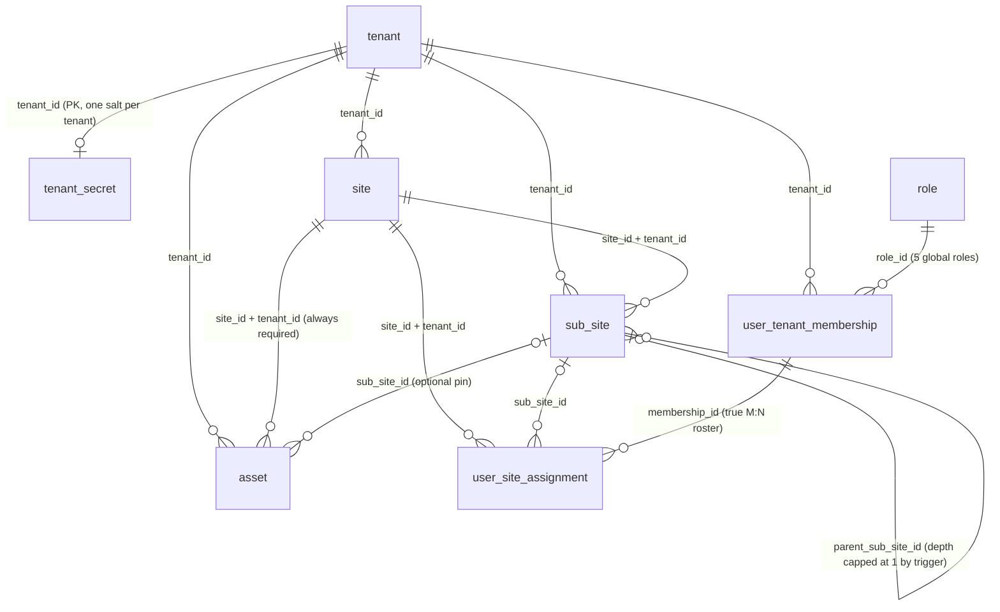
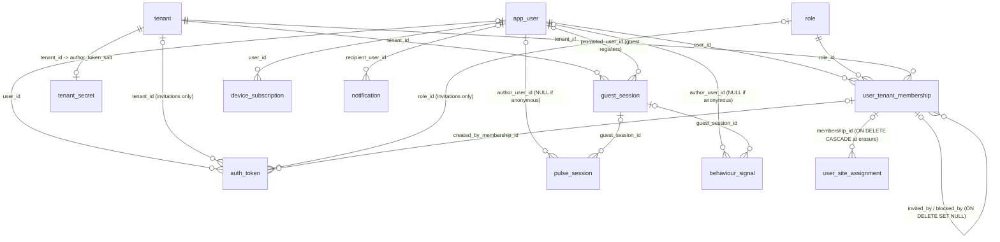
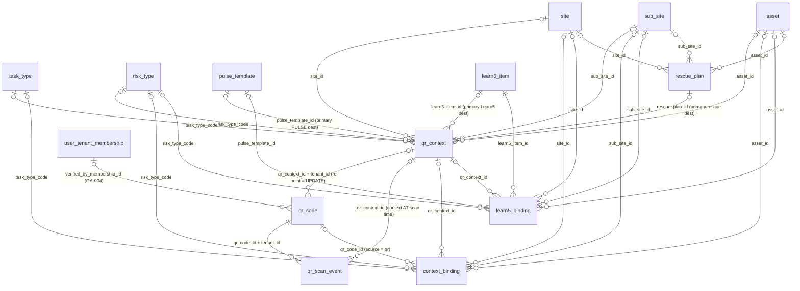
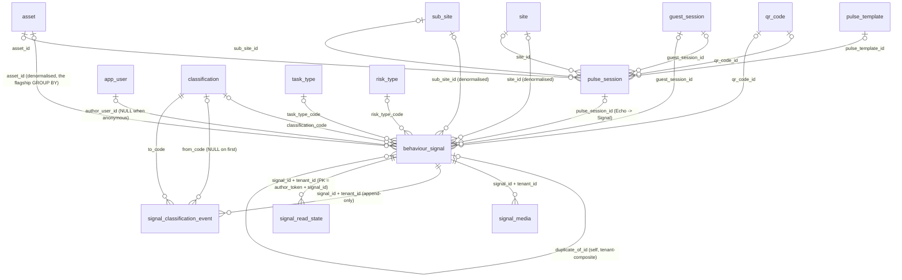
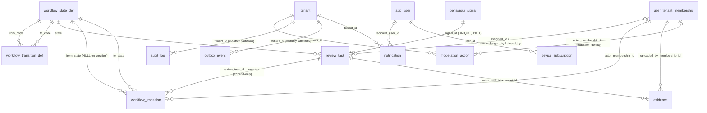

# SafeIn5 MVP — ER DIAGRAM

**Source of truth:** the executed migration files on disk —
`C:\Users\YaswanthK\Desktop\safeIn\db\migrations\0001_foundation.sql` … `0008_seed_demo.sql`.
Every entity, column, type and relationship below was verified against those files. Nothing is invented.

**Scale:** 38 base tables + 14 range partitions (7 for `audit_log`, 7 for `outbox_event`) + 2 sequences.

**Notation used in every Mermaid block**

| Symbol | Meaning |
|---|---|
| `A \|\|--o{ B` | B has a **NOT NULL** FK to A — one A, zero-or-many B |
| `A \|o--o{ B` | B has a **NULLABLE** FK to A — zero-or-one A, zero-or-many B |
| `A \|\|--o\| B` | one A, **at most one** B (unique FK) |
| label text | the FK column(s) on the child |

Types are the real DDL types. `numeric` in the diagrams is `numeric(9,6)` for lat/lon and `numeric(7,2)` for `geo_accuracy_m`, `numeric(4,3)` for `transcript_confidence` — the precision is dropped only because a comma inside a Mermaid attribute type is a parse error. All `char(n)` widths are shown as written.

---

## 1. Master diagram — every table

```mermaid
erDiagram
    tenant {
        uuid id PK
        citext slug
        text kind "community | corporate"
        text name "the organisation name"
        text industry_code "SIGNAL"
        char2 country_code
        boolean is_public_readable
        jsonb retention_policy
        text status
    }
    role {
        uuid id PK
        text code "worker|supervisor|org_admin|platform_admin|moderator"
        text name
        jsonb permissions
        boolean is_active
    }
    site {
        uuid id PK
        uuid tenant_id FK
        text name
        text timezone "SIGNAL"
        numeric centroid_lat "SIGNAL"
        text status
    }
    sub_site {
        uuid id PK
        uuid tenant_id FK
        uuid site_id FK
        uuid parent_sub_site_id FK "depth capped at 1"
        text name
        text kind "area|zone|task_zone|asset_group"
        text status
    }
    asset {
        uuid id PK
        uuid tenant_id FK
        uuid site_id FK
        uuid sub_site_id FK
        text external_ref
        text name
        text asset_type
    }
    app_user {
        uuid id PK
        citext email "nullable, PII"
        text password_hash "withheld from safein5_app"
        boolean default_anonymous
        text locale "SIGNAL"
        text status "active|blocked|erased"
        timestamptz erased_at
    }
    user_tenant_membership {
        uuid id PK
        uuid tenant_id FK
        uuid user_id FK
        uuid role_id FK
        char32 author_token "the anonymity keystone"
        boolean anonymous_override
        text status "invited|active|blocked|removed"
    }
    user_site_assignment {
        uuid id PK
        uuid tenant_id FK
        uuid membership_id FK
        uuid site_id FK
        uuid sub_site_id FK
        boolean is_primary
        text assignment_source "SIGNAL"
    }
    guest_session {
        uuid id PK
        uuid tenant_id FK
        char64 client_token_hash
        char32 author_token
        integer scan_count
        uuid promoted_user_id FK
    }
    auth_token {
        uuid id PK
        text kind "magic_link|otp|invitation|password_reset"
        char64 token_hash
        uuid user_id FK
        uuid tenant_id FK
        uuid role_id FK
        timestamptz expires_at
        timestamptz consumed_at
    }
    tenant_secret {
        uuid tenant_id PK
        bytea author_token_salt "16 bytes"
        integer salt_version
        text pepper_key_ref
    }
    task_type {
        text code PK "SIGNAL"
        text label
        integer sort_order
        boolean is_active
    }
    risk_type {
        text code PK "SIGNAL"
        text label
        integer sort_order
        boolean is_active
    }
    pulse_template {
        uuid id PK
        uuid tenant_id FK "NULL = SafeIn5-global"
        text name
        jsonb steps "exactly 5, keyed P U L S E"
        text risk_type_code FK
        text task_type_code FK
        integer version
        text status
    }
    qr_context {
        uuid id PK
        uuid tenant_id FK
        text name
        uuid site_id FK
        uuid sub_site_id FK
        uuid asset_id FK
        text task_type_code FK
        text risk_type_code FK
        jsonb destinations "polymorphic refs, not FK-enforced"
        uuid pulse_template_id FK
        uuid rescue_plan_id FK
        uuid learn5_item_id FK
        integer context_version "SIGNAL"
        text status
    }
    qr_code {
        uuid id PK
        uuid tenant_id FK
        char12 token "Crockford base32 URL segment"
        text label
        uuid qr_context_id FK
        uuid verified_by_membership_id FK
        text status "draft|active|inactive|revoked"
        bigint scan_count
    }
    qr_scan_event {
        uuid id PK
        uuid tenant_id FK
        uuid qr_code_id FK
        uuid qr_context_id FK
        char32 author_token "only actor key"
        boolean is_first_scan_for_token "SIGNAL"
        text entry_point "SIGNAL"
        timestamptz occurred_at
    }
    context_binding {
        uuid id PK
        uuid tenant_id FK
        text actor_kind "user|guest"
        uuid actor_ref "polymorphic, no FK"
        text source "qr|geo|manual|assignment"
        uuid site_id FK
        uuid sub_site_id FK
        uuid asset_id FK
        uuid qr_code_id FK
        uuid qr_context_id FK
        text task_type_code FK
        text risk_type_code FK
        jsonb context_snapshot "advisory cache"
        timestamptz expires_at "default now + 8h"
    }
    learn5_item {
        uuid id PK
        uuid tenant_id FK "NULL = SafeIn5-global"
        text title
        text delivery_mode "native|external"
        text risk_type_code FK
        text task_type_code FK
        text_array tags "SIGNAL"
        text status
    }
    learn5_binding {
        uuid id PK
        uuid tenant_id FK
        uuid learn5_item_id FK
        uuid site_id FK
        uuid sub_site_id FK
        uuid asset_id FK
        uuid qr_context_id FK
        uuid pulse_template_id FK
        text risk_type_code FK
        integer priority "exactly one target non-null"
    }
    learn5_view {
        uuid id PK
        uuid tenant_id FK
        uuid learn5_item_id FK
        char32 author_token "only actor key"
        text source "SIGNAL"
        uuid qr_code_id FK
        integer dwell_ms "SIGNAL"
        boolean completed
    }
    rescue_plan {
        uuid id PK
        uuid tenant_id FK
        uuid site_id FK
        uuid sub_site_id FK
        uuid asset_id FK
        text title
        jsonb immediate_actions
        jsonb escalation_contacts
        date review_date
        text status
    }
    classification {
        text code PK
        text label "Good Practice|Be Aware|Needs Attention Now"
        smallint severity_ordinal
        text colour_token
        boolean triggers_workflow
        boolean is_active
    }
    pulse_session {
        uuid id PK
        uuid tenant_id FK
        char32 author_token
        uuid author_user_id FK "NULL when anonymous"
        boolean is_anonymous
        uuid guest_session_id FK
        uuid qr_code_id FK
        uuid pulse_template_id FK
        jsonb context_snapshot
        uuid site_id FK
        uuid sub_site_id FK
        uuid asset_id FK
        text task_type_code FK
        text risk_type_code FK
        text_array steps_completed "SIGNAL"
        integer duration_ms "SIGNAL"
        text outcome "abandoned|completed|completed_with_signal"
    }
    behaviour_signal {
        uuid id PK "client-generated UUIDv7"
        uuid tenant_id FK
        text status "draft|classified|final|discarded"
        text visibility "site|tenant|public"
        char32 author_token
        uuid author_user_id FK "NULL when anonymous"
        boolean is_anonymous
        uuid guest_session_id FK
        uuid pulse_session_id FK
        uuid qr_code_id FK
        text classification_code FK
        integer classification_latency_ms "SIGNAL"
        integer capture_latency_ms "SIGNAL"
        text body_text
        text body_source "typed|voice_transcript|none"
        numeric transcript_confidence "SIGNAL"
        uuid site_id FK "denormalised"
        uuid sub_site_id FK "denormalised"
        uuid asset_id FK "denormalised"
        jsonb context_snapshot "immutable historical truth"
        text task_type_code FK
        text risk_type_code FK
        text media_state "denormalised from signal_media"
        text moderation_state
        text workflow_state "denormalised from review_task"
        tsvector search_vector "GENERATED STORED"
        uuid duplicate_of_id FK "SIGNAL"
        uuid similarity_group_id "SIGNAL, Phase-2 placeholder"
    }
    signal_media {
        uuid id PK
        uuid tenant_id FK
        uuid signal_id FK
        text kind "photo|video|audio"
        text state "reserved..ready|failed|orphaned"
        text storage_key "tenant-prefixed, unique"
        char64 checksum_sha256
        boolean exif_stripped "CHECK = true always"
        text transcript_state
    }
    signal_classification_event {
        uuid id PK
        uuid tenant_id FK
        uuid signal_id FK
        text from_code FK
        text to_code FK
        char32 changed_by_token
        text changed_by_role
        text source "worker|moderator|admin"
    }
    signal_read_state {
        char32 author_token PK "the READER"
        uuid signal_id PK
        uuid tenant_id FK
        timestamptz seen_at
        timestamptz opened_at
    }
    workflow_state_def {
        text code PK
        text label
        boolean is_terminal
        boolean requires_evidence
        boolean enabled_in_mvp
    }
    workflow_transition_def {
        uuid id PK
        text from_code FK
        text to_code FK
        text required_permission
        boolean enabled
    }
    review_task {
        uuid id PK
        uuid tenant_id FK
        uuid signal_id FK "UNIQUE"
        text state FK
        uuid assigned_to_membership_id FK
        uuid acknowledged_by_membership_id FK
        uuid closed_by_membership_id FK
        text closure_note "worker-visible"
        timestamptz due_at "SIGNAL"
        bigint first_response_ms "SIGNAL"
        bigint time_to_close_ms "SIGNAL"
    }
    workflow_transition {
        uuid id PK
        uuid tenant_id FK
        uuid review_task_id FK
        text from_state FK
        text to_state FK
        uuid actor_membership_id FK
        text actor_role "snapshotted"
    }
    evidence {
        uuid id PK
        uuid tenant_id FK
        uuid review_task_id FK
        text kind "photo|note|document"
        text storage_key
        text note
        uuid uploaded_by_membership_id FK
    }
    moderation_action {
        uuid id PK
        uuid tenant_id FK
        text target_type "signal|media|user|comment"
        uuid target_id "polymorphic, no FK"
        text action
        uuid actor_membership_id FK
        jsonb previous_value
        jsonb new_value
    }
    audit_log {
        bigint id PK
        timestamptz occurred_at PK "partition key"
        uuid tenant_id FK
        text actor_type "user|guest|system|admin"
        char32 actor_token "never a user_id"
        uuid actor_membership_id "deliberately NO FK"
        text action
        text entity_type
        text entity_id
        jsonb before
        jsonb after
    }
    device_subscription {
        uuid id PK
        uuid tenant_id FK
        uuid user_id FK
        text endpoint "globally UNIQUE"
        text p256dh_key
        integer failure_count
        timestamptz expired_at
    }
    notification {
        uuid id PK
        uuid tenant_id FK
        uuid recipient_user_id FK
        jsonb recipient_scope "broadcast target"
        text kind
        text channel "web_push|email|in_app"
        text state
        text dedupe_key
        uuid outbox_event_id "logical ref, no FK"
    }
    outbox_event {
        bigint id PK
        timestamptz occurred_at PK "partition key"
        uuid event_id "consumer idempotency key"
        uuid tenant_id FK
        text event_type "aggregate.past_tense"
        integer event_version
        text aggregate_type
        uuid aggregate_id
        jsonb payload "pseudonymous by CHECK"
        timestamptz published_at
    }

    tenant ||--o{ site : "tenant_id"
    tenant ||--o{ sub_site : "tenant_id"
    tenant ||--o{ asset : "tenant_id"
    tenant ||--o{ user_tenant_membership : "tenant_id"
    tenant ||--o{ user_site_assignment : "tenant_id"
    tenant ||--o{ guest_session : "tenant_id"
    tenant |o--o{ auth_token : "tenant_id (invitations)"
    tenant ||--o| tenant_secret : "tenant_id (PK, 1:1)"
    tenant |o--o{ pulse_template : "tenant_id (NULL = global)"
    tenant ||--o{ qr_context : "tenant_id"
    tenant ||--o{ qr_code : "tenant_id"
    tenant ||--o{ qr_scan_event : "tenant_id"
    tenant ||--o{ context_binding : "tenant_id"
    tenant |o--o{ learn5_item : "tenant_id (NULL = global)"
    tenant ||--o{ learn5_binding : "tenant_id"
    tenant ||--o{ learn5_view : "tenant_id"
    tenant ||--o{ rescue_plan : "tenant_id"
    tenant ||--o{ pulse_session : "tenant_id"
    tenant ||--o{ behaviour_signal : "tenant_id"
    tenant ||--o{ signal_media : "tenant_id"
    tenant ||--o{ signal_classification_event : "tenant_id"
    tenant ||--o{ signal_read_state : "tenant_id"
    tenant ||--o{ review_task : "tenant_id"
    tenant ||--o{ workflow_transition : "tenant_id"
    tenant ||--o{ evidence : "tenant_id"
    tenant ||--o{ moderation_action : "tenant_id"
    tenant ||--o{ audit_log : "tenant_id"
    tenant ||--o{ device_subscription : "tenant_id"
    tenant ||--o{ notification : "tenant_id"
    tenant ||--o{ outbox_event : "tenant_id"

    site ||--o{ sub_site : "site_id + tenant_id"
    site ||--o{ asset : "site_id + tenant_id"
    sub_site |o--o{ sub_site : "parent_sub_site_id"
    sub_site |o--o{ asset : "sub_site_id"

    role ||--o{ user_tenant_membership : "role_id"
    role |o--o{ auth_token : "role_id (invitations)"
    app_user ||--o{ user_tenant_membership : "user_id"
    app_user |o--o{ auth_token : "user_id"
    app_user |o--o{ guest_session : "promoted_user_id"
    app_user |o--o{ pulse_session : "author_user_id"
    app_user |o--o{ behaviour_signal : "author_user_id"
    app_user ||--o{ device_subscription : "user_id"
    app_user |o--o{ notification : "recipient_user_id"

    user_tenant_membership ||--o{ user_site_assignment : "membership_id + tenant_id"
    user_tenant_membership |o--o{ user_site_assignment : "assigned_by_membership_id"
    user_tenant_membership |o--o{ user_tenant_membership : "invited_by / blocked_by"
    user_tenant_membership |o--o{ auth_token : "created_by_membership_id"
    user_tenant_membership |o--o{ qr_code : "verified_by_membership_id"
    user_tenant_membership |o--o{ review_task : "assigned_to / acknowledged_by / closed_by"
    user_tenant_membership |o--o{ workflow_transition : "actor_membership_id"
    user_tenant_membership |o--o{ evidence : "uploaded_by_membership_id"
    user_tenant_membership |o--o{ moderation_action : "actor_membership_id"

    site |o--o{ user_site_assignment : "site_id"
    sub_site |o--o{ user_site_assignment : "sub_site_id"

    task_type |o--o{ pulse_template : "task_type_code"
    task_type |o--o{ qr_context : "task_type_code"
    task_type |o--o{ context_binding : "task_type_code"
    task_type |o--o{ learn5_item : "task_type_code"
    task_type |o--o{ pulse_session : "task_type_code"
    task_type |o--o{ behaviour_signal : "task_type_code"
    risk_type |o--o{ pulse_template : "risk_type_code"
    risk_type |o--o{ qr_context : "risk_type_code"
    risk_type |o--o{ context_binding : "risk_type_code"
    risk_type |o--o{ learn5_item : "risk_type_code"
    risk_type |o--o{ learn5_binding : "risk_type_code"
    risk_type |o--o{ pulse_session : "risk_type_code"
    risk_type |o--o{ behaviour_signal : "risk_type_code"

    site |o--o{ qr_context : "site_id"
    sub_site |o--o{ qr_context : "sub_site_id"
    asset |o--o{ qr_context : "asset_id"
    pulse_template |o--o{ qr_context : "pulse_template_id"
    rescue_plan |o--o{ qr_context : "rescue_plan_id (FK added in 0004)"
    learn5_item |o--o{ qr_context : "learn5_item_id (FK added in 0004)"

    qr_context |o--o{ qr_code : "qr_context_id + tenant_id"
    qr_code ||--o{ qr_scan_event : "qr_code_id + tenant_id"
    qr_context |o--o{ qr_scan_event : "qr_context_id"

    site |o--o{ context_binding : "site_id"
    sub_site |o--o{ context_binding : "sub_site_id"
    asset |o--o{ context_binding : "asset_id"
    qr_code |o--o{ context_binding : "qr_code_id"
    qr_context |o--o{ context_binding : "qr_context_id"

    learn5_item ||--o{ learn5_binding : "learn5_item_id"
    site |o--o{ learn5_binding : "site_id"
    sub_site |o--o{ learn5_binding : "sub_site_id"
    asset |o--o{ learn5_binding : "asset_id"
    qr_context |o--o{ learn5_binding : "qr_context_id"
    pulse_template |o--o{ learn5_binding : "pulse_template_id"
    learn5_item ||--o{ learn5_view : "learn5_item_id"
    qr_code |o--o{ learn5_view : "qr_code_id"

    site |o--o{ rescue_plan : "site_id"
    sub_site |o--o{ rescue_plan : "sub_site_id"
    asset |o--o{ rescue_plan : "asset_id"

    guest_session |o--o{ pulse_session : "guest_session_id"
    qr_code |o--o{ pulse_session : "qr_code_id"
    pulse_template |o--o{ pulse_session : "pulse_template_id"
    site |o--o{ pulse_session : "site_id"
    sub_site |o--o{ pulse_session : "sub_site_id"
    asset |o--o{ pulse_session : "asset_id"

    guest_session |o--o{ behaviour_signal : "guest_session_id"
    pulse_session |o--o{ behaviour_signal : "pulse_session_id"
    qr_code |o--o{ behaviour_signal : "qr_code_id"
    classification |o--o{ behaviour_signal : "classification_code"
    site |o--o{ behaviour_signal : "site_id"
    sub_site |o--o{ behaviour_signal : "sub_site_id"
    asset |o--o{ behaviour_signal : "asset_id"
    behaviour_signal |o--o{ behaviour_signal : "duplicate_of_id"

    behaviour_signal ||--o{ signal_media : "signal_id + tenant_id"
    behaviour_signal ||--o{ signal_classification_event : "signal_id + tenant_id"
    behaviour_signal ||--o{ signal_read_state : "signal_id + tenant_id"
    classification |o--o{ signal_classification_event : "from_code"
    classification ||--o{ signal_classification_event : "to_code"
    behaviour_signal ||--o| review_task : "signal_id (UNIQUE)"

    workflow_state_def ||--o{ workflow_transition_def : "from_code / to_code"
    workflow_state_def ||--o{ review_task : "state"
    workflow_state_def |o--o{ workflow_transition : "from_state / to_state"
    review_task ||--o{ workflow_transition : "review_task_id + tenant_id"
    review_task ||--o{ evidence : "review_task_id + tenant_id"
```

---

## 2. Focused sub-diagrams

These five are the ones to actually read. Attributes are omitted for legibility — look them up in the master diagram above.

### (a) Tenancy & Org Hierarchy

Everything hangs off `tenant`. **One tenant IS one organisation** — the customer-facing organisation profile (`name`, `industry_code`, `country_code`) lives on the `tenant` row itself, and `site` hangs directly off `tenant`. The composite `(id, tenant_id)` unique keys on `site`, `sub_site` and `asset` are what make every child FK cross-tenant-safe: a child can only reference a parent in its *own* tenant, which is the one class of bug RLS cannot catch.

**Why there is no separate `organisation` table.** The earlier design split tenancy (`tenant`) from the client organisation (`organisation`), on the theory that one tenant might one day hold several. It never earned the join. Only `site` ever referenced `organisation`; every tenant had exactly one organisation row, so the level added a mandatory hop to every hierarchy query and a second `(id, tenant_id)` key to police without ever partitioning anything; and the Community tenant — which has no client organisation at all — needed a synthetic organisation row that existed purely to satisfy `site.organisation_id`, i.e. pure fiction sitting in the middle of the tenancy graph. The two columns that carried real information, `industry_code` and `country_code`, moved onto `tenant`, `site.organisation_id` was dropped, and the table went with it. If multi-org tenancy is ever genuinely required, it comes back as a new level between `tenant` and `site` — which is a smaller change than keeping a table that lies about the model today.



### (b) Identity & Anonymity

`app_user` is deliberately **global** — no `tenant_id`, no RLS — so one person can hold a Community account and a corporate membership. `user_tenant_membership` is the anonymity keystone: it holds the only stored `user_id → author_token` mapping, derived from `tenant_secret.author_token_salt` + a KMS pepper. `guest_session` mints its own `author_token` from random bytes, so guests are first-class actors. Note that **`qr_scan_event`, `learn5_view` and `signal_read_state` have no `user_id` column at all** — token only — which is why they float free of `app_user` here.



### (c) QR & Context Resolution

`qr_code` (the physical sticker) is separate from `qr_context` (the logical destination set) so re-pointing a sticker is an `UPDATE`, never a reprint. `qr_scan_event` is the authoritative per-scan record; `qr_code.scan_count` / `last_scanned_at` are fire-and-forget counters. `context_binding` is the Context Engine's one-live-row-per-actor cache with an 8-hour (one shift) expiry.



`context_binding.actor_ref` is polymorphic (`app_user.id` or `guest_session.id`, discriminated by `actor_kind`) and has **no FK** — deliberately, so guests and members share one cache and one deletion path. `qr_context.destinations[].ref` and `pulse_template.steps[].learn5_item_id` are likewise not FK-enforced: both are polymorphic and nested in `jsonb`.

### (d) Signal Core & Media

`behaviour_signal` is one row for draft *and* final, distinguished by `status`. Zero mandatory fields at capture. `signal_classification_event` records every classification change including the worker-vs-reviewer disagreement.



### (e) Workflow, Moderation & Audit

The state machine is config-as-data: the full Dev Pack lifecycle is seeded in `workflow_state_def` / `workflow_transition_def`, but only `open → acknowledged → closed` carries `enabled = true`. Every membership reference in this slice is **single-column with `ON DELETE SET NULL`** so GDPR erasure of a supervisor cannot block or cascade.



`moderation_action.target_id` is polymorphic on `target_type` with no FK. `audit_log.actor_membership_id` has **no FK by design** — an audit trail truncatable by a data-subject request is not an audit trail. `notification.outbox_event_id` cannot be a FK because `outbox_event`'s only unique key is the composite `(event_id, occurred_at)`.

---

## 3. Table-by-table reference

Scope key: **T** = tenant-scoped (`tenant_id NOT NULL`, RLS enabled + forced) · **G** = global (no tenant_id, no RLS) · **T?** = nullable tenant_id (global-or-tenant content) · **P** = range partitioned · **AO** = append-only (no UPDATE/DELETE grant to runtime roles)

| # | Table | Purpose (one line) | Parents (FK out) | Children (FK in) | Scope |
|---|---|---|---|---|---|
| 1 | `tenant` | The RLS anchor **and the organisation record**; one row per Community/corporate tenant, carrying `name`, `industry_code`, `country_code`. | — | `site` + ~30 tenant-scoped tables | **G** (anchor, no RLS) |
| 2 | `role` | The five fixed MVP roles and their flat permission arrays. | — | `user_tenant_membership`, `auth_token` | **G** (seeded) |
| 3 | `site` | A physical site (e.g. a quarry). Top of the context hierarchy. | `tenant` | `sub_site`, `asset`, `user_site_assignment`, `qr_context`, `context_binding`, `learn5_binding`, `rescue_plan`, `pulse_session`, `behaviour_signal` | **T** |
| 4 | `sub_site` | Area / zone / task zone / asset group within a site; self-nesting capped at depth 1. | `tenant`, `site`, `sub_site` (self) | `sub_site`, `asset`, `user_site_assignment`, `qr_context`, `context_binding`, `learn5_binding`, `rescue_plan`, `pulse_session`, `behaviour_signal` | **T** |
| 5 | `asset` | A physical asset — plant, lifting fixture, access structure. | `tenant`, `site`, `sub_site` | `qr_context`, `context_binding`, `learn5_binding`, `rescue_plan`, `pulse_session`, `behaviour_signal` | **T** |
| 6 | `app_user` | Global person identity; one row per human across all tenants. | — | `user_tenant_membership`, `auth_token`, `guest_session`, `pulse_session`, `behaviour_signal`, `device_subscription`, `notification` | **G** (no RLS by design) |
| 7 | `user_tenant_membership` | Person × tenant join and the only stored `user → author_token` mapping. | `tenant`, `app_user`, `role`, self ×2 | `user_site_assignment` ×2, `auth_token`, `qr_code`, `review_task` ×3, `workflow_transition`, `evidence`, `moderation_action`, self ×2 | **T** |
| 8 | `user_site_assignment` | True M:N roster of memberships to sites/sub-sites; `is_primary` = home site. | `tenant`, `user_tenant_membership` ×2, `site`, `sub_site` | — | **T** |
| 9 | `guest_session` | Unauthenticated QR journey; carries its own `author_token`. | `tenant`, `app_user` (promotion) | `pulse_session`, `behaviour_signal` | **T** |
| 10 | `auth_token` | Hash-only single-use credential: magic link, OTP, invitation, password reset. | `app_user`, `tenant`, `role`, `user_tenant_membership` | — | **G** (pre-tenant, no RLS) |
| 11 | `tenant_secret` | Per-tenant 16-byte salt for `author_token` derivation; PK = `tenant_id`. | `tenant` | — | **T** (1:1) |
| 12 | `task_type` | Global seeded vocabulary of work-task types. | — | `pulse_template`, `qr_context`, `context_binding`, `learn5_item`, `pulse_session`, `behaviour_signal` | **G** (seeded) |
| 13 | `risk_type` | Global seeded vocabulary of hazard/risk types. | — | as `task_type`, plus `learn5_binding` | **G** (seeded) |
| 14 | `pulse_template` | Versioned set of the five P/U/L/S/E prompts. | `tenant` (nullable), `risk_type`, `task_type` | `qr_context`, `learn5_binding`, `pulse_session` | **T?** |
| 15 | `qr_context` | Logical destination set for a QR entry point. | `tenant`, `site`, `sub_site`, `asset`, `task_type`, `risk_type`, `pulse_template`, `rescue_plan`, `learn5_item` | `qr_code`, `qr_scan_event`, `context_binding`, `learn5_binding` | **T** |
| 16 | `qr_code` | One physical printed sticker; `token` is the URL path segment. | `tenant`, `qr_context`, `user_tenant_membership` | `qr_scan_event`, `context_binding`, `learn5_view`, `pulse_session`, `behaviour_signal` | **T** |
| 17 | `qr_scan_event` | Authoritative per-scan record, keyed by `author_token` only. | `tenant`, `qr_code`, `qr_context` | — | **T**, **AO** in practice |
| 18 | `context_binding` | Context Engine cache: one live binding per actor, 8-hour expiry. | `tenant`, `site`, `sub_site`, `asset`, `qr_code`, `qr_context`, `task_type`, `risk_type` | — | **T** |
| 19 | `learn5_item` | Micro-learning content; NULL tenant = SafeIn5-global. | `tenant` (nullable), `risk_type`, `task_type` | `qr_context`, `learn5_binding`, `learn5_view` | **T?** |
| 20 | `learn5_binding` | M:N attachment of an item to exactly one context target. | `tenant`, `learn5_item`, `site`, `sub_site`, `asset`, `qr_context`, `pulse_template`, `risk_type` | — | **T** |
| 21 | `learn5_view` | Learn5 engagement telemetry, keyed by `author_token` only. | `tenant`, `learn5_item`, `qr_code` | — | **T** |
| 22 | `rescue_plan` | Task/location-specific emergency procedure, structured jsonb. | `tenant`, `site`, `sub_site`, `asset` | `qr_context` | **T** |
| 23 | `classification` | The three seeded signal tiers and their severity ordinals. | — | `behaviour_signal`, `signal_classification_event` ×2 | **G** (seeded) |
| 24 | `pulse_session` | One PULSE walkthrough; the Echo half of Echo→Signal. | `tenant`, `app_user`, `guest_session`, `qr_code`, `pulse_template`, `site`, `sub_site`, `asset`, `task_type`, `risk_type` | `behaviour_signal` | **T** |
| 25 | `behaviour_signal` | **The core object.** Draft and final are the same row. | `tenant`, `app_user`, `guest_session`, `classification`, `pulse_session`, `qr_code`, `site`, `sub_site`, `asset`, `task_type`, `risk_type`, self | `signal_media`, `signal_classification_event`, `signal_read_state`, `review_task`, self | **T** |
| 26 | `signal_media` | One uploaded artefact per row; S3 upload state machine. | `tenant`, `behaviour_signal` | — | **T** |
| 27 | `signal_classification_event` | Every classification set or changed — the disagreement record. | `tenant`, `behaviour_signal`, `classification` ×2 | — | **T**, **AO** |
| 28 | `signal_read_state` | Per-reader read state; PK `(author_token, signal_id)`. | `tenant`, `behaviour_signal` | — | **T** |
| 29 | `workflow_state_def` | Config-as-data review-task states; `enabled_in_mvp` gates the subset. | — | `workflow_transition_def` ×2, `review_task`, `workflow_transition` ×2 | **G** (seeded, no RLS) |
| 30 | `workflow_transition_def` | Config-as-data edge list; `enabled` separates MVP from Phase 2. | `workflow_state_def` ×2 | — | **G** (seeded, no RLS) |
| 31 | `review_task` | One supervisor task per signal (`uq_review_task_signal`). | `tenant`, `behaviour_signal`, `workflow_state_def`, `user_tenant_membership` ×3 | `workflow_transition`, `evidence` | **T** |
| 32 | `workflow_transition` | Log of every review-task state change. | `tenant`, `review_task`, `workflow_state_def` ×2, `user_tenant_membership` | — | **T**, **AO** |
| 33 | `evidence` | Supporting evidence on a review task. Schema ships at MVP, UI does not. | `tenant`, `review_task`, `user_tenant_membership` | — | **T** |
| 34 | `moderation_action` | Polymorphic moderation/admin action log with before/after snapshots. | `tenant`, `user_tenant_membership` | — | **T**, **AO** |
| 35 | `audit_log` | Append-only audit trail; monthly partitions by `occurred_at`. | `tenant` (`actor_membership_id` intentionally has no FK) | — | **T**, **P**, **AO** |
| 36 | `device_subscription` | Web Push (VAPID) subscription, one per browser install per user. | `tenant`, `app_user` | — | **T** |
| 37 | `notification` | One row per intended delivery (recipient × channel). | `tenant`, `app_user` | — | **T** |
| 38 | `outbox_event` | Transactional outbox **and** the SIGNAL training corpus. | `tenant` | — | **T**, **P**, **AO** for the app role |

**Partitions (14):** `audit_log_2026_07` … `audit_log_2026_12`, `audit_log_default`; `outbox_event_2026_07` … `outbox_event_2026_12`, `outbox_event_default`. Each carries its own `ENABLE`/`FORCE ROW LEVEL SECURITY` and its own isolation policy, because RLS is not inherited by `CREATE TABLE … PARTITION OF` and a partition queried directly is a table in its own right.

**Sequences (2):** `audit_log_id_seq`, `outbox_event_id_seq` — explicit rather than `bigserial`/IDENTITY because PG16 rejects identity columns on partitioned tables.

---

## 4. The deliberate denormalisations

Four denormalisations are load-bearing enough to name. Each is a trade of write-time work and a consistency risk for read-time determinism on a hot path.

### `context_snapshot jsonb` — on `pulse_session`, `behaviour_signal` (`NOT NULL DEFAULT '{}'`) and `context_binding` (nullable)

**Buys:** historical truth. It is an immutable copy of the resolved context envelope — site/sub-site/asset/task/risk **names as well as ids**, plus `qr_context.context_version` — taken at capture time and never updated. A sub-site renamed six months later, an asset decommissioned, a QR context re-pointed: none of them rewrite what the worker was actually standing in. On `context_binding` it also lets the PWA render its context chip with zero joins.

**Costs:** the row can disagree with the live entities, and that disagreement is *intended*, so no reconciliation job may ever "fix" it. It is unindexed and unqueryable in practice — the FK columns beside it exist precisely because you cannot filter a feed on jsonb cheaply. It is also duplicated storage on the highest-volume table in the system. The rule that keeps this sane: **the FK columns are for querying, `context_snapshot` is for reading history.**

### `media_state` on `behaviour_signal` — `text NOT NULL DEFAULT 'none'`, one of `none|pending|partial|ready|failed`

**Buys:** the feed decides what to render — thumbnail, skeleton, or nothing — from one index scan, with no join to `signal_media` and no correlated subquery per card. Bytes never traverse the API container, so media arrives asynchronously and the feed must never wait for it or hide a signal because its photo isn't ready.

**Costs:** it is a rollup of N `signal_media.state` values maintained by the media worker, so it can drift if the worker dies mid-transition (`partial` exists precisely to describe the honest middle state). It needs the reconciler sweep to converge. There is no database constraint tying it to the child rows — this one is application-maintained by contract.

### `workflow_state` on `behaviour_signal` — `text NULL`, one of `open|acknowledged|closed`

**Buys:** the feed badge and the supervisor queue (`idx_behaviour_signal_workflow_state`) without joining `review_task` on every card. NULL means no task exists, which is the common case.

**Costs:** it is a second copy of `review_task.state`, which is itself a FK to `workflow_state_def.code`. The CHECK on `behaviour_signal` only admits the three MVP values, so enabling `assigned`/`actioned` in Phase 2 means updating seed data *and* altering this CHECK — the one place where the config-as-data state machine does not fully escape a schema change. Writes must be paired inside the transition transaction or a badge lies.

### `site_id` / `sub_site_id` / `asset_id` on `behaviour_signal`

**Buys:** the three hottest queries in the product become single index scans:
- WRK-013 auto-filter to the worker's current zone → `idx_behaviour_signal_subsite_classification`
- site feed → `idx_behaviour_signal_tenant_site`
- **the flagship supervisor insight** — "3 similar Be Aware signals in 2 weeks, all on custom lifting fixtures" — is a literal `GROUP BY asset_id` over `idx_behaviour_signal_asset`, joining back to `asset` only for the label. This is why `asset` is a real entity and not a free-text field: string matching would make the demo the product is sold on unreliable.

**Costs:** three nullable columns duplicating what `context_snapshot` already holds, three composite FKs to maintain, and a genuine semantic split — these columns are *current-entity* references (they follow renames and soft deletes) while `context_snapshot` is *point-in-time*. If a signal is ever re-scoped administratively, these change and the snapshot does not. That is correct, but it must be understood before anyone writes a report that joins both.

**Honourable mentions** (same pattern, smaller stakes): `qr_code.scan_count` / `last_scanned_at` (fire-and-forget counters; `qr_scan_event` is authoritative), `learn5_view.completed` (so completion-rate is a `COUNT` with no `CASE`), `signal_classification_event.changed_by_role` and `workflow_transition.actor_role` (role snapshots, because roles change and the record must not), `behaviour_signal.is_anonymous` and `pulse_session.is_anonymous` (materialised at capture — the account setting may be flipped later, but the promise made at that moment must be immutable), and `behaviour_signal.search_vector` (a `GENERATED … STORED` tsvector over `body_text` only, because a generated column's expression must be IMMUTABLE and same-row).

---

## 5. Legend — the `[SIGNAL]` columns

`[SIGNAL]` marks a column that is **written at MVP but read by no MVP feature.** It exists because it feeds the Phase 2 intelligence layer (the Sense → Gather → Identify pipeline) and because it is **unreconstructable retrospectively**: nobody can go back and measure how long a worker took to tap a classification tile in a quarry six months ago. Each costs one column and one write; omitting each costs a capability that can never be recovered. They are tagged in the DDL via `COMMENT ON COLUMN`, and searchable with `grep '\[SIGNAL\]' db/migrations/*.sql`.

Four rationales recur, and they are the test for adding a new one:

1. **Grouping keys for pattern detection.** `task_type_code` / `risk_type_code` are structured FK references to seeded vocabularies rather than free text on `qr_context`, `pulse_template`, `learn5_item`, `pulse_session` and `behaviour_signal`. Free text would make Phase-2 clustering string matching, i.e. unreliable.
2. **NFR proof from production data.** `classification_latency_ms` and `capture_latency_ms` are how "<10s to classify" and "<60s end-to-end" get proven at UAT across every real capture instead of by stopwatch on a demo device. Drop them and the NFR becomes an opinion.
3. **Metrics with no other source.** `first_response_ms` / `time_to_close_ms` on `review_task` are the entire "report black hole" claim. `steps_completed`, `dwell_ms`, `scan_count`, `is_first_scan_for_token` are the engagement measures. There is no other record anywhere that a Learn5 item was opened.
4. **Cheap now, impossible later.** `similarity_group_id` is a pure Phase-2 clustering placeholder; `site.timezone` and the centroids are uncorrectable once signals have been captured against a wrong or absent value.

### Full inventory

| Table | `[SIGNAL]` columns | What it unlocks |
|---|---|---|
| `tenant` | `industry_code` | Cross-industry benchmarking of behaviour patterns |
| `site` | `timezone`, `centroid_lat`, `centroid_lon` | Shift / time-of-day analysis (needs local time); geo clustering and proximity resolution |
| `sub_site` | `centroid_lat`, `centroid_lon` | Zone-level geo clustering |
| `app_user` | `locale` | Phase-2 i18n |
| `user_site_assignment` | `assignment_source` | The contractor pattern — `qr_scan` anticipates auto-attachment when a worker repeatedly scans at a site they aren't rostered to |
| `task_type` / `risk_type` | `code` | The two primary axes of all Phase-2 pattern detection |
| `pulse_template` | `risk_type_code`, `task_type_code` | Template resolution by taxonomy |
| `qr_context` | `task_type_code`, `risk_type_code`, `context_version` | Taxonomy rollups; interpreting an old signal against the context definition in force at capture |
| `qr_scan_event` | **the whole table**, plus `is_first_scan_for_token`, `entry_point` | QR scans are a named Phase 1 success metric and cannot be reconstructed from `qr_code.scan_count`; `manual_code` makes "the sticker is unreadable in the field" measurable rather than anecdotal |
| `context_binding` | `bound_at` | The per-actor sequence of bindings is the movement trace the Gather stage consumes — which is why expired rows are retained, not purged |
| `learn5_item` | `risk_type_code`, `task_type_code`, `tags` | Content-to-risk clustering |
| `learn5_view` | `source`, `qr_code_id`, `dwell_ms` | Which entry point drives learning; ties engagement to a specific sticker placement |
| `pulse_session` | `entry_point`, `task_type_code`, `risk_type_code`, `steps_completed`, `duration_ms` | PULSE completion rate; which entry points actually drive behaviour |
| `behaviour_signal` | `entry_point`, `classification_latency_ms`, `capture_latency_ms`, `transcript_confidence`, `task_type_code`, `risk_type_code`, `duplicate_of_id`, `similarity_group_id` | NFR proof, pattern-detection axes, duplicate detection, Phase-2 clustering |
| `signal_classification_event` | **the whole table** | The disagreement between the worker who was standing there and the reviewer who was not **is training data**, and it is irrecoverable if only the final value is kept |
| `review_task` | `due_at`, `first_response_ms`, `time_to_close_ms` | SLA-breach analysis; the only evidence that will ever exist for the "answered reports" claim |

One index is also tagged: `idx_qr_context_tenant_taxonomy` supports "which contexts carry this risk" rollups and taxonomy-based Learn5/PULSE fallback.

Finally, `outbox_event` is the `[SIGNAL]` principle applied to a whole table: every write path emits into it in the same transaction as the domain write, rows are **never deleted after publishing during the pilot**, payloads are pseudonymous by CHECK constraint, and the accumulated stream is the training corpus for the intelligence layer. Its monthly partitioning is for index locality and future cold-storage archival — *not* for deletion. Do not point the audit retention job at it.
